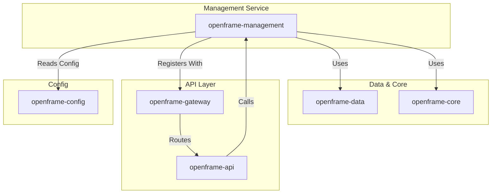
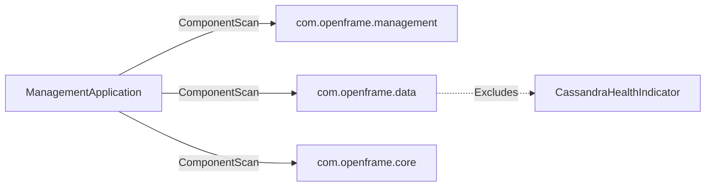
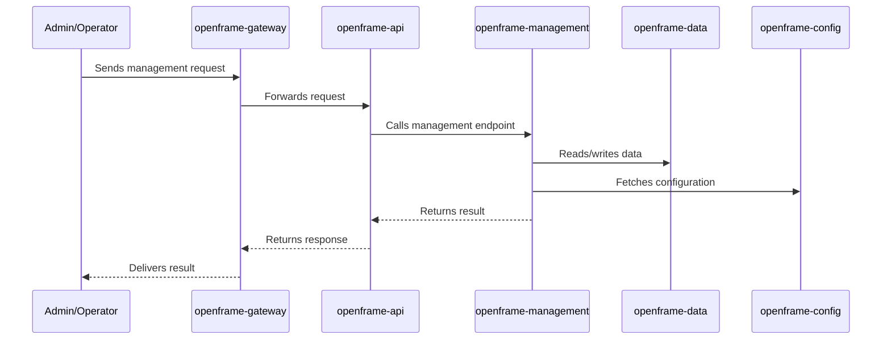

# openframe-management Module Documentation

## Introduction

The `openframe-management` module is a core backend service within the OpenFrame platform, responsible for management-related operations and orchestration. It is implemented as a Spring Boot application and is designed to integrate seamlessly with other OpenFrame modules, such as data, core, API, and gateway services. This module acts as a central point for management logic, configuration, and coordination of various platform components.

## Core Functionality

- **Spring Boot Application**: The module is bootstrapped as a Spring Boot application, providing robust dependency injection, configuration management, and lifecycle handling.
- **Component Scanning**: It scans and includes beans from its own package (`com.openframe.management`), as well as from `com.openframe.data` and `com.openframe.core`, ensuring tight integration with data and core platform services.
- **Health Check Customization**: The module explicitly excludes the `CassandraHealthIndicator` from component scanning, allowing for custom health check strategies or to avoid conflicts with Cassandra-specific health monitoring.
- **Service Orchestration**: As a management service, it likely coordinates between various subsystems, though the specifics depend on the broader OpenFrame architecture.

## Architecture Overview

The `openframe-management` module is part of a microservices-based architecture. It interacts with other OpenFrame modules, such as:
- [openframe-api](openframe-api.md): Provides API endpoints for external and internal consumers.
- [openframe-gateway](openframe-gateway.md): Handles routing, authentication, and API gateway responsibilities.
- [openframe-config](openframe-config.md): Supplies configuration management and dynamic property resolution.
- [openframe-data](openframe-data.md) and [openframe-core](openframe-core.md): Provide data access, business logic, and shared utilities.

### High-Level Architecture Diagram

## Component Relationships

- **ManagementApplication**: The main entry point for the module. It initializes the Spring context, sets up component scanning, and starts the service.
- **Integration with Data and Core**: By including `com.openframe.data` and `com.openframe.core` in the component scan, the management module can directly use repositories, services, and utilities defined in those modules.
- **Exclusion of CassandraHealthIndicator**: This exclusion allows the module to either provide its own health checks or avoid unnecessary Cassandra health monitoring if not required.

### Component Scan and Exclusion Diagram

## Data Flow and Process Overview

While the specific management processes are defined in the subcomponents and services (not shown in the provided code), the typical flow involves:
1. **Startup**: `ManagementApplication` starts, scanning and wiring beans from management, data, and core packages.
2. **Configuration**: Reads configuration from the config server ([openframe-config](openframe-config.md)).
3. **Service Registration**: Registers itself with the gateway ([openframe-gateway](openframe-gateway.md)) for service discovery and routing.
4. **API Exposure**: Exposes management endpoints, which may be consumed by [openframe-api](openframe-api.md) or other internal services.
5. **Health Monitoring**: Custom health checks are applied, excluding Cassandra-specific checks.

### Process Flow Diagram

## Dependencies

- **Spring Boot**: For application lifecycle, dependency injection, and configuration.
- **openframe-data**: For data access and persistence.
- **openframe-core**: For shared business logic and utilities.
- **openframe-config**: For configuration management.
- **openframe-gateway**: For service registration and routing.

For details on these modules, see their respective documentation:
- [openframe-data](openframe-data.md)
- [openframe-core](openframe-core.md)
- [openframe-config](openframe-config.md)
- [openframe-gateway](openframe-gateway.md)
- [openframe-api](openframe-api.md)

## Extensibility and Customization

- **Component Scan Customization**: Developers can adjust the `@ComponentScan` settings to include or exclude additional beans as needed.
- **Health Check Strategy**: By excluding `CassandraHealthIndicator`, the module can be extended to provide custom health checks or integrate with other monitoring solutions.

## Summary

The `openframe-management` module is a foundational backend service in the OpenFrame ecosystem, orchestrating management operations and integrating tightly with data, core, configuration, and gateway modules. Its design as a Spring Boot application ensures extensibility, maintainability, and robust integration with the broader platform.
