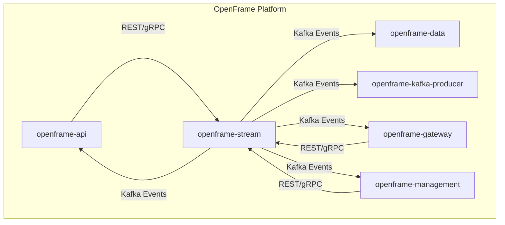
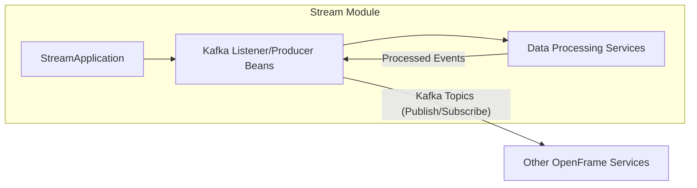
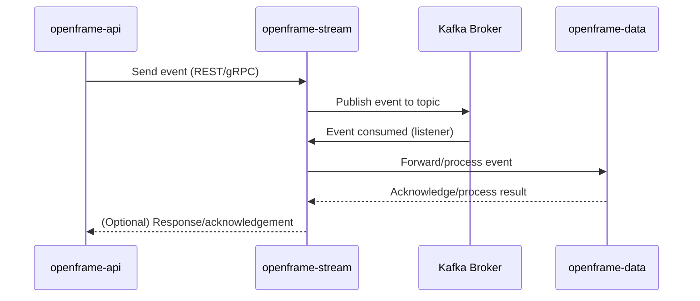

# openframe-stream Module Documentation

## Introduction

The `openframe-stream` module is a core backend service within the OpenFrame platform, responsible for real-time data streaming and event processing. It leverages Spring Boot and Apache Kafka to provide scalable, event-driven communication between various OpenFrame services. This module acts as a central hub for streaming data, enabling efficient, asynchronous message passing and integration with other microservices in the OpenFrame ecosystem.

## Core Functionality

- **Real-time Data Streaming:** Handles the ingestion, processing, and distribution of streaming data across the OpenFrame platform.
- **Kafka Integration:** Utilizes Apache Kafka for reliable, high-throughput event streaming and message brokering.
- **Spring Boot Foundation:** Built on Spring Boot for rapid development, dependency injection, and robust application lifecycle management.
- **Component Scanning:** Integrates with other OpenFrame modules (such as `openframe-data` and `openframe-kafka-producer`) via Spring's component scanning, allowing for modular and extensible service composition.

## Architecture Overview

The `openframe-stream` module is designed as a microservice that interacts with other OpenFrame services through Kafka topics and REST APIs. It is typically deployed alongside other backend services such as `openframe-api`, `openframe-gateway`, and `openframe-management`.

### High-Level Architecture



- **openframe-stream** acts as a Kafka producer/consumer, facilitating event-driven communication.
- **openframe-data** and **openframe-kafka-producer** are included in the component scan, allowing their beans and services to be used within the stream module.
- **openframe-api**, **openframe-gateway**, and **openframe-management** interact with the stream module for real-time updates and event processing.

## Component Relationships

### StreamApplication

The main entry point for the module is the `StreamApplication` class:

```java
@SpringBootApplication
@EnableKafka
@ComponentScan(basePackages = {
        "com.openframe.stream",
        "com.openframe.data",
        "com.openframe.kafka.producer"
})
public class StreamApplication {
    public static void main(String[] args) {
        SpringApplication.run(StreamApplication.class, args);
    }
}
```

- **@SpringBootApplication:** Marks this as a Spring Boot application.
- **@EnableKafka:** Enables Kafka listener annotated endpoints.
- **@ComponentScan:** Scans for Spring components in the `stream`, `data`, and `kafka.producer` packages, integrating their beans and services.

### Dependency and Data Flow



- The `StreamApplication` initializes the application context, including Kafka listeners and producers.
- Data processing services handle business logic for incoming and outgoing events.
- Kafka topics are used for communication with other OpenFrame modules.

## Integration with the OpenFrame System

The `openframe-stream` module is a foundational component for real-time, event-driven workflows in OpenFrame. It:
- Enables asynchronous communication between microservices.
- Provides a scalable backbone for event sourcing and data streaming.
- Integrates tightly with data and producer modules for extensibility.

For details on the data models and Kafka producer logic, see:
- [openframe-data.md](openframe-data.md)
- [openframe-kafka-producer.md](openframe-kafka-producer.md)

For information on how other services interact with the stream module, refer to:
- [openframe-api.md](openframe-api.md)
- [openframe-gateway.md](openframe-gateway.md)
- [openframe-management.md](openframe-management.md)

## Process Flow Example



## Summary

The `openframe-stream` module is a critical enabler of real-time, event-driven architecture in the OpenFrame platform. By leveraging Spring Boot and Kafka, it provides robust, scalable streaming capabilities and seamless integration with other OpenFrame services.

---

**References:**
- [openframe-data.md](openframe-data.md)
- [openframe-kafka-producer.md](openframe-kafka-producer.md)
- [openframe-api.md](openframe-api.md)
- [openframe-gateway.md](openframe-gateway.md)
- [openframe-management.md](openframe-management.md)
