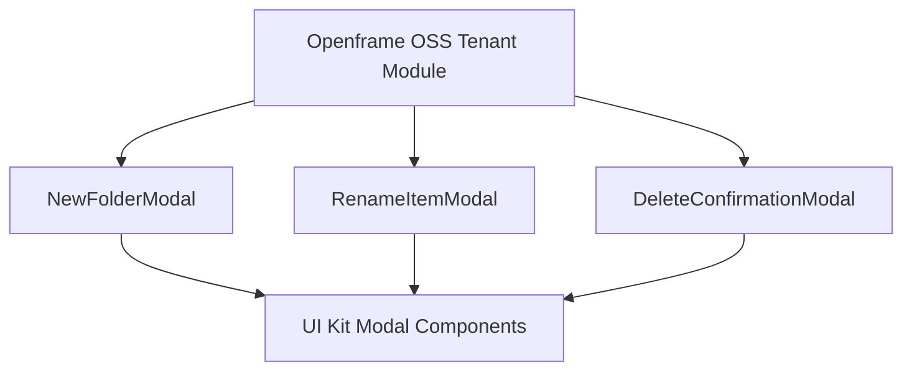

# Openframe OSS Tenant Module Documentation

## Introduction and Purpose

The Openframe OSS Tenant module is a part of the Openframe frontend services, specifically designed to manage file operations within device details views. It provides user interface components for file management tasks such as creating new folders, renaming items, and confirming deletions. This module enhances user interaction with device file systems by offering modal dialogs that facilitate these operations in a user-friendly manner.

## Architecture Overview

The module is structured around React functional components that utilize a shared UI kit (`@flamingo/ui-kit/components/ui`) for consistent modal dialog presentation. Each component represents a modal dialog for a specific file management action.

## Sub-Modules and Components

This module contains the following sub-modules, each documented in detail in their respective files:

- **NewFolderModal**: Modal dialog for creating new folders. See [name_new-folder-modal.md](name_new-folder-modal.md), [description_new-folder-modal.md](description_new-folder-modal.md), [core_components_new-folder-modal.md](core_components_new-folder-modal.md), [architecture_diagram_new-folder-modal.md](architecture_diagram_new-folder-modal.md).
- **RenameItemModal**: Modal dialog for renaming files or folders. See [name_rename-item-modal.md](name_rename-item-modal.md), [description_rename-item-modal.md](description_rename-item-modal.md), [core_components_rename-item-modal.md](core_components_rename-item-modal.md), [architecture_diagram_rename-item-modal.md](architecture_diagram_rename-item-modal.md).
- **DeleteConfirmationModal**: Modal dialog for confirming deletion of items. See [name_delete-confirmation-modal.md](name_delete-confirmation-modal.md), [description_delete-confirmation-modal.md](description_delete-confirmation-modal.md), [core_components_delete-confirmation-modal.md](core_components_delete-confirmation-modal.md), [architecture_diagram_delete-confirmation-modal.md](architecture_diagram_delete-confirmation-modal.md).

## Integration with Other Modules

This module primarily focuses on frontend UI components for file management within device details. It can be integrated with backend services or state management modules responsible for actual file operations and device data handling. For detailed backend or state management documentation, refer to related modules in the Openframe system.

---

For detailed documentation of each modal component, please refer to their respective files linked above.