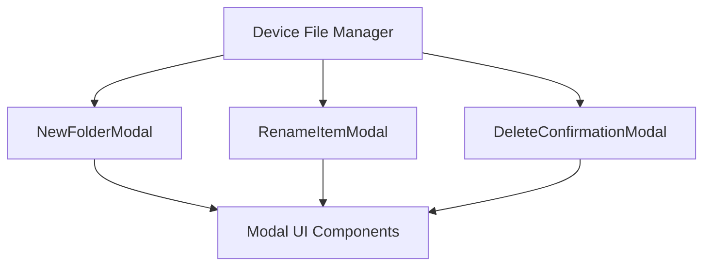

# Openframe OSS Tenant Module Documentation

## Introduction and Purpose
The Openframe OSS Tenant module is a frontend-focused module designed to manage device file operations within the Openframe ecosystem. It provides user interface components for file management tasks such as creating new folders, renaming items, and confirming deletions. This module is part of the Openframe OSS frontend services and is tailored to enhance user interaction with device file systems.

## Architecture Overview
The module is structured around React components that utilize a UI kit (`@flamingo/ui-kit`) for consistent modal dialogs and input controls. The core functionality revolves around modal components that handle user input and confirmation for file management actions.

## Sub-modules and Components
The module consists of the following key components, each encapsulated in its own file:

- **NewFolderModal**: Provides a modal dialog for creating new folders. It handles user input for the folder name and submission events.
  - See detailed documentation in [new-folder-modal.md](new-folder-modal.md)

- **RenameItemModal**: Offers a modal dialog for renaming existing items. It manages input for the new name and submission handling.
  - See detailed documentation in [rename-item-modal.md](rename-item-modal.md)

- **DeleteConfirmationModal**: Displays a confirmation modal for deleting one or multiple items, ensuring users confirm destructive actions.
  - See detailed documentation in [delete-confirmation-modal.md](delete-confirmation-modal.md)

## Integration and Dependencies
This module depends on the `@flamingo/ui-kit` for UI components such as Modal, Button, and Input. It is designed to be used within the device details context of the Openframe frontend application, specifically under the file manager section.

For detailed implementation and usage of each component, please refer to their respective documentation files:

- [NewFolderModal Component](new-folder-modal.md)
- [RenameItemModal Component](rename-item-modal.md)
- [DeleteConfirmationModal Component](delete-confirmation-modal.md)

---

For related modules and broader system context, refer to the main Openframe OSS documentation files.