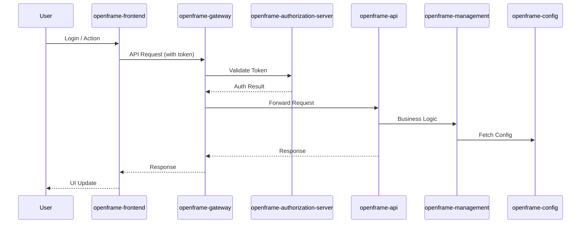

# openframe-oss-tenant Repository Overview

## Purpose

The `openframe-oss-tenant` repository is the open-source, multi-tenant distribution of the OpenFrame platform. It provides a modular, extensible foundation for secure, scalable device management, conversational AI, and enterprise IT automation. The repository brings together backend microservices, frontend applications, shared libraries, and integration modules to deliver a unified, tenant-aware SaaS experience.

Key goals of the repository include:

- **Multi-tenancy**: Isolate data, configuration, and access for each organization or tenant.
- **Modularity**: Enable independent development, deployment, and scaling of platform components.
- **Extensibility**: Support integration with third-party tools, custom workflows, and new AI models.
- **Security**: Centralized authentication, authorization, and configuration management.

---

## End-to-End Architecture

The OpenFrame OSS Tenant architecture is based on a microservices pattern, with clear separation between backend services, frontend clients, shared libraries, and integration modules.

### High-Level System Architecture

```mermaid
flowchart TD
    subgraph Frontend
        FE[openframe-frontend]
        CHAT[openframe-chat]
    end
    subgraph Backend
        GW[openframe-gateway]
        API[openframe-api]
        AUTHZ[openframe-authorization-server]
        MGMT[openframe-management]
        CONFIG[openframe-config]
        STREAM[openframe-stream]
        EXTAPI[openframe-external-api]
        CLIENT[openframe-client]
    end
    subgraph Shared
        LIB[openframe-frontend-lib]
    end
    subgraph E2E
        E2E[openframe-e2e-tests]
    end
    subgraph Integrations
        TACTICAL[integrated-tools-tactical-rmm]
    end

    FE -- uses --> LIB
    FE -- embeds --> CHAT
    FE -- API calls --> GW
    CHAT -- API calls --> GW
    GW -- routes --> API
    GW -- routes --> MGMT
    GW -- routes --> EXTAPI
    GW -- routes --> STREAM
    GW -- routes --> CLIENT
    GW -- auth --> AUTHZ
    API -- business logic --> MGMT
    API -- data --> CONFIG
    API -- events --> STREAM
    API -- auth --> AUTHZ
    EXTAPI -- data --> API
    EXTAPI -- events --> STREAM
    MGMT -- config --> CONFIG
    MGMT -- auth --> AUTHZ
    STREAM -- events --> API
    STREAM -- events --> MGMT
    FE -- tested by --> E2E
    FE -- integrates --> TACTICAL
```

### Data and Authentication Flow



---

## Repository Structure

```
openframe-oss-tenant/
├── openframe-chat/           # Conversational AI chat client (frontend)
├── openframe-frontend/       # Main web frontend (multi-tenant UI)
├── openframe-frontend-lib/   # Shared frontend library (API clients, MeshCentral, config)
├── openframe-e2e-tests/      # End-to-end UI test suite
├── openframe-api/            # Core backend API gateway (Spring Boot)
├── openframe-authorization-server/ # AuthN/AuthZ microservice (Spring Boot)
├── openframe-config/         # Centralized configuration server (Spring Boot)
├── openframe-external-api/   # External API for integrations (Spring Boot)
├── openframe-gateway/        # API gateway and request router (Spring Boot)
├── openframe-management/     # Management/orchestration backend (Spring Boot)
├── openframe-stream/         # Real-time event streaming (Spring Boot + Kafka)
├── integrated-tools-tactical-rmm/ # Tactical RMM integration (frontend)
```

---

## Core Modules Documentation

### 1. [openframe-chat](clients/openframe-chat/src)
- **Purpose:** Provides the chat and conversational AI frontend, supporting multi-model, multi-provider chat, streaming, and tool execution.
- **Key Components:** Contexts, hooks, services for chat API, SSE, token management, supported models, and types.
- **Docs:**  
  - [openframe-chat Module Documentation](#openframe-chat-module-documentation)
  - [DebugModeContext](openframe-chat.contexts.DebugModeContext.md)
  - [useChatConfig](openframe-chat.hooks.useChatConfig.md)
  - [useConnectionStatus](openframe-chat.hooks.useConnectionStatus.md)
  - [useSSE](openframe-chat.hooks.useSSE.md)
  - [ChatApiService](openframe-chat.services.chatApiService.md)
  - [SSEService](openframe-chat.services.sseService.md)
  - [MockChatService](openframe-chat.services.mockChatService.md)
  - [SupportedModelsService](openframe-chat.services.supportedModelsService.md)
  - [TokenService](openframe-chat.services.tokenService.md)
  - [Chat Types](openframe-chat.types.chat.types.md)

### 2. [openframe-frontend](openframe/services/openframe-frontend/src/app)
- **Purpose:** The main multi-tenant web UI for device management, organizations, chat, logs, policies, and settings.
- **Key Components:** Auth flows, device management, organizations, logs, chat integration, settings, and more.
- **Docs:** See in-source documentation and [openframe-frontend-lib](#openframe-frontend-lib) for shared logic.

### 3. [openframe-frontend-lib](openframe/services/openframe-frontend/src/lib)
- **Purpose:** Shared frontend library for API clients, MeshCentral integration, app config, and utilities.
- **Key Components:**  
  - `api-client`: HTTP client with auth and error handling  
  - `auth-api-client`: Auth flows, SSO, tenant discovery  
  - `fleet-api-client`: Device management API  
  - `meshcentral`: Remote device management (file, desktop, tunnel)  
  - `app-config`: Navigation, branding, layout  
- **Docs:**  
  - [openframe-frontend-lib Module Overview](#openframe-frontend-lib-module-overview)

### 4. [openframe-api](openframe/services/openframe-api/src/main/java/com/openframe/api)
- **Purpose:** Main backend API gateway, exposing REST endpoints and integrating with core, data, notification, and Kafka modules.
- **Docs:**  
  - [OpenFrame API Module Documentation](#openframe-api-module-documentation)

### 5. [openframe-authorization-server](openframe/services/openframe-authorization-server/src/main/java/com/openframe/authz)
- **Purpose:** Central authentication and authorization service, managing tokens, roles, and permissions.
- **Docs:**  
  - [OpenFrame Authorization Server](#openframe-authorization-server)

### 6. [openframe-config](openframe/services/openframe-config/src/main/java/com/openframe/config)
- **Purpose:** Centralized configuration server for all microservices.
- **Docs:**  
  - [openframe-config Module Documentation](#openframe-config-module-documentation)

### 7. [openframe-external-api](openframe/services/openframe-external-api/src/main/java/com/openframe/external)
- **Purpose:** External API layer for third-party integrations and external clients.
- **Docs:**  
  - [openframe-external-api Module Documentation](#openframe-external-api-module-documentation)

### 8. [openframe-gateway](openframe/services/openframe-gateway/src/main/java/com/openframe/gateway)
- **Purpose:** API gateway and request router, enforcing security and forwarding requests to backend services.
- **Docs:**  
  - [OpenFrame Gateway Module Documentation](#openframe-gateway-module-documentation)

### 9. [openframe-management](openframe/services/openframe-management/src/main/java/com/openframe/management)
- **Purpose:** Management and orchestration backend, integrating with data and core modules.
- **Docs:**  
  - [openframe-management Module Documentation](#openframe-management-module-documentation)

### 10. [openframe-stream](openframe/services/openframe-stream/src/main/java/com/openframe/stream)
- **Purpose:** Real-time event streaming and processing using Kafka.
- **Docs:**  
  - [openframe-stream Module Documentation](#openframe-stream-module-documentation)

### 11. [openframe-e2e-tests](openframe-e2e-tests/src/main/java/pageObjects)
- **Purpose:** End-to-end automated UI test suite using the Page Object Model.
- **Docs:**  
  - [openframe-e2e-tests Module Documentation](#openframe-e2e-tests-module-documentation)

### 12. [integrated-tools-tactical-rmm](integrated-tools/tactical-rmm/tactical-frontend)
- **Purpose:** Integration with Tactical RMM for remote monitoring and management.
- **Docs:** See in-source documentation.

---

## Further Reading

- [openframe-chat Module Documentation](#openframe-chat-module-documentation)
- [openframe-frontend-lib Module Overview](#openframe-frontend-lib-module-overview)
- [OpenFrame API Module Documentation](#openframe-api-module-documentation)
- [OpenFrame Authorization Server](#openframe-authorization-server)
- [openframe-config Module Documentation](#openframe-config-module-documentation)
- [openframe-external-api Module Documentation](#openframe-external-api-module-documentation)
- [OpenFrame Gateway Module Documentation](#openframe-gateway-module-documentation)
- [openframe-management Module Documentation](#openframe-management-module-documentation)
- [openframe-stream Module Documentation](#openframe-stream-module-documentation)
- [openframe-e2e-tests Module Documentation](#openframe-e2e-tests-module-documentation)

---

For detailed sub-module and API documentation, see the respective module documentation files and in-source comments.