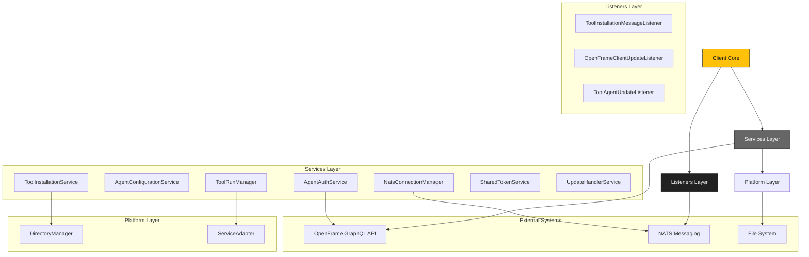
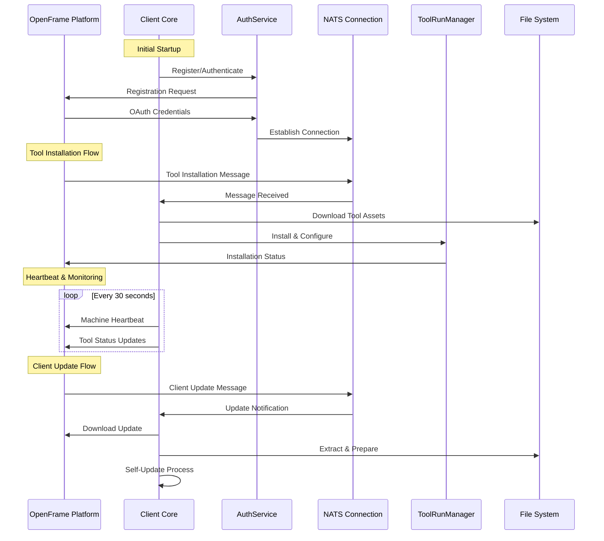

# openframe-oss-tenant Module Documentation

# OpenFrame Client Architecture Documentation

## Overview

OpenFrame Client is a cross-platform Rust system agent that acts as a bridge between managed endpoints and the OpenFrame platform. It handles device registration, tool installation/management, real-time communication via NATS messaging, heartbeat monitoring, and automatic client updates while providing secure authentication and multi-platform service management.

## Architecture

The client follows a modular, event-driven architecture built on Tokio async runtime with the following key layers:

- **Client Layer**: Main orchestration and lifecycle management
- **Services Layer**: Core business logic and state management 
- **Listener Layer**: NATS message consumers for real-time updates
- **Platform Layer**: OS-specific abstractions and utilities
- **Models Layer**: Data structures and serialization contracts

The system operates as a long-running service that maintains persistent connections to the OpenFrame platform through GraphQL APIs and NATS messaging for bidirectional communication.

## Core Components

### Client Core (`src/lib.rs`)
- **Client**: Main application orchestrator managing all services and listeners
- **ClientConfiguration**: Configuration management with defaults and persistence

### Services Layer (`src/services/`)
- **AgentConfigurationService**: Machine ID and authentication state management
- **AgentRegistrationService**: Initial device registration with the platform
- **AgentAuthService**: OAuth2 authentication and token refresh
- **ToolInstallationService**: Manages installation/uninstallation of tools
- **ToolRunManager**: Executes and monitors tool processes
- **NatsConnectionManager**: Maintains persistent NATS connections
- **SharedTokenService**: Encrypted token sharing with other processes
- **UpdateHandlerService**: Manages client self-updates

### Listeners Layer (`src/listener/`)
- **ToolInstallationMessageListener**: Processes tool installation requests
- **OpenFrameClientUpdateListener**: Handles client update notifications  
- **ToolAgentUpdateListener**: Manages tool agent updates

### Platform Layer (`src/platform/`)
- **DirectoryManager**: Cross-platform file system operations and permissions
- **Service Adapters**: OS-specific service management (Windows/Linux/macOS)

### Models Layer (`src/models/`)
- Data structures for API communication, configuration, and internal state
- Serializable messages for NATS communication

## Component Relationships



## Data Flow



## Key Files

### Core Application Files
- **`src/lib.rs`**: Main client implementation with service orchestration
- **`src/models/mod.rs`**: Data model definitions and API contracts

### Service Implementation Files
- **`src/services/agent_configuration_service.rs`**: Machine identity and config management
- **`src/services/nats_connection_manager.rs`**: Persistent NATS connection handling
- **`src/services/tool_installation_service.rs`**: Tool lifecycle management
- **`src/services/shared_token_service.rs`**: Encrypted token sharing for IPC

### Message Listener Files
- **`src/listener/tool_installation_message_listener.rs`**: NATS tool installation consumer
- **`src/listener/openframe_client_update_listener.rs`**: Client update message handling

### Platform Integration Files  
- **`src/platform/directories.rs`**: Cross-platform directory management
- **`src/service_adapter/mod.rs`**: OS service management abstraction

### Tauri Desktop App
- **`clients/openframe-chat/src-tauri/src/lib.rs`**: Desktop chat application
- **`clients/openframe-chat/src-tauri/src/token_watcher.rs`**: Token file monitoring for IPC

## CLI Commands

The client operates primarily as a system service but supports the following operational modes:

### Service Management
```bash
# Install as system service
openframe-client install

# Start the service
openframe-client start

# Stop the service  
openframe-client stop

# Check service status
openframe-client status
```

### Configuration
```bash
# Initialize with server configuration
openframe-client init --server-url <url> --initial-key <key>

# Configure for local development
openframe-client init --local-mode --ca-cert <path>

# Set log level
openframe-client --log-level debug
```

### Development Mode
```bash
# Run in development mode (user directories)
OPENFRAME_DEV_MODE=1 openframe-client run

# Run with custom configuration
openframe-client --config-path /path/to/config.json
```

The client automatically handles registration, authentication, and maintains persistent connections to the OpenFrame platform for real-time management and monitoring.
