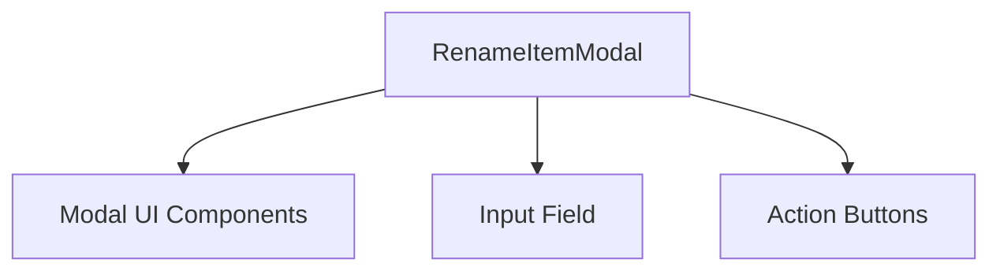

# RenameItemModal Component

## Overview
The `RenameItemModal` component provides a modal dialog interface for renaming an existing item in the device file manager. It manages user input for the new name and handles submission and cancellation.

## Core Components and Responsibilities
- **Props:**
  - `isOpen` (boolean): Controls modal visibility.
  - `value` (string): Current value of the rename input.
  - `submitting` (boolean): Indicates if the renaming process is ongoing.
  - `onChange` (function): Callback to update the rename input value.
  - `onSubmit` (function): Callback triggered on rename submission.
  - `onClose` (function): Callback to close the modal.

- **Functionality:**
  - Listens for Enter key to submit rename if input is valid and not submitting.
  - Renders modal with input field and cancel/rename buttons.
  - Disables inputs and buttons during submission.

## Usage
Used in the device file manager to rename files or folders.

## Code Location
`openframe/services/openframe-frontend/src/app/devices/details/[deviceId]/file-manager/components/rename-item-modal.tsx`

---

```typescript
// See the source code in the file for implementation details.
```

---

## Component Interaction Diagram


