# OpenFrame Deployment Guide

This document details the deployment process for OpenFrame and its components.

## Overview

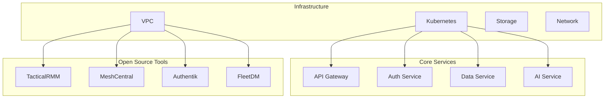

## Prerequisites

### Infrastructure Requirements
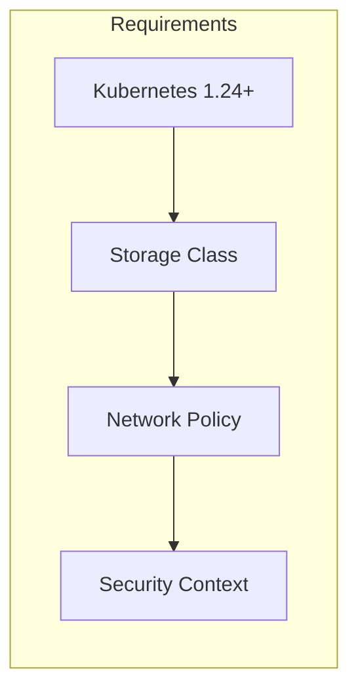

### Tool Requirements
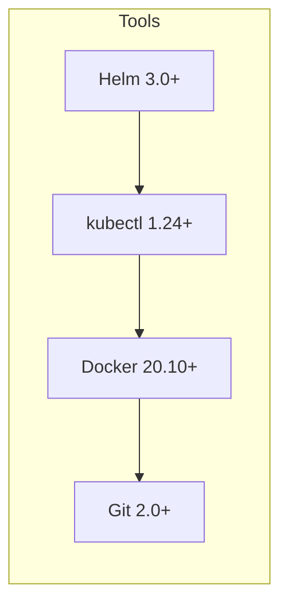

## Deployment Process

### Infrastructure Setup
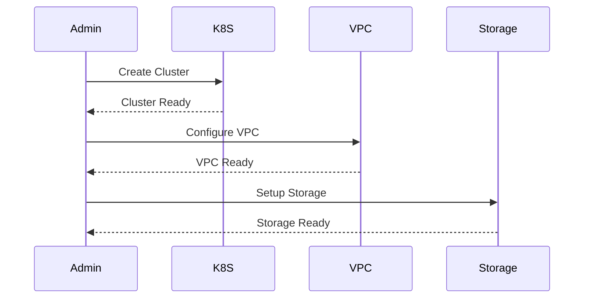

### Core Services Deployment
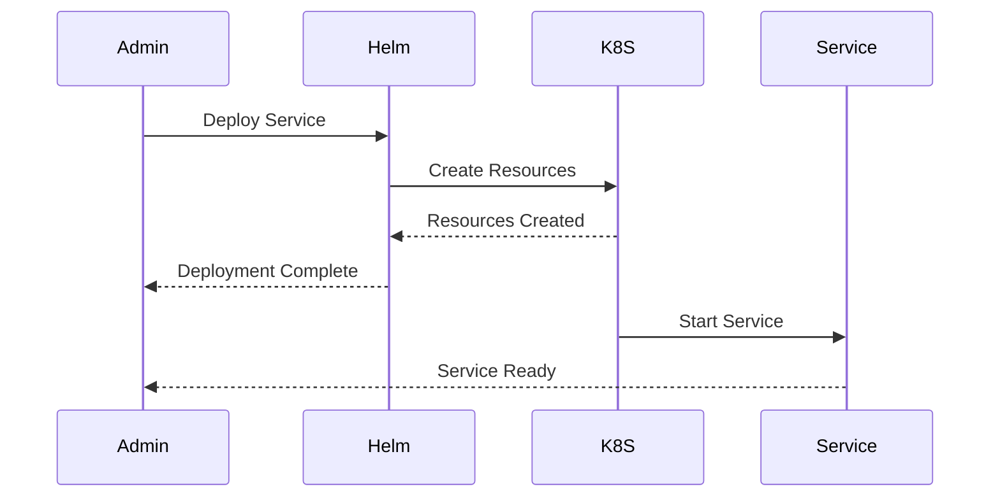

## Kubernetes Resources

### Namespace Structure
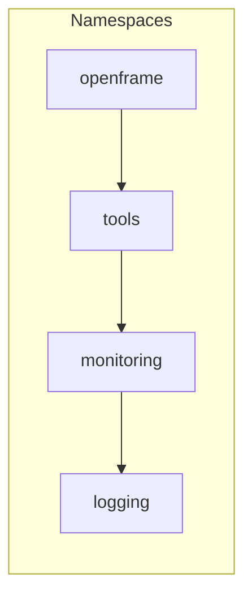

### Resource Quotas
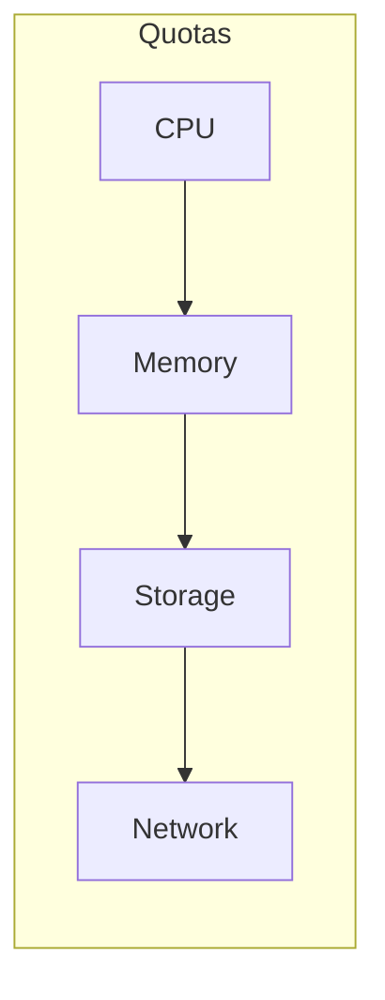

## Deployment Configuration

### Helm Values
```yaml
global:
  environment: production
  domain: openframe.example.com
  storageClass: standard

services:
  apiGateway:
    replicas: 2
    resources:
      requests:
        cpu: 500m
        memory: 512Mi
      limits:
        cpu: 1000m
        memory: 1Gi

  authService:
    replicas: 2
    resources:
      requests:
        cpu: 500m
        memory: 512Mi
      limits:
        cpu: 1000m
        memory: 1Gi
```

### Network Policies
```yaml
apiVersion: networking.k8s.io/v1
kind: NetworkPolicy
metadata:
  name: openframe-network-policy
spec:
  podSelector:
    matchLabels:
      app: openframe
  policyTypes:
  - Ingress
  - Egress
  ingress:
  - from:
    - namespaceSelector:
        matchLabels:
          name: openframe
    ports:
    - protocol: TCP
      port: 8080
```

## Tool Deployment

### Open Source Tools
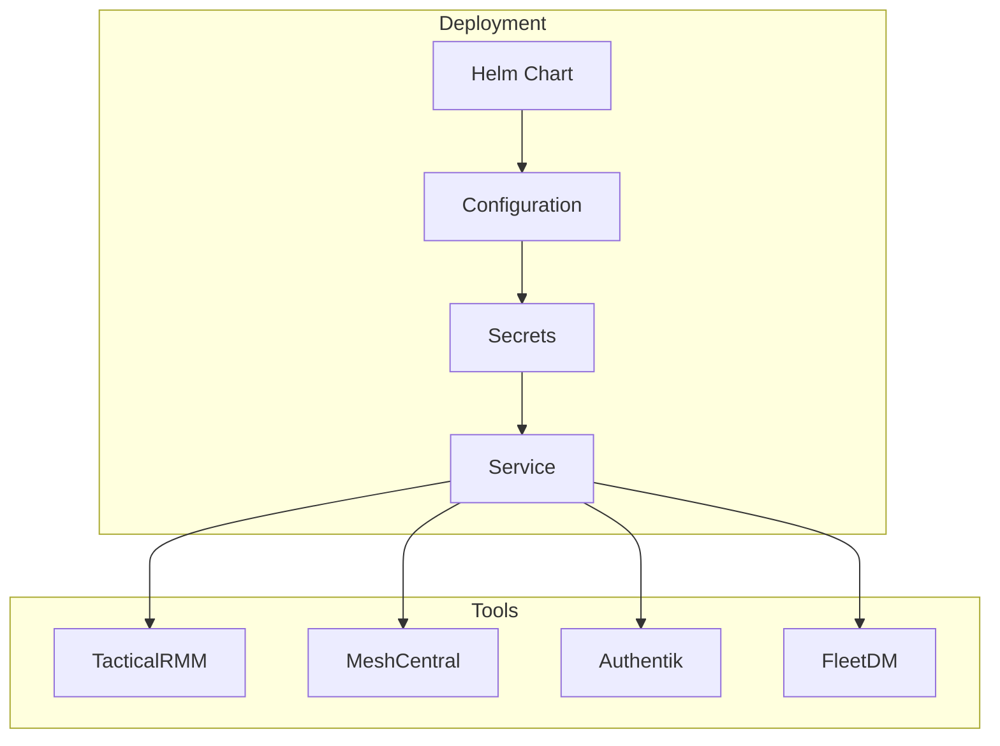

### Tool Configuration
```yaml
tools:
  tacticalRMM:
    enabled: true
    version: latest
    resources:
      requests:
        cpu: 500m
        memory: 512Mi
      limits:
        cpu: 1000m
        memory: 1Gi

  meshCentral:
    enabled: true
    version: latest
    resources:
      requests:
        cpu: 500m
        memory: 512Mi
      limits:
        cpu: 1000m
        memory: 1Gi
```

## Monitoring Setup

### Monitoring Stack
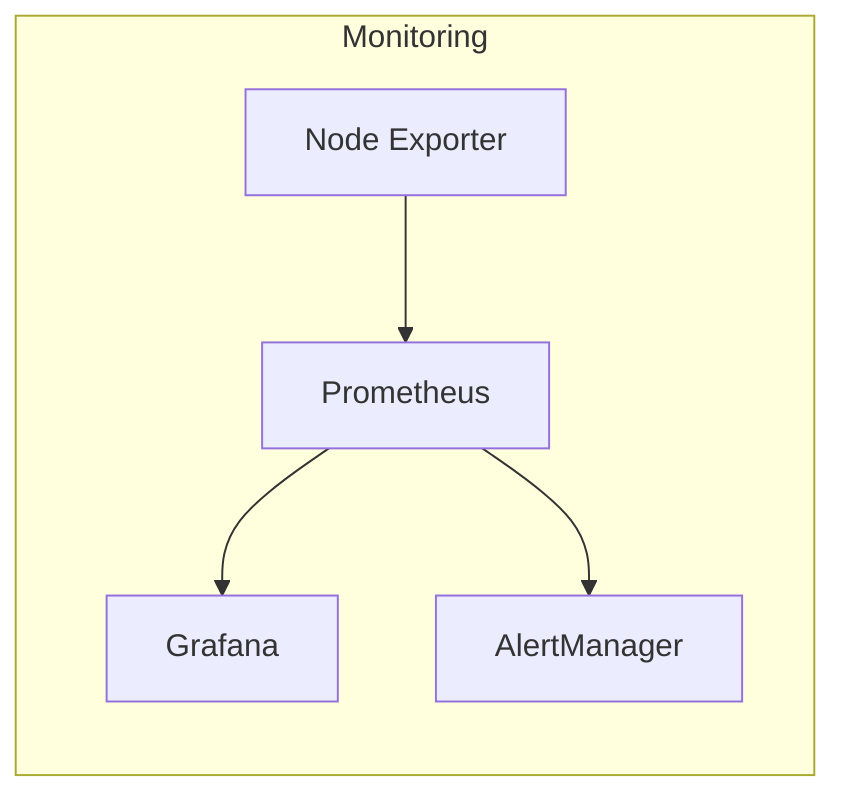

### Logging Stack
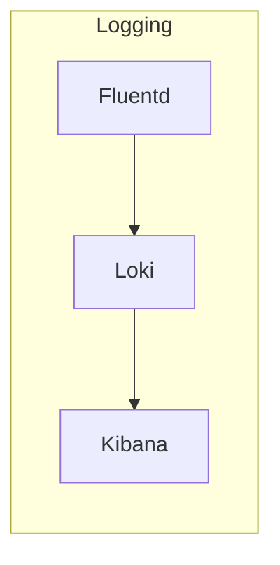

## Post-deployment

### Health Checks
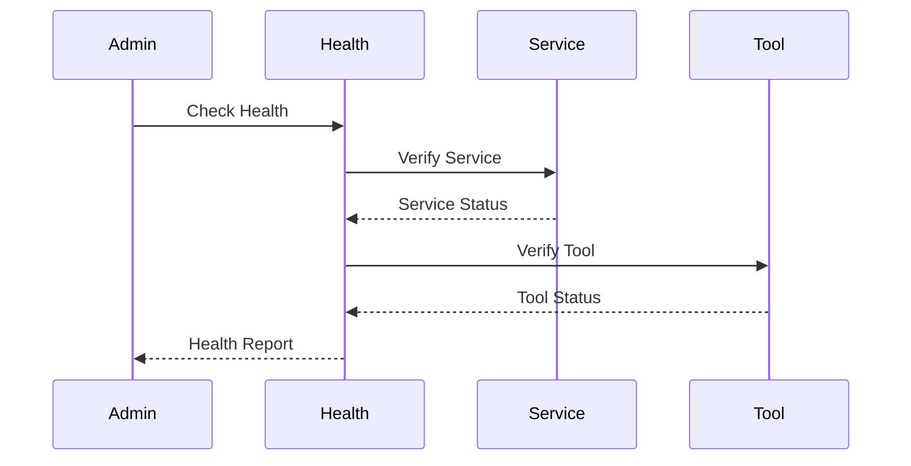

### Validation
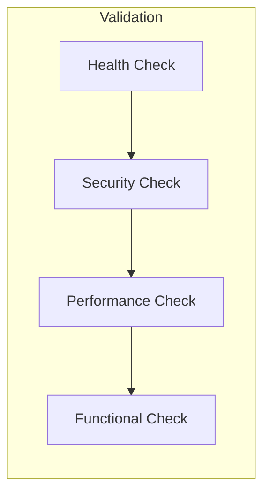

## Maintenance

### Backup Strategy
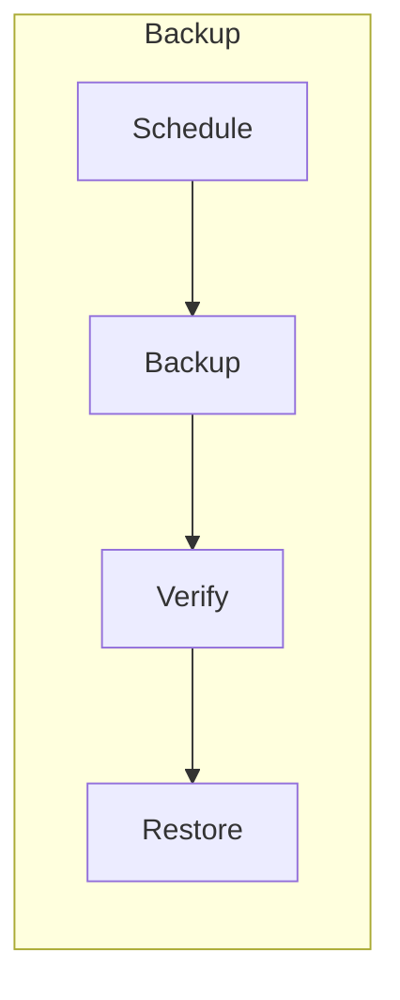

### Update Process
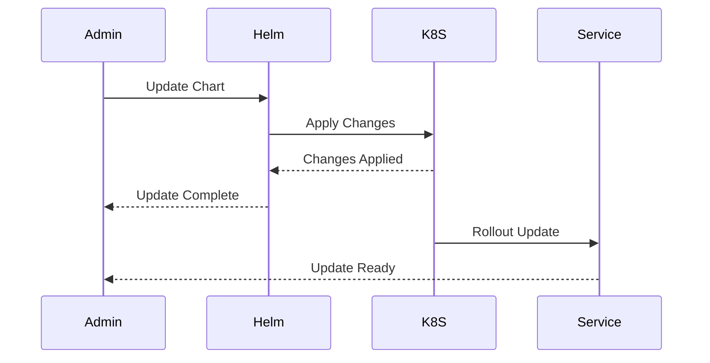

## Next Steps

- [Development Guide](../development/)
- [Operations Guide](../operations/)
- [Security Guide](./security.md)
- [API Integration Guide](./api-integration.md) 