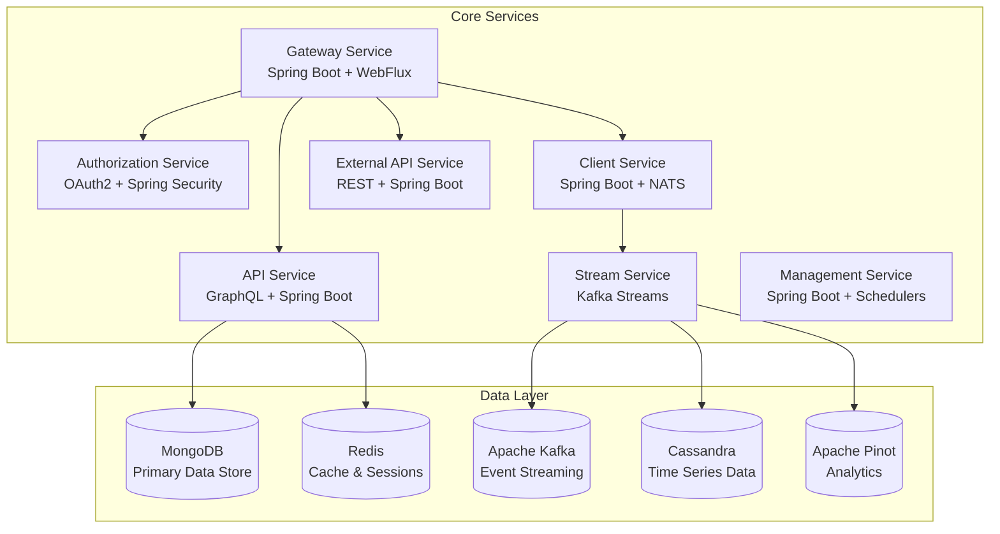
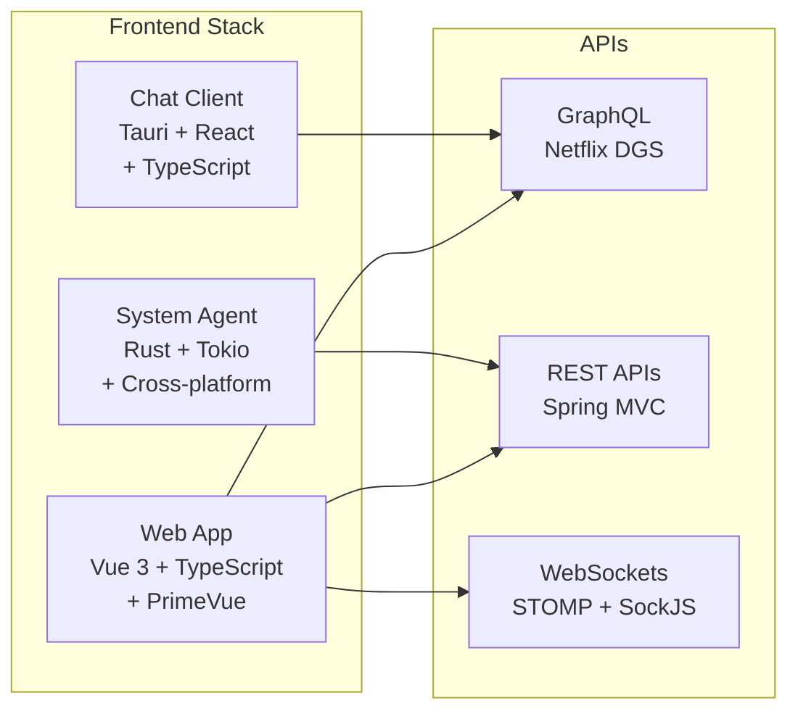

# Development Documentation

Welcome to the OpenFrame development documentation! This section provides comprehensive guides for developers working with OpenFrame, from initial setup to advanced customization.

## Quick Navigation

### 🚀 Getting Started
- **[Environment Setup](setup/environment.md)** - IDE configuration, tools, and development environment
- **[Local Development](setup/local-development.md)** - Running OpenFrame locally for development

### 🏗️ Architecture & Design
- **[Architecture Overview](architecture/overview.md)** - System design, components, and data flow
- **[API Design](architecture/api-design.md)** - GraphQL and REST API patterns

### 🧪 Testing
- **[Testing Overview](testing/overview.md)** - Test strategy, running tests, writing new tests
- **[E2E Testing](testing/e2e-testing.md)** - End-to-end testing with real services

### 🤝 Contributing
- **[Contributing Guidelines](contributing/guidelines.md)** - Code style, PR process, and development workflow
- **[API Development](contributing/api-development.md)** - Adding new APIs and endpoints

## OpenFrame Technology Stack

### Backend Services


### Frontend Applications


## Development Workflow

### Standard Development Process

1. **Setup Environment**
   ```bash
   # Clone repository
   git clone https://github.com/flamingo-stack/openframe-oss-tenant.git
   cd openframe-oss-tenant

   # Setup development environment
   ./scripts/setup-dev-env.sh
   ```

2. **Create Feature Branch**
   ```bash
   git checkout -b feature/your-feature-name
   ```

3. **Local Development**
   ```bash
   # Start infrastructure
   cd integrated-tools && docker compose up -d

   # Build and run services
   ./scripts/run-mac.sh  # or run-linux.sh, run-windows.ps1
   ```

4. **Test Changes**
   ```bash
   # Run unit tests
   mvn test

   # Run integration tests
   mvn test -Pintegration

   # Run e2e tests
   cd openframe-e2e-tests
   mvn test -Dtest=SmokeTest
   ```

5. **Submit Pull Request**
   - Ensure all tests pass
   - Update documentation
   - Follow code style guidelines
   - Add appropriate reviewers

## Key Development Tools

### Required Tools
| Tool | Version | Purpose |
|------|---------|---------|
| **Java JDK** | 21+ | Backend services development |
| **Node.js** | 18+ | Frontend development and build |
| **Docker** | 20+ | Local infrastructure and containers |
| **Maven** | 3.8+ | Java build and dependency management |
| **Git** | 2.40+ | Version control |

### Recommended IDEs and Extensions

#### IntelliJ IDEA (Java Development)
```
Essential Plugins:
• Spring Boot
• GraphQL
• Docker
• Kubernetes
• SonarLint
• Lombok

Configuration:
• JDK 21 project SDK
• Maven auto-import enabled
• Code style: Google Java Style Guide
• File encoding: UTF-8
```

#### VS Code (Frontend Development)
```json
{
  "recommendations": [
    "vue.vscode-typescript-vue-plugin",
    "bradlc.vscode-tailwindcss",
    "ms-vscode.vscode-typescript-next",
    "esbenp.prettier-vscode",
    "ms-vscode.vscode-eslint"
  ]
}
```

## Project Structure Overview

```
openframe-oss-tenant/
├── openframe/                    # Java services and libraries
│   ├── services/                # Microservices
│   │   ├── openframe-gateway/   # API Gateway
│   │   ├── openframe-api/       # Main API service
│   │   ├── openframe-authz/     # Authorization server
│   │   ├── openframe-client/    # Client/agent management
│   │   ├── openframe-stream/    # Event processing
│   │   ├── openframe-mgmt/      # Management service
│   │   ├── openframe-ext-api/   # External API
│   │   └── openframe-frontend/  # Vue.js web application
│   └── libs/                    # Shared libraries
│       ├── openframe-core/      # Core models and utilities
│       ├── openframe-data/      # Data access layer
│       ├── openframe-security/  # Security utilities
│       └── openframe-kafka/     # Kafka integration
├── clients/                     # Client applications
│   ├── openframe-chat/         # Desktop chat client (Tauri)
│   └── openframe-client/       # System agent (Rust)
├── integrated-tools/           # Docker configurations
├── manifests/                  # Kubernetes manifests
├── scripts/                    # Development scripts
└── docs/                       # Documentation
```

## Common Development Tasks

### Adding a New Microservice

1. **Create Service Module**
   ```bash
   cd openframe/services
   mkdir openframe-your-service
   cd openframe-your-service
   ```

2. **Setup Maven Structure**
   ```xml
   <!-- pom.xml -->
   <parent>
       <groupId>com.openframe</groupId>
       <artifactId>openframe-services</artifactId>
       <version>1.0.0-SNAPSHOT</version>
   </parent>
   
   <artifactId>openframe-your-service</artifactId>
   <name>OpenFrame Your Service</name>
   ```

3. **Add Spring Boot Main Class**
   ```java
   @SpringBootApplication
   @EnableEurekaClient  // If using service discovery
   public class YourServiceApplication {
       public static void main(String[] args) {
           SpringApplication.run(YourServiceApplication.class, args);
       }
   }
   ```

4. **Configure Gateway Routing**
   ```yaml
   # gateway configuration
   spring:
     cloud:
       gateway:
         routes:
           - id: your-service
             uri: http://localhost:8084
             predicates:
               - Path=/your-service/**
   ```

### Adding GraphQL APIs

1. **Create GraphQL Schema**
   ```graphql
   # src/main/resources/schema/your-schema.graphqls
   type Query {
       getYourData(id: ID!): YourDataType
       listYourData(filter: YourFilter): [YourDataType]
   }
   
   type YourDataType {
       id: ID!
       name: String!
       createdAt: DateTime!
   }
   ```

2. **Implement DataFetcher**
   ```java
   @DgsComponent
   public class YourDataFetcher {
       
       @DgsQuery
       public YourDataType getYourData(@InputArgument String id) {
           // Implementation
       }
       
       @DgsQuery
       public List<YourDataType> listYourData(@InputArgument YourFilter filter) {
           // Implementation
       }
   }
   ```

### Frontend Development

1. **Add New Page/Component**
   ```typescript
   // src/views/YourPage.vue
   <template>
     <div class="your-page">
       <h1>Your Feature</h1>
       <!-- Component content -->
     </div>
   </template>
   
   <script setup lang="ts">
   import { ref, onMounted } from 'vue'
   import { useYourService } from '@/services/your-service'
   
   const { data, loading, error } = useYourService()
   </script>
   ```

2. **Add Route Configuration**
   ```typescript
   // src/router/index.ts
   {
     path: '/your-feature',
     name: 'YourFeature',
     component: () => import('@/views/YourPage.vue'),
     meta: { requiresAuth: true }
   }
   ```

## Development Best Practices

### Code Quality Standards

1. **Java Backend**
   - Follow Google Java Style Guide
   - Use Lombok for boilerplate reduction
   - Implement proper error handling
   - Write comprehensive unit tests
   - Document public APIs with JavaDoc

2. **TypeScript Frontend**
   - Use strict TypeScript configuration
   - Implement proper component composition
   - Follow Vue 3 Composition API patterns
   - Ensure accessibility compliance
   - Write component tests

3. **Database Design**
   - Use appropriate indexes
   - Implement proper data validation
   - Design for multi-tenancy
   - Consider performance implications
   - Document schema changes

### Security Considerations

- Always validate input data
- Use parameterized queries
- Implement proper authentication/authorization
- Follow OWASP security guidelines
- Encrypt sensitive data at rest
- Use HTTPS for all communications

### Performance Guidelines

- Implement database query optimization
- Use caching appropriately (Redis)
- Design for horizontal scaling
- Monitor application metrics
- Profile code for bottlenecks
- Implement proper logging levels

## Testing Strategy

### Unit Testing
```bash
# Java services
mvn test -Dtest=YourServiceTest

# Frontend components
npm run test:unit
```

### Integration Testing
```bash
# With embedded test containers
mvn test -Pintegration
```

### End-to-End Testing
```bash
# Full application testing
cd openframe-e2e-tests
mvn test -Dtest=E2ETest
```

## Debugging and Troubleshooting

### Common Issues

1. **Service Won't Start**
   - Check Java version compatibility
   - Verify database connections
   - Review application logs
   - Ensure required ports are available

2. **Frontend Build Fails**
   - Clear `node_modules` and reinstall
   - Check Node.js version compatibility
   - Verify TypeScript configuration
   - Review build error messages

3. **Database Connection Issues**
   - Verify Docker containers are running
   - Check connection strings
   - Validate database user permissions
   - Review network connectivity

### Debugging Tools

- **Java Services**: Remote debugging on port 5005
- **Frontend**: Vue DevTools browser extension
- **Database**: MongoDB Compass, Redis CLI
- **API Testing**: GraphQL Playground, Postman

## Resources and References

### Documentation Links
- **Spring Boot**: https://spring.io/projects/spring-boot
- **Vue 3**: https://vuejs.org/guide/
- **GraphQL**: https://graphql.org/learn/
- **Apache Kafka**: https://kafka.apache.org/documentation/

### Community Resources
- **OpenMSP Slack**: Join our developer community
- **GitHub Discussions**: Technical discussions and Q&A
- **Stack Overflow**: Tag questions with `openframe`

---

Ready to start developing? Begin with [Environment Setup](setup/environment.md) to configure your development environment!