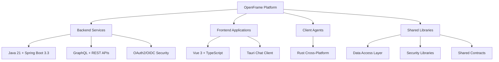

# Development Documentation

Welcome to the OpenFrame development documentation. This section provides comprehensive guides for developers who want to contribute to, extend, or understand the OpenFrame platform.

## 📖 Quick Navigation

### Setup Guides
- **[Environment Setup](setup/environment.md)** — IDE, tools, and dependencies
- **[Local Development](setup/local-development.md)** — Clone, build, and run locally

### Architecture
- **[Overview](architecture/overview.md)** — High-level system design and data flow

### Testing
- **[Testing Overview](testing/overview.md)** — Test structure, running tests, coverage

### Contributing
- **[Guidelines](contributing/guidelines.md)** — Code style, PR process, conventions

## 🏗️ Platform Overview

OpenFrame is a modern microservices platform built with:



## 🎯 Development Tracks

Choose your development path:

### Backend Development
Focus on Java services, APIs, and data processing:
- **Prerequisites**: Java 21, Maven, Docker
- **Key Technologies**: Spring Boot, GraphQL, Kafka
- **Entry Point**: [Environment Setup](setup/environment.md)

### Frontend Development  
Work on Vue.js web interface or chat clients:
- **Prerequisites**: Node.js 18+, npm
- **Key Technologies**: Vue 3, TypeScript, Tauri
- **Entry Point**: [Local Development](setup/local-development.md)

### Platform Development
Contribute to infrastructure and architecture:
- **Prerequisites**: Docker, Kubernetes, understanding of distributed systems
- **Key Technologies**: Kafka, MongoDB, Redis, Pinot
- **Entry Point**: [Architecture Overview](architecture/overview.md)

### Client Development
Build cross-platform system agents:
- **Prerequisites**: Rust toolchain
- **Key Technologies**: Rust, Tokio, cross-platform APIs
- **Entry Point**: [Local Development](setup/local-development.md)

## 🛠️ Development Workflow

### Standard Development Flow

1. **Setup Environment**
   ```bash
   # See environment setup guide
   git clone https://github.com/flamingo-stack/openframe-oss-tenant.git
   cd openframe-oss-tenant
   ```

2. **Choose Development Mode**
   ```bash
   # Full stack development
   ./scripts/run-mac.sh --dev
   
   # Frontend only
   cd openframe/services/openframe-frontend
   npm run dev
   
   # Backend only  
   mvn spring-boot:run -pl openframe/services/openframe-api
   ```

3. **Make Changes**
   - Follow our [coding standards](contributing/guidelines.md)
   - Write tests for new functionality
   - Update documentation as needed

4. **Test Changes**
   ```bash
   # Run all tests
   mvn test
   
   # Frontend tests
   npm run test
   
   # E2E tests
   npm run test:e2e
   ```

5. **Submit Contribution**
   - Create feature branch
   - Make pull request
   - Pass CI/CD checks
   - Get code review approval

## 📊 Repository Structure

Understanding the codebase organization:

```text
openframe-oss-tenant/
├── openframe/                      # Core platform
│   ├── services/                  # Microservices
│   │   ├── openframe-api/         # GraphQL API service
│   │   ├── openframe-gateway/     # API gateway
│   │   ├── openframe-frontend/    # Vue.js web app
│   │   └── ...                   # Other services
│   └── libs/                     # Shared libraries
├── clients/                      # Client applications
│   ├── openframe-client/        # Rust system agent
│   └── openframe-chat/          # Tauri chat client
├── integrated-tools/            # External tool configs
├── manifests/                   # Kubernetes deployments
├── scripts/                     # Development scripts
└── docs/                       # Documentation
```

## 🔧 Common Development Tasks

### Add a New Service

1. **Create Service Module**
   ```bash
   mkdir openframe/services/openframe-newservice
   cp openframe/services/openframe-api/pom.xml openframe/services/openframe-newservice/
   # Edit pom.xml with new artifact details
   ```

2. **Implement Service**
   - Follow Spring Boot conventions
   - Add to main `pom.xml`
   - Configure Docker image
   - Add to Docker Compose

3. **Add to Gateway Routes**
   ```yaml
   # In gateway configuration
   spring.cloud.gateway.routes:
     - id: newservice
       uri: http://openframe-newservice:8080
       predicates:
         - Path=/api/newservice/**
   ```

### Add a New Frontend Feature

1. **Create Vue Component**
   ```bash
   # In frontend directory
   touch src/components/NewFeature.vue
   touch src/views/NewFeaturePage.vue
   ```

2. **Add Route**
   ```typescript
   // router/index.ts
   {
     path: '/new-feature',
     component: () => import('../views/NewFeaturePage.vue')
   }
   ```

3. **Add Navigation**
   ```vue
   <!-- Add to navigation menu -->
   <router-link to="/new-feature">New Feature</router-link>
   ```

### Add API Endpoints

1. **GraphQL Schema**
   ```graphql
   # resources/schema/schema.graphqls
   type Query {
     newData(filter: String): NewDataConnection
   }
   
   type NewDataConnection {
     edges: [NewDataEdge]
     pageInfo: PageInfo
   }
   ```

2. **Data Fetcher**
   ```java
   @DgsComponent
   public class NewDataFetcher {
     @DgsQuery
     public DataConnection newData(@InputArgument String filter) {
       // Implementation
     }
   }
   ```

3. **REST Controller**
   ```java
   @RestController
   @RequestMapping("/api/new-data")
   public class NewDataController {
     @PostMapping
     public ResponseEntity<?> create(@RequestBody NewDataRequest request) {
       // Implementation
     }
   }
   ```

## 🧪 Testing Strategy

### Test Pyramid

OpenFrame follows a comprehensive testing strategy:

```mermaid
pyramid
    1[Unit Tests]
    2[Integration Tests]
    3[E2E Tests]
```

- **Unit Tests**: Fast, isolated tests for individual components
- **Integration Tests**: Database and service integration tests  
- **E2E Tests**: Full user workflows and API contracts

### Running Tests

```bash
# Backend unit tests
mvn test

# Backend integration tests
mvn test -Dtest="*IT"

# Frontend unit tests
cd openframe/services/openframe-frontend
npm test

# E2E tests
cd openframe-e2e-tests
mvn test
```

## 🚀 Performance Considerations

### Development Performance

- **Incremental builds**: Use `mvn compile` for faster iteration
- **Hot reload**: Frontend supports hot module replacement
- **Test subset**: Run specific test classes during development
- **Resource limits**: Configure Docker memory limits appropriately

### Production Performance

- **JVM tuning**: Optimize heap sizes for your deployment
- **Database indexing**: MongoDB indexes are auto-created
- **Caching**: Redis used for session and query caching
- **Connection pooling**: Configured for high throughput

## 📝 Documentation Standards

When contributing, ensure documentation is updated:

### Code Documentation
- **JavaDoc**: For all public APIs
- **JSDoc**: For TypeScript functions
- **README**: For each module/service
- **API Docs**: GraphQL schema documentation

### Tutorial Documentation
- **Getting Started**: User-focused guides
- **Development**: Technical implementation guides
- **Architecture**: Design decisions and patterns
- **Operations**: Deployment and maintenance

## 🤝 Contributing Guidelines

Before contributing, review:

1. **[Code Style Guidelines](contributing/guidelines.md)**
2. **[Testing Requirements](testing/overview.md)**
3. **Pull Request Process**
4. **Community Code of Conduct**

### Quick Contributing Checklist

- [ ] Fork the repository
- [ ] Create feature branch (`feature/my-feature`)
- [ ] Follow code style guidelines
- [ ] Add tests for new functionality
- [ ] Update documentation
- [ ] Test locally with `./scripts/run-mac.sh`
- [ ] Submit pull request with clear description
- [ ] Respond to code review feedback

## 🔗 External Resources

### Learning Resources
- **Spring Boot**: https://spring.io/guides
- **Vue.js**: https://vuejs.org/guide/
- **GraphQL**: https://graphql.org/learn/
- **Docker**: https://docs.docker.com/get-started/

### OpenFrame Resources
- **GitHub**: https://github.com/flamingo-stack/openframe-oss-tenant
- **Slack Community**: [OpenMSP Slack](https://join.slack.com/t/openmsp/shared_invite/zt-36bl7mx0h-3~U2nFH6nqHqoTPXMaHEHA)
- **Flamingo Platform**: https://flamingo.run/openframe

## 💡 Getting Help

### Development Support

**Community Support:**
- Join [OpenMSP Slack](https://join.slack.com/t/openmsp/shared_invite/zt-36bl7mx0h-3~U2nFH6nqHqoTPXMaHEHA) for real-time help
- Check existing GitHub issues for known problems
- Review documentation and architecture guides

**Reporting Issues:**
- Use GitHub Issues for bug reports
- Provide reproduction steps and environment details
- Include relevant logs and configuration

**Feature Requests:**
- Discuss in Slack community first
- Create GitHub issue with detailed requirements
- Consider contributing the implementation

---

Ready to start developing? Begin with [Environment Setup](setup/environment.md) or jump to [Local Development](setup/local-development.md) to start coding immediately.