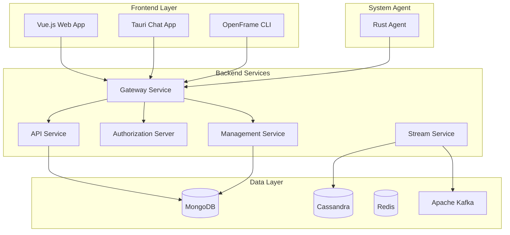
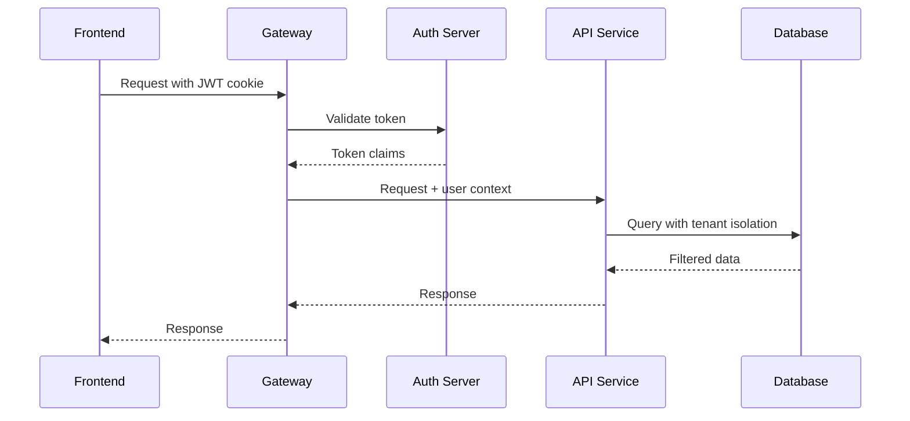

# Development Documentation

Welcome to the OpenFrame development documentation! This section provides comprehensive guides for developers who want to understand, modify, extend, or contribute to the OpenFrame platform.

[](https://www.youtube.com/watch?v=O8hbBO5Mym8)

## Quick Navigation

### Setup and Environment
- **[Environment Setup](setup/environment.md)** - IDE configuration, tools, and development environment
- **[Local Development](setup/local-development.md)** - Running OpenFrame locally for development

### Architecture and Design
- **[Architecture Overview](architecture/overview.md)** - High-level system design and component interaction
- **[Core Libraries](../reference/architecture/)** - Detailed reference for shared libraries and services

### Development Practices
- **[Testing Overview](testing/overview.md)** - Testing strategies, frameworks, and best practices
- **[Contributing Guidelines](contributing/guidelines.md)** - Code standards, PR process, and contribution workflow

## Development Stack Overview

OpenFrame is built using modern, cloud-native technologies organized in a microservices architecture:



## Technology Stack

### Backend Development
- **Language**: Java 21 (OpenJDK LTS)
- **Framework**: Spring Boot 3.3.0 with Spring Cloud 2023.0.3
- **API Layer**: Netflix DGS (GraphQL) + Spring Web (REST)
- **Security**: Spring Security with OAuth2/OIDC, JWT tokens
- **Build Tool**: Apache Maven 3.8+

### Frontend Development
- **Primary Framework**: Vue 3 with Composition API and TypeScript
- **UI Components**: PrimeVue 3.45.0 with custom design system
- **State Management**: Pinia stores for reactive state
- **Build System**: Vite 5.0.10 with TypeScript support
- **HTTP Client**: Apollo Client for GraphQL

### System Agent Development
- **Language**: Rust 1.75+ for cross-platform system agent
- **Framework**: Tokio for async runtime, Tauri for desktop apps
- **Platforms**: Windows, macOS, Linux support
- **Communication**: NATS messaging, REST APIs

### Data and Infrastructure
- **Databases**: MongoDB 7.x (primary), Cassandra 4.x (time-series), Redis 7.x (cache)
- **Message Streaming**: Apache Kafka 3.6.0 with Debezium CDC
- **Containerization**: Docker and Docker Compose
- **Orchestration**: Kubernetes 1.28+ with Helm charts

## Repository Structure

```
openframe-oss-tenant/
├── openframe/                          # Java services and libraries
│   ├── services/                       # Deployable microservices
│   │   ├── openframe-gateway/          # API Gateway
│   │   ├── openframe-api/              # GraphQL API service
│   │   ├── openframe-authorization-server/  # OAuth2 server
│   │   ├── openframe-management/       # Management service
│   │   ├── openframe-stream/           # Stream processing
│   │   ├── openframe-client/           # Agent management
│   │   ├── openframe-external-api/     # External API service
│   │   ├── openframe-config/           # Configuration server
│   │   └── openframe-frontend/         # Vue.js frontend
│   └── libs/                           # Shared libraries (in deps/)
├── clients/                            # Client applications
│   ├── openframe-client/               # Rust system agent
│   └── openframe-chat/                 # Tauri chat application  
├── integrated-tools/                   # MSP tool Docker configurations
├── manifests/                          # Kubernetes deployment manifests
├── scripts/                            # Development and deployment scripts
└── docs/                              # Documentation (this directory)
```

## Development Workflow

### Daily Development Tasks

```bash
# 1. Update dependencies and build
git pull origin main
mvn clean install

# 2. Start infrastructure services
docker compose -f integrated-tools/docker-compose.yml up -d

# 3. Run specific service for development
cd openframe/services/openframe-api
mvn spring-boot:run

# 4. Start frontend in development mode
cd openframe/services/openframe-frontend  
npm run dev
```

### Common Development Commands

| Task | Command | Description |
|------|---------|-------------|
| **Build all** | `mvn clean install` | Build all Java services and libraries |
| **Run tests** | `mvn test` | Execute all unit and integration tests |
| **Start frontend** | `npm run dev` | Start Vue.js dev server with hot reload |
| **Build Rust agent** | `cd clients/openframe-client && cargo build` | Compile system agent |
| **Generate GraphQL types** | `cd openframe/services/openframe-api && mvn dgs:generate` | Regenerate GraphQL DTOs |
| **Start all services** | `./scripts/run-mac.sh` | Start complete platform |

## Key Development Concepts

### Microservice Architecture Patterns

OpenFrame implements several key patterns:

- **API Gateway Pattern**: All external traffic routes through the gateway
- **Database per Service**: Each service owns its data and database
- **Event-Driven Architecture**: Services communicate via Kafka events
- **Shared Libraries**: Common functionality in reusable libraries

### Authentication and Security Flow



### Multi-Tenant Data Isolation

All services implement tenant-aware data access:

- **Request Context**: Tenant ID extracted from JWT claims
- **Database Filtering**: All queries automatically filtered by tenant
- **Cache Isolation**: Redis keys prefixed with tenant ID
- **Event Processing**: Kafka messages tagged with tenant context

## Development Environment Setup

### Required Tools

Before starting development, ensure you have:

1. **Java 21** - OpenJDK LTS version
2. **Maven 3.8+** - Build and dependency management
3. **Node.js 18/20 LTS** - Frontend development
4. **Docker** - Infrastructure services
5. **IDE** - IntelliJ IDEA, VS Code, or similar

### Optional Tools

For full-stack development:
- **Rust 1.75+** - System agent development
- **kubectl** - Kubernetes deployment
- **Postman/Insomnia** - API testing
- **MongoDB Compass** - Database management

## Getting Started with Development

### 1. Choose Your Focus Area

| Area | Skills Needed | Getting Started Guide |
|------|---------------|----------------------|
| **Backend Services** | Java, Spring Boot, GraphQL | [Environment Setup](setup/environment.md) |
| **Frontend Development** | Vue.js, TypeScript, GraphQL | [Local Development](setup/local-development.md) |
| **System Agent** | Rust, systems programming | [Contributing Guidelines](contributing/guidelines.md) |
| **DevOps/Infrastructure** | Kubernetes, Docker, CI/CD | [Architecture Overview](architecture/overview.md) |

### 2. Set Up Your Development Environment

1. **Read [Environment Setup](setup/environment.md)** - Configure your IDE and tools
2. **Follow [Local Development](setup/local-development.md)** - Run OpenFrame locally
3. **Review [Architecture Overview](architecture/overview.md)** - Understand system design

### 3. Make Your First Contribution

1. **Pick a good first issue** - Look for "good first issue" labels on GitHub
2. **Follow [Contributing Guidelines](contributing/guidelines.md)** - Learn our process
3. **Read [Testing Overview](testing/overview.md)** - Understand our testing approach
4. **Submit a pull request** - Get your code reviewed and merged

## Common Development Scenarios

### Adding a New GraphQL Query

```bash
# 1. Define schema
echo 'type Query { newQuery: String }' >> schema.graphqls

# 2. Generate DTOs
mvn dgs:generate

# 3. Implement DataFetcher
# Create new class implementing DataFetcher<String>

# 4. Test
mvn test
```

### Creating a New Frontend Component

```bash
# 1. Create component
touch src/components/MyComponent.vue

# 2. Add to component library
# Export from src/components/index.ts

# 3. Use in pages
# Import and use in page components

# 4. Test
npm run test
```

### Adding New Rust Agent Feature

```bash
# 1. Add to lib.rs or create new module
touch src/modules/my_feature.rs

# 2. Implement feature
# Add async functions and integration

# 3. Test
cargo test

# 4. Build
cargo build --release
```

## Testing and Quality Assurance

### Testing Strategies

- **Unit Tests**: Individual component testing (JUnit, Jest, Rust tests)
- **Integration Tests**: Service interaction testing
- **E2E Tests**: Full user workflow testing with Playwright
- **Contract Tests**: API contract verification

### Code Quality Tools

- **Java**: SpotBugs, PMD, Checkstyle
- **TypeScript**: ESLint, Prettier, TypeScript compiler
- **Rust**: Clippy, rustfmt, cargo audit

## Documentation and Resources

### Internal Documentation

- **API Documentation**: Generated from GraphQL schemas and OpenAPI specs
- **Architecture Decision Records**: Design decisions and rationale
- **Service Documentation**: README files in each service directory

### External Resources

- **Community**: [OpenMSP Slack](https://join.slack.com/t/openmsp/shared_invite/zt-36bl7mx0h-3~U2nFH6nqHqoTPXMaHEHA)
- **Video Guides**: [OpenFrame YouTube Channel](https://www.youtube.com/@OpenFrame)
- **Technical Blog**: Updates and deep dives on technical topics

## Contributing to OpenFrame

### Ways to Contribute

1. **Code Contributions**: New features, bug fixes, performance improvements
2. **Documentation**: Guides, tutorials, API documentation
3. **Testing**: Test cases, QA, bug reports  
4. **Community**: Help other developers, answer questions
5. **Translation**: Internationalization support

### Getting Recognition

- **Contributor Program**: Recognition for regular contributors
- **Mentorship**: Guidance for new contributors
- **Community Showcase**: Feature your contributions in community updates

---

Ready to start developing? Begin with the [Environment Setup](setup/environment.md) guide to configure your development environment and start contributing to OpenFrame!