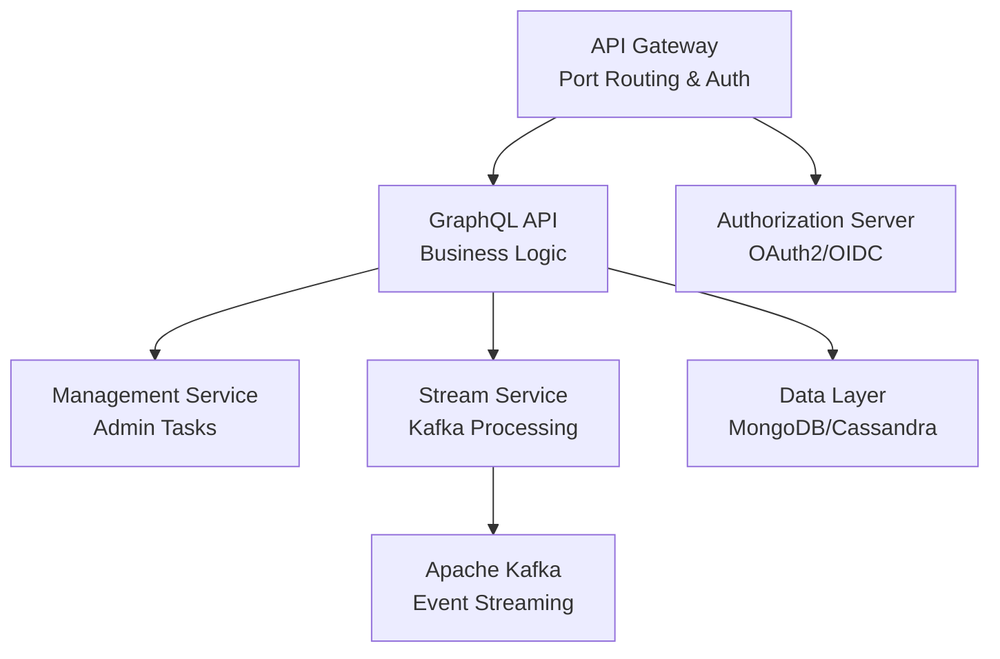
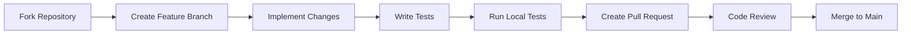
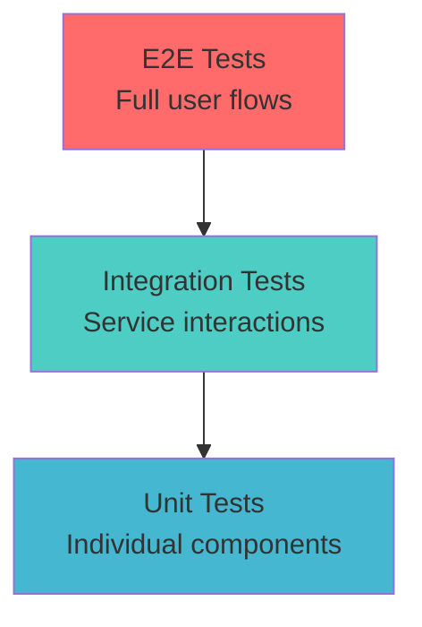
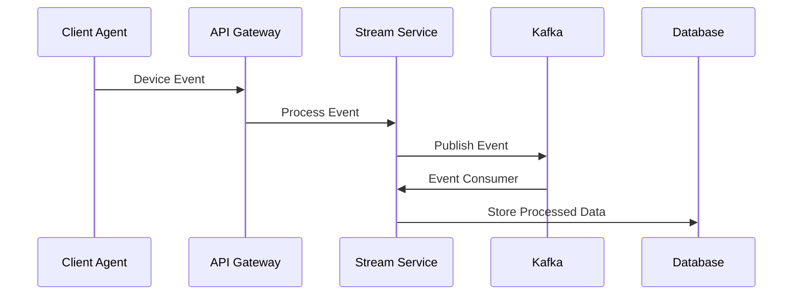

# Development Documentation

Welcome to the OpenFrame development documentation! This section provides comprehensive guides for developers who want to contribute to, customize, or extend the OpenFrame platform.

## Documentation Structure

### Quick Navigation

| Section | Purpose | For Who |
|---------|---------|---------|
| **[Setup](./setup/)** | Development environment and tools | New developers, contributors |
| **[Architecture](./architecture/)** | System design and components | Architects, senior developers |
| **[Testing](./testing/)** | Test strategies and execution | QA engineers, developers |
| **[Contributing](./contributing/)** | Contribution guidelines | All contributors |

## Getting Started with Development

### New to OpenFrame Development?

Follow this path to get up to speed:

1. **[Environment Setup](./setup/environment.md)** - Configure your development tools
2. **[Local Development](./setup/local-development.md)** - Run OpenFrame locally
3. **[Architecture Overview](./architecture/overview.md)** - Understand the system design
4. **[Contributing Guidelines](./contributing/guidelines.md)** - Learn our development process

### Experienced Developer?

Jump directly to what you need:

- **[Architecture Overview](./architecture/overview.md)** - System design patterns
- **[API Documentation](./architecture/overview.md#api-reference)** - GraphQL and REST APIs
- **[Testing Guide](./testing/overview.md)** - Test execution and strategy
- **[Contributing Guidelines](./contributing/guidelines.md)** - Code standards and process

## Core Development Areas

### Backend Services (Java/Spring Boot)

OpenFrame's backend is built with modern Java and Spring Boot:



**Key Technologies:**
- **Java 21** with modern language features
- **Spring Boot 3.3+** for microservices
- **GraphQL** (Netflix DGS) for APIs
- **Apache Kafka** for event streaming
- **MongoDB** for primary data storage

**Development Focus Areas:**
- Microservice architecture patterns
- Event-driven processing with Kafka
- GraphQL schema design and resolvers
- Security with JWT and OAuth2
- Multi-tenant data isolation

### Frontend (Vue.js/TypeScript)

The OpenFrame UI is built with Vue 3 and modern frontend technologies:

**Key Technologies:**
- **Vue 3** with Composition API
- **TypeScript** for type safety
- **Pinia** for state management
- **PrimeVue** for UI components
- **Apollo Client** for GraphQL

**Development Focus Areas:**
- Component architecture and reusability
- State management patterns
- Real-time updates with WebSockets
- Responsive design and accessibility
- Performance optimization

### Client Agent (Rust)

The cross-platform system agent is written in Rust:

**Key Technologies:**
- **Rust** for system-level programming
- **Tokio** for async runtime
- **Serde** for serialization
- **Cross-platform** system APIs

**Development Focus Areas:**
- System monitoring and data collection
- Secure communication with the platform
- Cross-platform compatibility
- Performance and resource efficiency

## Development Workflows

### Standard Development Process



### Code Quality Standards

| Aspect | Requirement | Tool/Process |
|--------|-------------|--------------|
| **Code Coverage** | 80%+ for new code | JaCoCo, Jest coverage |
| **Code Style** | Google Java Style, Prettier | Checkstyle, ESLint |
| **Documentation** | All public APIs | JavaDoc, TSDoc |
| **Security** | SAST scanning | SonarQube, npm audit |
| **Performance** | Load testing | JMeter, Lighthouse |

### Testing Strategy

Our testing pyramid ensures reliability at all levels:



**Test Types:**
- **Unit Tests**: Individual functions and components
- **Integration Tests**: Service-to-service communication
- **E2E Tests**: Complete user workflows
- **Performance Tests**: Load and stress testing

## Architecture Principles

### Microservices Design

OpenFrame follows these microservice principles:

| Principle | Implementation | Benefits |
|-----------|----------------|----------|
| **Single Responsibility** | One service per business capability | Clear ownership, easier maintenance |
| **Decentralized Data** | Each service owns its data | Better scalability, fault isolation |
| **API-First** | GraphQL and REST contracts | Service independence, parallel development |
| **Stateless Services** | No server-side session state | Horizontal scaling, fault tolerance |

### Event-Driven Architecture

Using Apache Kafka for reliable event processing:



### Security-First Approach

Security is built into every layer:

- **Authentication**: OAuth2/OIDC with multiple providers
- **Authorization**: Role-based access control (RBAC)
- **Data Protection**: AES-256 encryption, JWT tokens
- **Network Security**: TLS everywhere, network segmentation
- **Multi-tenancy**: Complete data isolation between tenants

## Development Tools & Setup

### Required Development Tools

| Category | Tool | Version | Purpose |
|----------|------|---------|---------|
| **Java** | OpenJDK | 21+ | Backend services |
| **Node.js** | Node | 18+ | Frontend build |
| **Rust** | Rustc | 1.70+ | Client agent |
| **Docker** | Docker | 20.10+ | Containerization |
| **IDE** | IntelliJ/VSCode | Latest | Development environment |

### Recommended IDE Setup

#### IntelliJ IDEA (Java Development)
```bash
# Install required plugins:
# - Spring Boot
# - GraphQL
# - Docker
# - Database Tools

# Configure code style:
# Settings -> Code Style -> Java -> Import -> google-java-format.xml
```

#### VSCode (Frontend/Full Stack)
```json
{
  "recommendations": [
    "vue.volar",
    "@vue/typescript-plugin",
    "bradlc.vscode-tailwindcss",
    "ms-vscode.vscode-typescript-next",
    "esbenp.prettier-vscode"
  ]
}
```

### Environment Configuration

Create your development environment file:

```bash
# Copy the example environment
cp .env.example .env.development

# Edit with your local settings
vim .env.development
```

## Contributing to OpenFrame

### How to Contribute

We welcome contributions from the community! Here are ways to get involved:

| Type | Description | Getting Started |
|------|-------------|-----------------|
| **Bug Reports** | Report issues you find | Use GitHub Issues (managed via Slack) |
| **Feature Requests** | Suggest new capabilities | Join [OpenMSP Slack](https://join.slack.com/t/openmsp/shared_invite/zt-36bl7mx0h-3~U2nFH6nqHqoTPXMaHEHA) |
| **Code Contributions** | Fix bugs, add features | Read [Contributing Guidelines](./contributing/guidelines.md) |
| **Documentation** | Improve docs and guides | Submit PRs for documentation updates |
| **Testing** | Help with QA and testing | Run test suites, report test failures |

### Development Community

Join our development community:

- **[OpenMSP Slack](https://join.slack.com/t/openmsp/shared_invite/zt-36bl7mx0h-3~U2nFH6nqHqoTPXMaHEHA)** - Main communication channel
- **GitHub Discussions** - Managed through Slack community
- **Weekly Dev Calls** - Announced in Slack
- **Code Reviews** - All PRs welcome community input

## Common Development Tasks

### Starting Development Environment

```bash
# Full development setup
./scripts/run-mac.sh          # macOS
./scripts/run-linux.sh        # Linux  
./scripts/run-windows.ps1     # Windows

# Individual services
mvn spring-boot:run -pl openframe-api
npm run dev                   # Frontend hot reload
cargo run                     # Rust client
```

### Running Tests

```bash
# Java backend tests
mvn test                      # All services
mvn test -pl openframe-api    # Specific service

# Frontend tests  
npm test                      # Unit tests
npm run test:e2e             # E2E tests

# Rust client tests
cargo test                    # All tests
cargo test --release         # Optimized tests
```

### Database Operations

```bash
# Start databases
docker compose -f integrated-tools/docker-compose.base.yml up -d

# Run migrations
mvn flyway:migrate

# Reset test data
mvn exec:java -Dexec.mainClass="com.openframe.TestDataGenerator"
```

## Troubleshooting Development Issues

### Common Problems

| Problem | Solution | Additional Info |
|---------|----------|-----------------|
| **Build failures** | Clear Maven cache: `mvn clean` | Check Java version |
| **Frontend errors** | Clear node_modules: `rm -rf node_modules && npm install` | Check Node version |
| **Database connection** | Restart containers: `docker compose restart` | Check port conflicts |
| **Permission errors** | Run with admin privileges | Required for client agent |

### Getting Help

1. **Check the logs** first - most issues are logged
2. **Search existing issues** in our Slack community
3. **Ask in Slack** - our community is helpful and responsive
4. **Create detailed bug reports** with steps to reproduce

## Resource Links

### Documentation
- **[Setup Guides](./setup/)** - Environment and tools setup
- **[Architecture Docs](./architecture/)** - System design and patterns
- **[Testing Guides](./testing/)** - QA and testing strategies
- **[Contributing](./contributing/)** - How to contribute code

### External Resources
- **[Spring Boot Docs](https://spring.io/projects/spring-boot)** - Backend framework
- **[Vue.js Guide](https://vuejs.org/guide/)** - Frontend framework
- **[Rust Book](https://doc.rust-lang.org/book/)** - Systems programming
- **[Apache Kafka Docs](https://kafka.apache.org/documentation/)** - Event streaming

### Community
- **[OpenMSP Slack](https://join.slack.com/t/openmsp/shared_invite/zt-36bl7mx0h-3~U2nFH6nqHqoTPXMaHEHA)** - Main community hub
- **[Flamingo Platform](https://flamingo.run)** - Parent organization
- **[OpenFrame Website](https://openframe.ai)** - Product information

---

**Ready to start developing?** Begin with the [Environment Setup](./setup/environment.md) guide, then move on to [Local Development](./setup/local-development.md) to get your first contribution ready!

We look forward to your contributions to the OpenFrame ecosystem! 🚀