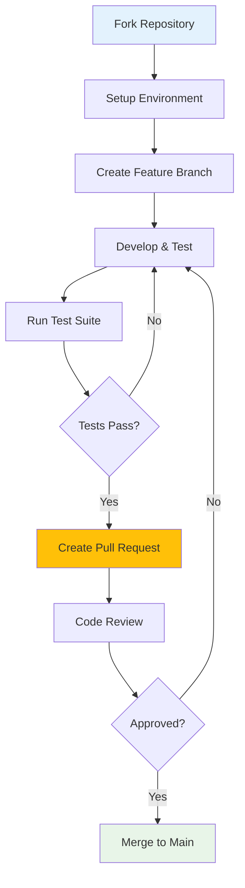

# Development Documentation

This section contains comprehensive documentation for developers working with OpenFrame. Whether you're contributing to the core platform, building custom integrations, or extending functionality, you'll find the resources you need here.

## Documentation Overview

The development documentation is organized into focused sections that guide you through different aspects of OpenFrame development:

### 🏗️ Setup & Environment
Get your development environment configured and running smoothly.

- **[Environment Setup](setup/environment.md)** - IDE configuration, tools, and extensions
- **[Local Development](setup/local-development.md)** - Clone, build, run, and debug

### 🏛️ Architecture & Design  
Understand how OpenFrame is designed and structured.

- **[Architecture Overview](architecture/overview.md)** - High-level system design and components
- Learn the microservices architecture, data flow, and key design decisions

### 🧪 Testing & Quality
Ensure code quality and reliability through comprehensive testing.

- **[Testing Overview](testing/overview.md)** - Test strategy, structure, and best practices
- Unit, integration, and end-to-end testing approaches

### 🤝 Contributing & Guidelines
Guidelines for contributing to OpenFrame development.

- **[Contributing Guidelines](contributing/guidelines.md)** - Code standards, PR process, and review checklist
- Code style, conventions, and collaboration practices

## Quick Navigation

### I Want to...

| Goal | Documentation | Time Estimate |
|------|---------------|---------------|
| **Set up my development environment** | [Environment Setup](setup/environment.md) | 30 minutes |
| **Start contributing code** | [Local Development](setup/local-development.md) + [Guidelines](contributing/guidelines.md) | 1 hour |
| **Understand the architecture** | [Architecture Overview](architecture/overview.md) | 45 minutes |
| **Write and run tests** | [Testing Overview](testing/overview.md) | 30 minutes |
| **Submit my first PR** | [Contributing Guidelines](contributing/guidelines.md) | 15 minutes |

### By Experience Level

#### New to OpenFrame
1. Start with [Architecture Overview](architecture/overview.md) to understand the system
2. Follow [Environment Setup](setup/environment.md) to configure your workspace
3. Try [Local Development](setup/local-development.md) to run the platform locally
4. Read [Contributing Guidelines](contributing/guidelines.md) before making changes

#### Experienced Developer
1. Jump to [Local Development](setup/local-development.md) for quick setup
2. Review [Architecture Overview](architecture/overview.md) for OpenFrame-specific patterns
3. Check [Testing Overview](testing/overview.md) for testing requirements
4. Refer to [Contributing Guidelines](contributing/guidelines.md) for submission standards

#### Platform Contributor
1. Master all sections in order
2. Focus on [Testing Overview](testing/overview.md) for quality standards
3. Follow [Contributing Guidelines](contributing/guidelines.md) religiously
4. Help improve this documentation itself

## Development Workflow Overview



## Technology Stack Reference

### Backend Technologies

| Component | Technology | Version | Documentation |
|-----------|------------|---------|---------------|
| **Runtime** | Java | 21+ | [Oracle Java Docs](https://docs.oracle.com/en/java/javase/21/) |
| **Framework** | Spring Boot | 3.3.0 | [Spring Boot Docs](https://docs.spring.io/spring-boot/docs/current/reference/html/) |
| **API** | GraphQL (Netflix DGS) | 7.0.0 | [DGS Framework](https://netflix.github.io/dgs/) |
| **Security** | Spring Security | 6.x | [Security Docs](https://docs.spring.io/spring-security/reference/) |
| **Database** | MongoDB | 7.x | [MongoDB Docs](https://docs.mongodb.com/) |
| **Caching** | Redis | 7.x | [Redis Docs](https://redis.io/documentation) |
| **Messaging** | Apache Kafka | 3.6.0 | [Kafka Docs](https://kafka.apache.org/documentation/) |
| **Analytics** | Apache Pinot | 1.2.0 | [Pinot Docs](https://docs.pinot.apache.org/) |

### Frontend Technologies

| Component | Technology | Version | Documentation |
|-----------|------------|---------|---------------|
| **Framework** | Vue.js | 3.x | [Vue 3 Docs](https://vuejs.org/guide/) |
| **Language** | TypeScript | 5.x | [TypeScript Docs](https://www.typescriptlang.org/docs/) |
| **UI Library** | PrimeVue | 3.45.0 | [PrimeVue Docs](https://primefaces.org/primevue/) |
| **State Management** | Pinia | 2.x | [Pinia Docs](https://pinia.vuejs.org/) |
| **Build Tool** | Vite | 5.0.10 | [Vite Docs](https://vitejs.dev/guide/) |
| **GraphQL Client** | Apollo Client | 3.x | [Apollo Docs](https://www.apollographql.com/docs/react/) |

### Development Tools

| Category | Tools | Purpose |
|----------|-------|---------|
| **IDE** | IntelliJ IDEA, VS Code | Primary development environments |
| **Build** | Maven, npm | Package management and builds |
| **Containers** | Docker, Docker Compose | Local development and testing |
| **Testing** | JUnit, Mockito, Vitest | Unit and integration testing |
| **Code Quality** | SpotBugs, ESLint, Prettier | Static analysis and formatting |

## Common Development Tasks

### Building & Running

```bash
# Build entire project
mvn clean install

# Run specific service  
cd openframe/services/openframe-api
mvn spring-boot:run

# Build and run frontend
cd openframe/services/openframe-frontend
npm install && npm run dev
```

### Testing

```bash
# Run all tests
mvn test

# Run tests for specific module
mvn test -pl openframe-api

# Frontend tests
cd openframe/services/openframe-frontend
npm run test:unit
```

### Code Quality

```bash
# Check code style
mvn spotbugs:check

# Format frontend code
cd openframe/services/openframe-frontend
npm run lint:fix
```

## Development Best Practices

### Code Organization

- **Modular Design**: Each service focuses on a single domain
- **Shared Libraries**: Common code in `openframe-oss-lib` modules
- **Clear Separation**: API, service, and repository layers
- **Configuration**: Externalized configuration via Spring Cloud Config

### API Design

- **GraphQL First**: Primary API interface
- **REST for External**: Public APIs use REST
- **Versioning**: API versioning strategy for backward compatibility
- **Documentation**: Self-documenting GraphQL schemas

### Security Practices

- **Authentication**: JWT tokens in HTTP-only cookies
- **Authorization**: Role-based access control (RBAC)
- **Input Validation**: Comprehensive validation at all layers
- **Secure Defaults**: Security by default configuration

### Performance Guidelines

- **Database Optimization**: Proper indexing and query optimization
- **Caching Strategy**: Redis for frequently accessed data
- **Async Processing**: Kafka for background processing
- **Connection Pooling**: Optimized database connections

## Learning Resources

### Video Tutorials

Enhanced developer experience overview:

[](https://www.youtube.com/watch?v=O8hbBO5Mym8)

### External Documentation

- **Spring Framework**: https://docs.spring.io/
- **Vue.js Ecosystem**: https://vuejs.org/ecosystem/
- **Apache Kafka**: https://kafka.apache.org/documentation/
- **MongoDB**: https://docs.mongodb.com/
- **Docker**: https://docs.docker.com/

### Community Resources

- **OpenMSP Slack**: https://join.slack.com/t/openmsp/shared_invite/zt-36bl7mx0h-3~U2nFH6nqHqoTPXMaHEHA
- **GitHub Discussions**: Repository discussions for technical questions
- **Issue Tracker**: GitHub Issues for bug reports and feature requests

## Getting Help

### Documentation Issues

If you find gaps or errors in this documentation:

1. **Quick Fix**: Edit the file directly and submit a PR
2. **Discussion**: Start a discussion in the repository
3. **Issue**: Create a documentation issue with details

### Development Questions

- **Architecture Questions**: [Architecture Overview](architecture/overview.md) or community Slack
- **Setup Issues**: [Environment Setup](setup/environment.md) troubleshooting section
- **Testing Help**: [Testing Overview](testing/overview.md) and example test files
- **Contribution Process**: [Contributing Guidelines](contributing/guidelines.md)

### Code Reviews

All code changes require peer review. When submitting PRs:

- Follow the [Contributing Guidelines](contributing/guidelines.md)
- Include comprehensive tests
- Update documentation as needed
- Respond promptly to review feedback

---

**Ready to start developing?** Begin with [Environment Setup](setup/environment.md) to configure your development workspace.