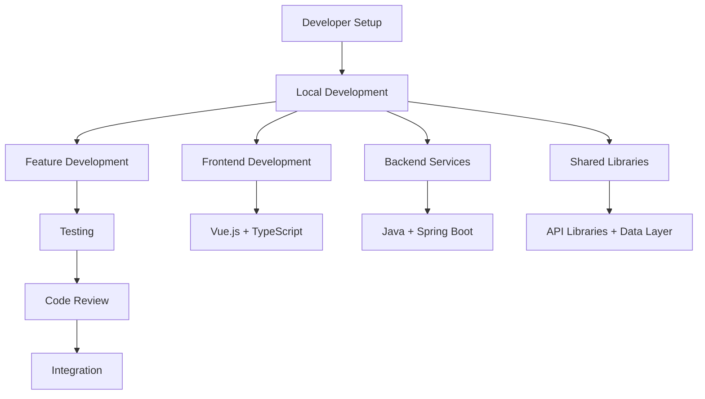

# Development Documentation

Welcome to the **OpenFrame Development Guide**. This section provides comprehensive documentation for developers working on the OpenFrame platform, from initial setup to advanced contribution workflows.

## Quick Navigation

### 🚀 **Getting Started**
| Guide | Purpose | Time Required |
|-------|---------|---------------|
| **[Environment Setup](setup/environment.md)** | Configure IDE, tools, and extensions | 30 minutes |
| **[Local Development](setup/local-development.md)** | Advanced development workflows | 45 minutes |

### 🏗️ **Architecture & Design**
| Guide | Purpose | Time Required |
|-------|---------|---------------|
| **[Architecture Overview](architecture/overview.md)** | System design and component relationships | 20 minutes |

### 🧪 **Testing & Quality**
| Guide | Purpose | Time Required |
|-------|---------|---------------|
| **[Testing Overview](testing/overview.md)** | Test strategy, running tests, writing tests | 30 minutes |

### 🤝 **Contributing**
| Guide | Purpose | Time Required |
|-------|---------|---------------|
| **[Contributing Guidelines](contributing/guidelines.md)** | Code style, PR process, review standards | 15 minutes |

---

## Development Workflow Overview

OpenFrame follows a **microservices development model** with clear separation between frontend, backend services, and shared libraries.



## Technology Stack

### Backend Development
- **Runtime**: Java 21 with Spring Boot 3.3.0
- **Framework**: Spring Cloud 2023.0.3 for microservices
- **API Layer**: GraphQL (Netflix DGS 7.0.0) + RESTful services
- **Security**: JWT with OAuth2, Spring Security
- **Data**: MongoDB, Cassandra, Apache Pinot, Redis
- **Messaging**: Apache Kafka 3.6.0
- **Build**: Apache Maven 3.9+
- **Testing**: JUnit 5, Testcontainers, MockWebServer

### Frontend Development
- **Framework**: Vue 3 with Composition API and `<script setup>` syntax
- **Language**: TypeScript with strict type checking
- **UI Library**: PrimeVue 3.45.0 + custom design system
- **State Management**: Pinia for reactive state
- **Data Fetching**: Apollo Client for GraphQL
- **Build System**: Vite 5.0.10 with hot module replacement
- **Testing**: Vitest + Vue Testing Library

### DevOps & Infrastructure
- **Containers**: Docker and Docker Compose
- **Orchestration**: Kubernetes 1.28+ with Helm charts
- **Service Mesh**: Istio 1.20 for traffic management
- **Monitoring**: Prometheus, Grafana, Loki
- **CI/CD**: GitHub Actions (OpenFrame CLI handles deployments)

## Project Structure

```text
openframe-oss-tenant/
├── openframe/                          # Java services and libraries
│   ├── services/                       # Microservices
│   │   ├── openframe-gateway/          # API Gateway
│   │   ├── openframe-api/              # GraphQL/REST API
│   │   ├── openframe-authorization-server/ # OAuth2 provider
│   │   ├── openframe-client/           # Agent management
│   │   ├── openframe-management/       # Platform automation
│   │   ├── openframe-stream/           # Event processing
│   │   ├── openframe-config/           # Configuration server
│   │   ├── openframe-external-api/     # Public APIs
│   │   └── openframe-frontend/         # Vue.js frontend
│   └── libs/                           # Shared libraries
│       ├── openframe-core/             # Core utilities
│       ├── openframe-data/             # Data layer
│       ├── openframe-security/         # JWT and OAuth
│       └── api-library/                # API DTOs and services
├── clients/                            # Client agents and tools
│   ├── openframe-client/               # Rust system agent
│   └── openframe-chat/                 # Chat interface (Tauri)
├── manifests/                          # Kubernetes Helm charts
├── integrated-tools/                   # External tool configurations
├── scripts/                            # Development and deployment scripts
└── docs/                               # Documentation (this folder)
```

## Development Environment Types

### Local Development (Recommended)
**Best for**: Day-to-day feature development, debugging, testing

**Setup**: All services run locally with Docker Compose for databases
**Advantages**: 
- Fast feedback loops with hot reload
- Easy debugging with IDE integration
- Complete control over all components

### Containerized Development
**Best for**: Testing deployment configurations, integration testing

**Setup**: All services run in Docker containers
**Advantages**:
- Production-like environment
- Consistent across team members
- Easy to reset to clean state

### Hybrid Development  
**Best for**: Working on specific services while using stable versions of others

**Setup**: Key service running locally, others in containers
**Advantages**:
- Focus development effort where needed
- Stable integration points
- Reduced resource usage

## Common Development Tasks

### Starting Development Environment

```bash
# Full local development
./scripts/run-mac.sh --silent

# Frontend only (with backend services in containers)
cd openframe/services/openframe-frontend
npm run dev

# Specific service development
cd openframe/services/openframe-api
mvn spring-boot:run -Dspring-boot.run.profiles=development
```

### Building and Testing

```bash
# Build all Java components
mvn clean install

# Run all tests
mvn test

# Build specific service
cd openframe/services/openframe-api
mvn clean install

# Frontend testing
cd openframe/services/openframe-frontend
npm test
npm run type-check
```

### Database Operations

```bash
# Start databases only
docker compose up -d mongodb kafka redis cassandra pinot

# Reset databases (clean state)
docker compose down
docker volume prune -f
docker compose up -d

# View logs
docker compose logs mongodb
```

## IDE Configuration

### IntelliJ IDEA (Recommended for Java)

**Required Plugins:**
- Spring Boot  
- Lombok
- GraphQL
- Docker
- Kubernetes

**Recommended Settings:**
```text
File → Settings → Build, Execution, Deployment → Compiler → Annotation Processors
☑ Enable annotation processing

File → Settings → Editor → Code Style → Java
☑ Use tab character: false
Tab size: 4, Indent: 4, Continuation indent: 8
```

### Visual Studio Code (Great for Frontend)

**Required Extensions:**
- Vetur or Volar (Vue.js)
- TypeScript and JavaScript Language Features
- GraphQL: Language Feature Support
- Docker
- Extension Pack for Java (if doing backend work)

**Recommended Settings (`.vscode/settings.json`):**
```json
{
  "typescript.preferences.quoteStyle": "single",
  "editor.codeActionsOnSave": {
    "source.fixAll.eslint": true
  },
  "vetur.validation.template": false,
  "vetur.validation.script": false,
  "vetur.validation.style": false
}
```

## Development Best Practices

### Code Organization
- **Single Responsibility**: Each service has a clear, focused purpose
- **API-First Design**: Define APIs before implementation
- **Configuration Externalization**: Use Spring Cloud Config for environment-specific settings
- **Dependency Injection**: Leverage Spring's DI container extensively

### Security Considerations
- **Never commit secrets**: Use environment variables and Spring profiles
- **JWT Best Practices**: HTTP-only cookies, proper expiration times
- **API Security**: All endpoints protected by Gateway authentication
- **Data Validation**: Validate input at service boundaries

### Performance Guidelines
- **Database Indexing**: Ensure proper MongoDB and Cassandra indexes
- **Caching Strategy**: Use Redis appropriately for session and frequently accessed data
- **Event Processing**: Design Kafka consumers for high throughput
- **Frontend Optimization**: Lazy loading, code splitting, component optimization

### Testing Strategy
- **Unit Tests**: 80%+ coverage for service logic
- **Integration Tests**: Test service interactions and database operations
- **E2E Tests**: Critical user journeys through the complete stack
- **Performance Tests**: Load testing for APIs and event processing

## Troubleshooting Development Issues

### Common Build Issues

**Maven dependency conflicts:**
```bash
mvn dependency:tree -Dverbose
mvn clean install -U  # Force update dependencies
```

**Frontend compilation errors:**
```bash
cd openframe/services/openframe-frontend
rm -rf node_modules package-lock.json
npm install
npm run type-check
```

### Runtime Issues

**Service won't start:**
- Check if required ports are available
- Verify database services are running and ready
- Review application logs for configuration errors

**Database connection issues:**
```bash
# Test database connectivity
docker compose ps
docker compose logs mongodb

# Reset database state
docker compose restart mongodb
```

**Memory issues:**
- Increase Docker Desktop memory allocation
- Configure JVM heap sizes appropriately
- Monitor system resource usage

## Getting Help

### Internal Resources
1. **Architecture Documentation**: Understand system design decisions
2. **Code Comments**: Inline documentation for complex logic
3. **Test Examples**: Reference existing tests for patterns
4. **Configuration Examples**: Sample configurations in `/config` directories

### Community Support
**OpenMSP Slack Community**: https://join.slack.com/t/openmsp/shared_invite/zt-36bl7mx0h-3~U2nFH6nqHqoTPXMaHEHA

- `#development` - Development questions and discussions
- `#support` - Technical help and troubleshooting
- `#architecture` - Design decisions and system architecture

> **Important**: We don't use GitHub Issues. All development support happens in our Slack community.

---

## Next Steps

1. **New to OpenFrame development?** Start with [Environment Setup](setup/environment.md)
2. **Want to understand the system?** Read [Architecture Overview](architecture/overview.md)  
3. **Ready to contribute?** Check [Contributing Guidelines](contributing/guidelines.md)
4. **Need to run tests?** See [Testing Overview](testing/overview.md)

Happy coding! 🚀