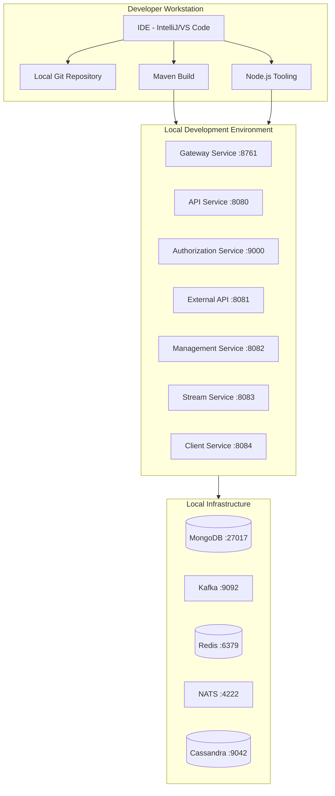
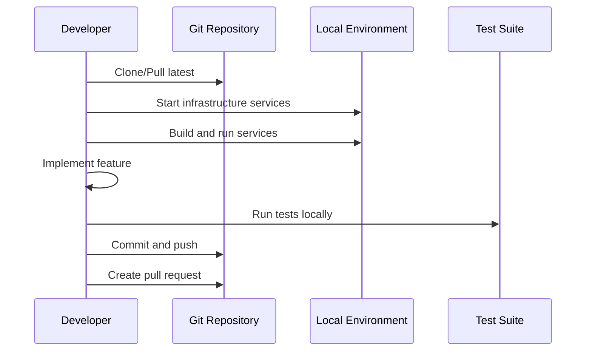
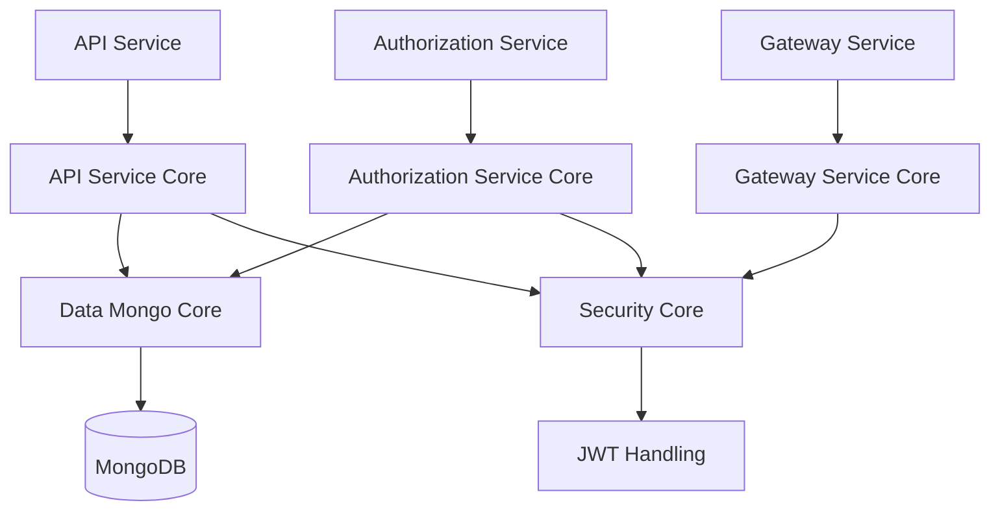

# Development Documentation

Welcome to the OpenFrame OSS Tenant development documentation! This section provides comprehensive guides for developers working on the platform, from initial setup to advanced customization.

## Overview

OpenFrame OSS Tenant is a sophisticated multi-tenant backend platform built with modern technologies and best practices. The development documentation is organized to help you get productive quickly, whether you're:

- Setting up a local development environment
- Understanding the system architecture
- Contributing to the codebase
- Building custom integrations
- Testing and security practices

## Quick Navigation

### 🚀 Getting Started
- **[Environment Setup](setup/environment.md)** - Configure your development environment with the right tools and settings
- **[Local Development](setup/local-development.md)** - Clone, build, and run OpenFrame locally with hot reload

### 🏗️ Architecture & Design
- **[Architecture Overview](architecture/README.md)** - High-level system design, service interactions, and data flows
- **[Security Guide](security/README.md)** - Authentication, authorization, and security best practices

### 🧪 Testing & Quality
- **[Testing Overview](testing/README.md)** - Test structure, running tests, and writing new test cases

### 🤝 Contributing
- **[Contributing Guidelines](contributing/guidelines.md)** - Code style, PR process, and development workflow

## Technology Stack at a Glance

### Backend Services (Spring Boot 3.3.0)
- **Language**: Java 21 with modern language features
- **Framework**: Spring Boot with Spring Cloud ecosystem
- **Databases**: MongoDB (primary), Cassandra (logs), Redis (cache)
- **Messaging**: Apache Kafka (event streaming), NATS JetStream (real-time)
- **Security**: OAuth2/OIDC, JWT tokens, API key authentication
- **Monitoring**: Prometheus metrics, actuator endpoints

### Tooling Layer (Node.js)
- **AI Integration**: Anthropic AI SDK for intelligent automation
- **Core Framework**: VoltAgent Core for agent orchestration
- **Utilities**: Glob pattern matching, Zod schema validation

### Development Tools
- **Build**: Maven (Java), NPM (Node.js)
- **Containerization**: Docker and Docker Compose
- **Testing**: JUnit 5, Testcontainers, MockMVC
- **Code Quality**: SpotBugs, Checkstyle, SonarQube integration

## Development Architecture

OpenFrame follows a modular microservices architecture with clear separation of concerns:



## Core Principles

### 1. Multi-Tenant First
Every component is designed with tenant isolation in mind:
- Database collections include tenant context
- JWT tokens carry tenant information
- Service boundaries respect tenant boundaries

### 2. Event-Driven Architecture
Services communicate through events rather than direct calls:
- Kafka for durable event streaming
- NATS for real-time messaging
- Event sourcing patterns for audit trails

### 3. Security by Design
Security is integrated at every layer:
- OAuth2/OIDC for authentication
- JWT tokens with proper validation
- API keys for service-to-service communication
- Encrypted sensitive data storage

### 4. Observability
Built-in monitoring and debugging capabilities:
- Prometheus metrics at every service
- Structured logging with correlation IDs
- Health checks and readiness probes
- Distributed tracing support

## Common Development Workflows

### 1. Feature Development Flow



### 2. API Development Cycle

1. **Define the API** - Update OpenAPI specs or GraphQL schema
2. **Implement Controllers** - Create REST or GraphQL endpoints
3. **Add Business Logic** - Implement service layer functionality
4. **Update Data Layer** - Modify repositories and entities
5. **Write Tests** - Unit tests, integration tests, and API tests
6. **Document Changes** - Update API docs and architectural notes

### 3. Integration Development

1. **Study Tool APIs** - Research external system APIs
2. **Create SDK Wrapper** - Build Java client for the tool
3. **Implement Event Mapping** - Map tool events to OpenFrame events
4. **Add Stream Processing** - Handle event transformation and enrichment
5. **Test Integration** - Verify data flow end-to-end
6. **Document Integration** - Create setup guides and troubleshooting docs

## Development Environment Benefits

### Hot Reload & Fast Feedback
- Spring Boot DevTools for automatic restarts
- Frontend hot reload for UI changes
- Container-based infrastructure for consistency

### Comprehensive Testing
- Unit tests with high coverage
- Integration tests with Testcontainers
- API tests with MockMVC and WebTestClient
- Performance tests with load simulation

### Developer Productivity Tools
- IDE integration with proper run configurations
- Debug support with remote debugging
- Database clients for direct data inspection
- Message queue tools for event monitoring

## Code Organization

OpenFrame uses a clear modular structure:

```text
openframe-oss-tenant/
├── deps/openframe-oss-lib/          # Core reusable libraries
│   ├── openframe-api-service-core/  # Internal API logic
│   ├── openframe-data-mongo/        # Data persistence layer
│   ├── openframe-security-core/     # Security primitives
│   └── ...
├── openframe/services/              # Deployable applications
│   ├── openframe-api/               # API service entry point
│   ├── openframe-gateway/           # Gateway service entry point
│   └── ...
├── clients/                         # Client applications
│   ├── openframe-client/           # Rust agent client
│   └── openframe-chat/             # Tauri chat client
├── integrated-tools/                # Tool-specific configurations
└── manifests/                       # Deployment manifests
```

### Module Dependencies

Core libraries are designed to be reusable across services:



## Getting Started Recommendations

### New to OpenFrame Development
1. Start with [Environment Setup](setup/environment.md)
2. Follow [Local Development Guide](setup/local-development.md)
3. Explore the [Architecture Overview](architecture/README.md)
4. Try building a simple integration

### Backend Java Developers
1. Review the [Architecture Overview](architecture/README.md)
2. Understand the service interactions and data models
3. Look at existing service implementations
4. Study the testing patterns and security implementation

### Frontend/Integration Developers
1. Focus on [API Documentation](../architecture/api-service-core/api-service-core.md)
2. Learn the GraphQL schema and REST endpoints
3. Understand authentication and authorization flows
4. Explore client SDK usage patterns

### DevOps/Infrastructure Engineers
1. Review container-based development setup
2. Understand service deployment models
3. Study monitoring and observability features
4. Learn about production deployment considerations

## Contributing to Development

We welcome contributions from the community! Here are ways to get involved:

### Code Contributions
- Bug fixes and feature implementations
- Performance improvements
- Security enhancements
- Documentation improvements

### Integration Development
- New tool integrations (RMM, MDM, ticketing systems)
- Enhanced data mapping and transformation
- Custom agent implementations

### Testing and Quality Assurance
- Additional test coverage
- Performance testing and benchmarking
- Security testing and vulnerability research
- Documentation testing and validation

### Community Engagement
- Join the [OpenMSP Slack community](https://join.slack.com/t/openmsp/shared_invite/zt-36bl7mx0h-3~U2nFH6nqHqoTPXMaHEHA)
- Share your OpenFrame implementations and customizations
- Help other developers with questions and issues
- Contribute to architectural discussions and planning

## Development Resources

### Documentation Links
- **[./architecture/](../architecture/)** - Detailed architecture documentation
- **[API Service Core](../architecture/api-service-core/api-service-core.md)** - Internal API architecture
- **[Gateway Service Core](../architecture/gateway-service-core/gateway-service-core.md)** - Edge gateway design
- **[Security OAuth Core](../architecture/security-oauth-core/security-oauth-core.md)** - Security implementation

### External Resources
- **OpenFrame Platform**: https://www.flamingo.run/openframe
- **Flamingo Stack**: https://flamingo.run
- **Spring Boot Documentation**: https://spring.io/projects/spring-boot
- **Spring Security OAuth2**: https://spring.io/projects/spring-security-oauth

### Community Support
- **OpenMSP Slack**: https://join.slack.com/t/openmsp/shared_invite/zt-36bl7mx0h-3~U2nFH6nqHqoTPXMaHEHA
- **Community Website**: https://www.openmsp.ai/

---

## Ready to Start Developing?

Choose your path:

- **🔧 Set up your environment**: [Environment Setup](setup/environment.md)
- **🚀 Start coding locally**: [Local Development](setup/local-development.md)  
- **📚 Learn the architecture**: [Architecture Overview](architecture/README.md)
- **🧪 Understand testing**: [Testing Overview](testing/README.md)
- **🤝 Start contributing**: [Contributing Guidelines](contributing/guidelines.md)

Welcome to the OpenFrame development community! 🎉