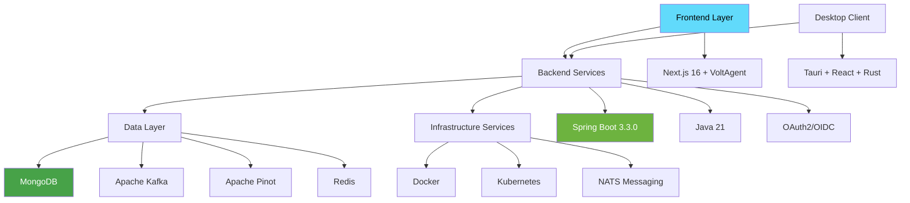
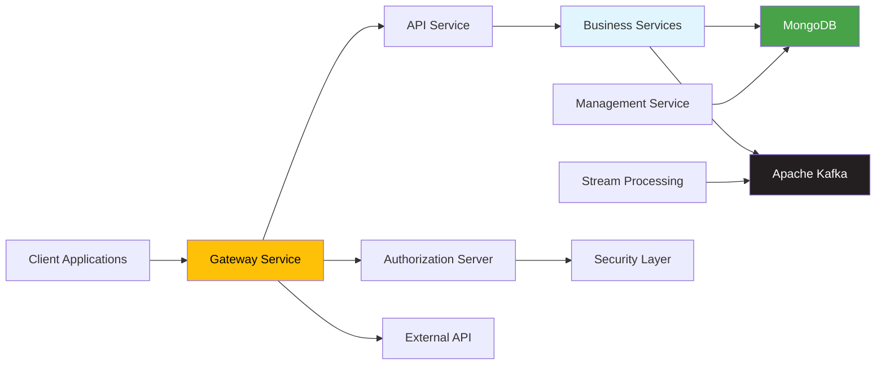
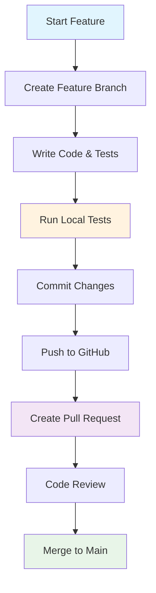

# Development Documentation

Welcome to the OpenFrame development documentation! This section provides comprehensive guides for developers who want to customize, extend, or contribute to the OpenFrame platform.

## Overview

OpenFrame is built as a modern, cloud-native platform using cutting-edge technologies and best practices. Whether you're a platform engineer, MSP developer, or open-source contributor, this documentation will help you understand and work with the OpenFrame codebase effectively.

### What You'll Learn

- 🏗️ **Architecture**: Understand the microservices design and component interactions
- 🛠️ **Development Environment**: Set up your local development environment
- 🔒 **Security**: Implement security best practices and understand the authentication flows
- 🧪 **Testing**: Write and run tests for your contributions
- 🤝 **Contributing**: Guidelines for contributing to the OpenFrame project

## Technology Stack

OpenFrame leverages modern, proven technologies:



### Core Technologies

| Layer | Technology | Version | Purpose |
|-------|------------|---------|---------|
| **Frontend** | Next.js | 16+ | Web application framework |
| **AI Framework** | VoltAgent | 2.4.1 | AI-powered frontend components |
| **AI Provider** | Anthropic Claude | Latest | AI assistant backend |
| **Backend** | Spring Boot | 3.3.0 | Microservices framework |
| **Language** | Java | 21 | Primary backend language |
| **Desktop** | Tauri | Latest | Desktop chat application |
| **Database** | MongoDB | 6.0+ | Primary data persistence |
| **Streaming** | Apache Kafka | 3.6.0 | Event-driven architecture |
| **Analytics** | Apache Pinot | 1.2.0 | Real-time analytics |
| **Caching** | Redis | 6.0+ | Performance optimization |
| **Security** | OAuth2/OIDC | - | Authentication & authorization |

## Architecture Overview

OpenFrame follows a microservices architecture with clear separation of concerns:



### Service Responsibilities

| Service | Port | Purpose | Key Features |
|---------|------|---------|-------------|
| **Gateway** | 8080 | Entry point & routing | JWT validation, API key auth, WebSocket proxy |
| **API Service** | 8081 | Business logic | GraphQL, REST endpoints, domain services |
| **Auth Server** | 8082 | Identity & access | OAuth2/OIDC, multi-tenant, SSO integration |
| **External API** | 8083 | Public API | Versioned REST API, rate limiting |
| **Management** | 8084 | System operations | Initialization, orchestration, health checks |
| **Stream Service** | 8085 | Event processing | Kafka consumers, data enrichment |
| **Config Server** | 8888 | Configuration | Centralized configuration management |
| **Client Service** | 8086 | Client operations | Agent communication, tool coordination |

## Development Documentation Structure

### 🚀 Setup & Environment
Get your development environment up and running:
- **[Environment Setup](setup/environment.md)**: IDE configuration, tools, and environment variables
- **[Local Development](setup/local-development.md)**: Clone, build, and run OpenFrame locally

### 🏗️ Architecture Deep-Dive
Understand the platform's design and patterns:
- **[Architecture Overview](architecture/README.md)**: High-level system design and component interactions

### 🔒 Security Implementation
Learn about OpenFrame's security model:
- **[Security Best Practices](security/README.md)**: Authentication, authorization, and data protection

### 🧪 Testing Strategy
Write and run comprehensive tests:
- **[Testing Overview](testing/README.md)**: Unit tests, integration tests, and test automation

### 🤝 Contributing Guidelines
Contribute to the OpenFrame project:
- **[Contributing Guidelines](contributing/guidelines.md)**: Code style, PR process, and review checklist

## Quick Development Setup

For experienced developers who want to get started immediately:

```bash
# 1. Clone and setup environment
git clone https://github.com/flamingo-stack/openframe-oss-tenant.git
cd openframe-oss-tenant

# 2. Install development tools
./scripts/dev-setup.sh  # Platform-specific setup script

# 3. Start infrastructure
docker-compose up -d

# 4. Build and run services
mvn clean install
./scripts/start-dev-services.sh

# 5. Start frontend in development mode
cd openframe/services/openframe-frontend
npm install && npm run dev
```

## Development Workflows

### Feature Development Workflow



### Common Development Tasks

| Task | Command | Purpose |
|------|---------|---------|
| **Build All** | `mvn clean install` | Compile all services and libraries |
| **Run Tests** | `mvn test` | Execute unit and integration tests |
| **Start Services** | `./scripts/start-dev-services.sh` | Launch all microservices |
| **Frontend Dev** | `npm run dev` | Start Next.js development server |
| **Database Reset** | `./scripts/reset-dev-data.sh` | Reset development database |
| **Logs** | `./scripts/tail-logs.sh` | View aggregated service logs |

## Key Development Concepts

### Microservices Communication

OpenFrame services communicate through well-defined interfaces:

- **Synchronous**: REST APIs for request-response operations
- **Asynchronous**: Kafka events for data streaming and notifications
- **Real-time**: WebSocket connections for live updates

### Multi-Tenant Architecture

Every component is designed for multi-tenancy:

- **Data Isolation**: Tenant-scoped database queries
- **Authentication**: Tenant-aware JWT validation
- **Configuration**: Per-tenant settings and customization

### AI Integration Patterns

OpenFrame integrates AI capabilities throughout:

- **Mingo AI Assistant**: Conversational AI for MSP operations
- **Autonomous Agents**: AI-driven issue resolution
- **Intelligent Analysis**: AI-powered data insights and recommendations

## Development Best Practices

### Code Organization

```text
openframe-oss-tenant/
├── clients/                    # Client applications
│   ├── openframe-chat/        # Desktop chat client (Tauri + React)
│   └── openframe-client/      # System agent client (Rust)
├── openframe/                 # Main platform services
│   └── services/              # Spring Boot microservices
│       ├── openframe-api/     # Main API service
│       ├── openframe-gateway/ # Gateway service
│       └── ...
├── deps/                      # External dependencies
│   └── openframe-oss-lib/     # Shared libraries
└── integrated-tools/          # Tool integrations
```

### Development Guidelines

1. **Follow Microservices Patterns**: Each service should have a single responsibility
2. **API-First Design**: Define APIs before implementation
3. **Test-Driven Development**: Write tests alongside code
4. **Security by Design**: Implement security controls from the beginning
5. **Documentation**: Keep documentation up-to-date with code changes

### Performance Considerations

- **Database Optimization**: Use proper indexing and query patterns
- **Caching Strategy**: Implement Redis caching for frequently accessed data
- **Async Processing**: Use Kafka for non-blocking operations
- **Resource Management**: Monitor memory and CPU usage in microservices

## Getting Help

### Community Resources
- **OpenMSP Slack**: [Join our development community](https://join.slack.com/t/openmsp/shared_invite/zt-36bl7mx0h-3~U2nFH6nqHqoTPXMaHEHA)
- **GitHub Discussions**: Technical discussions and questions
- **Code Reviews**: Learn from peer feedback on pull requests

### Development Support
- **Architecture Questions**: Ask in the `#architecture` Slack channel
- **Bug Reports**: Use GitHub Issues with detailed reproduction steps
- **Feature Requests**: Discuss in `#feature-requests` before implementation

### Documentation Improvements
Found an issue with the documentation? We welcome contributions:
1. Fork the repository
2. Make your improvements
3. Submit a pull request with clear descriptions
4. Tag documentation maintainers for review

## What's Next?

Choose your development path:

### 🔧 **For Platform Engineers**
Start with [Environment Setup](setup/environment.md) to configure your development environment for customization and extension.

### 🏗️ **For Contributors**
Review [Contributing Guidelines](contributing/guidelines.md) to understand our development process and code standards.

### 🔒 **For Security-Focused Developers**
Explore [Security Best Practices](security/README.md) to understand OpenFrame's security architecture.

### 🧪 **For QA Engineers**
Check out [Testing Overview](testing/README.md) to understand our testing strategy and automation.

---

**Ready to build the future of MSP operations?** Let's start developing! 🚀

> **💡 Pro Tip**: OpenFrame is designed for extensibility. The more you understand the architecture and patterns, the easier it becomes to build powerful customizations and integrations.