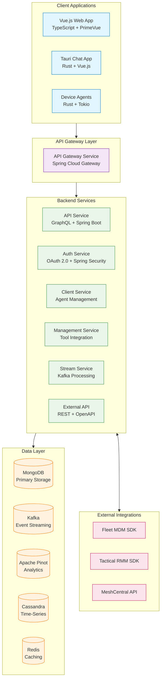

# Development Documentation

Welcome to the comprehensive development guide for OpenFrame. This section provides everything you need to understand, develop, and extend the OpenFrame platform.

## 📋 Documentation Structure

This development documentation is organized into the following sections:

### 🛠️ **Setup & Environment**
- **[Environment Setup](./setup/environment.md)** - IDE, tools, and development environment configuration
- **[Local Development](./setup/local-development.md)** - Complete local development setup guide

### 🏗️ **Architecture & Design**
- **[Architecture Overview](./architecture/overview.md)** - High-level system architecture and design patterns

### 🧪 **Testing & Quality**
- **[Testing Overview](./testing/overview.md)** - Testing strategies, frameworks, and best practices

### 📝 **Contributing**
- **[Contributing Guidelines](./contributing/guidelines.md)** - Code standards, review process, and contribution workflow

## 🚀 Quick Navigation

### For New Developers
If you're new to OpenFrame development, follow this learning path:

1. **Start Here**: [Environment Setup](./setup/environment.md) - Set up your development tools
2. **Get Coding**: [Local Development](./setup/local-development.md) - Clone, build, and run OpenFrame locally
3. **Understand**: [Architecture Overview](./architecture/overview.md) - Learn the system design
4. **Contribute**: [Contributing Guidelines](./contributing/guidelines.md) - Make your first contribution

### For Experienced Developers
Jump directly to what you need:

| Task | Documentation |
|------|---------------|
| **Set up development environment** | [Environment Setup](./setup/environment.md) |
| **Run services locally** | [Local Development](./setup/local-development.md) |
| **Understand microservices architecture** | [Architecture Overview](./architecture/overview.md) |
| **Write and run tests** | [Testing Overview](./testing/overview.md) |
| **Submit code changes** | [Contributing Guidelines](./contributing/guidelines.md) |

## 🏛️ Architecture at a Glance

OpenFrame follows a **microservices architecture** with clear separation of concerns:



### Key Technologies

| Layer | Technologies | Purpose |
|-------|-------------|---------|
| **Frontend** | Vue 3, TypeScript, PrimeVue, Tauri | User interfaces and client applications |
| **Backend** | Java 21, Spring Boot 3.x, GraphQL (Netflix DGS) | Business logic and APIs |
| **Data** | MongoDB, Kafka, Apache Pinot, Cassandra, Redis | Data storage and streaming |
| **Security** | OAuth 2.0, JWT, Spring Security | Authentication and authorization |
| **DevOps** | Docker, Kubernetes, Helm, Maven | Development and deployment |

## 🛠️ Development Workflow

### Standard Development Process

```mermaid
flowchart LR
    subgraph local[Local Development]
        Setup[Environment Setup]
        Clone[Clone Repository]
        Build[Build Services]
        Test[Run Tests]
        Code[Write Code]
    end
    
    subgraph ci[Continuous Integration]
        PR[Create Pull Request]
        Review[Code Review]
        CI[CI Pipeline]
        Merge[Merge to Main]
    end
    
    subgraph deploy[Deployment]
        Stage[Staging Deploy]
        Validate[Validation Tests]
        Prod[Production Deploy]
    end

    Setup --> Clone --> Build --> Test --> Code
    Code --> PR --> Review --> CI --> Merge
    Merge --> Stage --> Validate --> Prod
    
    classDef localStyle fill:#e8f5e8
    classDef ciStyle fill:#e3f2fd
    classDef deployStyle fill:#fff3e0
    
    class Setup,Clone,Build,Test,Code localStyle
    class PR,Review,CI,Merge ciStyle
    class Stage,Validate,Prod deployStyle
```



### Development Commands

Essential commands for daily development:

```bash
# Environment setup
./scripts/setup-dev-environment.sh

# Build all services
mvn clean install

# Run tests
mvn test

# Start local development
./scripts/run-mac.sh  # or run-linux.sh, run-windows.ps1

# Frontend development
cd openframe/services/openframe-frontend
npm run dev

# Client development  
cd clients/openframe-client
cargo build
cargo test
```

## 📚 Key Concepts

### Multi-Tenant Architecture
OpenFrame provides true multi-tenancy with complete isolation:
- **Data Isolation**: Tenant-specific databases and collections
- **Security Isolation**: Tenant-specific JWT signing keys
- **Configuration Isolation**: Per-tenant service configurations
- **Resource Isolation**: Tenant-specific resource limits and quotas

### Event-Driven Design
Real-time data processing using Kafka event streams:
- **Change Data Capture (CDC)**: Database changes trigger events
- **Stream Processing**: Real-time data enrichment and aggregation
- **Event Sourcing**: Complete audit trail of system changes
- **Real-time Updates**: WebSocket connections for live UI updates

### API-First Development
GraphQL and REST APIs for flexible client integration:
- **GraphQL**: Type-safe queries with efficient data fetching
- **REST**: Standard HTTP APIs for external integrations
- **WebSocket**: Real-time bidirectional communication
- **OpenAPI**: Comprehensive API documentation and tooling

## 🧩 Module Overview

### Core Services

| Service | Purpose | Technology Stack | Documentation |
|---------|---------|------------------|---------------|
| **API Gateway** | Request routing, authentication, rate limiting | Spring Cloud Gateway, WebFlux | [Gateway Details](./architecture/overview.md) |
| **API Service** | GraphQL API, business logic, data access | Spring Boot, Netflix DGS, MongoDB | [API Details](./architecture/overview.md) |
| **Auth Service** | OAuth 2.0, user management, SSO integration | Spring Security, OAuth2 | [Auth Details](./architecture/overview.md) |
| **Client Service** | Agent management, device registration | Spring Boot, NATS | [Client Details](./architecture/overview.md) |
| **Management Service** | Tool integration, system administration | Spring Boot, Debezium | [Management Details](./architecture/overview.md) |
| **Stream Service** | Real-time event processing | Kafka Streams, Spring Kafka | [Stream Details](./architecture/overview.md) |

### Client Applications

| Application | Purpose | Technology Stack | Documentation |
|-------------|---------|------------------|---------------|
| **Web Frontend** | Main dashboard and management interface | Vue 3, TypeScript, PrimeVue | [Frontend Details](./setup/local-development.md) |
| **Chat Client** | AI-powered chat interface (Mingo) | Tauri, Rust, Vue.js | [Chat Details](./setup/local-development.md) |
| **Device Agent** | Cross-platform system monitoring agent | Rust, Tokio, NATS | [Agent Details](./setup/local-development.md) |

### Data Layer

| Component | Purpose | Use Case | Documentation |
|-----------|---------|----------|---------------|
| **MongoDB** | Primary data storage | Users, devices, organizations, configuration | [Data Layer](./architecture/overview.md) |
| **Apache Kafka** | Event streaming | Real-time data processing, CDC events | [Streaming](./architecture/overview.md) |
| **Apache Pinot** | Real-time analytics | Performance metrics, log analysis | [Analytics](./architecture/overview.md) |
| **Cassandra** | Time-series storage | Device metrics, monitoring data | [Time-Series](./architecture/overview.md) |
| **Redis** | Caching layer | Session storage, rate limiting | [Caching](./architecture/overview.md) |

## 🔧 Development Tools

### Required Tools

| Tool | Version | Purpose | Installation |
|------|---------|---------|--------------|
| **Java JDK** | 21+ | Backend services | [OpenJDK](https://jdk.java.net/21/) |
| **Maven** | 3.9+ | Build automation | [Apache Maven](https://maven.apache.org/) |
| **Node.js** | 18+ | Frontend development | [Node.js](https://nodejs.org/) |
| **Docker** | 24.0+ | Containerization | [Docker](https://docs.docker.com/get-docker/) |
| **Rust** | 1.70+ | Client development | [Rustup](https://rustup.rs/) |

### Recommended IDEs

| IDE | Best For | Plugins |
|-----|----------|---------|
| **IntelliJ IDEA** | Java backend development | Spring Boot, GraphQL, Docker |
| **VS Code** | Full-stack development | Java Extension Pack, Rust Analyzer, Vue Language Features |
| **WebStorm** | Frontend development | Vue.js, TypeScript, Tailwind CSS |

## 🚦 Development Standards

### Code Quality Standards
- **Test Coverage**: Minimum 80% code coverage for new code
- **Code Style**: Consistent formatting with automated tools
- **Documentation**: Comprehensive inline and API documentation
- **Security**: Security-first development with OWASP guidelines

### Git Workflow
- **Feature Branches**: All development in feature branches
- **Pull Requests**: Mandatory code review before merge
- **Commit Messages**: Conventional commit format
- **Branch Protection**: Main branch protected with required checks

### Performance Standards
- **API Response Time**: < 200ms for 95% of requests
- **UI Load Time**: < 3 seconds initial load
- **Memory Usage**: Efficient memory management with monitoring
- **Database Queries**: Optimized queries with proper indexing

## 🤝 Getting Help

### Community Resources
- **[OpenMSP Slack](https://join.slack.com/t/openmsp/shared_invite/zt-36bl7mx0h-3~U2nFH6nqHqoTPXMaHEHA)** - Developer discussions and support
- **[OpenMSP.ai](https://www.openmsp.ai/)** - Community hub and resources

### Development Support
- **Architecture Questions**: Ask in `#architecture` Slack channel
- **Code Reviews**: Submit PR and tag `@dev-team`
- **Bug Reports**: Use `#bugs` channel with detailed reproduction steps
- **Feature Requests**: Discuss in `#features` channel

## 📖 Additional Resources

### External Documentation
- **[Spring Boot Reference](https://docs.spring.io/spring-boot/docs/current/reference/htmlsingle/)** - Spring Boot framework documentation
- **[Vue.js Guide](https://vuejs.org/guide/)** - Vue.js frontend framework
- **[GraphQL Specification](https://spec.graphql.org/)** - GraphQL query language
- **[Apache Kafka Docs](https://kafka.apache.org/documentation/)** - Kafka event streaming

### Learning Resources
- **[Microservices Patterns](https://microservices.io/patterns/)** - Microservices architecture patterns
- **[OAuth 2.0 Security](https://auth0.com/docs/get-started/authentication-and-authorization-flow)** - Authentication best practices
- **[Event-Driven Architecture](https://martinfowler.com/articles/201701-event-driven.html)** - Event-driven design principles

---

## 🎯 Ready to Start?

Choose your path based on your experience and goals:

### 🆕 New to OpenFrame?
1. **[Environment Setup](./setup/environment.md)** - Configure your development environment
2. **[Local Development](./setup/local-development.md)** - Get OpenFrame running locally
3. **[Architecture Overview](./architecture/overview.md)** - Understand the system design

### 🔄 Returning Developer?
- **[Testing Overview](./testing/overview.md)** - Run tests and validate changes
- **[Contributing Guidelines](./contributing/guidelines.md)** - Submit your improvements

### 🚀 Ready to Contribute?
- **[Contributing Guidelines](./contributing/guidelines.md)** - Learn the contribution workflow
- Join our [OpenMSP Slack](https://join.slack.com/t/openmsp/shared_invite/zt-36bl7mx0h-3~U2nFH6nqHqoTPXMaHEHA) community

Welcome to OpenFrame development! Let's build the future of MSP operations together. 🚀