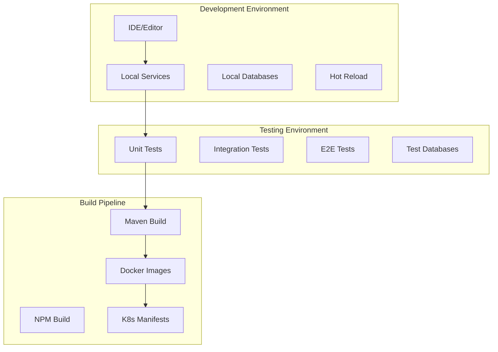

# Development Documentation

Welcome to the OpenFrame development documentation! This section provides comprehensive guides for developers who want to contribute to OpenFrame, customize the platform, or integrate with its APIs.

## Getting Started with Development

### Prerequisites for Development

Before diving into OpenFrame development, ensure you have:

- All standard [Prerequisites](../getting-started/prerequisites.md) met
- IDE set up with Java 21 and TypeScript support
- Understanding of the [Architecture Overview](architecture/overview.md)
- [Development environment](setup/environment.md) configured

### Development Workflow Overview

OpenFrame follows a microservices architecture with multiple development environments:



## 📚 Documentation Sections

### Setup Guides

| Guide | Description | Audience |
|-------|-------------|----------|
| [Environment Setup](setup/environment.md) | Complete development environment configuration | New developers |
| [Local Development](setup/local-development.md) | Running and debugging OpenFrame locally | All developers |

### Architecture Deep Dives

| Topic | Description | Audience |
|--------|-------------|----------|
| [Architecture Overview](architecture/overview.md) | System design and service relationships | All developers |

### Testing

| Guide | Description | Audience |
|-------|-------------|----------|
| [Testing Overview](testing/overview.md) | Testing strategy, tools, and best practices | All developers |

### Contributing

| Guide | Description | Audience |
|-------|-------------|----------|
| [Contributing Guidelines](contributing/guidelines.md) | Code standards, PR process, and review guidelines | Contributors |

## 🛠 Technology Stack

### Backend Services

| Technology | Version | Purpose |
|------------|---------|---------|
| **Java** | 21+ | Primary backend language |
| **Spring Boot** | 3.3.0 | Microservices framework |
| **Spring Security** | 6.x | Authentication and authorization |
| **GraphQL** | Netflix DGS 7.0 | API layer |
| **MongoDB** | 7.x | Primary database |
| **Redis** | 6.x | Caching and sessions |
| **Apache Kafka** | 3.6 | Event streaming |
| **Apache Cassandra** | 4.x | Time-series data |

### Frontend

| Technology | Version | Purpose |
|------------|---------|---------|
| **Vue 3** | 3.4+ | Frontend framework |
| **TypeScript** | 5.x | Type safety |
| **Vite** | 5.x | Build tool |
| **Pinia** | 2.x | State management |
| **GraphQL** | Apollo Client | API communication |

### Client Agent

| Technology | Version | Purpose |
|------------|---------|---------|
| **Rust** | 1.75+ | System agent language |
| **Tauri** | 2.x | Desktop app framework |
| **Tokio** | Async runtime |

## 🏗 Development Patterns

### Service Architecture Patterns

OpenFrame follows these key architectural patterns:

#### 1. Gateway-First Architecture
All external traffic flows through the API Gateway, which handles:
- JWT validation and issuer resolution
- Tenant-aware routing
- WebSocket proxying
- API key authentication

#### 2. Multi-Tenant by Design
Every service is built with tenant isolation:
- Database-level tenant partitioning
- Tenant context propagation
- Isolated caching layers
- Tenant-specific configuration

#### 3. Event-Driven Architecture
Services communicate via events when appropriate:
- Kafka for async event streaming
- NATS for real-time messaging
- Event sourcing for audit trails
- CQRS for read/write separation

#### 4. GraphQL-First APIs
Primary APIs are GraphQL-based:
- Type-safe API contracts
- Efficient data fetching
- Real-time subscriptions
- Auto-generated documentation

### Code Organization Patterns

#### Service Structure
```text
service-name/
├── src/main/java/com/openframe/service/
│   ├── config/          # Spring configuration
│   ├── controller/      # REST endpoints
│   ├── service/         # Business logic
│   ├── repository/      # Data access
│   ├── dto/            # Data transfer objects
│   └── security/       # Security configuration
├── src/main/resources/  # Configuration files
└── src/test/           # Test code
```

#### Frontend Structure
```text
frontend/
├── src/
│   ├── components/     # Reusable UI components
│   ├── pages/         # Page components
│   ├── stores/        # Pinia stores
│   ├── composables/   # Vue composables
│   ├── types/         # TypeScript types
│   └── utils/         # Utility functions
├── public/            # Static assets
└── tests/            # Test files
```

## 🚀 Quick Development Commands

### Java Services

```bash
# Build all services
mvn clean install

# Build without tests (faster)
mvn clean install -DskipTests

# Run specific service
cd openframe/services/openframe-api
mvn spring-boot:run

# Run with specific profile
mvn spring-boot:run -Dspring-boot.run.profiles=dev

# Debug mode
mvn spring-boot:run -Dspring-boot.run.jvmArguments="-Xdebug -Xrunjdwp:transport=dt_socket,server=y,suspend=n,address=5005"
```

### Frontend Development

```bash
# Install dependencies
cd openframe/services/openframe-frontend
npm install

# Start development server
npm run dev

# Type checking
npm run type-check

# Build for production
npm run build

# Run tests
npm run test
```

### Client Agent

```bash
# Build client
cd clients/openframe-client
cargo build

# Run in development
cargo run

# Run tests
cargo test

# Release build
cargo build --release
```

## 🔧 Development Tools

### Recommended IDEs and Extensions

#### IntelliJ IDEA (Recommended for Java)
- **Spring Boot Plugin**
- **GraphQL Plugin**
- **Kubernetes Plugin**
- **Docker Plugin**

#### Visual Studio Code (Recommended for Frontend)
- **Vue Language Features (Volar)**
- **TypeScript Vue Plugin**
- **GraphQL: Language Feature Support**
- **Tailwind CSS IntelliSense**

#### Rust Development
- **Rust Analyzer** (VS Code/IntelliJ)
- **CodeLLDB** for debugging
- **Tauri** extension

### Debugging Tools

#### Java Services
```bash
# Attach debugger to service (default port 5005)
# In IDE, create "Remote JVM Debug" configuration
# Host: localhost, Port: 5005
```

#### Frontend Debugging
- **Vue DevTools** browser extension
- **Apollo Client DevTools** for GraphQL
- **Chrome DevTools** for network inspection

#### Database Tools
- **MongoDB Compass** for MongoDB
- **Redis CLI** or **RedisInsight**
- **Kafka Tool** or **Confluent Control Center**

## 📋 Development Checklist

### Before Starting Development

- [ ] All [prerequisites](../getting-started/prerequisites.md) installed
- [ ] [Development environment](setup/environment.md) configured
- [ ] Local OpenFrame instance running via [quick start](../getting-started/quick-start.md)
- [ ] IDE configured with recommended plugins
- [ ] Git hooks set up for code formatting

### Before Submitting Changes

- [ ] Code follows [style guidelines](contributing/guidelines.md)
- [ ] Tests written and passing
- [ ] Documentation updated
- [ ] Breaking changes documented
- [ ] PR template completed

## 🤝 Getting Help

### Community Resources

- **OpenMSP Slack**: [Join our community](https://join.slack.com/t/openmsp/shared_invite/zt-36bl7mx0h-3~U2nFH6nqHqoTPXMaHEHA)
- **Architecture Questions**: Ask in `#architecture` channel
- **Development Help**: Ask in `#development` channel
- **Bug Reports**: Report in `#bugs` channel

### Documentation Links

- [OpenFrame Website](https://openframe.ai)
- [API Documentation](https://api.openframe.ai/docs)
- [Architecture Diagrams](architecture/overview.md)

## 📈 Development Roadmap

Stay up to date with OpenFrame development:

[](https://www.youtube.com/watch?v=PexpoNdZtUk)

### Current Focus Areas

- **AI Agent Enhancements**: Improving Mingo AI capabilities
- **Tool Integration Expansion**: Adding more MSP tool integrations  
- **Performance Optimization**: Scaling improvements
- **Security Hardening**: Enhanced security features
- **Developer Experience**: Better tooling and documentation

### How to Contribute

See our [Contributing Guidelines](contributing/guidelines.md) for detailed information on:

- Code contribution process
- Issue reporting and feature requests
- Documentation improvements
- Community involvement

---

Ready to start developing? Begin with the [Environment Setup](setup/environment.md) guide!