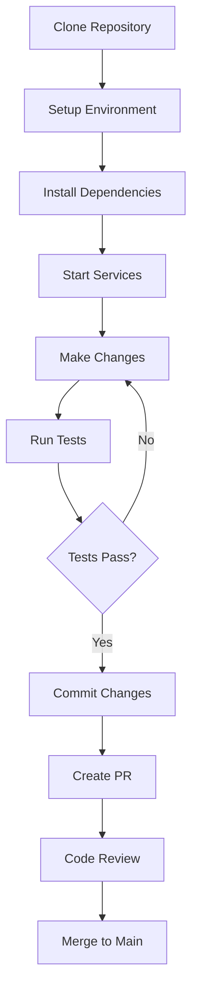
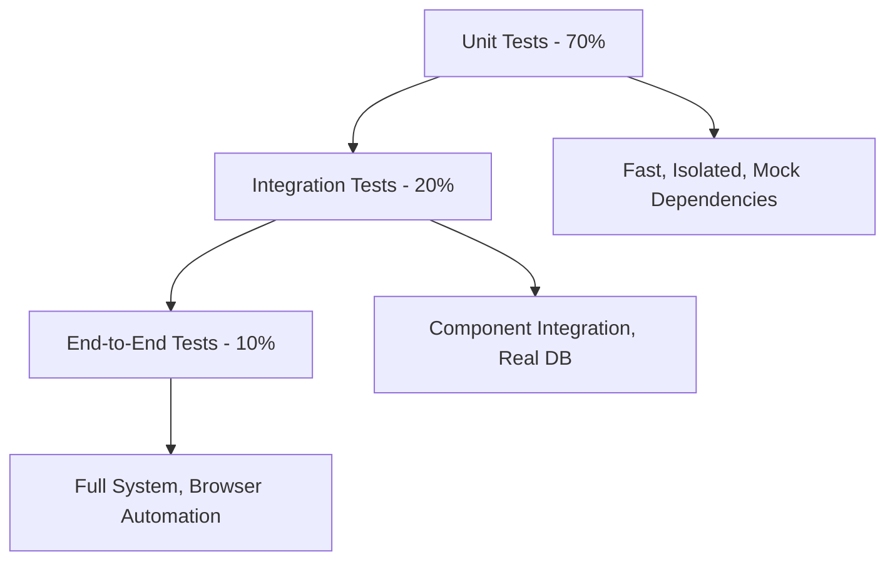

# Development Documentation

Welcome to the OpenFrame development section! This comprehensive guide covers everything you need to know to develop, customize, and extend the OpenFrame platform.

## Quick Navigation

### Setup & Environment
- [Environment Setup](setup/environment.md) - IDE, tools, and development environment configuration
- [Local Development](setup/local-development.md) - Running OpenFrame locally with hot reload

### Architecture & Design
- [Architecture Overview](architecture/overview.md) - System design, microservices, and data flow
- [Testing Strategy](testing/overview.md) - Unit tests, integration tests, and quality assurance

### Contributing
- [Contributing Guidelines](contributing/guidelines.md) - Code standards, PR process, and collaboration

## Development Stack

OpenFrame is built with modern, enterprise-grade technologies:

### Backend Services
- **Language**: Java 21 with modern features
- **Framework**: Spring Boot 3.3.0, Spring Cloud 2023.0.3
- **API**: GraphQL (Netflix DGS 7.0.0) + RESTful services
- **Security**: JWT with OAuth2/OIDC, Spring Security
- **Data**: MongoDB 7.x, Apache Pinot, Cassandra, Redis
- **Messaging**: Apache Kafka 3.6.0
- **Build**: Maven 3.9+ with multi-module structure

### Frontend Application
- **Framework**: Vue 3 with Composition API
- **Language**: TypeScript (strict mode)
- **UI Components**: PrimeVue 3.45.0 + custom design system
- **State Management**: Pinia stores
- **GraphQL**: Apollo Client 4.x
- **Build**: Vite 5.0.10 with hot module replacement

### Client Agent
- **Language**: Rust 1.70+ (cross-platform agent)
- **Runtime**: Tokio async runtime
- **Security**: AES-256 encryption, secure communication

### Infrastructure
- **Containers**: Docker and Docker Compose
- **Orchestration**: Kubernetes 1.28+ with Helm charts
- **Monitoring**: Prometheus, Grafana, Loki stack
- **Service Mesh**: Istio 1.20 for traffic management

## Development Workflow

### Typical Development Process



### Quick Start for Developers

1. **Environment Setup**
   ```bash
   # Ensure prerequisites are installed
   java --version    # Java 21+
   mvn --version     # Maven 3.9+
   node --version    # Node.js 18+
   docker --version  # Docker 24.0+
   ```

2. **Clone and Setup**
   ```bash
   git clone https://github.com/flamingo-stack/openframe-oss-tenant.git
   cd openframe-oss-tenant
   ./scripts/run-mac.sh  # or run-linux.sh / run-windows.ps1
   ```

3. **Build and Start**
   ```bash
   mvn clean install -DskipTests
   docker-compose up -d
   ```

## Project Structure

```text
openframe-oss-tenant/
├─ openframe/                      # Java services and libraries
│  ├─ services/                   # Deployable microservices
│  │  ├─ openframe-api/          # GraphQL API service
│  │  ├─ openframe-gateway/      # API Gateway with WebSockets
│  │  ├─ openframe-management/   # Admin and scheduled tasks
│  │  ├─ openframe-stream/       # Real-time data processing
│  │  ├─ openframe-client/       # Agent management service
│  │  ├─ openframe-frontend/     # Vue.js frontend application
│  │  └─ ...                     # Additional services
│  └─ libs/                      # Shared libraries
│     ├─ openframe-core/         # Core domain models
│     ├─ openframe-data/         # Data access layer
│     ├─ openframe-security/     # JWT and OAuth components
│     └─ ...                     # Additional libraries
├─ clients/                       # Client applications
│  ├─ openframe-client/          # Rust system agent
│  └─ openframe-chat/            # Tauri-based chat client
├─ integrated-tools/              # External tool configurations
│  ├─ tactical-rmm/              # Tactical RMM setup
│  ├─ meshcentral/               # MeshCentral setup
│  └─ ...                        # Additional tools
├─ manifests/                     # Kubernetes deployment manifests
├─ scripts/                       # Development and deployment scripts
└─ docs/                          # Documentation
```

## Development Environments

### Local Development
- **Hot Reload**: Automatic restart on code changes
- **Debug Mode**: Full debugging with IDE integration
- **Mock Services**: Stubbed external dependencies
- **Test Data**: Pre-populated sample data

### Integration Environment
- **Full Stack**: All services running in containers
- **External Tools**: Real integration with Tactical RMM, MeshCentral
- **Performance Testing**: Load testing and optimization
- **Security Scanning**: Vulnerability assessment

### CI/CD Pipeline
- **Automated Testing**: Unit, integration, and end-to-end tests
- **Code Quality**: SonarQube analysis and coverage reports
- **Security Scans**: Dependency and container vulnerability checks
- **Deployment**: Automated deployment to staging and production

## Key Development Patterns

### Microservices Architecture
- **Service Isolation**: Each service has its own database and deployment
- **API-First Design**: OpenAPI/GraphQL specifications before implementation
- **Event-Driven**: Kafka-based asynchronous communication
- **Circuit Breakers**: Resilience patterns for service failures

### Data Management
- **Domain-Driven Design**: Clear bounded contexts for each service
- **CQRS Pattern**: Separate read/write models for complex queries
- **Event Sourcing**: Audit trail and state reconstruction capability
- **Multi-Tenancy**: Secure tenant isolation at all layers

### Security Implementation
- **Zero Trust**: No implicit trust between services
- **JWT-Based Auth**: Stateless authentication with refresh tokens
- **Role-Based Access**: Fine-grained permissions per tenant
- **Encryption**: Data at rest and in transit protection

## Common Development Tasks

### Adding a New Microservice
1. Create Maven module in `openframe/services/`
2. Implement Spring Boot application with standard structure
3. Add Docker configuration and Helm charts
4. Register service routes in API Gateway
5. Update integration tests and documentation

### Creating New APIs
1. Define GraphQL schema or OpenAPI specification
2. Implement service layer with business logic
3. Add repository layer for data access
4. Write comprehensive tests (unit + integration)
5. Update frontend client if needed

### Extending the Frontend
1. Create Vue components with TypeScript
2. Add GraphQL queries/mutations with Apollo
3. Implement Pinia stores for state management
4. Add PrimeVue styling and responsive design
5. Write unit tests for components

## Testing Strategy

### Test Pyramid


### Testing Tools
- **Java**: JUnit 5, Mockito, TestContainers, WireMock
- **Frontend**: Vitest, Vue Test Utils, Cypress
- **Rust**: Built-in test framework with tokio-test
- **Integration**: Docker Compose test environments

### Quality Gates
- **Code Coverage**: Minimum 80% line coverage
- **Performance**: API response time < 200ms p95
- **Security**: No high/critical vulnerabilities
- **Documentation**: All public APIs documented

## Performance Considerations

### Backend Optimization
- **Database Indexing**: Proper MongoDB and Cassandra indexes
- **Caching Strategy**: Redis for hot data and query results
- **Connection Pooling**: Optimized database connections
- **Async Processing**: Non-blocking I/O with reactive patterns

### Frontend Performance
- **Bundle Splitting**: Lazy-loaded routes and components
- **Image Optimization**: Compressed and responsive images  
- **CDN Integration**: Static asset delivery optimization
- **Progressive Enhancement**: Core functionality first

## Getting Started with Development

### For New Contributors
1. Read [Contributing Guidelines](contributing/guidelines.md)
2. Set up your [Development Environment](setup/environment.md)
3. Follow [Local Development](setup/local-development.md) setup
4. Review [Architecture Overview](architecture/overview.md)
5. Start with good first issues labeled `good-first-issue`

### For Experienced Developers
1. Review system [Architecture Overview](architecture/overview.md)
2. Understand [Testing Strategy](testing/overview.md) 
3. Set up [Local Development](setup/local-development.md)
4. Explore advanced customization patterns
5. Consider contributing to core libraries

## Resources & Support

### Documentation
- **API Documentation**: Generated from GraphQL schemas and OpenAPI specs
- **Code Examples**: Sample implementations in `/examples`
- **Runbooks**: Operational procedures in `/docs/operations`

### Community
- **OpenMSP Slack**: [Join for technical discussions](https://join.slack.com/t/openmsp/shared_invite/zt-36bl7mx0h-3~U2nFH6nqHqoTPXMaHEHA)
- **GitHub Issues**: Bug reports and feature requests
- **Community Calls**: Weekly technical architecture discussions

### Tools & IDE Setup
- **IntelliJ IDEA**: Recommended for Java development
- **VS Code**: Excellent for frontend and Rust development
- **Docker Desktop**: Local container development
- **Postman/Insomnia**: API testing and exploration

---

**Ready to start developing?** Choose your path:
- **New to OpenFrame**: Start with [Environment Setup](setup/environment.md)
- **Contributing Code**: Review [Contributing Guidelines](contributing/guidelines.md)
- **Understanding Architecture**: Read [Architecture Overview](architecture/overview.md)