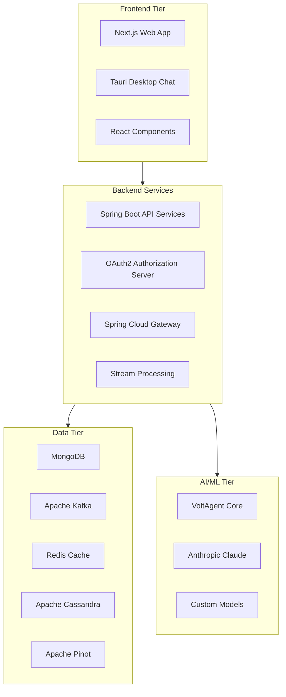
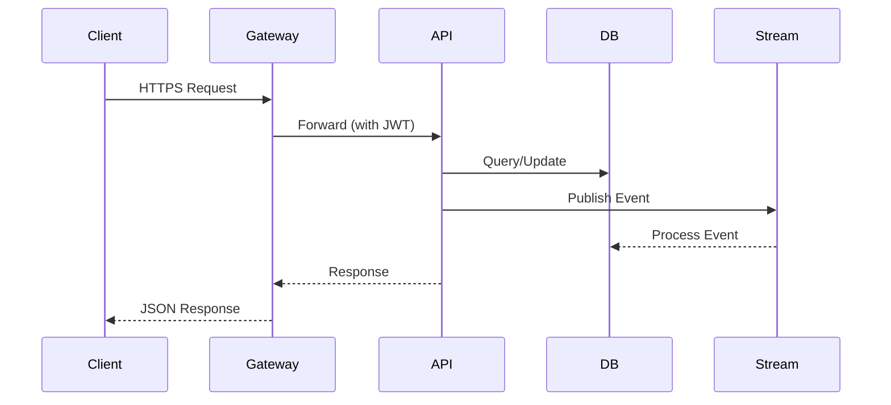

# Development Documentation

Welcome to the OpenFrame development documentation! This section provides comprehensive guides for developers who want to extend, customize, or contribute to the OpenFrame platform.

## Overview

OpenFrame is a sophisticated multi-tenant MSP platform built with modern technologies and architectural patterns. This documentation helps you:

- Set up a complete development environment
- Understand the platform architecture  
- Follow security best practices
- Contribute effectively to the project
- Build custom integrations and extensions

## Quick Navigation

### Getting Started with Development

| Guide | Description | Time Required |
|-------|-------------|---------------|
| **[Environment Setup](setup/environment.md)** | Configure your development environment with IDEs, tools, and extensions | 15 minutes |
| **[Local Development](setup/local-development.md)** | Clone, build, and run OpenFrame locally with hot reload | 10 minutes |

### Understanding the Platform

| Guide | Description | Complexity |
|-------|-------------|------------|
| **[Architecture Overview](architecture/README.md)** | Complete system architecture, data flows, and component relationships | Intermediate |
| **[Security Guidelines](security/README.md)** | Security patterns, authentication, authorization, and best practices | Advanced |

### Development Workflow

| Guide | Description | Audience |
|-------|-------------|----------|
| **[Testing Overview](testing/README.md)** | Test structure, running tests, writing new tests, coverage requirements | All Developers |
| **[Contributing Guidelines](contributing/guidelines.md)** | Code style, PR process, commit conventions, review checklist | Contributors |

## Technology Stack Overview

OpenFrame uses a modern, distributed architecture:



### Core Technologies

**Backend (Java/Spring Boot 3.3.0):**
- Java 21 with Spring Boot microservices
- Spring Cloud Gateway for routing
- Spring Security OAuth2 Resource Server
- Netflix DGS for GraphQL
- Apache Maven for build management

**Frontend (JavaScript/TypeScript):**
- Next.js 16+ framework
- React 18+ components  
- Tailwind CSS for styling
- TypeScript for type safety

**Data & Infrastructure:**
- MongoDB 6.0+ (operational data)
- Apache Kafka 3.6+ (event streaming)
- Redis 7.0+ (caching)
- Apache Cassandra 4.0+ (time-series logs)
- Apache Pinot 1.2+ (real-time analytics)

**AI & Automation:**
- VoltAgent core (@voltagent/core 2.4.1+)
- Anthropic Claude integration
- Custom agent architectures

## Development Environment Types

### Local Development
- Full stack running on localhost
- Docker Compose for infrastructure services
- Hot reload enabled for rapid development
- Self-signed certificates for HTTPS

### Production-Like Environment  
- Multi-container deployment
- External databases and services
- Load balancing and scaling
- Valid SSL certificates

### Contribution Environment
- Fork and feature branch workflow
- Pre-commit hooks and linting
- Test coverage requirements
- Code review process

## Key Development Concepts

### Multi-Tenant Architecture

Every component supports tenant isolation:

```text
Tenant A: /api/v1/devices?tenantId=tenant-a
Tenant B: /api/v1/devices?tenantId=tenant-b

Per-tenant JWT signing keys
Database-level tenant separation  
Isolated configuration and customization
```

### Event-Driven Patterns

Real-time operations via:
- Kafka streams for tool integrations
- NATS for agent communications  
- WebSockets for live dashboard updates
- Debezium for change data capture

### Microservices Communication



## Development Workflow

### 1. Environment Setup
1. **[Prerequisites](../getting-started/prerequisites.md)** - Install required software
2. **[Environment Setup](setup/environment.md)** - Configure development tools
3. **[Local Development](setup/local-development.md)** - Start developing

### 2. Understanding the Codebase  
1. **[Architecture Overview](architecture/README.md)** - System design and patterns
2. Explore service modules in `openframe/services/`
3. Review API contracts in dependency libraries
4. Study data models and relationships

### 3. Making Changes
1. Create feature branch from `main`
2. Implement changes with tests
3. Run test suite and verify coverage
4. Submit pull request following **[Contributing Guidelines](contributing/guidelines.md)**

### 4. Testing & Validation
1. **[Testing Overview](testing/README.md)** - Run comprehensive tests  
2. **[Security Guidelines](security/README.md)** - Security review checklist
3. Manual testing in local environment
4. Performance and integration testing

## Common Development Tasks

### Adding a New API Endpoint

```java
// 1. Add to REST controller
@RestController
@RequestMapping("/api/v1/custom")
public class CustomController {
    
    @GetMapping("/endpoint")
    public ResponseEntity<CustomResponse> getCustomData(
        @AuthenticationPrincipal AuthPrincipal principal
    ) {
        // Implementation
    }
}

// 2. Add service layer
@Service
public class CustomService {
    // Business logic
}

// 3. Add repository layer  
public interface CustomRepository extends MongoRepository<Custom, String> {
    // Data access
}

// 4. Add tests
@WebMvcTest(CustomController.class)
public class CustomControllerTest {
    // Test cases
}
```

### Creating a New Integration

```java
// 1. Define integration interface
public interface ToolIntegration {
    List<Device> getDevices();
    void executeCommand(String deviceId, Command command);
}

// 2. Implement for specific tool
@Component
public class CustomToolIntegration implements ToolIntegration {
    // Tool-specific implementation
}

// 3. Configure event processing
@KafkaListener(topics = "custom-tool-events")
public void processToolEvent(CustomToolEvent event) {
    // Event handling logic
}
```

### Extending the Frontend

```typescript
// 1. Create new component
interface CustomComponentProps {
  data: CustomData[];
  onAction: (id: string) => void;
}

export function CustomComponent({ data, onAction }: CustomComponentProps) {
  return (
    <div className="custom-component">
      {/* Component implementation */}
    </div>
  );
}

// 2. Add to page
export default function CustomPage() {
  const { data, isLoading } = useCustomData();
  
  if (isLoading) return <LoadingSkeleton />;
  
  return <CustomComponent data={data} onAction={handleAction} />;
}

// 3. Add API integration  
export function useCustomData() {
  return useQuery({
    queryKey: ['customData'],
    queryFn: () => apiClient.get('/api/v1/custom')
  });
}
```

## Performance Considerations

### Backend Optimization
- Use reactive patterns with Spring WebFlux
- Implement proper database indexing
- Leverage Redis caching strategically
- Optimize Kafka consumer performance

### Frontend Optimization  
- Implement lazy loading for large components
- Use React.memo for expensive renders
- Optimize bundle size with code splitting
- Implement proper caching strategies

### Database Optimization
- Design efficient MongoDB schemas
- Use appropriate indexes
- Implement proper pagination
- Monitor query performance

## Security in Development

### Authentication & Authorization
- Every endpoint requires valid JWT
- Implement proper role-based access control
- Use `@AuthenticationPrincipal` for user context
- Validate tenant isolation

### Data Protection
- Encrypt sensitive data at rest
- Use HTTPS for all communications  
- Implement proper input validation
- Follow OWASP security guidelines

### Secrets Management
- Never commit secrets to code
- Use environment variables
- Implement proper secret rotation
- Use secure secret storage in production

## Debugging & Troubleshooting

### Common Issues

**Build Failures:**
```bash
# Clear Maven cache
mvn dependency:purge-local-repository

# Clean and rebuild
mvn clean install -DskipTests
```

**Database Connection Issues:**
```bash
# Check MongoDB status
docker compose logs mongodb

# Reset database
docker compose down -v
docker compose up -d mongodb
```

**Frontend Issues:**
```bash
# Clear Next.js cache
rm -rf .next
npm run build

# Check for TypeScript errors
npx tsc --noEmit
```

### Debugging Tools

**Backend:**
- Enable DEBUG logging: `logging.level.com.openframe=DEBUG`
- Use IntelliJ IDEA debugger
- Monitor with Spring Boot Actuator

**Frontend:**
- React Developer Tools
- Next.js built-in debugging
- Browser DevTools Network tab

**Database:**
- MongoDB Compass for data inspection
- Redis CLI for cache debugging
- Kafka tooling for message inspection

## Getting Help

### Community Support
- **OpenMSP Slack Community**: https://www.openmsp.ai/
- **Join Slack**: https://join.slack.com/t/openmsp/shared_invite/zt-36bl7mx0h-3~U2nFH6nqHqoTPXMaHEHA
- Use `#development` channel for technical discussions

### Documentation
- **Architecture docs** in this section
- **API documentation** via OpenAPI/GraphQL introspection  
- **Code comments** and JavaDoc documentation

### Code Review
- All changes require peer review
- Focus on security, performance, and maintainability
- Follow the **[Contributing Guidelines](contributing/guidelines.md)**

---

**Ready to start developing?** Begin with the **[Environment Setup](setup/environment.md)** guide and join our community on Slack for support and collaboration.