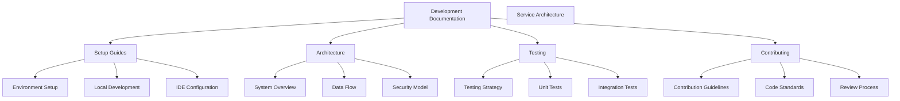
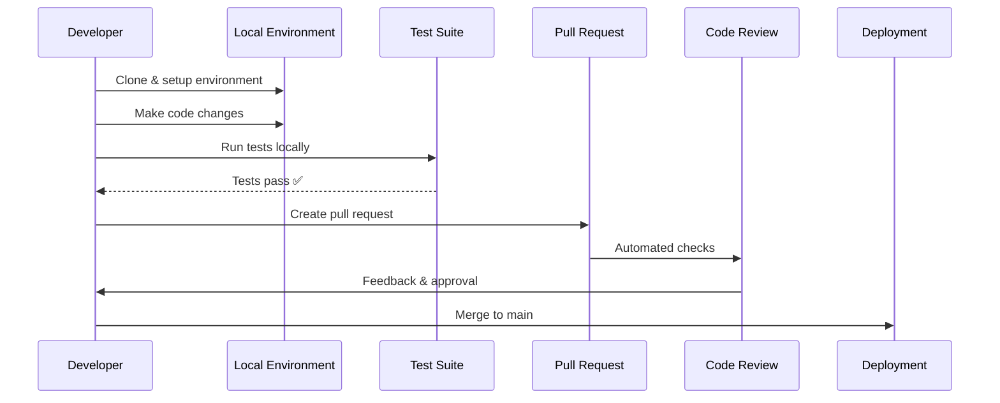

# Development Documentation

Welcome to the OpenFrame development documentation! This section provides comprehensive guides for contributing to, extending, and customizing the OpenFrame platform.

## 📖 Documentation Structure

The development documentation is organized into logical sections to help you find what you need quickly:



## 🚀 Quick Navigation

### Setup & Getting Started

| Guide | Description | Time to Complete |
|-------|-------------|------------------|
| **[Environment Setup](setup/environment.md)** | IDE, tools, and development environment | 15 minutes |
| **[Local Development](setup/local-development.md)** | Running services locally, debugging | 20 minutes |

### Architecture & Design

| Document | Focus Area | Audience |
|----------|------------|----------|
| **[Architecture Overview](architecture/overview.md)** | High-level system design | All developers |

### Testing & Quality

| Resource | Coverage | Best For |
|----------|----------|----------|
| **[Testing Overview](testing/overview.md)** | Testing strategy and execution | All developers |

### Contributing

| Guide | Purpose | Required Reading |
|-------|---------|------------------|
| **[Contributing Guidelines](contributing/guidelines.md)** | Code style, PR process, standards | Before first contribution |

## 🏗️ Development Workflow

### Typical Development Process



### Essential Commands

```bash
# Environment setup
./scripts/setup-dev-env.sh

# Build entire project
mvn clean install

# Run tests
mvn test

# Start development stack
./scripts/run-mac.sh --dev    # macOS
./scripts/run-linux.sh --dev  # Linux

# Frontend development
cd openframe/services/openframe-frontend
npm run dev
```

## 🛠️ Development Environment

### Required Tools

- **Java 21** - Primary backend language
- **Node.js 20+** - Frontend development
- **Rust** - Client agent development
- **Docker** - Containerization and dependencies
- **Maven** - Java build tool
- **npm** - Frontend package management

### Recommended IDE Setup

#### IntelliJ IDEA (Java Development)
- Install Spring Boot plugin
- Configure Java 21 as project SDK
- Enable Maven auto-import
- Install Docker integration

#### VS Code (Frontend & General)
- TypeScript support
- Tailwind CSS IntelliSense
- Docker extension
- REST Client for API testing

## 📂 Repository Structure

Understanding the codebase organization:

```text
openframe-oss-tenant/
├── openframe-oss-lib/              # Reusable core libraries
│   ├── openframe-api-service-core  # GraphQL/REST API core
│   ├── openframe-data-mongo        # MongoDB data layer
│   ├── openframe-gateway-service-core # API Gateway core
│   ├── openframe-security-core     # JWT/OAuth security
│   └── ...                         # Other core libraries
├── openframe/services/             # Deployable applications
│   ├── openframe-api/              # Main API service
│   ├── openframe-gateway/          # API Gateway
│   ├── openframe-frontend/         # Next.js frontend
│   └── ...                         # Other services
├── clients/                        # Client applications
│   ├── openframe-chat/             # AI chat client
│   └── openframe-client/           # System agent (Rust)
├── scripts/                        # Development scripts
└── docs/                          # Documentation
```

## 🧪 Development Practices

### Code Quality Standards

- **Java**: Follow Spring Boot best practices, use Lombok judiciously
- **TypeScript**: Strict type checking, consistent naming conventions  
- **Rust**: Follow Rust idioms, comprehensive error handling
- **Testing**: Maintain >80% code coverage, write meaningful tests
- **Documentation**: Document public APIs and complex business logic

### Git Workflow

1. **Branch Naming**
   ```text
   feature/short-description
   bugfix/issue-number-description
   hotfix/critical-fix-description
   ```

2. **Commit Messages**
   ```text
   feat: add device registration endpoint
   fix: resolve JWT token expiration issue
   docs: update API documentation
   test: add integration tests for user service
   ```

3. **Pull Request Process**
   - Create PR against `main` branch
   - Ensure all tests pass
   - Request review from appropriate team members
   - Address feedback and update PR

### Testing Strategy

| Test Type | Coverage | Tools | When to Run |
|-----------|----------|-------|-------------|
| **Unit** | Individual methods/classes | JUnit 5, Jest | Every commit |
| **Integration** | Service interactions | Spring Test, Testcontainers | Before PR |
| **E2E** | Full user workflows | REST Assured, Playwright | Before release |
| **Performance** | Load and stress testing | JMeter, k6 | Release cycles |

## 🔧 Common Development Tasks

### Adding a New REST Endpoint

1. **Create DTO classes** in the appropriate service core module
2. **Implement controller** with proper validation and security
3. **Add service layer logic** with business rules
4. **Write unit tests** for all components
5. **Update API documentation** with OpenAPI annotations

### Adding a New GraphQL Query

1. **Define schema** in `schema.graphqls` files
2. **Implement DataFetcher** in the appropriate service
3. **Add data loader** for efficient batching if needed
4. **Write integration tests** with GraphQL test framework
5. **Update frontend queries** if client changes required

### Creating a New Microservice

1. **Use service template** from existing services as a starting point
2. **Configure Maven dependencies** and parent POM structure
3. **Implement core functionality** following established patterns
4. **Add health checks** and monitoring endpoints
5. **Create Docker configuration** for containerization
6. **Write comprehensive tests** including integration tests

## 📚 Additional Resources

### Architecture Deep Dives
- Service interaction patterns
- Database design principles
- Security implementation details
- Event-driven architecture with Kafka

### API Documentation
- GraphQL schema reference
- REST endpoint documentation
- Authentication flow diagrams
- Rate limiting and throttling

### Deployment Guides
- Docker containerization
- Kubernetes manifests
- Environment configuration
- Monitoring and logging setup

## 🤝 Community & Support

### Getting Help

1. **Documentation First**: Search this documentation for answers
2. **OpenMSP Slack**: Join the [#openframe-dev](https://join.slack.com/t/openmsp/shared_invite/zt-36bl7mx0h-3~U2nFH6nqHqoTPXMaHEHA) channel
3. **Code Reviews**: Learn from PR discussions and feedback
4. **Team Knowledge**: Reach out to experienced contributors

### Contributing Back

- **Bug Reports**: Report issues with detailed reproduction steps
- **Feature Requests**: Propose new features with use cases
- **Code Contributions**: Submit PRs following our guidelines
- **Documentation**: Help improve and expand documentation

### Community Guidelines

- **Be Respectful**: Treat all contributors with respect and professionalism
- **Be Helpful**: Share knowledge and assist others when possible
- **Be Collaborative**: Work together towards shared goals
- **Be Open**: Embrace feedback and different perspectives

## 🎯 Next Steps

Ready to start developing? Here's your recommended path:

1. **Environment Setup**: Follow the [Environment Setup](setup/environment.md) guide
2. **Local Development**: Get the stack running with [Local Development](setup/local-development.md)
3. **Architecture Understanding**: Review [Architecture Overview](architecture/overview.md)
4. **First Contribution**: Read [Contributing Guidelines](contributing/guidelines.md)

Happy coding! 🚀

---

**Need help?** Join the OpenMSP Slack community at [https://join.slack.com/t/openmsp/shared_invite/zt-36bl7mx0h-3~U2nFH6nqHqoTPXMaHEHA](https://join.slack.com/t/openmsp/shared_invite/zt-36bl7mx0h-3~U2nFH6nqHqoTPXMaHEHA)