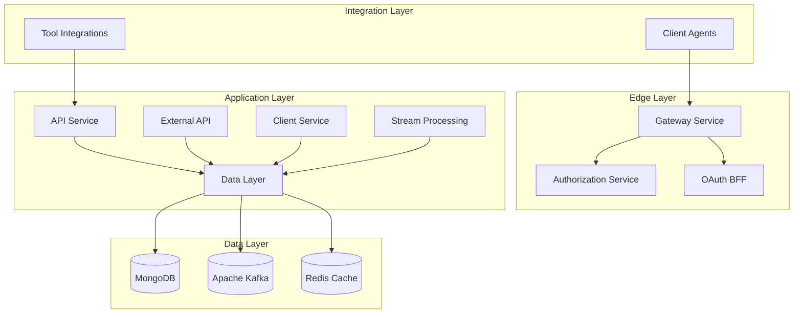

# Development Documentation

Welcome to the OpenFrame development documentation. This section provides comprehensive guides for developers who want to contribute to, extend, or build upon the OpenFrame platform.

## Overview

OpenFrame is a complex, multi-service platform built with modern technologies and architectural patterns. Understanding the development workflow, architecture, and contribution guidelines is essential for effective development.

### What You'll Find Here

This development section covers:

- **Environment Setup**: Complete development environment configuration
- **Local Development**: Running and debugging OpenFrame locally  
- **Architecture Deep-Dive**: Understanding the system design and service interactions
- **Security Guidelines**: Best practices for secure development
- **Testing**: Comprehensive testing strategies and procedures
- **Contributing**: Guidelines for code contributions and collaboration

## Quick Navigation

### 🚀 **Getting Started with Development**
- **[Environment Setup](./setup/environment.md)** - IDE configuration and development tools
- **[Local Development](./setup/local-development.md)** - Running OpenFrame in development mode

### 🏗 **Architecture & Design**
- **[Architecture Overview](./architecture/README.md)** - System architecture and component relationships
- **[Service Documentation](../architecture/README.md)** - Detailed service-by-service documentation

### 🔐 **Security & Best Practices**
- **[Security Guidelines](./security/README.md)** - Security patterns and vulnerability prevention
- **[Authentication](../architecture/authorization-service-core/authorization-service-core.md)** - OAuth2/OIDC implementation details

### 🧪 **Testing & Quality**
- **[Testing Overview](./testing/README.md)** - Testing strategies and running tests
- **[API Testing](../architecture/api-service-core/api-service-core.md)** - Testing GraphQL and REST endpoints

### 🤝 **Collaboration**
- **[Contributing Guidelines](./contributing/guidelines.md)** - Code style, PR process, and community standards

## Technology Stack

OpenFrame is built using modern, scalable technologies:

### Backend Technologies
- **Java 21** with **Spring Boot 3.3.0**
- **Spring Cloud Gateway** for API gateway functionality
- **Spring Security** with OAuth2/OIDC
- **Netflix DGS** for GraphQL implementation
- **Maven** for build and dependency management

### Client Technologies
- **Rust** for cross-platform desktop agents
- **Node.js** with AI automation frameworks (VoltAgent)
- **TypeScript** for type-safe development

### Data & Messaging
- **MongoDB** for primary data persistence
- **Apache Kafka** for event streaming
- **NATS** for real-time messaging
- **Redis** for caching and session management

### Integration & Monitoring
- **Apache Pinot** for analytics
- **Apache Cassandra** for time-series data
- **Prometheus** for metrics collection
- **JWT** for secure API authentication

## Architecture Overview

OpenFrame follows a microservices architecture with clear separation of concerns:

### Key Architectural Principles

- **Multi-Tenant**: Complete isolation between different organizations
- **Event-Driven**: Asynchronous processing using Kafka streams
- **Security-First**: OAuth2/OIDC with JWT validation at every layer
- **Microservices**: Loosely coupled services with clear boundaries
- **API-Centric**: GraphQL and REST APIs for all external interactions

## Development Workflow

### 1. Local Setup Process
1. Clone the repository and set up your development environment
2. Start infrastructure services (MongoDB, Kafka, Redis, NATS)
3. Build and run core services in dependency order
4. Configure IDE and development tools

### 2. Development Cycle
1. Create feature branch from `main`
2. Implement changes with appropriate tests
3. Run full test suite locally
4. Submit pull request with detailed description
5. Address code review feedback
6. Merge after approval and CI validation

### 3. Testing Strategy
- **Unit Tests**: Test individual components and services
- **Integration Tests**: Test service-to-service interactions
- **API Tests**: Test GraphQL and REST endpoints
- **E2E Tests**: Test complete user workflows

## Contributing to OpenFrame

We welcome contributions from the community! Here's how to get involved:

### Types of Contributions
- **Bug Reports**: Help us identify and fix issues
- **Feature Requests**: Suggest new functionality
- **Code Contributions**: Implement features or fixes
- **Documentation**: Improve guides and technical documentation
- **Testing**: Add test coverage or improve test quality

### Contribution Process
1. **Join the Community**: Connect with us on [OpenMSP Slack](https://join.slack.com/t/openmsp/shared_invite/zt-36bl7mx0h-3~U2nFH6nqHqoTPXMaHEHA)
2. **Find an Issue**: Look for good first issues or propose new features
3. **Set Up Development**: Follow our development environment setup guide
4. **Code & Test**: Implement your changes with appropriate test coverage
5. **Submit PR**: Create a pull request with detailed description
6. **Review Process**: Collaborate with maintainers on code review
7. **Merge & Deploy**: Your contribution becomes part of OpenFrame!

## Development Resources

### Essential Links
- **GitHub Repository**: https://github.com/flamingo-stack/openframe-oss-tenant
- **OpenMSP Community**: https://www.openmsp.ai/
- **Slack Community**: https://join.slack.com/t/openmsp/shared_invite/zt-36bl7mx0h-3~U2nFH6nqHqoTPXMaHEHA
- **OpenFrame Website**: https://openframe.ai

### Development Tools
- **Recommended IDE**: IntelliJ IDEA Community or VSCode
- **Database Tools**: MongoDB Compass, Redis Insight
- **API Testing**: Postman, GraphQL Playground
- **Container Tools**: Docker Desktop, Docker Compose

### Monitoring & Debugging
- **Application Logs**: Structured logging with configurable levels
- **Health Endpoints**: Actuator endpoints for service monitoring
- **Metrics**: Prometheus metrics for performance monitoring
- **Tracing**: Distributed tracing for request flow analysis

## Getting Help

### Community Support
- **Slack Channels**: Join specific channels for different topics
- **Office Hours**: Regular community calls for development discussions
- **Mentorship**: Experienced contributors available to help new developers

### Technical Support
- **Documentation**: Comprehensive guides and API references
- **Code Examples**: Sample implementations and integration patterns  
- **Troubleshooting**: Common issues and solutions
- **Architecture Discussions**: Deep technical discussions on design decisions

## What's Next?

Ready to start developing with OpenFrame? Here's your recommended path:

1. **[Set up your development environment](./setup/environment.md)** with all necessary tools
2. **[Run OpenFrame locally](./setup/local-development.md)** to understand the system
3. **[Explore the architecture](./architecture/README.md)** to understand component relationships
4. **[Review security guidelines](./security/README.md)** for secure development practices
5. **[Join the community](https://join.slack.com/t/openmsp/shared_invite/zt-36bl7mx0h-3~U2nFH6nqHqoTPXMaHEHA)** and introduce yourself

## Code of Conduct

OpenFrame is committed to providing a welcoming and inclusive environment for all contributors. We expect all community members to:

- Be respectful and professional in all interactions
- Provide constructive feedback and accept it gracefully
- Focus on what's best for the community and project
- Show empathy and kindness towards other community members

For detailed guidelines, see our community Code of Conduct in the OpenMSP Slack community.

---

Happy coding! The OpenFrame community looks forward to your contributions. 🚀