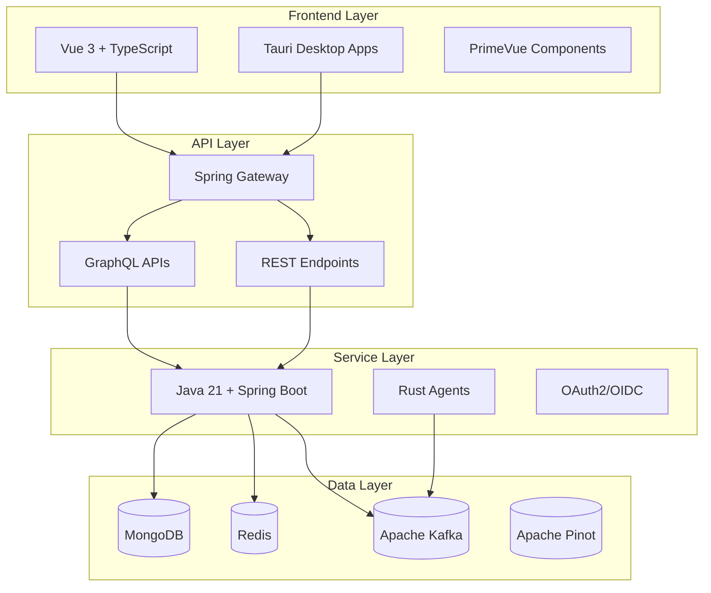
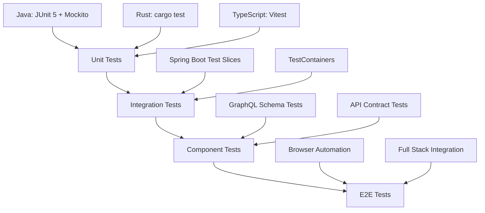

# Development Documentation

Welcome to the OpenFrame development guide! This section provides comprehensive documentation for developers working with the OpenFrame platform, from initial setup to advanced customization.

## Quick Navigation

### Setup & Environment
- **[Environment Setup](setup/environment.md)** - IDE configuration, tools, and development environment
- **[Local Development](setup/local-development.md)** - Running OpenFrame locally for development

### Architecture & Design
- **[Architecture Overview](architecture/overview.md)** - High-level system design and component interactions
- **[Testing Overview](testing/overview.md)** - Testing strategies, frameworks, and best practices

### Contributing
- **[Contributing Guidelines](contributing/guidelines.md)** - Code standards, processes, and contribution workflow

## Development Stack Overview

OpenFrame uses a modern, multi-language technology stack:



## Core Technologies

### Backend Services
| Technology | Version | Purpose |
|------------|---------|---------|
| **Java** | 21 LTS | Primary backend runtime |
| **Spring Boot** | 3.3.0 | Microservice framework |
| **Spring Cloud** | 2023.0.3 | Service orchestration |
| **Netflix DGS** | 7.0.0 | GraphQL implementation |
| **Spring Security** | 6.x | Authentication and authorization |
| **Maven** | 3.9+ | Build and dependency management |

### Frontend & Clients
| Technology | Version | Purpose |
|------------|---------|---------|
| **Vue.js** | 3.x | Primary web framework |
| **TypeScript** | 5.x | Type-safe JavaScript |
| **PrimeVue** | 3.45+ | UI component library |
| **Pinia** | 2.x | State management |
| **Apollo Client** | 4.x | GraphQL client |
| **Vite** | 5.x | Build tool and dev server |
| **Tauri** | 1.x | Desktop application framework |
| **Rust** | 1.70+ | System agents and performance-critical components |

### Data & Infrastructure
| Technology | Version | Purpose |
|------------|---------|---------|
| **MongoDB** | 7.x | Primary database |
| **Apache Kafka** | 3.6+ | Event streaming |
| **Redis** | 7.x | Caching and sessions |
| **Apache Pinot** | 1.2+ | Analytics database |
| **Apache Cassandra** | 4.x | Time-series data |
| **Docker** | 24.0+ | Containerization |
| **Kubernetes** | 1.28+ | Orchestration |

## Project Structure

```text
openframe-oss-tenant/
├── clients/                           # Client applications
│   ├── openframe-chat/               # Desktop chat client (Tauri + React)
│   └── openframe-client/             # System agent (Rust)
│
├── openframe/                         # Main Java platform
│   ├── services/                     # Deployable microservices
│   │   ├── openframe-gateway/        # API Gateway service
│   │   ├── openframe-api/            # Core API service
│   │   ├── openframe-authorization-server/  # OAuth2 server
│   │   ├── openframe-management/     # Admin and automation service
│   │   ├── openframe-stream/         # Event processing service
│   │   ├── openframe-client/         # Agent management service
│   │   ├── openframe-external-api/   # External integrations
│   │   ├── openframe-config/         # Configuration service
│   │   └── openframe-frontend/       # Vue.js frontend
│   └── libs/                         # Shared libraries (deprecated)
│
├── openframe-oss-lib/                # Shared service libraries
│   ├── openframe-api-service-core/   # API service implementation
│   ├── openframe-gateway-service-core/  # Gateway implementation
│   ├── openframe-authorization-service-core/  # Auth implementation
│   ├── openframe-data-mongo/         # MongoDB data layer
│   ├── openframe-data-kafka/         # Kafka integration
│   ├── openframe-security-core/      # Security utilities
│   └── openframe-frontend-core/      # Frontend component library
│
├── integrated-tools/                 # External tool configurations
│   ├── tactical-rmm/                # TacticalRMM setup
│   ├── meshcentral/                 # MeshCentral configuration
│   └── fleetdm/                     # FleetDM setup
│
├── openframe-e2e-tests/             # End-to-end tests
├── manifests/                       # Kubernetes deployments
├── scripts/                         # Development and deployment scripts
└── docs/                            # Documentation
```

## Development Workflows

### Common Development Tasks

#### Building the Platform
```bash
# Build all Java services
mvn clean install

# Build specific service
mvn clean install -pl openframe/services/openframe-api

# Build without tests (faster)
mvn clean install -DskipTests
```

#### Running Services Locally
```bash
# Start all infrastructure (databases, etc.)
docker compose up -d mongo redis kafka

# Start individual services
cd openframe/services/openframe-gateway
mvn spring-boot:run

# Start frontend development server
cd openframe/services/openframe-frontend
npm run dev
```

#### Working with the Frontend
```bash
cd openframe/services/openframe-frontend

# Install dependencies
npm install

# Start development server with hot reload
npm run dev

# Type checking
npm run type-check

# Build for production
npm run build
```

#### Agent Development
```bash
cd clients/openframe-client

# Build the Rust agent
cargo build

# Run tests
cargo test

# Run agent locally
cargo run
```

### Code Standards and Conventions

#### Java/Spring Boot
- Use Java 21 features (records, pattern matching, sealed classes)
- Follow Spring Boot conventions for package structure
- Use constructor injection over field injection
- Implement proper exception handling with `@ControllerAdvice`
- Use `@ConfigurationProperties` for type-safe configuration

#### TypeScript/Vue.js
- Use Vue 3 Composition API with `<script setup>`
- Strict TypeScript configuration with full type coverage
- PrimeVue components for UI consistency
- Pinia stores for state management
- Apollo Client composables for GraphQL

#### Rust
- Follow Rust naming conventions (snake_case for functions/variables)
- Use `anyhow` for error handling in applications
- Use `thiserror` for library error types
- Tokio async runtime for I/O operations
- Comprehensive unit tests with `cargo test`

## Testing Strategy

### Testing Pyramid


### Running Tests
```bash
# Java tests
mvn test                                    # All tests
mvn test -Dtest=ClassName                   # Specific class
mvn test -Dtest=ClassName#methodName        # Specific method

# Frontend tests  
cd openframe/services/openframe-frontend
npm run test:unit

# Rust tests
cd clients/openframe-client
cargo test

# E2E tests
cd openframe-e2e-tests  
mvn test
```

## API Development

### GraphQL Schema Development
```bash
# Location of GraphQL schemas
openframe/services/openframe-api/src/main/resources/schema/

# Generate TypeScript types from schema
cd openframe/services/openframe-frontend
npm run graphql:codegen
```

### REST API Development  
- Use OpenAPI 3.0 specifications
- Document all endpoints with Swagger annotations
- Follow RESTful conventions for resource naming
- Implement proper HTTP status codes

## Security Considerations

### Authentication & Authorization
- JWT tokens stored in HTTP-only cookies (NOT Authorization headers)
- OAuth2/OIDC for user authentication
- Service account authentication for agents
- Role-based access control (RBAC)

### Data Security
- All sensitive data encrypted at rest
- TLS encryption for all communications
- API rate limiting and throttling
- Input validation and sanitization

## Performance Guidelines

### Backend Performance
- Database query optimization with indexes
- Connection pooling for all data sources
- Async processing for non-blocking operations
- Caching strategies with Redis

### Frontend Performance
- Code splitting and lazy loading
- Component-level caching
- Optimized GraphQL queries
- Progressive loading for large datasets

## Debugging and Monitoring

### Local Development Debugging
```bash
# Enable debug logging
export LOG_LEVEL=DEBUG
export SPRING_PROFILES_ACTIVE=local,debug

# Java remote debugging
export MAVEN_OPTS="-Xdebug -Xrunjdwp:transport=dt_socket,server=y,suspend=n,address=5005"

# Frontend debugging
cd openframe/services/openframe-frontend
npm run dev -- --debug
```

### Production Monitoring
- Prometheus metrics collection
- Distributed tracing with Jaeger
- Centralized logging with ELK stack
- Health checks and circuit breakers

## Getting Started

### New Developers
1. **Start with [Environment Setup](setup/environment.md)** - Configure your development environment
2. **Follow [Local Development](setup/local-development.md)** - Get OpenFrame running locally
3. **Review [Architecture Overview](architecture/overview.md)** - Understand the system design
4. **Read [Contributing Guidelines](contributing/guidelines.md)** - Learn the development workflow

### Experienced Developers
1. Clone the repository and run the setup scripts
2. Focus on specific components based on your expertise
3. Check existing issues and contribute to ongoing development
4. Join the OpenMSP Slack for technical discussions

## Community and Support

- 💬 **Developer Chat**: [OpenMSP Slack #dev Channel](https://join.slack.com/t/openmsp/shared_invite/zt-36bl7mx0h-3~U2nFH6nqHqoTPXMaHEHA)
- 📋 **Project Board**: GitHub Issues and Projects
- 📖 **API Documentation**: Available at `/graphql` and `/api-docs` endpoints
- 🎥 **Development Tutorials**: [OpenFrame YouTube Channel](https://www.youtube.com/@OpenFrame)

---

**Ready to contribute to OpenFrame?** Start with the environment setup and join our developer community!