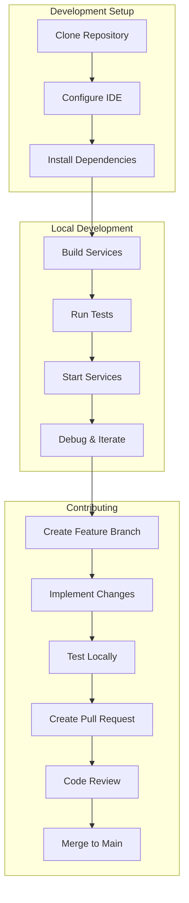

# Development Documentation

Welcome to the OpenFrame development documentation! This section provides comprehensive guides for developers who want to contribute to OpenFrame, customize the platform, or understand its internal architecture.

## Quick Navigation

### 🚀 **Getting Started**
- [Development Environment Setup](setup/environment.md) - IDE, tools, and workspace configuration
- [Local Development Guide](setup/local-development.md) - Running OpenFrame locally for development

### 🏗️ **Architecture & Design**
- [Architecture Overview](architecture/overview.md) - System design, components, and data flow
- [Testing Guidelines](testing/overview.md) - Test strategy, frameworks, and best practices

### 🤝 **Contributing**
- [Contributing Guidelines](contributing/guidelines.md) - Code style, PR process, and review criteria

## Development Workflow Overview



## Technology Stack for Developers

### Backend Development
| Component | Technology | Version | Purpose |
|-----------|------------|---------|---------|
| **Runtime** | Java JDK | 21+ | Primary backend language |
| **Framework** | Spring Boot | 3.3.0 | Microservices foundation |
| **Build Tool** | Maven | 3.9+ | Dependency management and build |
| **API** | GraphQL (Netflix DGS) | 7.0.0 | Modern API development |
| **Security** | Spring Security + JWT | Latest | Authentication & authorization |
| **Data** | MongoDB, Cassandra, Redis | Latest | Multi-model data persistence |

### Frontend Development  
| Component | Technology | Version | Purpose |
|-----------|------------|---------|---------|
| **Framework** | Vue 3 | Latest | Reactive UI framework |
| **Language** | TypeScript | 5.x | Type-safe JavaScript |
| **UI Library** | PrimeVue | 3.45.0+ | Component library |
| **State** | Pinia | Latest | State management |
| **Build** | Vite | 5.x | Fast development build tool |
| **Testing** | Vitest + Vue Test Utils | Latest | Unit and component testing |

### Infrastructure & DevOps
| Component | Technology | Purpose |
|-----------|------------|---------|
| **Containerization** | Docker + Docker Compose | Local development and deployment |
| **Orchestration** | Kubernetes + Helm | Production deployment |
| **CI/CD** | GitHub Actions | Automated testing and deployment |
| **Monitoring** | Prometheus + Grafana | Observability and metrics |

## Development Environment Requirements

### System Requirements
- **CPU**: 8 cores (minimum 4 cores)
- **Memory**: 16GB RAM (minimum 8GB)
- **Storage**: 100GB SSD (minimum 50GB)
- **OS**: macOS 11+, Ubuntu 20.04+, Windows 10/11

### Required Software
- Java JDK 21+
- Node.js 18+
- Docker 24+
- Git 2.30+
- Maven 3.9+

## Repository Structure

Understanding the codebase layout:

```
openframe-oss-tenant/
├── openframe/                          # Java backend services
│   ├── services/                       # Microservices
│   │   ├── openframe-gateway/          # API Gateway
│   │   ├── openframe-api/              # Main GraphQL/REST API
│   │   ├── openframe-frontend/         # Vue.js UI
│   │   ├── openframe-management/       # Admin services
│   │   └── ...                         # Other services
│   └── libs/                           # Shared Java libraries
├── clients/                            # Client applications
│   ├── openframe-client/               # Rust system agent
│   └── openframe-chat/                 # TypeScript chat client
├── integrated-tools/                   # Third-party tool configs
│   ├── tactical-rmm/                   # Tactical RMM integration
│   ├── meshcentral/                    # MeshCentral integration
│   └── ...                             # Other integrations
├── manifests/                          # Kubernetes deployment configs
├── scripts/                            # Development and deployment scripts
└── docs/                               # Documentation (you are here!)
```

## Development Patterns & Standards

### Code Organization
- **Domain-Driven Design**: Services organized by business domains
- **Clean Architecture**: Separation of concerns with clear boundaries
- **API-First**: GraphQL and REST APIs define service contracts
- **Event-Driven**: Kafka-based async communication between services

### Quality Standards
- **Test Coverage**: Minimum 80% code coverage
- **Code Style**: Enforced via Checkstyle (Java) and ESLint (TypeScript)
- **Security**: OWASP guidelines, dependency scanning, secret management
- **Documentation**: Comprehensive inline docs and architectural decision records

## Common Development Tasks

### Building the Project
```bash
# Full build with tests
mvn clean install

# Quick build without tests
mvn clean install -DskipTests

# Frontend only
cd openframe/services/openframe-frontend
npm run build
```

### Running Tests
```bash
# All Java tests
mvn test

# Specific service tests
cd openframe/services/openframe-api
mvn test

# Frontend tests
cd openframe/services/openframe-frontend
npm run test
```

### Local Development
```bash
# Start with platform scripts
./scripts/run-mac.sh      # macOS
./scripts/run-linux.sh    # Linux
./scripts/run-windows.ps1 # Windows

# Or start services individually
# See Local Development Guide for details
```

## Getting Help

### Development Support
- **OpenMSP Slack**: [Join our community](https://join.slack.com/t/openmsp/shared_invite/zt-36bl7mx0h-3~U2nFH6nqHqoTPXMaHEHA) for real-time help
- **Architecture Docs**: Deep dive into system design and patterns
- **Code Examples**: Reference implementations in the codebase

### Contribution Workflow
1. **Read** [Contributing Guidelines](contributing/guidelines.md)
2. **Set up** your [Development Environment](setup/environment.md)
3. **Clone and build** following [Local Development Guide](setup/local-development.md)
4. **Create** feature branch and implement changes
5. **Test** thoroughly and submit pull request

## Development Resources

### Essential Links
- **Main Repository**: [openframe-oss-tenant](https://github.com/flamingo-stack/openframe-oss-tenant)
- **OpenFrame CLI**: [External repository](https://github.com/flamingo-stack/openframe-cli)
- **Community**: [OpenMSP Slack](https://openmsp.ai/)
- **Website**: [OpenFrame Platform](https://openframe.ai)

### Documentation Sections
| Section | Purpose | Audience |
|---------|---------|----------|
| **Setup Guides** | Environment configuration | All developers |
| **Architecture** | System design and patterns | Backend developers |
| **Testing** | Quality assurance practices | All developers |
| **Contributing** | Contribution workflow | Open source contributors |

---

## What's Next?

Ready to start developing? Choose your path:

🔧 **New to OpenFrame?**  
→ Start with [Development Environment Setup](setup/environment.md)

🏗️ **Want to understand the architecture?**  
→ Read [Architecture Overview](architecture/overview.md)

🧪 **Ready to contribute?**  
→ Check [Contributing Guidelines](contributing/guidelines.md)

💬 **Need help?**  
→ Join our [OpenMSP Slack community](https://join.slack.com/t/openmsp/shared_invite/zt-36bl7mx0h-3~U2nFH6nqHqoTPXMaHEHA)

---

**Happy coding!** 🚀 The OpenFrame platform is built by developers like you. Let's build the future of MSP operations together.