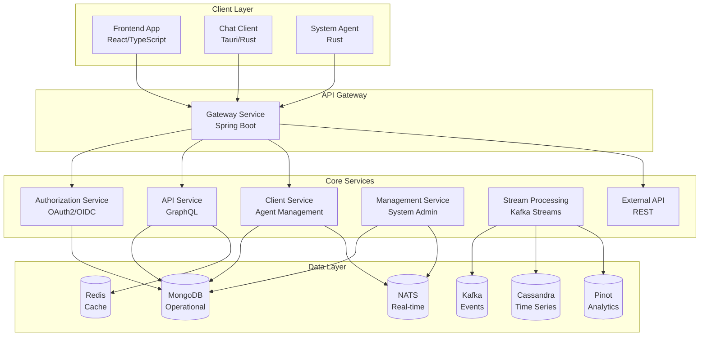

# Development Documentation

Welcome to the OpenFrame development documentation! This section provides comprehensive guides for developers working on or extending the OpenFrame platform.

## 📚 Documentation Overview

This development documentation is organized into several key areas:

### 🛠️ Setup and Environment
- **[Environment Setup](setup/environment.md)** - IDE configuration, extensions, and development tools
- **[Local Development](setup/local-development.md)** - Running OpenFrame locally for development

### 🏗️ Architecture and Design
- **[Architecture Overview](architecture/README.md)** - System architecture, components, and data flow

### 🔒 Security
- **[Security Best Practices](security/README.md)** - Authentication, authorization, and security guidelines

### 🧪 Testing
- **[Testing Overview](testing/README.md)** - Test structure, running tests, and writing new tests

### 🤝 Contributing
- **[Contributing Guidelines](contributing/guidelines.md)** - Code style, PR process, and development workflow

## 🚀 Quick Development Setup

```bash
# 1. Clone and enter directory
git clone https://github.com/flamingo-stack/openframe-oss-tenant.git
cd openframe-oss-tenant

# 2. Start backing services
docker compose -f integrated-tools/docker-compose.yml up -d

# 3. Build all services
mvn clean install -DskipTests

# 4. Start in development mode
./scripts/run-mac.sh    # macOS
./scripts/run-linux.sh  # Linux
```

## 🏛️ Architecture at a Glance

OpenFrame is built as a distributed microservices platform with the following key components:



## 🛠️ Technology Stack

### Backend Services
- **Runtime**: Java 21, Spring Boot 3.3.0, Spring Cloud 2023.0.3
- **APIs**: GraphQL (Netflix DGS 7.0.0), REST with Spring WebFlux
- **Security**: JWT with OAuth2/OIDC, Spring Security 6
- **Data**: MongoDB 7.x, Apache Cassandra 4.x, Apache Pinot 1.2.0, Redis 7.x
- **Messaging**: Apache Kafka 3.6.0, NATS 2.9+
- **Processing**: Custom stream processing with Kafka Streams

### Frontend Applications  
- **Main Frontend**: React 18 with TypeScript, Next.js 14
- **Alternative Frontend**: Vue 3 with Composition API (legacy)
- **Desktop Chat**: Tauri + React with TypeScript
- **UI Components**: Custom design system with PrimeVue/PrimeReact

### System Agent
- **Runtime**: Rust with Tokio async runtime
- **Communication**: NATS messaging, HTTP/REST APIs
- **Cross-platform**: Windows, macOS, Linux support

### Infrastructure
- **Containerization**: Docker and Docker Compose
- **Orchestration**: Kubernetes with Helm charts
- **Service Mesh**: Istio for traffic management
- **Monitoring**: Prometheus, Grafana, Loki

## 🔄 Development Workflow

### Standard Development Process

1. **Setup**: Follow [Environment Setup](setup/environment.md) 
2. **Branch**: Create feature branch from `main`
3. **Develop**: Make changes following [Contributing Guidelines](contributing/guidelines.md)
4. **Test**: Run tests locally and add new tests
5. **Submit**: Create PR with description and tests
6. **Review**: Code review and approval process
7. **Deploy**: Merge and automatic deployment

### Code Organization

```text
openframe-oss-tenant/
├── openframe/                  # Java services and libraries
│   ├── services/              # Spring Boot microservices
│   │   ├── openframe-api/     # GraphQL API service
│   │   ├── openframe-gateway/ # API gateway
│   │   ├── openframe-stream/  # Stream processing
│   │   └── ...
│   └── libs/                  # Shared libraries
├── clients/                   # Client applications
│   ├── openframe-client/      # Rust system agent
│   ├── openframe-chat/        # Tauri chat client
│   └── openframe-frontend/    # React frontend
├── integrated-tools/          # External tool configurations
├── manifests/                 # Kubernetes deployments
└── scripts/                   # Development scripts
```

## 🎯 Development Focus Areas

### Current Priority Areas

| Area | Description | Documentation |
|------|-------------|---------------|
| **AI Integration** | Mingo AI agents and chat interfaces | [AI Architecture](architecture/README.md) |
| **Tool Integrations** | Fleet MDM, Tactical RMM, MeshCentral | [Integration Guides](architecture/README.md) |
| **Security Hardening** | OAuth2, JWT, multi-tenant isolation | [Security Guide](security/README.md) |
| **Stream Processing** | Real-time event processing and analytics | [Stream Architecture](architecture/README.md) |
| **Performance Optimization** | Database queries, caching, scaling | [Performance Guide](architecture/README.md) |

### Extension Points

OpenFrame is designed to be extended:

- **Custom Tool Integrations**: Add new MSP tools
- **AI Model Integrations**: Support additional AI providers  
- **Custom Processors**: Extend data processing pipelines
- **Plugin Architecture**: Add custom business logic
- **Theming and UI**: Customize frontend appearance

## 📖 Essential Reading Order

For new developers, we recommend this reading order:

### Day 1: Environment Setup
1. **[Prerequisites](../getting-started/prerequisites.md)** - Install required tools
2. **[Quick Start](../getting-started/quick-start.md)** - Get OpenFrame running  
3. **[Environment Setup](setup/environment.md)** - Configure your IDE

### Day 2: Architecture Understanding
1. **[Architecture Overview](architecture/README.md)** - Understand system design
2. **[Local Development](setup/local-development.md)** - Development workflow
3. **[Security Overview](security/README.md)** - Security patterns

### Day 3: Contributing
1. **[Testing Guide](testing/README.md)** - Test structure and practices
2. **[Contributing Guidelines](contributing/guidelines.md)** - Code standards and process
3. Pick a small issue to work on

## 🤝 Getting Development Help

### Community Resources

- **OpenMSP Slack**: [Join our developer community](https://join.slack.com/t/openmsp/shared_invite/zt-36bl7mx0h-3~U2nFH6nqHqoTPXMaHEHA)
- **GitHub Discussions**: Ask questions and share ideas
- **GitHub Issues**: Report bugs and request features

### Development Support Channels

| Channel | Purpose | Response Time |
|---------|---------|---------------|
| **#dev-general** (Slack) | General development questions | Hours |
| **#dev-architecture** (Slack) | Architecture and design discussions | Same day |
| **#dev-help** (Slack) | Troubleshooting and debugging | Hours |
| **GitHub Issues** | Bug reports and feature requests | Days |

### Code Review Process

All code changes go through our review process:

1. **Automated Checks**: CI/CD pipeline runs tests and security scans
2. **Peer Review**: At least one developer review required
3. **Architecture Review**: Complex changes reviewed by core team
4. **Security Review**: Security-related changes get additional review

## 🛣️ Development Roadmap

### Short Term (Next Release)
- Enhanced AI agent capabilities
- Additional tool integrations  
- Performance optimizations
- Mobile responsive improvements

### Medium Term (Next Quarter)
- Plugin architecture for custom extensions
- Advanced analytics and reporting
- Multi-cloud deployment options
- Enhanced security features

### Long Term (Next Year) 
- Machine learning for predictive maintenance
- Advanced automation workflows
- Enterprise federation capabilities
- Edge computing support

---

**Ready to start developing?** Choose your path:

- 🆕 **New to OpenFrame**: Start with [Environment Setup](setup/environment.md)
- 🏗️ **Architecture First**: Jump to [Architecture Overview](architecture/README.md)  
- 🔒 **Security Focus**: Begin with [Security Guide](security/README.md)
- 🧪 **Testing Focus**: Check out [Testing Guide](testing/README.md)
- 🤝 **Ready to Contribute**: See [Contributing Guidelines](contributing/guidelines.md)