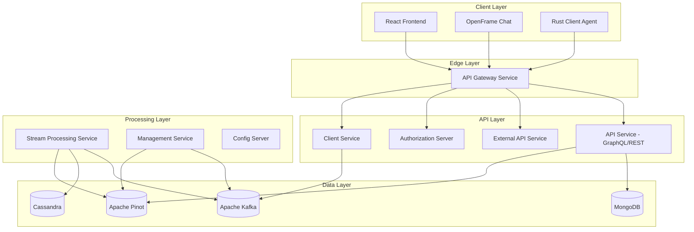

# Development Documentation

Welcome to the OpenFrame development documentation! This section provides comprehensive guides for developers who want to contribute to, extend, or integrate with the OpenFrame platform.

## 📋 Overview

OpenFrame is built using modern development practices with a microservices architecture, enabling developers to work on individual components independently while maintaining a cohesive platform experience.

## 🗺️ Development Documentation Structure

### Setup & Environment
- **[Environment Setup](setup/environment.md)**: IDE configuration, development tools, and local environment preparation
- **[Local Development](setup/local-development.md)**: Clone, build, and run OpenFrame locally with hot reload

### Architecture & Design
- **[Architecture Overview](architecture/README.md)**: High-level system architecture, component relationships, and design decisions
- **[Security](security/README.md)**: Authentication, authorization, and security best practices

### Testing & Quality
- **[Testing Overview](testing/README.md)**: Test structure, running tests, and writing new tests

### Contributing
- **[Contributing Guidelines](contributing/guidelines.md)**: Code style, PR process, and development conventions

## 🏗️ Architecture Overview

OpenFrame uses a modern, distributed microservices architecture:



## 🛠️ Technology Stack

### Backend Services

| Component | Technology | Version | Purpose |
|-----------|------------|---------|---------|
| **Runtime** | Java | 21+ | Primary backend language |
| **Framework** | Spring Boot | 3.3.0+ | Microservices framework |
| **API** | GraphQL (DGS) | 7.0.0+ | Query API layer |
| **Security** | Spring Security | 6.0+ | Authentication & authorization |
| **Data** | Spring Data | 3.0+ | Data access layer |

### Data Storage

| Component | Technology | Version | Purpose |
|-----------|------------|---------|---------|
| **Operational** | MongoDB | 6.0+ | User data, organizations, devices |
| **Analytics** | Apache Pinot | 1.0+ | Real-time analytics queries |
| **Time-series** | Apache Cassandra | 4.0+ | Event data, metrics |
| **Streaming** | Apache Kafka | 3.6+ | Event streaming, real-time processing |
| **Cache** | Redis | 7.0+ | Session storage, caching |

### Frontend

| Component | Technology | Version | Purpose |
|-----------|------------|---------|---------|
| **Framework** | React | 18+ | UI framework |
| **Language** | TypeScript | 5.0+ | Type-safe JavaScript |
| **Build** | Vite | 4.0+ | Build tool and dev server |
| **State** | Zustand | 4.0+ | State management |
| **API** | Apollo Client | 3.0+ | GraphQL client |

### Client Agent

| Component | Technology | Version | Purpose |
|-----------|------------|---------|---------|
| **Language** | Rust | 1.70+ | System agent implementation |
| **Async Runtime** | Tokio | 1.0+ | Asynchronous runtime |
| **HTTP** | Reqwest | 0.11+ | HTTP client |
| **Serialization** | Serde | 1.0+ | JSON serialization |

## 🚀 Quick Development Setup

### 1. Prerequisites Check

Ensure you have the required development tools:

```bash
# Check Java version
java --version  # Should be 21+

# Check Node.js version  
node --version  # Should be 18+

# Check Rust version
rustc --version  # Should be 1.70+

# Check Docker
docker --version  # Should be 20.10+
```

### 2. Clone and Setup

```bash
# Clone repository
git clone https://github.com/flamingo-stack/openframe-oss-tenant.git
cd openframe-oss-tenant

# Start infrastructure services
docker-compose up -d mongodb kafka cassandra pinot

# Build backend services
mvn clean install -DskipTests

# Setup frontend
cd openframe/services/openframe-frontend
npm install
```

### 3. Development Workflow

```bash
# Terminal 1: Start backend services
./scripts/run-mac.sh --dev

# Terminal 2: Start frontend with hot reload  
cd openframe/services/openframe-frontend
npm run dev

# Terminal 3: Build and run client agent (if needed)
cd clients/openframe-client
cargo run
```

## 📁 Repository Structure

```text
openframe-oss-tenant/
├── openframe/                          # Java services and libraries
│   ├── services/                       # Deployable microservices
│   │   ├── openframe-api/              # GraphQL/REST API service
│   │   ├── openframe-gateway/          # API Gateway and routing
│   │   ├── openframe-authorization-server/ # OAuth2/OIDC server
│   │   ├── openframe-management/       # System management service
│   │   ├── openframe-stream/           # Event stream processing
│   │   ├── openframe-client/           # Agent management service
│   │   ├── openframe-external-api/     # External REST API
│   │   ├── openframe-config/           # Configuration server
│   │   └── openframe-frontend/         # React frontend application
│   └── libs/                           # Shared libraries (not in this repo)
├── clients/                            # Client applications
│   ├── openframe-client/               # Rust system agent
│   └── openframe-chat/                 # Chat client (Tauri + React)
├── integrated-tools/                   # External tool configurations
│   ├── tactical-rmm/                   # TacticalRMM integration
│   ├── fleet-mdm/                      # Fleet MDM integration
│   └── meshcentral/                    # MeshCentral integration
├── manifests/                          # Kubernetes deployment manifests
├── scripts/                            # Development and deployment scripts
└── docs/                              # Generated documentation
```

## 🧪 Development Modes

### Local Development
- Hot reload for frontend changes
- Automatic service restart on backend changes
- Local database instances
- Debug logging enabled

### Integration Testing
- Full service stack with Docker Compose
- Real external tool integrations
- Production-like data flow
- Performance testing capabilities

### Production Simulation
- Kubernetes manifests
- Production security settings
- Real SSL certificates
- External database connections

## 🔧 Common Development Tasks

### Backend Development

#### Add New GraphQL Query
```java
@Component
public class DeviceDataFetcher {
    @DgsQuery
    public List<Device> devices(@InputArgument DeviceFilterInput filter) {
        return deviceService.findDevices(filter);
    }
}
```

#### Create New REST Endpoint
```java
@RestController
@RequestMapping("/api/v1/organizations")
public class OrganizationController {
    @GetMapping
    public ResponseEntity<List<Organization>> getOrganizations() {
        return ResponseEntity.ok(organizationService.findAll());
    }
}
```

### Frontend Development

#### Add New React Component
```typescript
import { FC } from 'react';
interface DeviceCardProps {
  device: Device;
}

export const DeviceCard: FC<DeviceCardProps> = ({ device }) => {
  return (
    <div className="device-card">
      <h3>{device.hostname}</h3>
      <p>Status: {device.status}</p>
    </div>
  );
};
```

#### GraphQL Query Integration
```typescript
const GET_DEVICES = gql`
  query GetDevices($filter: DeviceFilterInput) {
    devices(filter: $filter) {
      edges {
        node {
          id
          hostname
          status
        }
      }
    }
  }
`;
```

### Client Agent Development

#### Add New Agent Feature
```rust
pub async fn collect_system_info() -> Result<SystemInfo, AgentError> {
    let info = SystemInfo {
        hostname: get_hostname()?,
        os_version: get_os_version()?,
        cpu_usage: get_cpu_usage().await?,
        memory_usage: get_memory_usage()?,
    };
    Ok(info)
}
```

## 📚 Development Resources

### Internal APIs

| API | URL | Purpose |
|-----|-----|---------|
| **GraphQL Playground** | http://localhost:8080/graphql | Interactive GraphQL IDE |
| **API Documentation** | http://localhost:8080/swagger-ui | REST API documentation |
| **Health Checks** | http://localhost:8080/actuator/health | Service health monitoring |

### Development Tools

| Tool | Purpose | Access |
|------|---------|---------|
| **MongoDB Express** | Database administration | http://localhost:8081 |
| **Kafka UI** | Message broker management | http://localhost:8082 |
| **Pinot Console** | Analytics query interface | http://localhost:8083 |

## 🎯 Getting Started Paths

Choose your development focus:

### 🎨 Frontend Developer
1. [Environment Setup](setup/environment.md) - Configure Node.js and development tools
2. [Local Development](setup/local-development.md) - Start frontend with hot reload
3. Frontend-specific guides in the architecture documentation

### ⚙️ Backend Developer  
1. [Environment Setup](setup/environment.md) - Configure Java and Maven
2. [Local Development](setup/local-development.md) - Start backend services
3. [Architecture Overview](architecture/README.md) - Understand service interactions

### 🦀 Client Agent Developer
1. [Environment Setup](setup/environment.md) - Configure Rust toolchain
2. [Local Development](setup/local-development.md) - Build and run agent
3. Client agent architecture guides

### 🔐 Platform Security
1. [Security Overview](security/README.md) - Authentication and authorization patterns
2. [Environment Setup](setup/environment.md) - Security development tools
3. Security implementation guides

### 🧪 Quality Assurance
1. [Testing Overview](testing/README.md) - Test structure and execution
2. [Environment Setup](setup/environment.md) - Testing tools setup
3. Testing strategy and implementation guides

## 🆘 Development Support

### Community Resources
- **[OpenMSP Slack Community](https://join.slack.com/t/openmsp/shared_invite/zt-36bl7mx0h-3~U2nFH6nqHqoTPXMaHEHA)**: Get help from the community
- **GitHub Discussions**: For feature requests and architectural discussions

### Documentation
- **API References**: GraphQL playground and Swagger documentation
- **Architecture Docs**: Deep-dive into system design and patterns
- **Code Examples**: Working examples for common development tasks

### Development Environment Help
- **Setup Issues**: Common environment setup problems and solutions
- **Service Debugging**: Troubleshooting guide for service connectivity
- **Performance Tuning**: Development environment optimization

Ready to start developing? Choose your path above and dive into the OpenFrame platform! 🚀