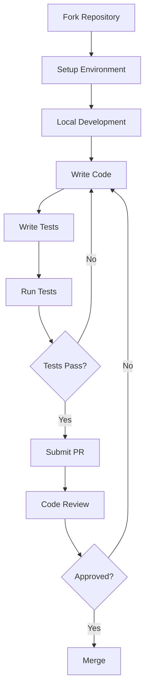
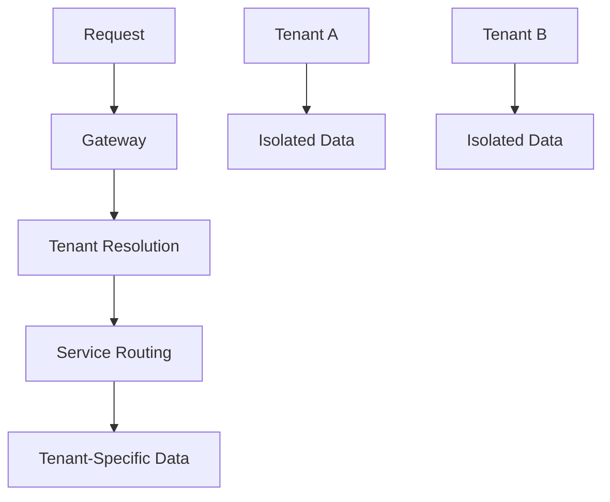
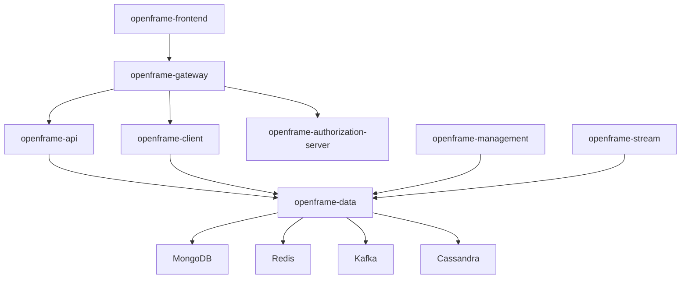

# Development Documentation

Welcome to the OpenFrame development documentation! This section provides comprehensive guides for developers who want to contribute to, extend, or customize OpenFrame.

## Quick Navigation

### Getting Started with Development
- **[Environment Setup](setup/environment.md)** - IDE, tools, and development environment configuration
- **[Local Development](setup/local-development.md)** - Running OpenFrame locally for development
- **[Architecture Overview](architecture/overview.md)** - Understanding the system design and components

### Core Development Areas
- **[Testing](testing/overview.md)** - Testing strategies, running tests, and writing new tests
- **[Contributing](contributing/guidelines.md)** - Code standards, PR process, and contribution guidelines

## Development Workflow



## OpenFrame Architecture at a Glance

OpenFrame is built as a distributed microservices platform:

### Service Layer
| Service | Purpose | Technology |
|---------|---------|------------|
| **openframe-gateway** | API Gateway & routing | Spring Cloud Gateway, WebSocket |
| **openframe-api** | GraphQL API & OAuth | Spring Boot, Netflix DGS |
| **openframe-management** | Admin & lifecycle | Spring Boot, Scheduling |
| **openframe-stream** | Stream processing | Spring Boot, Kafka Streams |
| **openframe-client** | Agent management | Spring Boot, NATS |
| **openframe-frontend** | Web interface | Vue.js 3, TypeScript |

### Technology Stack

#### Backend
- **Java 21** with Spring Boot 3.3.0
- **GraphQL** via Netflix DGS
- **Event Streaming** with Apache Kafka
- **Data Storage**: MongoDB, Cassandra, Redis, Apache Pinot
- **Messaging**: NATS JetStream
- **Security**: JWT, OAuth2, Spring Security

#### Frontend  
- **Vue.js 3** with Composition API
- **TypeScript** for type safety
- **Vite** for build tooling
- **Pinia** for state management
- **Apollo Client** for GraphQL

#### Shared Libraries
OpenFrame uses a extensive set of shared libraries in `openframe-oss-lib/`:

- **Frontend Core**: Shared UI components and utilities
- **API Library**: Common DTOs and service contracts
- **Data Layer**: Persistence abstractions and repositories
- **Security Core**: JWT, OAuth, and authentication utilities
- **Stream Service Core**: Kafka stream processing components
- **Gateway Service Core**: Gateway routing and security
- **Management Service Core**: Administrative functionality

## Development Environment Types

### Local Development
- **Purpose**: Feature development and debugging
- **Requirements**: Java 21, Maven, Node.js, Docker
- **Services**: All services running locally
- **Data**: Local MongoDB, Redis, Kafka

### Integration Testing
- **Purpose**: Service integration testing
- **Requirements**: Docker Compose
- **Services**: Services in containers
- **Data**: Containerized databases

### E2E Testing
- **Purpose**: End-to-end application testing
- **Location**: `openframe-e2e-tests/`
- **Technology**: Java, RestAssured, TestNG
- **Scope**: Full application workflow testing

## Key Development Concepts

### Multi-Tenant Architecture

OpenFrame is designed for multi-tenancy:



- **Tenant Isolation**: Data and configuration isolated per tenant
- **Shared Services**: Core services shared across tenants
- **Dynamic Configuration**: Tenant-specific settings and integrations

### Event-Driven Architecture

OpenFrame uses events for loose coupling:

- **Command Events**: User actions and system commands
- **Domain Events**: Business logic state changes  
- **Integration Events**: External tool data synchronization
- **Stream Processing**: Real-time data enrichment and analysis

### AI Integration Points

Mingo AI and Fae AI integration throughout:

- **Chat Interface**: Direct AI interaction
- **Context Awareness**: AI understands user context
- **Tool Integration**: AI can interact with MSP tools
- **Approval Workflows**: AI actions require human approval
- **Learning**: AI improves based on usage patterns

## Development Best Practices

### Code Standards
- **Java**: Follow Spring Boot conventions, use Lombok judiciously
- **TypeScript**: Strict type checking, prefer composition API
- **Testing**: Comprehensive unit and integration test coverage
- **Documentation**: JavaDoc for APIs, README for modules

### Security Practices
- **Authentication**: OAuth2/OIDC with JWT tokens
- **Authorization**: Role-based access control (RBAC)
- **Data Encryption**: Sensitive data encrypted at rest
- **API Security**: All APIs require authentication
- **Input Validation**: Validate all user inputs

### Performance Considerations
- **Database**: Proper indexing, query optimization
- **Caching**: Redis for frequently accessed data
- **Async Processing**: Use events for long-running operations
- **Connection Pooling**: Proper connection management
- **Memory Management**: Monitor heap usage, tune JVM settings

## Project Structure Deep Dive

```text
openframe-oss-tenant/
├── clients/                    # Client applications
│   ├── openframe-chat/        # Chat widget (Tauri + Vue)
│   └── openframe-client/      # System agent (Rust)
├── openframe/
│   ├── services/              # Microservices
│   └── libs/                  # Shared Java libraries  
├── openframe-oss-lib/         # External shared libraries
├── integrated-tools/          # Docker configs for MSP tools
├── scripts/                   # Development and deployment scripts
├── manifests/                 # Kubernetes Helm charts
└── openframe-e2e-tests/      # End-to-end tests
```

### Service Dependencies



## Getting Started Checklist

Before diving into development:

- [ ] Read the [Environment Setup](setup/environment.md) guide
- [ ] Set up your [Local Development](setup/local-development.md) environment  
- [ ] Understand the [Architecture Overview](architecture/overview.md)
- [ ] Review [Testing Guidelines](testing/overview.md)
- [ ] Read [Contributing Guidelines](contributing/guidelines.md)

## Common Development Tasks

### Adding a New Feature
1. **Design**: Document the feature requirements and design
2. **Backend**: Implement service layer changes
3. **Frontend**: Add UI components and pages
4. **Integration**: Wire up frontend to backend APIs
5. **Testing**: Add unit, integration, and E2E tests
6. **Documentation**: Update relevant documentation

### Debugging Issues
1. **Logs**: Check service logs for errors
2. **Database**: Verify data consistency
3. **Network**: Check service-to-service communication
4. **Cache**: Clear Redis cache if needed
5. **Configuration**: Verify environment variables

### Performance Optimization
1. **Profiling**: Use JVM profiling tools
2. **Database**: Analyze query performance
3. **Caching**: Implement appropriate caching strategies
4. **Async**: Move blocking operations to background
5. **Monitoring**: Set up metrics and alerts

## Development Tools & IDEs

### Recommended IDEs
| IDE | Best For | Extensions |
|-----|----------|------------|
| **IntelliJ IDEA** | Java backend development | Spring Boot, GraphQL, Docker |
| **VS Code** | Frontend & multi-language | Vetur, ESLint, Docker |
| **WebStorm** | Frontend focus | Vue.js, TypeScript, GraphQL |

### Essential Tools
- **Maven**: Java build and dependency management
- **Node.js/npm**: Frontend build and package management
- **Docker**: Container development and testing
- **Postman/Insomnia**: API testing and exploration
- **MongoDB Compass**: Database inspection and querying

## Community & Support

### Getting Help
- **OpenMSP Community**: [Slack workspace](https://join.slack.com/t/openmsp/shared_invite/zt-36bl7mx0h-3~U2nFH6nqHqoTPXMaHEHA)
- **GitHub Discussions**: Technical questions and architecture discussions
- **Code Reviews**: Learn from PR feedback and reviews

### Contributing Back
- **Bug Reports**: File issues with detailed reproduction steps
- **Feature Requests**: Propose new features with use cases
- **Documentation**: Improve guides and API documentation
- **Code Contributions**: Submit PRs following our guidelines

---

*Ready to start developing? Begin with [Environment Setup](setup/environment.md) to configure your development environment.*