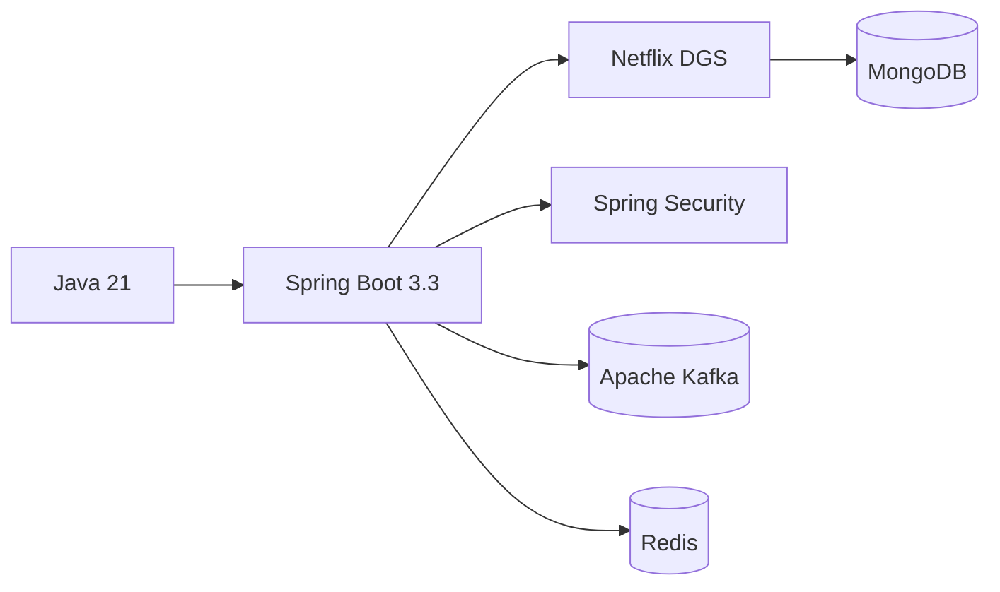
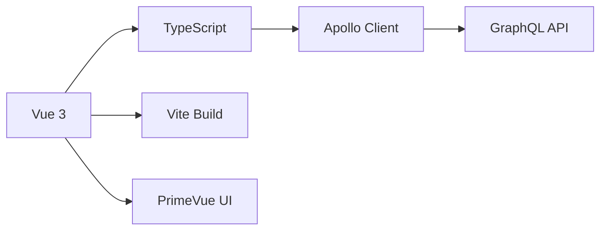
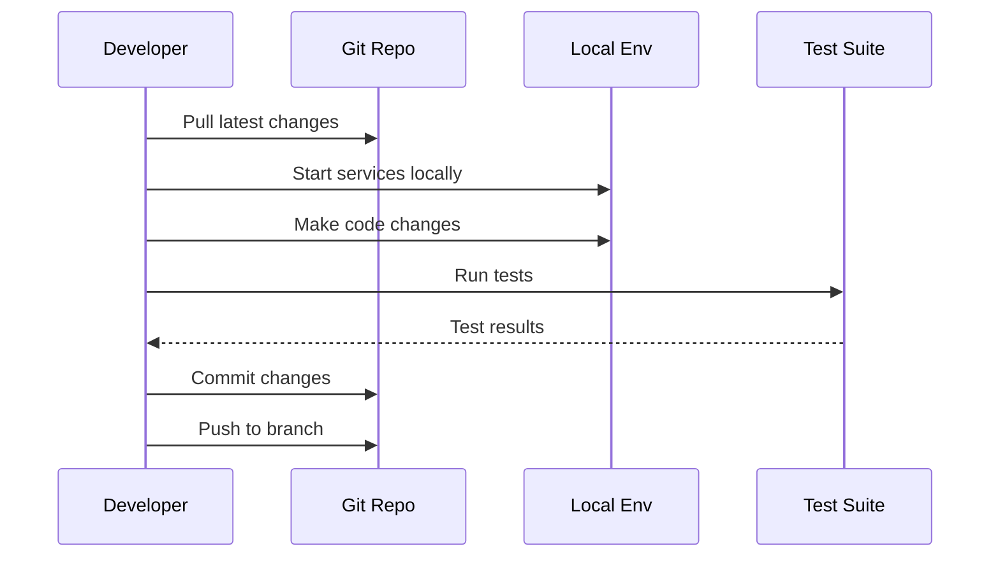
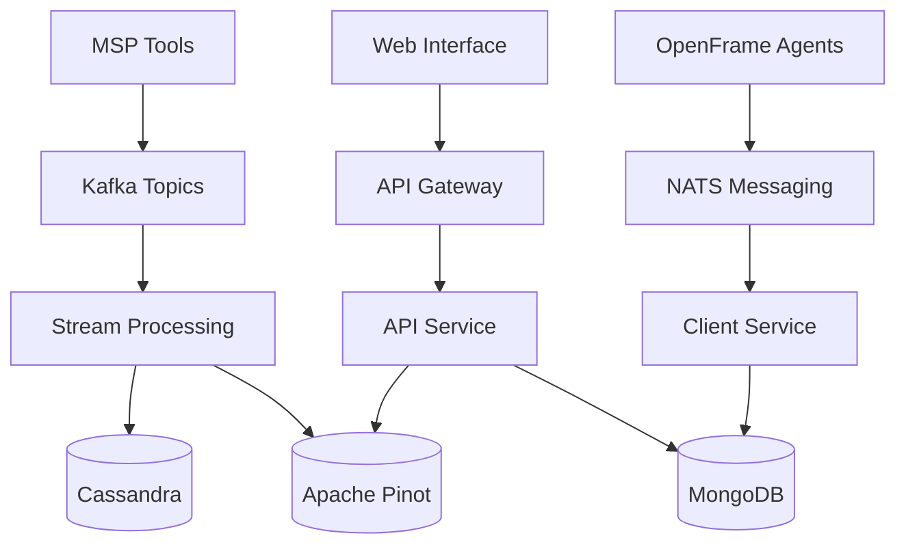

# Development Documentation

Welcome to the OpenFrame development documentation! This section provides comprehensive guides for developers working with, extending, or contributing to the OpenFrame platform.

## Quick Navigation

### Setup & Environment
- **[Environment Setup](setup/environment.md)** - IDE configuration, development tools, and extensions
- **[Local Development](setup/local-development.md)** - Clone, build, run, and debug locally

### Architecture & Design
- **[Architecture Overview](architecture/overview.md)** - System design, components, and data flow
- **[Testing Overview](testing/overview.md)** - Test structure, running tests, and writing new tests

### Contributing
- **[Contributing Guidelines](contributing/guidelines.md)** - Code standards, workflows, and review process

## Development Stack

### Backend Technologies


### Frontend Technologies  


### Infrastructure
- **Containerization**: Docker & Docker Compose
- **Orchestration**: Kubernetes with Helm charts  
- **Messaging**: Apache Kafka, NATS
- **Analytics**: Apache Pinot, Cassandra
- **Monitoring**: Prometheus, Grafana, Loki

## Key Development Concepts

### Multi-Tenant Architecture

OpenFrame is built with multi-tenancy as a core principle:

- **Tenant Context**: Propagated through all service calls
- **Data Isolation**: Tenant-scoped data access patterns  
- **Security**: Tenant-aware authentication and authorization
- **Scalability**: Services designed for multi-tenant deployment

### Event-Driven Design

The platform uses event-driven patterns extensively:

| Component | Event Type | Purpose |
|-----------|------------|---------|
| **Kafka Streams** | Domain events | Cross-service communication |
| **Debezium CDC** | Database changes | Real-time data synchronization |
| **NATS** | Real-time events | WebSocket broadcasting |
| **GraphQL Subscriptions** | Client updates | Live UI updates |

### Microservice Patterns

OpenFrame follows established microservice patterns:

- **API Gateway**: Single entry point, routing, authentication
- **Service Discovery**: Spring Cloud configuration
- **Circuit Breakers**: Resilience patterns
- **Event Sourcing**: Audit trails and state reconstruction

## Development Workflow

### 1. Environment Setup
```bash
# Prerequisites check
./scripts/check-prerequisites.sh

# Development environment setup
./scripts/setup-dev-environment.sh

# IDE configuration
./scripts/configure-ide.sh
```

### 2. Local Development Loop


### 3. Testing Strategy
- **Unit Tests**: Service and component level tests
- **Integration Tests**: Cross-service interaction tests
- **End-to-End Tests**: Full user workflow tests
- **Performance Tests**: Load and stress testing

## Project Structure

```
openframe/
├── services/                    # Deployable microservices
│   ├── openframe-api/          # GraphQL API service
│   ├── openframe-gateway/      # API Gateway
│   ├── openframe-auth/         # OAuth2/OIDC server
│   ├── openframe-stream/       # Event processing
│   ├── openframe-management/   # Admin operations
│   ├── openframe-client/       # Agent management  
│   ├── openframe-external-api/ # Third-party API
│   └── openframe-frontend/     # Vue.js web interface
├── libs/                       # Shared libraries  
│   ├── openframe-core/         # Core models & utilities
│   ├── openframe-data/         # Data access layer
│   ├── openframe-security/     # Authentication & authorization
│   └── api-library/            # Common API components
├── clients/                    # Client applications
│   ├── openframe-client/       # Rust system agent
│   └── openframe-chat/         # Tauri chat client
├── integrated-tools/           # External tool integrations
├── manifests/                  # Kubernetes deployment
└── scripts/                    # Development & deployment scripts
```

## Core Services Deep Dive

### API Service (openframe-api)
- **Technology**: Spring Boot + Netflix DGS (GraphQL)
- **Purpose**: Primary API for web interface and integrations
- **Key Features**: Multi-tenant data access, real-time subscriptions
- **Port**: 8080

### Gateway Service (openframe-gateway)
- **Technology**: Spring WebFlux
- **Purpose**: Edge routing, authentication, rate limiting  
- **Key Features**: JWT processing, WebSocket proxying
- **Port**: 8081

### Stream Service (openframe-stream)
- **Technology**: Spring Kafka + Custom processors
- **Purpose**: Real-time event processing and analytics
- **Key Features**: Debezium integration, data enrichment
- **Port**: 8085

## Data Flow Architecture



## Development Best Practices

### Code Quality
- **Java**: Use Lombok for boilerplate reduction
- **TypeScript**: Strict type checking enabled
- **Testing**: Minimum 80% code coverage
- **Documentation**: Comprehensive JavaDoc/JSDoc

### Security
- **Authentication**: OAuth2/OIDC flows only
- **Authorization**: Role-based access control
- **Data**: Encrypt sensitive data at rest
- **APIs**: Input validation and sanitization

### Performance
- **Caching**: Redis for frequently accessed data
- **Database**: Optimized queries and indexing
- **APIs**: GraphQL DataLoader patterns
- **Monitoring**: APM and metrics collection

## Common Development Tasks

### Adding a New Service
1. Create service module structure
2. Configure Spring Boot application
3. Add to Docker Compose setup
4. Update Gateway routing rules
5. Add monitoring and health checks

### Creating GraphQL APIs
1. Define schema in `.graphqls` files
2. Implement DataFetchers
3. Add DataLoaders for N+1 prevention
4. Write integration tests
5. Update API documentation

### Adding Event Processing
1. Define Kafka topic structure
2. Create stream processing logic
3. Add data enrichment rules
4. Configure output destinations
5. Test event flow end-to-end

## Development Tools Integration

### IntelliJ IDEA
- Spring Boot plugin for hot reload
- GraphQL schema support
- Maven integration
- Database tool integration

### VS Code
- Java Extension Pack
- Vetur for Vue development
- Docker extension
- GraphQL schema validation

### Debug Configuration
- Remote JVM debugging setup
- Frontend source maps
- Database query profiling
- Log aggregation setup

## Contributing Workflow

1. **Fork & Clone**: Get your development copy
2. **Feature Branch**: Create isolated feature branches  
3. **Development**: Follow coding standards and test requirements
4. **Pull Request**: Submit with clear description and tests
5. **Code Review**: Address feedback and iterate
6. **Merge**: Maintain clean commit history

## Getting Started

New to OpenFrame development? Start here:

1. **[Environment Setup](setup/environment.md)** - Get your development environment ready
2. **[Local Development](setup/local-development.md)** - Run OpenFrame locally
3. **[Architecture Overview](architecture/overview.md)** - Understand the system design
4. **[Contributing Guidelines](contributing/guidelines.md)** - Learn the development workflow

## Resources

### Documentation
- [API Reference Documentation](../reference/api/)
- [Database Schema Documentation](../reference/data/)
- [Architecture Decision Records](../reference/architecture/)

### Community
- **OpenMSP Slack**: [openmsp.ai](https://www.openmsp.ai/)
- **GitHub Discussions**: Technical discussions and Q&A
- **Developer Blog**: Latest updates and deep dives

### Tools & Links
- **GraphQL Playground**: `http://localhost:8080/graphql`
- **Service Health Checks**: `http://localhost:808x/actuator/health`
- **Monitoring Dashboard**: `http://localhost:3001` (when enabled)

---

Ready to start developing? Choose your path:

- 🚀 **New Developer**: Start with [Environment Setup](setup/environment.md)
- 🔧 **Quick Setup**: Jump to [Local Development](setup/local-development.md)  
- 🏗️ **System Design**: Explore [Architecture Overview](architecture/overview.md)
- 🤝 **Contributing**: Review [Contributing Guidelines](contributing/guidelines.md)