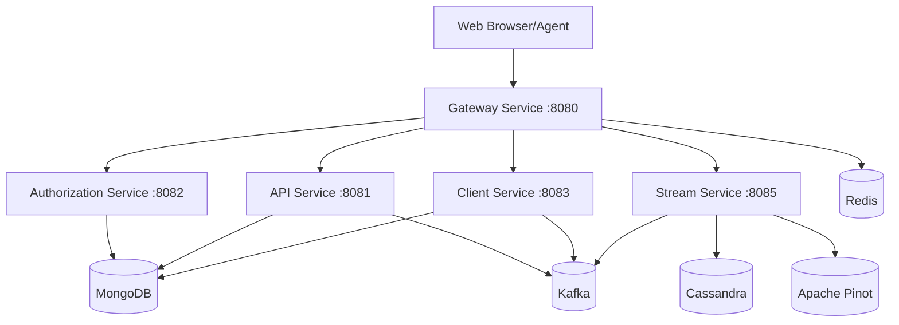

# Development Documentation

Welcome to the OpenFrame development documentation. This section provides comprehensive guides for developers who want to contribute to, extend, or deploy OpenFrame.

## Quick Navigation

### Setup and Environment
- **[Environment Setup](setup/environment.md)** - IDE configuration, development tools, and environment variables
- **[Local Development](setup/local-development.md)** - Running OpenFrame locally for development

### Architecture and Design
- **[Architecture Overview](architecture/overview.md)** - High-level system architecture, service relationships, and data flow
- **[Testing Overview](testing/overview.md)** - Testing strategy, frameworks, and best practices

### Contribution Guidelines
- **[Contributing Guidelines](contributing/guidelines.md)** - Code style, pull request process, and development workflow

## OpenFrame Development Stack

OpenFrame is a modern, distributed microservices platform built with the following technologies:

### Backend Services (Java)
- **Framework**: Spring Boot 3.3.0 + Spring Cloud 2023.0.3
- **Runtime**: Java 21 with native compilation support
- **API**: GraphQL (Netflix DGS), RESTful services
- **Security**: OAuth2/OIDC, JWT tokens, Spring Security
- **Data**: MongoDB 7.x, Apache Cassandra 4.x, Apache Pinot 1.2.0, Redis
- **Messaging**: Apache Kafka 3.6.0 for event streaming
- **Build**: Maven 3.9+ with multi-module project structure

### Frontend Application (Vue.js)
- **Framework**: Vue 3 with Composition API and TypeScript
- **UI Library**: PrimeVue 3.45.0 component library
- **State Management**: Pinia stores with TypeScript
- **GraphQL Client**: Apollo Client for data fetching
- **Build Tool**: Vite 5.0.10 with hot module replacement
- **Styling**: Tailwind CSS with custom design system

### Client Agent (Rust)
- **Language**: Rust 1.75+ with async/await
- **Cross-Platform**: Windows, macOS, and Linux support
- **System Integration**: WMI, systemd, launchd APIs
- **Communication**: NATS messaging, HTTP REST APIs
- **Security**: TLS encryption, certificate management

### Infrastructure
- **Containerization**: Docker and Docker Compose
- **Orchestration**: Kubernetes 1.28+ with Helm charts
- **Service Mesh**: Istio 1.20 for traffic management
- **Observability**: Prometheus, Grafana, Jaeger tracing
- **CI/CD**: GitHub Actions with automated testing

## Development Workflow

### 1. Setting Up Your Environment

```bash
# Clone the repository
git clone https://github.com/flamingo-stack/openframe-oss-tenant.git
cd openframe-oss-tenant

# Follow the environment setup guide
cat development/setup/environment.md
```

### 2. Local Development

```bash
# Start infrastructure dependencies
docker-compose -f integrated-tools/docker-compose.yml up -d

# Build and run services
mvn clean install
./scripts/run-mac.sh  # or run-linux.sh

# Start frontend development server
cd openframe/services/openframe-frontend
npm install && npm run dev
```

### 3. Testing

```bash
# Run all Java tests
mvn test

# Run frontend tests
cd openframe/services/openframe-frontend
npm test

# Run E2E tests
cd openframe-e2e-tests
mvn test -Dtest=smoke
```

## Service Architecture

OpenFrame follows a microservices architecture with clear separation of concerns:



### Core Services

| Service | Port | Purpose | Technology |
|---------|------|---------|------------|
| **Gateway** | 8080 | API Gateway, routing, authentication | Spring Cloud Gateway |
| **API** | 8081 | GraphQL/REST APIs, business logic | Spring Boot + Netflix DGS |
| **Authorization** | 8082 | OAuth2/OIDC server, tenant management | Spring Authorization Server |
| **Client** | 8083 | Agent registration, device management | Spring Boot |
| **Stream** | 8085 | Event processing, data enrichment | Spring Cloud Stream + Kafka |
| **Management** | 8084 | Admin tasks, schedulers, monitoring | Spring Boot |
| **Frontend** | 3000 | Vue.js web application | Vue 3 + Vite |

### Shared Libraries

OpenFrame uses a modular library structure for code reuse:

```bash
openframe/libs/
├── openframe-core/              # Core domain models and utilities
├── openframe-data/              # Data access layer and repositories  
├── openframe-data-mongo/        # MongoDB-specific data access
├── openframe-security-core/     # JWT and security utilities
├── openframe-security-oauth/    # OAuth2/OIDC implementation
├── openframe-api-lib/           # Shared API DTOs and services
├── openframe-gateway-service-core/ # Gateway filters and configuration
└── openframe-stream-service-core/  # Stream processing components
```

## Development Principles

### 1. Microservices Best Practices
- **Single Responsibility**: Each service has a clear, focused purpose
- **Database Per Service**: No shared databases between services
- **API-First Design**: Well-defined REST and GraphQL contracts
- **Stateless Services**: All state stored in external systems

### 2. Security-First Approach
- **Zero Trust**: All inter-service communication is authenticated
- **Tenant Isolation**: Multi-tenant data segregation at all layers
- **Minimal Permissions**: Principle of least privilege access
- **Audit Logging**: Comprehensive security event tracking

### 3. Observability and Monitoring
- **Structured Logging**: JSON-formatted logs with correlation IDs
- **Metrics Collection**: Prometheus metrics for all services
- **Distributed Tracing**: Jaeger tracing across service boundaries
- **Health Checks**: Comprehensive readiness and liveness probes

### 4. Test-Driven Development
- **Unit Tests**: Comprehensive coverage for business logic
- **Integration Tests**: Database and external service testing
- **Contract Tests**: API contract validation
- **E2E Tests**: Full user journey validation

## Getting Started

### For New Contributors

1. **Read the [Contributing Guidelines](contributing/guidelines.md)** - Understand our development workflow
2. **Set up your [Development Environment](setup/environment.md)** - Install required tools and dependencies
3. **Follow the [Local Development Guide](setup/local-development.md)** - Get OpenFrame running locally
4. **Review the [Architecture Overview](architecture/overview.md)** - Understand the system design
5. **Explore the [Testing Overview](testing/overview.md)** - Learn our testing practices

### For System Administrators

1. **Deployment Guides** - Kubernetes and Docker deployment instructions
2. **Configuration Management** - Environment-specific configuration
3. **Monitoring Setup** - Prometheus, Grafana, and alerting configuration
4. **Backup and Recovery** - Data backup and disaster recovery procedures

### For API Consumers

1. **GraphQL Schema** - Complete API documentation and examples
2. **REST API Reference** - OpenAPI specifications and usage examples
3. **Authentication Guide** - OAuth2/OIDC integration instructions
4. **SDK Documentation** - Client libraries and code examples

## Common Development Tasks

### Adding a New Service

1. Create service module in `openframe/services/`
2. Implement Spring Boot application with proper configuration
3. Add service discovery and gateway routing
4. Implement health checks and metrics
5. Add comprehensive tests and documentation

### Adding a New Feature

1. Design API contracts (GraphQL/REST)
2. Implement backend services and data models
3. Add frontend components and state management
4. Write tests at all levels (unit, integration, E2E)
5. Update documentation and migration scripts

### Debugging and Troubleshooting

1. **Check Service Logs**: Use centralized logging aggregation
2. **Monitor Metrics**: Review Prometheus dashboards
3. **Trace Requests**: Use Jaeger for distributed tracing
4. **Database Queries**: Verify data consistency and performance
5. **Network Connectivity**: Test service-to-service communication

## Community and Support

- **OpenMSP Slack Community**: [Join here](https://join.slack.com/t/openmsp/shared_invite/zt-36bl7mx0h-3~U2nFH6nqHqoTPXMaHEHA)
- **GitHub Repository**: [flamingo-stack/openframe-oss-tenant](https://github.com/flamingo-stack/openframe-oss-tenant)
- **Development Discussions**: GitHub Discussions for technical questions
- **Issue Tracking**: GitHub Issues for bug reports and feature requests

---

**Ready to contribute?** Start with the [Environment Setup Guide](setup/environment.md) and join our vibrant developer community!