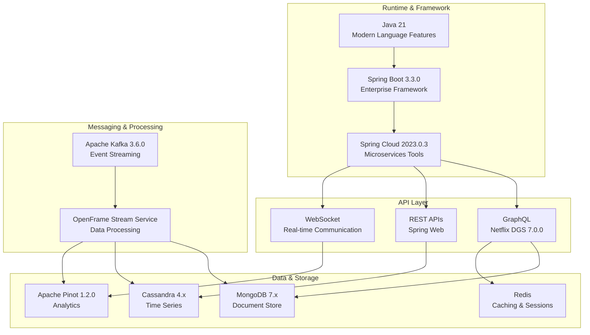
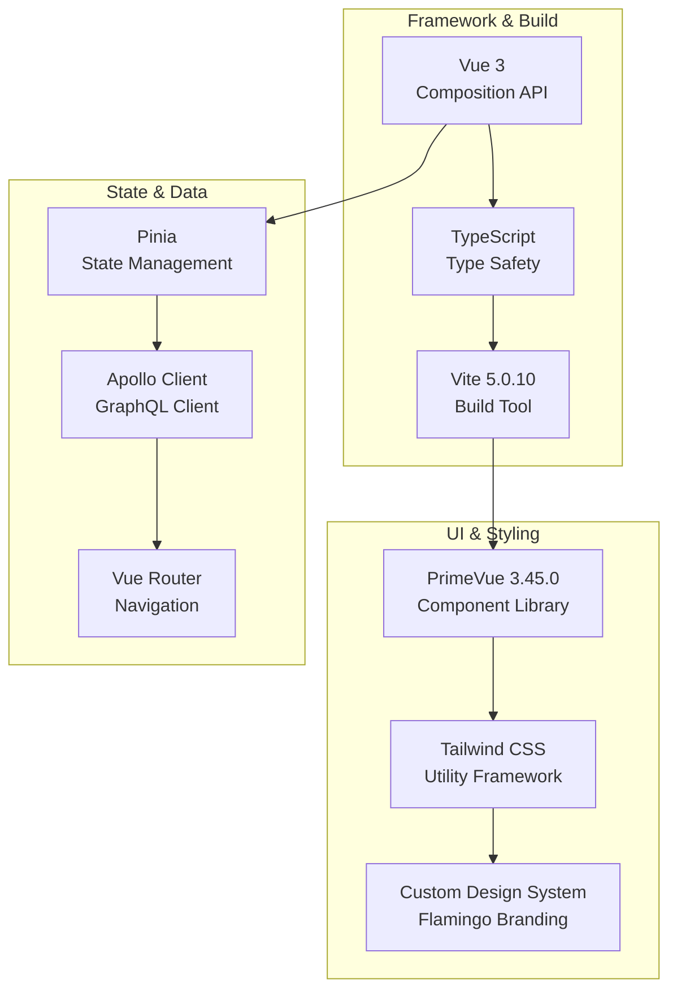
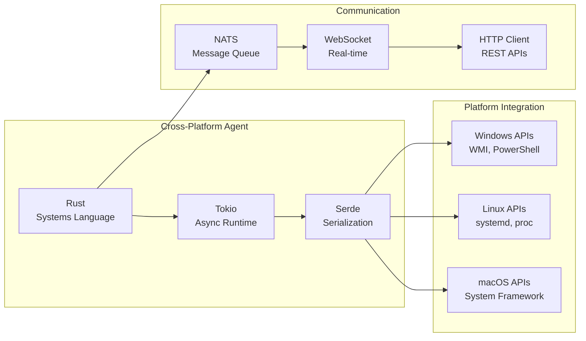
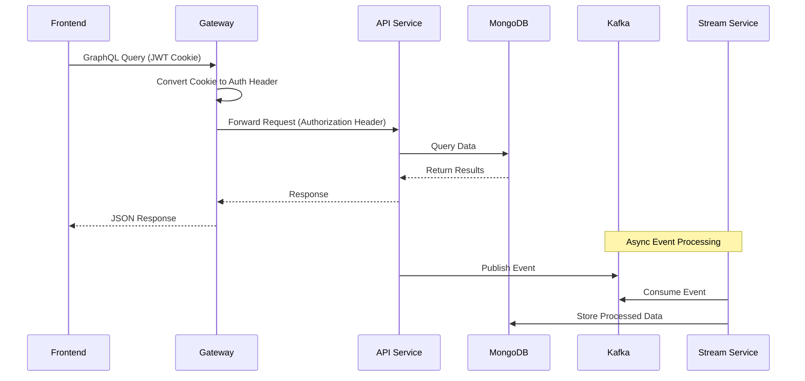
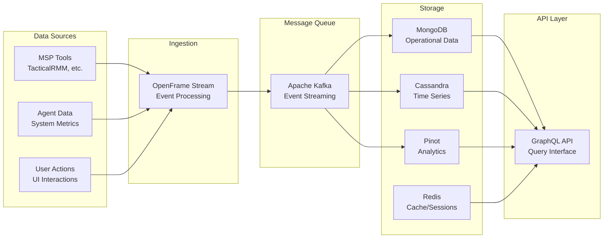

# Development Documentation

This section provides comprehensive guides for developers working with OpenFrame, from initial setup through advanced customization and deployment.

## Quick Navigation

### Setup and Environment
| Guide | Description | Audience |
|-------|-------------|----------|
| **[Environment Setup](setup/environment.md)** | IDE configuration and development tools | All developers |
| **[Local Development](setup/local-development.md)** | Running OpenFrame locally for development | All developers |

### Architecture and Design  
| Guide | Description | Audience |
|-------|-------------|----------|
| **[Architecture Overview](architecture/overview.md)** | System design and component interactions | All developers |

### Testing and Quality
| Guide | Description | Audience |
|-------|-------------|----------|
| **[Testing Overview](testing/overview.md)** | Test structure, running tests, and writing new tests | All developers |

### Contributing
| Guide | Description | Audience |
|-------|-------------|----------|
| **[Contributing Guidelines](contributing/guidelines.md)** | Code style, PR process, and development workflow | Contributors |

## Development Stack Overview

OpenFrame uses a modern, polyglot development stack optimized for microservices architecture:

### Backend Technologies


### Frontend Technologies


### Client Agent Technologies


## Development Environment Requirements

### Recommended Hardware
- **CPU**: 8+ cores (Intel i7/M1 Pro or better)
- **Memory**: 32GB+ RAM (16GB minimum)
- **Storage**: 1TB SSD with 500GB+ free space
- **Network**: Stable broadband connection

### Required Software Versions
| Component | Version | Purpose |
|-----------|---------|---------|
| **Java** | 21+ (OpenJDK recommended) | Backend services |
| **Maven** | 3.9+ | Java build tool |
| **Node.js** | 18+ | Frontend development |
| **npm** | 9+ | Package management |
| **Rust** | 1.70+ | Client agent development |
| **Docker** | 24.0+ | Containerization |
| **Git** | 2.40+ | Version control |

### Supported IDEs

#### Java Development
- **IntelliJ IDEA Ultimate** (Recommended)
  - Spring Boot plugin
  - GraphQL plugin  
  - Docker integration
- **Eclipse IDE** with Spring Tools
- **Visual Studio Code** with Java extensions

#### Frontend Development
- **WebStorm** (Recommended)
  - Vue.js support
  - TypeScript integration
  - GraphQL tooling
- **Visual Studio Code** with Vue extensions
- **Sublime Text** with Vue syntax

#### Rust Development
- **Visual Studio Code** with rust-analyzer
- **IntelliJ IDEA** with Rust plugin
- **Vim/Neovim** with rust.vim

## Project Structure Deep Dive

### Service Organization
```
openframe/
├── services/                    # Microservices
│   ├── openframe-gateway/       # 🌐 API Gateway & Auth
│   ├── openframe-api/           # 📊 GraphQL API & OAuth
│   ├── openframe-management/    # ⚙️  Admin & Scheduling
│   ├── openframe-stream/        # 🔄 Stream Processing
│   ├── openframe-config/        # ⚙️  Configuration
│   ├── openframe-client/        # 🤖 Agent Management
│   ├── openframe-external-api/  # 🔌 External Integrations
│   ├── openframe-authorization-server/ # 🔐 OAuth2 Server
│   └── openframe-frontend/      # 🖥️  Vue.js Frontend
└── libs/                        # Shared Libraries
    ├── openframe-core/          # 🧱 Core Models
    ├── openframe-data/          # 💾 Data Access
    ├── openframe-jwt/           # 🔑 JWT Security
    └── api-library/             # 📡 API Services
```

### Client Structure
```
clients/
├── openframe-client/           # 🦀 Rust System Agent
│   ├── src/
│   │   ├── clients/           # API client implementations
│   │   ├── services/          # Core business logic
│   │   ├── platform/          # OS-specific code
│   │   ├── models/            # Data structures
│   │   └── listeners/         # Event handling
│   └── Cargo.toml
└── openframe-chat/            # 💬 AI Chat Client (Tauri)
    ├── src/                   # React/TypeScript frontend
    └── src-tauri/             # Rust backend
```

### Configuration Management
```
scripts/                       # Development Scripts
├── run-mac.sh                # macOS development setup
├── run-linux.sh              # Linux development setup
├── run-windows.ps1           # Windows PowerShell setup
├── build/                    # Build automation
├── deployment/               # Deployment helpers
└── testing/                  # Test utilities
```

## Key Development Concepts

### Microservices Communication



### Authentication Flow

OpenFrame uses a hybrid authentication approach:

1. **User Authentication**: OAuth2/OpenID Connect with JWT in HTTP-only cookies
2. **Service-to-Service**: JWT tokens in Authorization headers (internal)
3. **Agent Authentication**: Service account credentials with refresh tokens

### Data Processing Pipeline



## Development Workflow

### Standard Development Process

1. **Feature Branch**: Create feature branch from `main`
2. **Local Development**: Run services locally with hot reload
3. **Testing**: Write and run unit + integration tests
4. **Code Review**: Submit PR with comprehensive description
5. **CI/CD**: Automated testing and quality checks
6. **Merge**: Merge to main after approval

### Hot Reload Capabilities

| Component | Hot Reload Support | Restart Required |
|-----------|-------------------|------------------|
| **Frontend (Vue)** | ✅ Full hot reload | Never |
| **GraphQL Schema** | ✅ Auto-reload | Service restart |
| **Java Services** | ✅ Spring DevTools | Configuration changes |
| **Rust Client** | ❌ Full rebuild | Always |
| **Configuration** | ✅ Spring Cloud Config | Depends on property |

### Debugging Support

#### Java Services
```bash
# Start with debug mode
mvn spring-boot:run -Dspring-boot.run.jvmArguments="-agentlib:jdwp=transport=dt_socket,server=y,suspend=n,address=5005"

# IntelliJ IDEA: Create Remote JVM Debug configuration
# Port: 5005, Host: localhost
```

#### Frontend
```bash
# Start development server with source maps
cd openframe/services/openframe-frontend
npm run dev

# Browser DevTools: Vue.js DevTools extension
# Available for Chrome, Firefox, Edge
```

#### Rust Client
```bash
# Debug build with symbols
cd clients/openframe-client
cargo build --features debug-logging

# Run with logging
RUST_LOG=debug cargo run
```

## Common Development Tasks

### Adding a New GraphQL Query

1. **Update Schema** (`schema.graphqls`)
2. **Create DataFetcher** (Java class implementing data loading)
3. **Register DataFetcher** (DGS configuration)
4. **Add Frontend Query** (GraphQL document)
5. **Test Integration** (Unit + E2E tests)

### Creating a New Microservice

1. **Maven Module**: Add to root `pom.xml`
2. **Spring Boot Main Class**: Application entry point
3. **Configuration**: `application.yml` and externalized config
4. **Docker Configuration**: `Dockerfile` and compose entry
5. **Helm Chart**: Kubernetes deployment manifests

### Integrating External Tools

1. **API Client**: Create service client (typically in `openframe-external-api`)
2. **Data Models**: Define DTOs for external data
3. **Stream Processing**: Add Kafka topic and consumer
4. **UI Integration**: Add frontend components
5. **Configuration**: Add tool-specific settings

## Performance and Monitoring

### Development Metrics
- **Build Time**: Full build should complete in < 5 minutes
- **Test Suite**: All tests should complete in < 10 minutes  
- **Hot Reload**: Frontend changes reflect in < 2 seconds
- **Service Startup**: Each service starts in < 30 seconds

### Profiling Tools
- **JProfiler**: Java application profiling
- **Vue DevTools**: Frontend performance analysis
- **Docker Stats**: Container resource usage
- **Prometheus**: Metrics collection and alerting

## Getting Help

### Documentation Resources
- **API Documentation**: GraphQL Playground and OpenAPI specs
- **Code Comments**: Inline documentation and JavaDoc
- **Architecture Decision Records**: Design rationale documentation
- **Troubleshooting Guides**: Common issues and solutions

### Community Support
- **OpenMSP Slack**: Real-time developer discussions at https://www.openmsp.ai/
- **GitHub Issues**: Bug reports and feature requests
- **Code Reviews**: Learning from peer feedback
- **Developer Meetings**: Regular team sync and architecture discussions

### Development Best Practices
- **Test-Driven Development**: Write tests first, then implementation
- **Code Coverage**: Maintain > 80% coverage for critical paths
- **Documentation**: Update docs with every significant change
- **Security**: Follow OWASP guidelines for web application security

---

**Ready to start developing?** Begin with [Environment Setup](setup/environment.md) to configure your development tools, then proceed to [Local Development](setup/local-development.md) to get OpenFrame running locally with hot reload capabilities.