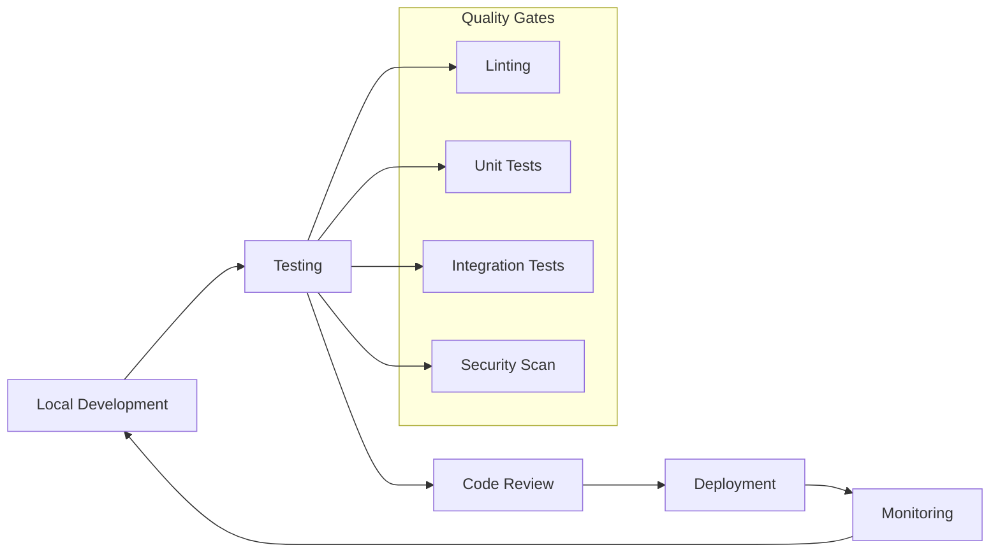

# Development Documentation

Welcome to the OpenFrame development documentation! This section provides comprehensive guides for developers working on the OpenFrame platform, from setting up your development environment to contributing code and deploying changes.

## Overview

OpenFrame is a complex, multi-service platform built with modern technologies. This documentation helps you navigate the development process effectively, whether you're contributing to core services, building integrations, or extending functionality.

### Development Philosophy

OpenFrame follows these core development principles:

- **Microservices Architecture**: Loosely coupled, independently deployable services
- **API-First Design**: GraphQL and REST APIs drive all functionality
- **Event-Driven Processing**: Real-time data flow through Kafka and NATS
- **Multi-Tenant by Design**: Secure tenant isolation at all layers
- **Developer Experience**: Clear documentation, automated testing, easy local development

## Documentation Structure

This development section is organized into focused areas:

### 🛠️ Setup and Environment

| Guide | Purpose | Audience |
|-------|---------|----------|
| **[Environment Setup](setup/environment.md)** | IDE configuration, development tools | All developers |
| **[Local Development](setup/local-development.md)** | Running services locally, debugging | Backend developers |

### 🏗️ Architecture and Design

| Guide | Purpose | Audience |
|-------|---------|----------|
| **[Architecture Overview](architecture/overview.md)** | System design, service interactions | All developers |

### 🧪 Testing and Quality

| Guide | Purpose | Audience |
|-------|---------|----------|
| **[Testing Overview](testing/overview.md)** | Test strategies, running tests | All developers |

### 🤝 Contributing

| Guide | Purpose | Audience |
|-------|---------|----------|
| **[Contributing Guidelines](contributing/guidelines.md)** | Code style, PR process, review checklist | All contributors |

## Quick Navigation

### For New Developers
1. **Start Here**: [Environment Setup](setup/environment.md)
2. **Get Running**: [Local Development](setup/local-development.md)  
3. **Understand the System**: [Architecture Overview](architecture/overview.md)
4. **Write Tests**: [Testing Overview](testing/overview.md)
5. **Contribute Code**: [Contributing Guidelines](contributing/guidelines.md)

### For Specific Roles

#### Backend Developers (Java/Spring Boot)
- **Core Services**: API, Gateway, Management, Stream services
- **Data Layer**: MongoDB, Kafka, Cassandra integration
- **Security**: JWT, OAuth2, multi-tenancy implementation
- **Key Files**: Service implementations, DTOs, repositories

#### Frontend Developers (Vue.js/TypeScript)
- **UI Components**: Vue 3 with Composition API
- **State Management**: Pinia stores and reactive data
- **API Integration**: GraphQL with Apollo Client
- **Key Files**: Components, stores, GraphQL queries

#### DevOps Engineers  
- **Containerization**: Docker and Docker Compose configurations
- **Orchestration**: Kubernetes Helm charts
- **Infrastructure**: Service mesh, monitoring, logging
- **Key Files**: Kubernetes manifests, Docker files, deployment scripts

#### Integration Developers
- **External APIs**: Tool integrations (Tactical RMM, Fleet MDM)
- **Event Processing**: Kafka streams and Debezium
- **Client Agents**: Rust-based system agents
- **Key Files**: Integration services, stream processors, agent code

## Technology Stack Reference

### Backend Technologies

| Technology | Version | Purpose | Documentation |
|------------|---------|---------|---------------|
| **Java** | 21 | Runtime platform | Oracle JDK docs |
| **Spring Boot** | 3.3.0 | Application framework | Spring Boot reference |
| **Spring Cloud** | 2023.0.3 | Microservices toolkit | Spring Cloud docs |
| **Netflix DGS** | 7.0.0 | GraphQL framework | DGS documentation |
| **MongoDB** | 7.x | Primary database | MongoDB manual |
| **Apache Kafka** | 3.6.0 | Event streaming | Kafka documentation |
| **Cassandra** | 4.x | Time-series data | Cassandra docs |
| **Redis** | 7.x | Caching | Redis documentation |

### Frontend Technologies

| Technology | Version | Purpose | Documentation |
|------------|---------|---------|---------------|
| **Vue.js** | 3.x | UI framework | Vue.js guide |
| **TypeScript** | 5.x | Type safety | TypeScript handbook |
| **Vite** | 5.0.10 | Build tool | Vite guide |
| **PrimeVue** | 3.45.0 | UI components | PrimeVue docs |
| **Apollo Client** | 3.x | GraphQL client | Apollo docs |
| **Pinia** | 2.x | State management | Pinia documentation |

### Infrastructure Technologies

| Technology | Version | Purpose | Documentation |
|------------|---------|---------|---------------|
| **Docker** | 24.x | Containerization | Docker docs |
| **Kubernetes** | 1.28+ | Container orchestration | Kubernetes docs |
| **Helm** | 3.x | Package management | Helm documentation |
| **Istio** | 1.20 | Service mesh | Istio documentation |
| **Prometheus** | Latest | Monitoring | Prometheus docs |

## Development Workflows

### Code Development Cycle



### Development Environment Types

| Environment | Purpose | Data | Access |
|-------------|---------|------|---------|
| **Local** | Feature development | Synthetic/mocked | Developer workstation |
| **Development** | Integration testing | Shared test data | Team access |
| **Staging** | Pre-production validation | Production-like data | Restricted access |
| **Production** | Live system | Real customer data | Highly restricted |

## Common Development Tasks

### Building the Project

```bash
# Full build (all services and libraries)
mvn clean install

# Build specific service
cd openframe/services/openframe-api
mvn clean install

# Build frontend
cd openframe/services/openframe-frontend
npm run build
```

### Running Tests

```bash
# All tests
mvn test

# Specific service tests
cd openframe/services/openframe-api
mvn test

# Frontend tests
cd openframe/services/openframe-frontend
npm run test
```

### Local Development

```bash
# Start infrastructure services
docker-compose -f integrated-tools/docker-compose.yml up -d

# Start backend services (see local development guide)
./scripts/run-mac.sh

# Start frontend in development mode
cd openframe/services/openframe-frontend
npm run dev
```

## Project Standards

### Code Quality

- **Linting**: ESLint for TypeScript, Checkstyle for Java
- **Formatting**: Prettier for frontend, Google Java Format for backend
- **Testing**: Minimum 80% code coverage required
- **Documentation**: JavaDoc for Java, JSDoc for TypeScript

### Git Workflow

- **Branching**: Feature branches from `main`
- **Commits**: Conventional commit messages
- **Pull Requests**: Required for all changes
- **Reviews**: Minimum 2 approvals for core changes

### Security Standards

- **Authentication**: JWT tokens with secure storage
- **Authorization**: Role-based access control (RBAC)
- **Data Protection**: Encryption at rest and in transit
- **Auditing**: Complete audit trails for all actions

## Getting Help

### Community Resources
- **OpenMSP Slack**: [Join our community](https://join.slack.com/t/openmsp/shared_invite/zt-36bl7mx0h-3~U2nFH6nqHqoTPXMaHEHA)
- **GitHub Discussions**: Technical discussions and Q&A
- **Documentation Issues**: Report docs problems

### Internal Resources  
- **Architecture Decisions**: See `/docs/architecture/` for design rationale
- **API Documentation**: GraphQL schema and REST API specs
- **Runbooks**: Operational procedures and troubleshooting

### Development Support
- **Code Reviews**: Get feedback from experienced contributors
- **Pair Programming**: Schedule sessions for complex features
- **Office Hours**: Regular community help sessions

## Contributing Back

OpenFrame thrives on community contributions. Ways to contribute:

- **Bug Reports**: Detailed issue reports with reproduction steps
- **Feature Requests**: Well-defined enhancement proposals
- **Code Contributions**: Bug fixes, features, documentation improvements
- **Community Support**: Help other developers in Slack and discussions

## What's Next?

Choose your path based on your role and interests:

- **New to OpenFrame?** → Start with [Environment Setup](setup/environment.md)
- **Building Features?** → Read [Architecture Overview](architecture/overview.md)
- **Writing Tests?** → Check [Testing Overview](testing/overview.md)
- **Ready to Contribute?** → Follow [Contributing Guidelines](contributing/guidelines.md)

---

**Happy Coding!** 🚀 The OpenFrame community is here to support your development journey.