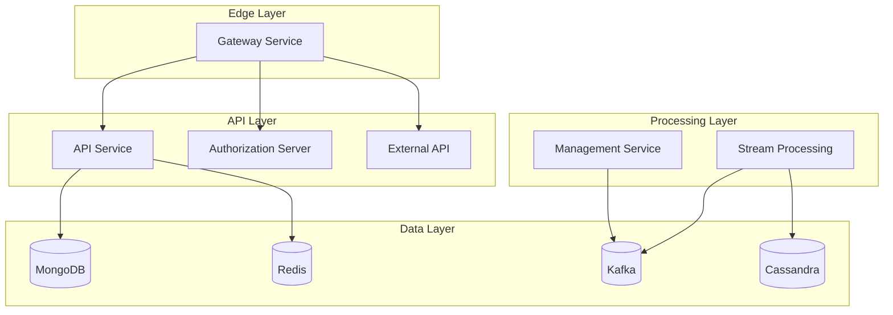

# Development Documentation

Welcome to the OpenFrame development documentation! This section provides comprehensive guides for developers who want to customize, extend, or contribute to the OpenFrame platform.

## Overview

OpenFrame is built with a modern, modular architecture that supports extensive customization and integration. Whether you're setting up a development environment, building custom integrations, or contributing to the core platform, this documentation will guide you through the process.

## Table of Contents

### Setup and Environment
- **[Environment Setup](setup/environment.md)** - Complete development environment configuration
- **[Local Development](setup/local-development.md)** - Running OpenFrame locally for development

### Architecture and Design
- **[Architecture Overview](architecture/overview.md)** - High-level system architecture and design patterns
- **[Service Communication](architecture/service-communication.md)** - Inter-service communication patterns
- **[Data Flow](architecture/data-flow.md)** - Understanding data flow through the system

### Development Workflows  
- **[Testing Overview](testing/overview.md)** - Testing strategies and running tests
- **[Contributing Guidelines](contributing/guidelines.md)** - Code standards and contribution process
- **[API Development](api/development.md)** - Building and extending APIs

## Technology Stack

OpenFrame is built with modern, enterprise-grade technologies:

### Backend Services
| Technology | Version | Purpose |
|------------|---------|---------|
| **Java** | 21 | Primary backend runtime |
| **Spring Boot** | 3.3.0 | Microservices framework |
| **Spring Cloud** | 2023.0.3 | Service coordination |
| **GraphQL** | Netflix DGS 7.0.0 | API query language |
| **OAuth2/OIDC** | Spring Security | Authentication & authorization |

### Data Layer
| Technology | Version | Purpose |
|------------|---------|---------|
| **MongoDB** | 7.0+ | Primary database |
| **Cassandra** | 4.0+ | Time-series data |
| **Redis** | 6.2+ | Caching & sessions |
| **Apache Kafka** | 3.6.0 | Event streaming |
| **Apache Pinot** | 1.2.0 | Analytics database |

### Frontend
| Technology | Version | Purpose |
|------------|---------|---------|
| **Vue 3** | 3.4+ | Frontend framework |
| **TypeScript** | 5.0+ | Type-safe JavaScript |
| **PrimeVue** | 3.45.0 | UI component library |
| **Vite** | 5.0.10 | Build tool |
| **Pinia** | 2.1+ | State management |

### Client Agent
| Technology | Version | Purpose |
|------------|---------|---------|
| **Rust** | 1.70+ | Cross-platform agent |
| **Tokio** | 1.35+ | Async runtime |
| **Serde** | 1.0+ | Serialization |

## Development Environment

### Minimum Requirements

| Component | Requirement |
|-----------|-------------|
| **OS** | Linux, macOS, or Windows |
| **CPU** | 4 cores (8 cores recommended) |
| **RAM** | 8 GB (16 GB recommended) |
| **Storage** | 50 GB free space |
| **Java** | OpenJDK 21+ |
| **Node.js** | 18+ |
| **Docker** | 20.10+ |

### Quick Setup

```bash
# Clone the repository
git clone https://github.com/flamingo-stack/openframe-oss-tenant.git
cd openframe-oss-tenant

# Install dependencies and start development environment
./scripts/dev-setup.sh

# Start all services
./scripts/run-local-dev.sh
```

## Key Concepts

### Microservices Architecture

OpenFrame follows a microservices pattern with these core services:



### Service Responsibilities

| Service | Primary Responsibility | Key Technologies |
|---------|----------------------|------------------|
| **Gateway** | Request routing, authentication proxy | Spring Cloud Gateway, JWT |
| **API** | Business logic, GraphQL endpoint | Netflix DGS, MongoDB |
| **Authorization** | OAuth2/OIDC identity provider | Spring Authorization Server |
| **Management** | System administration, scheduled tasks | Spring Boot, Kafka |
| **Stream Processing** | Real-time event processing | Kafka Streams, Cassandra |
| **External API** | Third-party tool integrations | REST clients, SDKs |

### Data Flow Patterns

1. **Request-Response**: Client → Gateway → API → Database
2. **Event-Driven**: Service → Kafka → Stream Processor → Analytics DB
3. **Real-time**: WebSocket → Gateway → Service → Client
4. **Batch Processing**: Scheduler → Management → External Tools

### Security Model

OpenFrame implements a comprehensive security model:

- **Authentication**: OAuth2/OIDC with multiple provider support
- **Authorization**: JWT tokens with role-based access control (RBAC)
- **Encryption**: AES-256 for sensitive data, TLS for transport
- **Multi-tenancy**: Tenant isolation at data and service levels

## Development Workflows

### Setting Up Your Environment

1. **Prerequisites**: Install required software ([Environment Setup](setup/environment.md))
2. **Clone Repository**: Get the latest source code
3. **Dependencies**: Install Java, Node.js, and Docker dependencies
4. **Configuration**: Set up local environment variables
5. **Services**: Start databases and external dependencies
6. **Build**: Compile and start OpenFrame services

### Making Changes

1. **Feature Branches**: Create feature branches from `main`
2. **Development**: Make changes with comprehensive testing
3. **Testing**: Run unit, integration, and e2e tests
4. **Code Review**: Submit pull requests for review
5. **Integration**: Merge after approval and CI/CD validation

### Testing Strategy

OpenFrame uses a multi-layered testing approach:

- **Unit Tests**: Individual component testing
- **Integration Tests**: Service-to-service interaction testing  
- **E2E Tests**: Full workflow testing
- **Performance Tests**: Load and stress testing
- **Security Tests**: Vulnerability and penetration testing

## Common Development Tasks

### Adding a New API Endpoint

1. **Define GraphQL Schema**: Add queries/mutations to schema files
2. **Create Data Fetcher**: Implement GraphQL data fetchers
3. **Add Business Logic**: Implement service layer logic
4. **Database Integration**: Add repository methods
5. **Write Tests**: Unit and integration tests
6. **Documentation**: Update API documentation

### Creating a New Service

1. **Service Template**: Use Spring Boot service template
2. **Configuration**: Add service-specific configuration
3. **Dependencies**: Configure shared library dependencies
4. **Service Registration**: Register with service discovery
5. **Monitoring**: Add health checks and metrics
6. **Deployment**: Create Kubernetes manifests

### Extending Frontend

1. **Component Development**: Create Vue 3 components
2. **State Management**: Integrate with Pinia stores
3. **API Integration**: Connect to GraphQL endpoints
4. **Styling**: Use PrimeVue design system
5. **Type Safety**: Ensure TypeScript compliance
6. **Testing**: Component and integration tests

## Best Practices

### Code Quality
- Follow established coding standards and conventions
- Write comprehensive tests for all new code
- Use type safety (TypeScript for frontend, Java for backend)
- Implement proper error handling and logging

### Security
- Never commit secrets or credentials
- Use environment variables for configuration
- Implement proper input validation
- Follow OWASP security guidelines

### Performance
- Optimize database queries and indexes
- Use caching appropriately (Redis)
- Implement proper pagination
- Monitor and profile performance regularly

### Documentation
- Document all public APIs
- Maintain up-to-date README files
- Include code comments for complex logic
- Update documentation with changes

## Resources

### Official Documentation
- [Architecture Overview](architecture/overview.md) - System design and patterns
- [API Reference](../reference/) - Complete API documentation
- [Testing Guide](testing/overview.md) - Testing strategies and tools

### External Resources
- [Spring Boot Documentation](https://docs.spring.io/spring-boot/docs/current/reference/htmlsingle/)
- [Vue 3 Documentation](https://vuejs.org/guide/)
- [GraphQL Documentation](https://graphql.org/learn/)
- [MongoDB Documentation](https://docs.mongodb.com/)

### Community
- [OpenMSP Slack](https://join.slack.com/t/openmsp/shared_invite/zt-36bl7mx0h-3~U2nFH6nqHqoTPXMaHEHA) - Developer discussions
- [GitHub Issues](https://github.com/flamingo-stack/openframe-oss-tenant/issues) - Bug reports and feature requests
- [Contributing Guidelines](contributing/guidelines.md) - How to contribute

## Getting Help

### Development Questions
- Check existing documentation first
- Search through GitHub issues
- Ask in the OpenMSP Slack #development channel
- Create detailed GitHub issues for bugs

### Feature Requests
- Discuss in community channels first
- Create GitHub issues with detailed requirements
- Consider contributing the feature yourself

### Bug Reports
- Provide detailed reproduction steps
- Include environment information
- Add relevant logs and error messages
- Test against the latest version

---

**Ready to start developing?** Begin with the [Environment Setup](setup/environment.md) guide to configure your development environment.