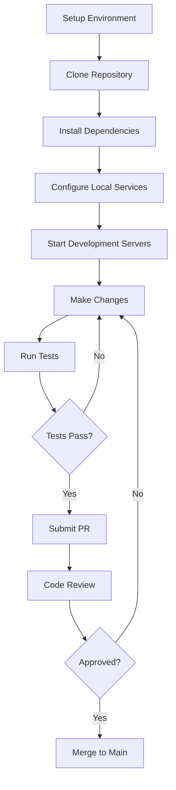
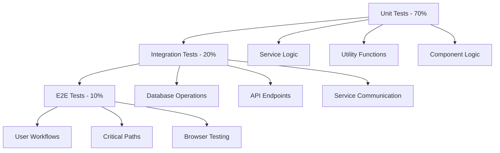

# Development Documentation

This section contains comprehensive documentation for developers working on the OpenFrame platform. Whether you're contributing to the open-source project, customizing the platform for your needs, or building integrations, these guides will help you get started.

## 🚀 Quick Navigation

### Setup Guides
- **[Environment Setup](./setup/environment.md)** - Configure your development environment with IDEs, tools, and extensions
- **[Local Development](./setup/local-development.md)** - Clone, build, and run OpenFrame locally with hot reload

### Architecture & Design
- **[Architecture Overview](./architecture/overview.md)** - High-level system architecture and component relationships
- **[Testing Overview](./testing/overview.md)** - Testing strategy, frameworks, and best practices

### Contributing
- **[Contributing Guidelines](./contributing/guidelines.md)** - Code standards, review process, and submission guidelines

## 📋 Development Workflow Overview



## 🛠 Technology Stack for Developers

### Backend Development
- **Languages**: Java 21, with modern features (records, sealed classes, pattern matching)
- **Frameworks**: Spring Boot 3.3.0, Spring Security, Spring Data
- **APIs**: GraphQL (Netflix DGS 7.0.0), REST with Spring Web
- **Testing**: JUnit 5, Mockito, TestContainers, Spring Boot Test
- **Build**: Maven 3.9+ with multi-module structure
- **Documentation**: Javadoc, OpenAPI/Swagger

### Frontend Development
- **Languages**: TypeScript 5.0+ with strict mode enabled
- **Framework**: Vue 3 with Composition API and `<script setup>`
- **UI Library**: PrimeVue 3.45.0 component library
- **State Management**: Pinia stores with TypeScript
- **GraphQL**: Apollo Client with code generation
- **Testing**: Vitest, Vue Testing Library
- **Build**: Vite 5.0.10 with HMR and TypeScript support

### System Agent Development
- **Language**: Rust 1.70+ with async/await
- **Runtime**: Tokio for async operations
- **HTTP Client**: reqwest for API communication
- **Error Handling**: anyhow and thiserror
- **Testing**: Built-in test framework with async support
- **Build**: Cargo with cross-compilation support

### Data & Infrastructure
- **Databases**: MongoDB 7.x, Apache Cassandra 4.x, Redis 7.x
- **Analytics**: Apache Pinot 1.2.0 for real-time analytics
- **Messaging**: Apache Kafka 3.6.0 for event streaming
- **Containers**: Docker 24.0+ and Docker Compose
- **Orchestration**: Kubernetes 1.28+ with Helm 3.12+

## 🏗 Project Structure for Developers

```
openframe-oss-tenant/
├── openframe/                          # Main Java project
│   ├── services/                       # Microservices
│   │   ├── openframe-api/              # GraphQL API service
│   │   │   ├── src/main/java/          # Java source code
│   │   │   ├── src/main/resources/     # Configuration files
│   │   │   └── src/test/java/          # Unit and integration tests
│   │   ├── openframe-gateway/          # API Gateway with routing
│   │   ├── openframe-management/       # Administrative service
│   │   ├── openframe-stream/           # Stream processing
│   │   ├── openframe-config/           # Configuration server
│   │   ├── openframe-client/           # Agent management
│   │   └── openframe-frontend/         # Vue.js frontend
│   │       ├── src/app/                # Vue components and pages
│   │       ├── src/lib/                # Shared utilities
│   │       ├── src/components/         # Reusable UI components
│   │       └── src/stores/             # Pinia state stores
│   └── libs/                           # Shared Java libraries
│       ├── openframe-core/             # Core utilities
│       ├── openframe-data/             # Data access layer
│       └── api-library/                # Common API services
├── clients/                            # Client applications
│   ├── openframe-client/               # Rust system agent
│   │   ├── src/                        # Rust source code
│   │   ├── Cargo.toml                  # Dependencies
│   │   └── tests/                      # Integration tests
│   └── openframe-chat/                 # Chat client (Tauri)
├── manifests/                          # Kubernetes manifests
│   └── helm/                          # Helm charts
├── integrated-tools/                   # Docker configs
├── scripts/                           # Development scripts
└── docs/                              # Documentation
```

## 🔧 Development Environment Types

### Minimal Development (Frontend Only)
Perfect for UI/UX development and frontend contributions:
- **Requirements**: Node.js 18+, npm/yarn
- **Services**: Frontend development server only
- **Backend**: Connect to staging/demo API
- **Use Case**: UI components, styling, frontend features

### Standard Development (Full Stack)
Complete local development with all services:
- **Requirements**: Java 21, Maven, Node.js, Docker
- **Services**: All OpenFrame services running locally  
- **Database**: Local containers (MongoDB, Redis, etc.)
- **Use Case**: Full-stack features, API development, integrations

### Distributed Development (Service Focus)
Develop specific services while using remote instances for others:
- **Requirements**: Depends on target service
- **Services**: Target service local, others remote
- **Database**: Shared development database
- **Use Case**: Service-specific features, performance optimization

## 📝 Code Standards Summary

### Java Code Standards
```java
// Use records for DTOs
public record UserResponse(String id, String name, String email) {}

// Use sealed classes for type safety
public sealed interface ApiResponse permits SuccessResponse, ErrorResponse {}

// Constructor injection
@Service
public class UserService {
    private final UserRepository userRepository;
    
    public UserService(UserRepository userRepository) {
        this.userRepository = userRepository;
    }
}
```

### TypeScript/Vue Standards
```typescript
// Use Composition API with script setup
<script setup lang="ts">
interface Props {
  readonly userId: string
  readonly editable?: boolean
}

const props = withDefaults(defineProps<Props>(), {
  editable: false
})

const userStore = useUserStore()
const { user, loading } = storeToRefs(userStore)
</script>
```

### Rust Standards
```rust
// Use proper error handling
use anyhow::{Context, Result};

pub async fn fetch_user_data(id: &str) -> Result<UserData> {
    let response = reqwest::get(&format!("/api/users/{}", id))
        .await
        .context("Failed to fetch user data")?;
        
    let user_data = response.json().await
        .context("Failed to parse user data")?;
        
    Ok(user_data)
}
```

## 🧪 Testing Strategy

### Test Pyramid Structure


### Testing Commands
```bash
# Backend tests
mvn test                                # All Java tests
mvn test -Dtest=UserServiceTest         # Specific test class
mvn verify                             # Integration tests

# Frontend tests  
cd openframe/services/openframe-frontend
npm run test                           # Unit tests
npm run test:e2e                       # End-to-end tests
npm run type-check                     # TypeScript validation

# Rust tests
cd clients/openframe-client
cargo test                             # All Rust tests
cargo test --package openframe-client  # Package-specific tests
```

## 📚 Essential Resources for New Developers

### Getting Started Checklist
- [ ] Read [Environment Setup](./setup/environment.md) guide
- [ ] Complete [Local Development](./setup/local-development.md) setup
- [ ] Review [Architecture Overview](./architecture/overview.md)
- [ ] Understand [Contributing Guidelines](./contributing/guidelines.md)
- [ ] Join the [OpenMSP Slack](https://join.slack.com/t/openmsp/shared_invite/zt-36bl7mx0h-3~U2nFH6nqHqoTPXMaHEHA) community

### Learning Resources
- **Spring Boot**: https://spring.io/guides
- **Vue 3**: https://vuejs.org/guide/
- **GraphQL DGS**: https://netflix.github.io/dgs/
- **PrimeVue**: https://primevue.org/
- **Rust Async**: https://rust-lang.github.io/async-book/
- **Tokio Runtime**: https://tokio.rs/tokio/tutorial

### OpenFrame-Specific Knowledge
- **Authentication Flow**: JWT with HTTP-only cookies
- **Data Access Patterns**: Repository pattern with Spring Data
- **Event Streaming**: Kafka-based messaging
- **Multi-tenancy**: Organization-based data isolation
- **AI Integration**: Mingo and Fae AI service integration

## 🔗 Development Tools Integration

### Recommended IDE Configuration

#### IntelliJ IDEA (Java Development)
```xml
<!-- .idea/runConfigurations/OpenFrame_API.xml -->
<configuration name="OpenFrame API" type="SpringBootApplicationConfigurationType">
  <module name="openframe-api" />
  <option name="SPRING_BOOT_MAIN_CLASS" value="com.openframe.api.ApiApplication" />
  <option name="ACTIVE_PROFILES" value="dev,local" />
</configuration>
```

#### VS Code (Frontend Development)
```json
// .vscode/settings.json
{
  "vue.server.hybridMode": true,
  "typescript.preferences.importModuleSpecifier": "relative",
  "editor.formatOnSave": true,
  "editor.defaultFormatter": "esbenp.prettier-vscode"
}
```

### Git Workflow
```bash
# Feature development workflow
git checkout -b feature/user-management
# ... make changes ...
git add .
git commit -m "feat: add user role management"
git push origin feature/user-management
# ... create pull request ...
```

## 🐛 Common Development Issues

### Port Conflicts
```bash
# Check what's using required ports
lsof -i :8080-8888

# Kill conflicting processes
sudo kill -9 <PID>
```

### Dependency Issues
```bash
# Clean Maven dependencies
mvn dependency:purge-local-repository

# Clean npm dependencies
rm -rf node_modules package-lock.json
npm install
```

### Database Connection Problems
```bash
# Restart database containers
docker-compose restart mongodb redis cassandra

# Check container logs
docker logs mongodb
```

## 🚀 Next Steps

Choose your development path:

1. **Frontend Developer**: Start with [Environment Setup](./setup/environment.md) → [Local Development](./setup/local-development.md)
2. **Backend Developer**: Review [Architecture Overview](./architecture/overview.md) → [Environment Setup](./setup/environment.md)  
3. **Full-Stack Developer**: Complete all guides in sequence
4. **Contributor**: Read [Contributing Guidelines](./contributing/guidelines.md) first

---

Happy coding! 🎉 Join our community in the [OpenMSP Slack](https://join.slack.com/t/openmsp/shared_invite/zt-36bl7mx0h-3~U2nFH6nqHqoTPXMaHEHA) for development discussions and support.