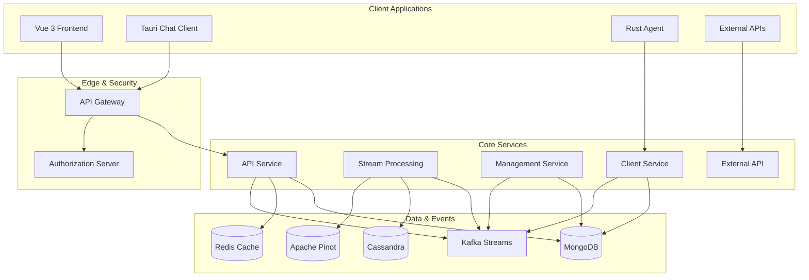

# Development Documentation

Welcome to the OpenFrame development documentation! This section provides comprehensive guides for developers who want to contribute to, extend, or customize OpenFrame.

## 📚 Documentation Structure

### 🚀 Getting Started
- **[Environment Setup](setup/environment.md)** - Configure your development environment
- **[Local Development](setup/local-development.md)** - Run OpenFrame locally for development

### 🏗️ Architecture & Design  
- **[Architecture Overview](architecture/README.md)** - High-level system architecture
- **[Security Best Practices](security/README.md)** - Security patterns and guidelines

### 🧪 Testing & Quality
- **[Testing Overview](testing/README.md)** - Test structure and practices
- **[Contributing Guidelines](contributing/guidelines.md)** - How to contribute to OpenFrame

## 🎯 Quick Navigation

### For New Contributors
1. **Start here**: [Environment Setup](setup/environment.md)
2. **Then**: [Local Development](setup/local-development.md)
3. **Finally**: [Contributing Guidelines](contributing/guidelines.md)

### For Architecture Understanding
1. **Overview**: [Architecture README](architecture/README.md)
2. **Security**: [Security Guidelines](security/README.md)
3. **Testing**: [Testing Overview](testing/README.md)

### For Advanced Development
- **Custom Integrations**: Building tool connectors
- **API Extensions**: Extending GraphQL schema
- **Frontend Customization**: Vue.js component development
- **Agent Development**: Rust client modifications

## 🛠️ Technology Stack

### Backend Services
- **Runtime**: Java 21 with Spring Boot 3.3.0
- **API Layer**: GraphQL (Netflix DGS), REST endpoints
- **Security**: OAuth2/OIDC, JWT with HTTP-only cookies
- **Data**: MongoDB, Cassandra, Redis, Apache Pinot
- **Messaging**: Apache Kafka 3.6.0 for event streaming
- **Processing**: Custom stream processing (not NiFi)

### Frontend Application
- **Framework**: Vue 3 with Composition API
- **Language**: TypeScript with strict type checking
- **UI Components**: PrimeVue 3.45.0 with custom design system
- **State Management**: Pinia for reactive state
- **API Client**: Apollo GraphQL with real-time subscriptions
- **Build Tool**: Vite 5.0.10 with hot module replacement

### Client Agent
- **Language**: Rust for cross-platform compatibility
- **GUI Framework**: Tauri (for desktop chat client)
- **Networking**: Secure encrypted communication
- **Distribution**: Self-updating agent system

### Infrastructure
- **Containerization**: Docker and Docker Compose
- **Orchestration**: Kubernetes 1.28+ with Helm charts
- **Service Mesh**: Istio 1.20 for traffic management
- **Monitoring**: Prometheus, Grafana, Loki stack
- **CI/CD**: GitHub Actions with automated testing

## 🏛️ Architecture Overview

OpenFrame follows a modular, event-driven microservices architecture:



### Key Architectural Principles

1. **Multi-Tenancy**: Complete isolation between organizations
2. **Event-Driven**: Kafka-based event streaming for real-time updates
3. **API-First**: GraphQL and REST APIs for all integrations
4. **Security-First**: OAuth2, OIDC, and encrypted communication
5. **Scalability**: Horizontal scaling with Kubernetes
6. **Observability**: Comprehensive monitoring and logging

## 🔧 Development Workflow

### Local Development Process

1. **Environment Setup** → Configure IDE and tools
2. **Repository Clone** → Get the latest source code  
3. **Dependency Installation** → Install all required dependencies
4. **Service Startup** → Run infrastructure and services
5. **Feature Development** → Make changes and test locally
6. **Testing** → Run unit and integration tests
7. **Pull Request** → Submit changes for review

### Code Organization

```text
openframe-oss-tenant/
├── openframe/                    # Main services
│   └── services/
│       ├── openframe-api/        # GraphQL API service
│       ├── openframe-gateway/    # API Gateway
│       ├── openframe-frontend/   # Vue 3 application
│       └── ...                   # Other services
├── clients/                      # Client applications
│   ├── openframe-client/         # Rust agent
│   └── openframe-chat/           # Tauri chat app
├── integrated-tools/             # Tool integrations
├── deps/                         # Dependency libraries
└── docs/                         # Documentation
```

## 📖 Documentation Standards

### Writing Guidelines

- **Clear Structure**: Use headings, lists, and tables effectively
- **Code Examples**: Provide working, copy-paste ready examples
- **Screenshots**: Include UI screenshots where helpful
- **Links**: Cross-reference related documentation
- **Updates**: Keep documentation current with code changes

### Markdown Standards

- Use proper heading hierarchy (H1 → H2 → H3)
- Include language hints for code blocks: ` ```bash `, ` ```typescript `
- Use tables for structured data comparison
- Include Mermaid diagrams for architecture and flows
- Embed relevant YouTube videos for complex topics

## 🤝 Contributing

### Ways to Contribute

- **Bug Reports**: Help us identify and fix issues
- **Feature Requests**: Suggest new capabilities
- **Code Contributions**: Submit pull requests
- **Documentation**: Improve guides and references
- **Testing**: Add test coverage and quality assurance
- **Community**: Help others in Slack and forums

### Development Prerequisites

Before contributing, ensure you have:
- ✅ Development environment set up
- ✅ Local instance running successfully  
- ✅ Understanding of the architecture
- ✅ Familiarity with our coding standards
- ✅ Agreement to our contribution guidelines

## 📋 Development Checklist

### Before Starting Development
- [ ] Read the [Architecture Overview](architecture/README.md)
- [ ] Complete [Environment Setup](setup/environment.md)
- [ ] Successfully run [Local Development](setup/local-development.md)
- [ ] Review [Contributing Guidelines](contributing/guidelines.md)

### During Development
- [ ] Follow coding standards and conventions
- [ ] Write comprehensive tests for new features
- [ ] Update documentation for user-facing changes
- [ ] Test changes across multiple browsers/platforms
- [ ] Verify security best practices

### Before Submitting PRs
- [ ] All tests pass locally
- [ ] Code follows style guidelines
- [ ] Documentation is updated
- [ ] Commit messages are clear and descriptive
- [ ] PR description explains changes and rationale

## 🎯 Focus Areas for Contribution

### High Priority
- **Tool Integrations**: Connecting new MSP tools
- **AI Enhancement**: Improving Mingo AI responses
- **Performance**: Database query optimization
- **Security**: Authentication and authorization improvements
- **Testing**: Increasing test coverage

### Medium Priority
- **UI/UX**: Frontend component improvements
- **API Extensions**: New GraphQL mutations and queries
- **Documentation**: Tutorial and guide improvements
- **Monitoring**: Enhanced observability features
- **Mobile**: Responsive design improvements

### Experimental
- **New Platforms**: Additional OS support
- **AI Models**: Alternative AI provider integrations
- **Deployment**: New orchestration platforms
- **Analytics**: Advanced reporting features
- **Automation**: Workflow and rule engines

## 🆘 Getting Help

### Community Support
- **[OpenMSP Slack](https://join.slack.com/t/openmsp/shared_invite/zt-36bl7mx0h-3~U2nFH6nqHqoTPXMaHEHA)**: Real-time developer chat
- **GitHub Discussions**: Long-form technical discussions  
- **GitHub Issues**: Bug reports and feature requests

### Documentation
- **API Reference**: GraphQL schema and REST endpoints
- **Architecture Docs**: Deep-dive technical specifications
- **Video Tutorials**: Step-by-step development guides

### Professional Services
- **Flamingo Stack**: Commercial support and consulting
- **Custom Development**: Enterprise feature development
- **Training**: Developer team education programs

---

**Ready to start developing?** Begin with the [Environment Setup Guide](setup/environment.md) and join our community of contributors building the future of AI-powered MSP platforms!