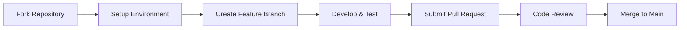

# Development Documentation

Welcome to the OpenFrame development documentation. This section provides comprehensive guides for developers who want to contribute to OpenFrame, build custom integrations, or deploy the platform in their own environments.

## Documentation Overview

The development documentation is organized into several key areas:

### 📚 Setup and Environment
- **[Environment Setup](setup/environment.md)** - IDE configuration, tools, and development workflow
- **[Local Development](setup/local-development.md)** - Running OpenFrame locally for development

### 🏗️ Architecture and Design  
- **[Architecture Overview](architecture/overview.md)** - High-level system design and component relationships
- **[Testing Strategy](testing/overview.md)** - Testing approaches, frameworks, and best practices

### 🤝 Contributing
- **[Contributing Guidelines](contributing/guidelines.md)** - Code style, PR process, and development standards

## Quick Navigation

### For New Contributors
Start here if you're new to OpenFrame development:

1. [Environment Setup](setup/environment.md) - Set up your development tools
2. [Local Development](setup/local-development.md) - Get OpenFrame running locally
3. [Architecture Overview](architecture/overview.md) - Understand the system design
4. [Contributing Guidelines](contributing/guidelines.md) - Learn our development process

### For Integration Developers
Building integrations with OpenFrame:

1. [Architecture Overview](architecture/overview.md) - Understand the platform structure
2. [API Documentation](../reference/) - Explore available APIs and services
3. [Local Development](setup/local-development.md) - Set up a test environment

### For Platform Operators
Deploying and managing OpenFrame:

1. [Local Development](setup/local-development.md) - Understand the deployment process
2. [Testing Overview](testing/overview.md) - Validation and quality assurance
3. [Architecture Overview](architecture/overview.md) - System design considerations

## Development Workflow

OpenFrame follows a modern development workflow with these key principles:

### 🔄 Development Process

### 🧪 Quality Assurance
- **Unit Testing**: Comprehensive unit test coverage for all components
- **Integration Testing**: End-to-end testing of service interactions
- **Performance Testing**: Benchmarking and resource usage validation
- **Security Testing**: Vulnerability scanning and security reviews

### 📦 Release Process
- **Semantic Versioning**: Following semver for predictable releases
- **Automated CI/CD**: GitHub Actions for build, test, and deployment
- **Documentation**: Comprehensive release notes and migration guides

## Technology Stack Overview

### Backend Technologies
| Component | Technology | Purpose |
|-----------|------------|---------|
| **Runtime** | Java 21, Spring Boot 3.3.0 | Core service framework |
| **API Layer** | GraphQL (Netflix DGS), REST | Data access and operations |
| **Security** | Spring Security, JWT, OAuth2 | Authentication and authorization |
| **Data Storage** | MongoDB, Cassandra, Redis | Persistent and ephemeral data |
| **Messaging** | Apache Kafka | Event streaming and processing |
| **Analytics** | Apache Pinot | Real-time analytics and filtering |

### Frontend Technologies
| Component | Technology | Purpose |
|-----------|------------|---------|
| **Framework** | Vue 3, TypeScript | Reactive user interface |
| **UI Components** | PrimeVue 3.45.0 | Component library |
| **State Management** | Pinia | Application state |
| **GraphQL Client** | Apollo Client | API data fetching |
| **Build System** | Vite 5.0.10 | Development and build tooling |

### Infrastructure
| Component | Technology | Purpose |
|-----------|------------|---------|
| **Containerization** | Docker, Docker Compose | Local development and deployment |
| **Orchestration** | Kubernetes, Helm | Production deployment |
| **Monitoring** | Prometheus, Grafana, Loki | Observability and alerting |
| **Service Mesh** | Istio | Traffic management and security |

## Development Environment Features

### 🔧 Developer Tools
- **Hot Reload**: Automatic service restart on code changes
- **Debug Support**: Full IDE debugging for Java services
- **API Testing**: GraphQL playground and REST API testing
- **Log Aggregation**: Centralized logging during development
- **Database Management**: GUI tools for data inspection

### 🔍 Code Quality Tools
- **Static Analysis**: SonarQube integration for code quality
- **Formatting**: Consistent code formatting with Prettier and Google Java Format
- **Linting**: ESLint for TypeScript/JavaScript, SpotBugs for Java
- **Pre-commit Hooks**: Automated formatting and basic validation

### 📊 Monitoring and Observability
- **Health Checks**: Service health endpoints for monitoring
- **Metrics**: Prometheus metrics for performance tracking
- **Distributed Tracing**: Request tracing across services
- **Error Tracking**: Centralized error collection and analysis

## Development Standards

### Code Style
- **Java**: Google Java Style Guide with automatic formatting
- **TypeScript**: Standard TypeScript conventions with ESLint
- **Documentation**: Comprehensive JavaDoc and TSDoc comments
- **Testing**: Minimum 80% code coverage requirement

### Git Workflow
- **Branch Strategy**: Feature branches with descriptive names
- **Commit Messages**: Conventional commit format for automated changelog
- **Pull Requests**: Required reviews and automated testing
- **Release Management**: Automated releases with semantic versioning

### Security Practices
- **Dependency Scanning**: Automated vulnerability detection
- **Secret Management**: No hardcoded secrets in source code
- **Authentication**: All services require proper authentication
- **Authorization**: Fine-grained access control throughout the platform

## Getting Help

### Community Resources
- **[OpenMSP Slack](https://join.slack.com/t/openmsp/shared_invite/zt-36bl7mx0h-3~U2nFH6nqHqoTPXMaHEHA)** - Active community chat
- **GitHub Discussions** - Design discussions and Q&A
- **GitHub Issues** - Bug reports and feature requests

### Development Support
- **Architecture Questions** - Discuss design decisions in GitHub Discussions
- **Bug Reports** - Use GitHub Issues with detailed reproduction steps
- **Feature Requests** - Propose new features through GitHub Issues
- **Security Issues** - Contact maintainers directly for security concerns

### Documentation Feedback
Help us improve this documentation:
- **Missing Information** - Open an issue describing what's needed
- **Clarity Issues** - Suggest improvements to existing content
- **Examples** - Contribute example code and tutorials
- **Translations** - Help translate documentation to other languages

## What's Next?

Choose your path based on your goals:

### 🎯 I want to contribute code
1. Start with [Environment Setup](setup/environment.md)
2. Follow [Local Development](setup/local-development.md)
3. Review [Contributing Guidelines](contributing/guidelines.md)

### 🏗️ I want to understand the architecture
1. Read [Architecture Overview](architecture/overview.md)
2. Explore the [Testing Overview](testing/overview.md)
3. Browse the API reference documentation

### 🚀 I want to deploy OpenFrame
1. Complete [Local Development](setup/local-development.md)
2. Review production deployment guides
3. Understand monitoring and maintenance procedures

---

Ready to start developing? Choose your next step from the navigation above, or join our community to connect with other developers working on OpenFrame.