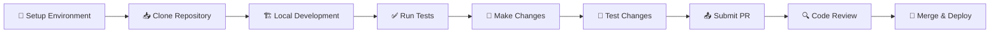

# Development Documentation

Welcome to the OpenFrame development documentation. This section provides comprehensive guides for developers who want to contribute to, extend, or customize OpenFrame.

## Overview

OpenFrame is built with modern technologies and follows industry best practices for microservices architecture, security, and scalability. Whether you're fixing a bug, adding a feature, or building custom integrations, this documentation will guide you through the development process.

## Quick Navigation

### Getting Started
- **[Environment Setup](setup/environment.md)** - IDE configuration and development tools
- **[Local Development](setup/local-development.md)** - Running OpenFrame for development
- **[Architecture Overview](architecture/overview.md)** - Understanding the system design

### Testing and Quality
- **[Testing Overview](testing/overview.md)** - Test structure and best practices
- **[Contributing Guidelines](contributing/guidelines.md)** - Code style and contribution process

## Technology Stack

### Backend (Java/Spring)
- **Framework**: Spring Boot 3.3.0, Spring Cloud 2023.0.3
- **API**: GraphQL (Netflix DGS 7.0.0), RESTful services
- **Security**: JWT, OAuth2, Spring Security
- **Data**: MongoDB, Redis, Cassandra, Apache Kafka
- **Build**: Maven 3.9+, Java 21

### Frontend (React/TypeScript)
- **Framework**: React 19, Next.js 16
- **Language**: TypeScript 5.8+
- **UI**: Custom components, Tailwind CSS
- **State**: Zustand, Apollo Client
- **Build**: Vite, Turbo

### Client Agent (Rust)
- **Language**: Rust (latest stable)
- **Build**: Cargo
- **Cross-platform**: Windows, macOS, Linux

## Development Workflow



## Key Development Concepts

### Microservices Architecture

OpenFrame follows a microservices pattern with clear service boundaries:

| Service | Purpose | Technology |
|---------|---------|------------|
| **Gateway** | API routing, authentication, security | Spring Cloud Gateway |
| **API** | GraphQL/REST APIs, business logic | Spring Boot + Netflix DGS |
| **Authorization** | OAuth2/OIDC, user management | Spring Authorization Server |
| **Management** | Admin tasks, scheduling, monitoring | Spring Boot |
| **Stream** | Event processing, data enrichment | Spring Boot + Kafka |
| **Client** | Agent management, device communication | Spring Boot |

### Multi-Tenant Security

Every component in OpenFrame is designed with multi-tenancy in mind:

- **Tenant Isolation**: Data, caching, and messaging are tenant-aware
- **JWT Context**: Tenant information embedded in JWT tokens
- **Database Partitioning**: MongoDB collections include tenant identifiers
- **Cache Isolation**: Redis keys are tenant-prefixed

### Event-Driven Architecture

OpenFrame uses Apache Kafka for event streaming:

- **Device Events**: Agent connectivity, status changes
- **Audit Events**: User actions, security events
- **Integration Events**: External tool synchronization
- **Processing Events**: Data enrichment and transformation

## Common Development Tasks

### Adding a New API Endpoint

1. Define GraphQL schema in `openframe-api-service-core`
2. Create data fetcher implementation
3. Add service layer logic
4. Write unit and integration tests
5. Update documentation

### Extending Frontend Components

1. Create component in `openframe-frontend/src/components`
2. Implement TypeScript interfaces
3. Add Storybook stories (if applicable)
4. Write unit tests with React Testing Library
5. Update relevant pages/views

### Integrating External Tools

1. Create SDK in `openframe-oss-lib/sdk/[tool-name]`
2. Implement service adapter in appropriate core module
3. Add configuration properties
4. Create event handlers and processors
5. Write comprehensive tests

### Adding Database Entities

1. Define document model in `openframe-data-mongo`
2. Create repository interfaces
3. Add service layer abstractions
4. Implement MongoDB indexes
5. Write migration scripts (if needed)

## Development Environment Features

### Hot Reloading
- **Frontend**: Automatic browser refresh on file changes
- **Backend**: Spring Boot DevTools for Java hot swapping
- **Configuration**: Spring Cloud Config for dynamic configuration

### Debugging
- **Java Services**: Remote debugging support on port 5005
- **Frontend**: Browser DevTools integration
- **Agent**: Rust debugging with `cargo run`

### Testing
- **Unit Tests**: JUnit 5 for Java, Jest for TypeScript
- **Integration Tests**: TestContainers for full stack testing
- **E2E Tests**: Playwright for end-to-end workflows

## Code Organization

```text
openframe-oss-tenant/
├── openframe/
│   ├── services/           # Deployable applications
│   │   ├── openframe-api/
│   │   ├── openframe-gateway/
│   │   └── ...
│   └── libs/              # Shared libraries
│       ├── openframe-core/
│       ├── openframe-data/
│       └── ...
├── clients/               # Client applications
│   ├── openframe-client/  # Rust agent
│   └── openframe-chat/    # Desktop chat client
├── integrated-tools/      # Docker configurations
├── manifests/            # Kubernetes deployments
└── scripts/              # Development scripts
```

## Best Practices

### Code Quality
- Follow established style guides (Checkstyle for Java, ESLint for TypeScript)
- Write meaningful commit messages
- Include comprehensive tests with new features
- Document public APIs and complex logic

### Security
- Never commit secrets or credentials
- Use environment variables for configuration
- Implement proper input validation
- Follow OWASP security guidelines

### Performance
- Optimize database queries with proper indexing
- Implement caching where appropriate
- Use async processing for heavy operations
- Monitor and profile application performance

## Development Resources

### External Tools and Services
- **OpenFrame CLI**: [https://github.com/flamingo-stack/openframe-cli](https://github.com/flamingo-stack/openframe-cli)
- **Docker Hub**: Pre-built images for development
- **Maven Central**: Java dependencies and libraries

### Documentation and Support
- **OpenMSP Slack**: [https://join.slack.com/t/openmsp/shared_invite/zt-36bl7mx0h-3~U2nFH6nqHqoTPXMaHEHA](https://join.slack.com/t/openmsp/shared_invite/zt-36bl7mx0h-3~U2nFH6nqHqoTPXMaHEHA)
- **API Reference**: GraphQL Playground at http://localhost:8080/graphiql
- **Architecture Docs**: In-depth technical documentation in this repository

## Getting Started

Ready to start developing? Follow these guides in order:

1. **[Environment Setup](setup/environment.md)** - Configure your development environment
2. **[Local Development](setup/local-development.md)** - Run OpenFrame locally
3. **[Architecture Overview](architecture/overview.md)** - Understand the system design
4. **[Testing Overview](testing/overview.md)** - Learn about testing practices
5. **[Contributing Guidelines](contributing/guidelines.md)** - Submit your first contribution

## Need Help?

The OpenFrame development community is active and welcoming:

- 💬 **Technical Questions**: Ask in #development channel on OpenMSP Slack
- 🐛 **Bug Reports**: Discuss in #bug-reports on OpenMSP Slack
- 💡 **Feature Requests**: Share ideas in #feature-requests on OpenMSP Slack
- 📖 **Documentation Issues**: Report in #documentation on OpenMSP Slack

Remember: We use the OpenMSP Slack community for all development coordination, not GitHub Issues or Discussions.