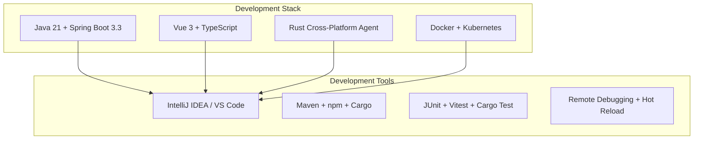
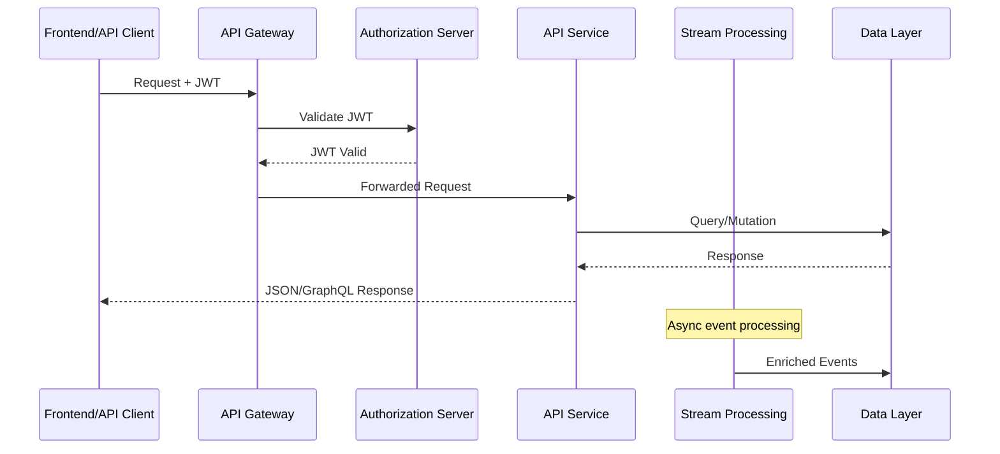

# Development Documentation

Welcome to the OpenFrame development documentation! This section provides comprehensive guides for developers working with the OpenFrame platform, from initial setup to advanced customization and contribution.

## Quick Navigation

### 🚀 Getting Started
- **[Environment Setup](setup/environment.md)** - Complete development environment configuration
- **[Local Development](setup/local-development.md)** - Running and debugging OpenFrame locally

### 🏗️ Architecture & Design
- **[System Architecture](architecture/overview.md)** - High-level system design and component relationships
- **[Security Model](security/overview.md)** - Authentication, authorization, and security best practices

### 🧪 Testing & Quality
- **[Testing Overview](testing/overview.md)** - Testing strategies, frameworks, and best practices

### 🤝 Contributing
- **[Contributing Guidelines](contributing/guidelines.md)** - Code standards, PR process, and community guidelines

## Development Overview

OpenFrame is built as a distributed microservices platform with modern development practices:



## Key Technologies

### Backend Services (Java)
- **Java 21** - Latest LTS with modern language features
- **Spring Boot 3.3.0** - Production-ready application framework
- **Spring Cloud 2023.0.3** - Distributed systems patterns
- **Netflix DGS 7.0.0** - GraphQL implementation
- **MongoDB** - Primary data persistence
- **Apache Kafka** - Event streaming and processing
- **Redis** - Caching and session management

### Frontend Applications
- **Vue 3 + Composition API** - Reactive user interfaces
- **TypeScript** - Type-safe JavaScript development
- **PrimeVue** - Enterprise-grade UI components
- **Pinia** - State management
- **Apollo Client** - GraphQL client
- **Vite** - Fast build tooling

### Client Agent (Rust)
- **Tokio** - Async runtime for I/O operations
- **Serde** - Serialization framework
- **Reqwest** - HTTP client
- **Tauri** - Desktop application framework (for chat client)

### Infrastructure
- **Docker & Docker Compose** - Containerization
- **Kubernetes + Helm** - Orchestration
- **Istio** - Service mesh
- **Prometheus + Grafana** - Monitoring

## Development Principles

### Code Quality Standards
- **Type Safety**: Leverage TypeScript, Java generics, and Rust's type system
- **Testing**: Comprehensive unit, integration, and E2E test coverage
- **Documentation**: Clear, up-to-date documentation for all public APIs
- **Security**: Security-first design with proper authentication and authorization

### Architecture Patterns
- **Microservices**: Loosely coupled, independently deployable services
- **Event-Driven**: Kafka-based event streaming for service communication  
- **API-First**: GraphQL and REST APIs as primary service interfaces
- **Multi-Tenant**: Secure isolation between different organizations

### Development Workflow
- **Git Flow**: Feature branches with pull request reviews
- **CI/CD**: Automated testing and deployment pipelines
- **Code Review**: Mandatory peer review for all changes
- **Documentation**: Update documentation with code changes

## Development Environment

### Recommended IDE Setup
- **IntelliJ IDEA Ultimate** (Java/Kotlin)
- **Visual Studio Code** (TypeScript/Frontend)
- **VS Code + Rust Analyzer** (Rust development)

### Essential Extensions
```text
VS Code Extensions:
- Vue Language Features (Volar)  
- TypeScript Vue Plugin (Volar)
- Rust Analyzer
- GraphQL: Language Feature Support
- Docker
- Kubernetes

IntelliJ Plugins:
- Lombok
- GraphQL
- Docker
- Kubernetes
```

## Service Architecture

OpenFrame consists of these primary services:

| Service | Technology | Port | Purpose |
|---------|------------|------|---------|
| **openframe-gateway** | Spring WebFlux | 8081 | API Gateway & Authentication |
| **openframe-api** | Spring Boot + DGS | 8080 | Main GraphQL/REST API |
| **openframe-authorization-server** | Spring Authorization Server | 8082 | OAuth2/OIDC Provider |
| **openframe-management** | Spring Boot | 8083 | System Management |
| **openframe-stream** | Spring Boot + Kafka | 8084 | Event Processing |
| **openframe-client** | Spring Boot | 8085 | Agent Management |
| **openframe-external-api** | Spring Boot | 8086 | External Integrations |
| **openframe-config** | Spring Cloud Config | 8888 | Configuration Server |
| **openframe-frontend** | Vue 3 + Vite | 3000 | Web Interface |

### Data Flow Architecture



## Development Workflows

### Feature Development
1. **Create feature branch** from `main`
2. **Implement changes** with tests
3. **Run local testing** suite
4. **Create pull request** with description
5. **Code review** and approval
6. **Merge to main** after CI passes

### Bug Fixes
1. **Identify issue** through logs/monitoring
2. **Create bug report** with reproduction steps  
3. **Implement fix** with regression tests
4. **Test fix** in development environment
5. **Deploy fix** through normal release process

### Testing Strategy
- **Unit Tests**: Test individual components and services
- **Integration Tests**: Test service interactions
- **E2E Tests**: Test complete user workflows
- **Performance Tests**: Validate system performance under load

## Getting Support

### Community Resources
- **[OpenMSP Slack](https://join.slack.com/t/openmsp/shared_invite/zt-36bl7mx0h-3~U2nFH6nqHqoTPXMaHEHA)** - Active developer community
- **GitHub Discussions** - Managed through Slack community
- **Documentation** - Comprehensive guides and API references

### Development Channels
- **#dev-general** - General development discussions
- **#dev-backend** - Java/Spring Boot development
- **#dev-frontend** - Vue.js/TypeScript development  
- **#dev-infrastructure** - Docker/Kubernetes/DevOps
- **#dev-questions** - Get help with development issues

## Next Steps

### For New Contributors
1. **Start with** [Environment Setup](setup/environment.md) to configure your development environment
2. **Review** [Architecture Overview](architecture/overview.md) to understand the system design
3. **Check out** [Contributing Guidelines](contributing/guidelines.md) for contribution workflow
4. **Join** the community Slack for questions and collaboration

### For Experienced Developers
1. **Deep dive** into [Security Overview](security/overview.md) for security patterns
2. **Explore** [Testing Overview](testing/overview.md) for quality assurance practices
3. **Review** service-specific documentation in the `docs/architecture/` directory
4. **Contribute** improvements and new features through pull requests

### For System Integrators
1. **Understand** the API structure through GraphQL playground
2. **Review** external API documentation
3. **Study** integration patterns for MSP tools
4. **Build** custom connectors and extensions

## Documentation Structure

This development section is organized as follows:

```text
development/
├── README.md                    # This overview document
├── setup/                       # Development environment setup
│   ├── environment.md          # IDE, tools, and configuration
│   └── local-development.md    # Running and debugging locally
├── architecture/                # System design and architecture  
│   └── overview.md             # High-level architecture guide
├── security/                    # Security implementation details
│   └── overview.md             # Authentication, authorization, encryption
├── testing/                     # Testing strategies and practices
│   └── overview.md             # Testing overview and guidelines
└── contributing/                # Contribution guidelines
    └── guidelines.md           # Code standards and PR process
```

Each section provides detailed, hands-on guidance for working with OpenFrame's codebase and contributing to the project.

Welcome to the OpenFrame developer community! 🚀