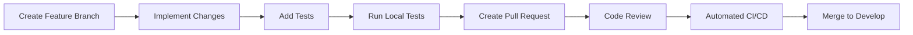
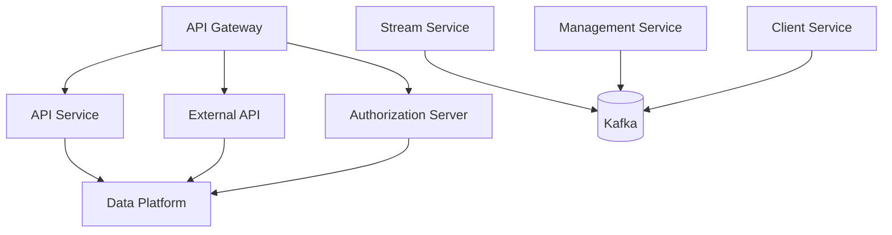

# Development Documentation

Welcome to the OpenFrame development guide! This section provides comprehensive documentation for developers working on or extending the OpenFrame platform.

## Overview

OpenFrame is built as a modern microservices platform with a focus on:

- **Modularity**: Core business logic separated from deployment concerns
- **Scalability**: Horizontal scaling through independent services
- **Maintainability**: Clean architecture with clear separation of concerns
- **Extensibility**: Plugin architecture for MSP tool integrations

## Development Section Structure

This development guide is organized into key areas:

### 🛠️ Setup & Environment

| Guide | Description |
|-------|-------------|
| **[Environment Setup](setup/environment.md)** | IDE setup, tools, and development configuration |
| **[Local Development](setup/local-development.md)** | Running OpenFrame locally for development |

### 🏗️ Architecture & Design

| Guide | Description |
|-------|-------------|
| **[Architecture Overview](architecture/overview.md)** | High-level architecture, service interaction, data flow |

### 🧪 Testing & Quality

| Guide | Description |
|-------|-------------|
| **[Testing Overview](testing/overview.md)** | Test structure, running tests, writing new tests |

### 🤝 Contributing

| Guide | Description |
|-------|-------------|
| **[Contributing Guidelines](contributing/guidelines.md)** | Code style, PR process, development workflow |

## Technology Stack

### Backend (Java/Spring)

- **Language**: Java 21 with Spring Boot 3.3.0
- **Framework**: Spring Cloud microservices architecture
- **API**: GraphQL with Netflix DGS framework
- **Security**: JWT authentication with Spring Security
- **Data**: MongoDB, Cassandra, Apache Pinot for analytics
- **Messaging**: Apache Kafka for event streaming
- **Caching**: Redis for session management and caching

### Frontend (Vue.js/TypeScript)

- **Framework**: Vue 3 with Composition API and TypeScript
- **UI Components**: PrimeVue 3.45.0 design system
- **State Management**: Pinia for reactive state
- **Data Fetching**: Apollo Client for GraphQL
- **Build Tools**: Vite 5.0.10 for fast development builds

### Client Agent (Rust)

- **Language**: Rust for cross-platform system monitoring
- **Architecture**: Event-driven async runtime with Tokio
- **Communication**: NATS messaging and HTTP APIs
- **Security**: Mutual TLS and token-based authentication

## Quick Start for Developers

```bash
# 1. Clone and setup
git clone https://github.com/flamingo-stack/openframe-oss-tenant.git
cd openframe-oss-tenant

# 2. Install development dependencies
make dev-setup  # Installs Java, Node.js, Rust tools

# 3. Start development services
make dev-up     # Starts databases and infrastructure

# 4. Build and run in development mode
make dev        # Starts all services with hot reload
```

## Development Workflow

### 1. Branch Strategy

```text
main                 ← Stable release branch
  ├── develop       ← Integration branch for features
  ├── feature/*     ← Feature development branches
  ├── bugfix/*      ← Bug fix branches
  └── release/*     ← Release preparation branches
```

### 2. Development Process



### 3. Code Quality Gates

All code changes must pass:

- ✅ **Unit Tests**: `mvn test` (Java) and `npm test` (Frontend)
- ✅ **Integration Tests**: Full service interaction testing
- ✅ **Static Analysis**: SonarQube quality checks
- ✅ **Security Scans**: OWASP dependency and code scanning
- ✅ **Code Review**: Peer review by core maintainers

## Key Development Patterns

### Microservices Communication



### Data Flow Architecture

1. **Request Flow**: Client → Gateway → Service → Data Platform
2. **Event Flow**: Service → Kafka → Stream Processing → Analytics
3. **Real-time**: WebSocket → Gateway → Service → Live Updates

### Security Patterns

- **Authentication**: JWT tokens with HTTP-only cookies
- **Authorization**: Role-based access control (RBAC)
- **API Security**: Rate limiting, input validation, CORS
- **Service Communication**: Mutual TLS between services

## Environment Configuration

### Development Environment Variables

Create a `.env.development` file:

```bash
# Application Configuration
PROFILE=development
LOG_LEVEL=DEBUG

# Database URLs
MONGODB_URI=mongodb://localhost:27017/openframe_dev
CASSANDRA_HOSTS=localhost
KAFKA_BOOTSTRAP_SERVERS=localhost:9092
REDIS_URL=redis://localhost:6379

# Security Configuration
JWT_SECRET=development-jwt-secret-key
ENCRYPTION_KEY=development-encryption-key

# External Tool Configuration
TACTICAL_RMM_URL=http://localhost:8000
MESHCENTRAL_URL=http://localhost:4430
FLEET_URL=http://localhost:8412

# Development Flags
ENABLE_DEBUG_LOGGING=true
DISABLE_CSRF=true
MOCK_EXTERNAL_APIS=true
```

### Service Ports (Development)

| Service | Port | Purpose |
|---------|------|---------|
| Gateway | 8080 | Main entry point |
| API Service | 8081 | Internal GraphQL API |
| Authorization Server | 8082 | OAuth/OIDC flows |
| External API | 8083 | Partner/public API |
| Client Service | 8084 | Agent management |
| Stream Service | 8085 | Event processing |
| Management Service | 8086 | Admin operations |
| Config Server | 8888 | Configuration management |
| Frontend Dev Server | 3000 | Vue.js development |

## Debugging & Development Tools

### Java Services

```bash
# Run service with debugging enabled
mvn spring-boot:run -Dspring-boot.run.jvmArguments="-Xdebug -Xrunjdwp:transport=dt_socket,server=y,suspend=n,address=5005"

# Or use IDE debug configuration
# IntelliJ: Run/Debug Configurations → Spring Boot
# VSCode: Java Debug Configuration
```

### Frontend Development

```bash
# Start with hot module replacement
cd openframe/services/openframe-frontend
npm run dev

# TypeScript checking
npm run type-check

# Component testing
npm run test:unit
```

### Database Management

```bash
# MongoDB shell
mongosh mongodb://localhost:27017/openframe_dev

# Redis CLI
redis-cli -h localhost -p 6379

# Kafka topics
kafka-topics --bootstrap-server localhost:9092 --list
```

## API Documentation

### GraphQL Schema

OpenFrame uses GraphQL for the primary API. The schema is auto-generated from Java annotations:

```bash
# Generate schema documentation
mvn compile
# Schema available at: target/generated-sources/dgs/schema.graphql

# GraphQL Playground (development)
# http://localhost:8081/graphql
```

### REST Endpoints

External API provides RESTful endpoints for partner integrations:

```bash
# API documentation (OpenAPI/Swagger)
# http://localhost:8083/swagger-ui.html

# Example REST calls
curl -H "Authorization: Bearer YOUR_API_KEY" \
     http://localhost:8083/api/v1/devices
```

## Common Development Tasks

### Adding a New Service

1. Create new Spring Boot module in `openframe/services/`
2. Add service entrypoint with `@SpringBootApplication`
3. Configure service discovery and dependencies
4. Add service to Docker Compose and scripts
5. Update gateway routing configuration

### Adding a New Integration

1. Create tool SDK in `openframe-oss-lib/sdk/`
2. Implement data models and API client
3. Add integration configuration to Management Service
4. Create UI components for tool management
5. Add test coverage for integration flows

### Database Schema Changes

1. Update MongoDB document models in `openframe-data-mongo`
2. Create migration scripts for existing data
3. Update GraphQL schema definitions
4. Test backwards compatibility
5. Document schema changes in release notes

## Performance & Monitoring

### Local Performance Testing

```bash
# JMeter load testing
jmeter -n -t test-plans/api-load-test.jmx

# Database performance
mongoperf < perf-test.json

# Memory profiling
java -XX:+FlightRecorder -XX:StartFlightRecording=duration=60s myapp.jar
```

### Monitoring Setup

Development monitoring stack:

- **Metrics**: Micrometer + Prometheus
- **Tracing**: Spring Cloud Sleuth + Zipkin  
- **Logging**: Logback + ELK Stack
- **Health Checks**: Spring Actuator endpoints

## Getting Help

### Documentation Resources

- **Architecture Docs**: Detailed service and component documentation
- **API Reference**: GraphQL schema and REST endpoint documentation
- **Code Examples**: Sample integrations and usage patterns

### Community Support

- **OpenMSP Slack**: Development discussions and Q&A
- **GitHub Issues**: Bug reports and feature requests
- **Code Reviews**: Collaborative development feedback

### Office Hours

Core maintainers host weekly office hours for development questions:

- **When**: Fridays 2-3 PM EST
- **Where**: OpenMSP Slack #office-hours channel
- **Topics**: Architecture questions, code reviews, feature planning

---

Ready to start developing? Choose your path:

- **New to OpenFrame?** → Start with [Environment Setup](setup/environment.md)
- **Ready to code?** → Jump to [Local Development](setup/local-development.md)
- **Want to understand the architecture?** → Read [Architecture Overview](architecture/overview.md)

Happy coding! 🚀