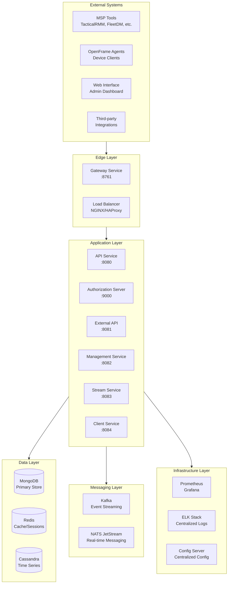
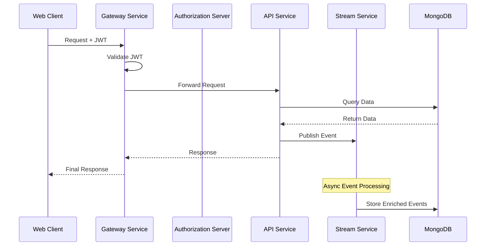
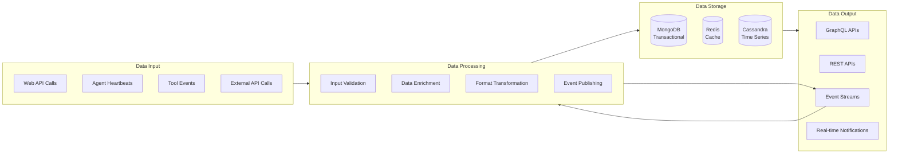
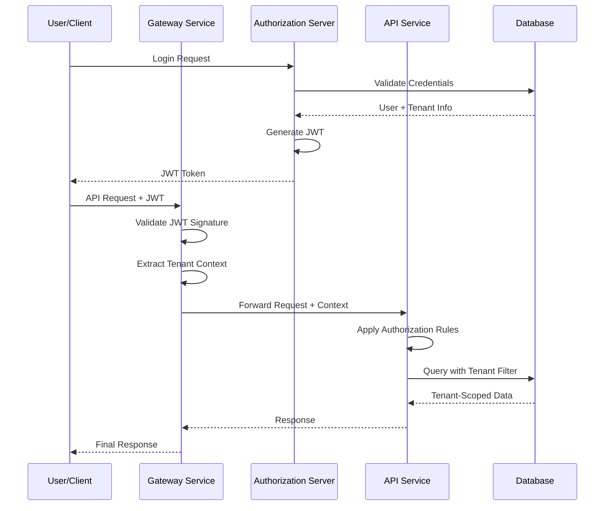
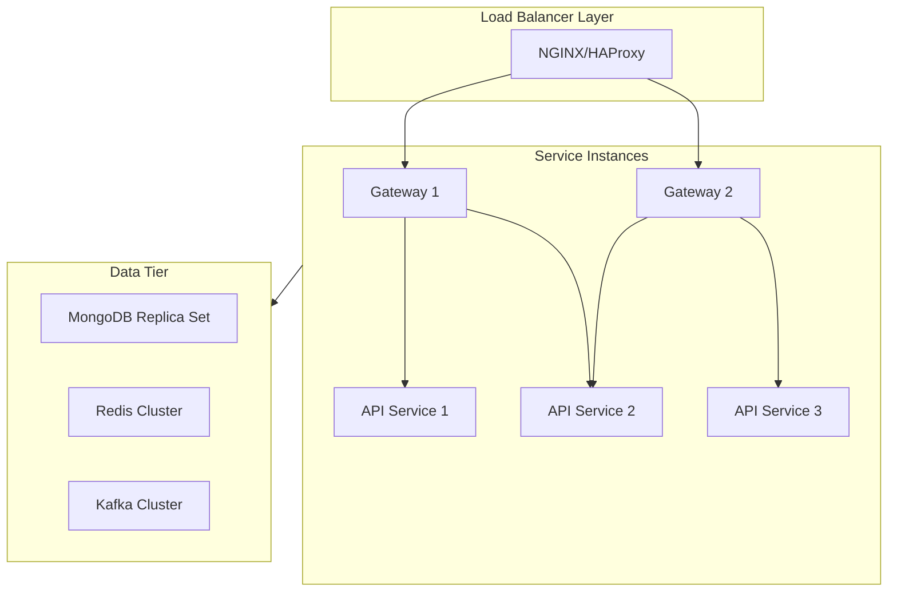
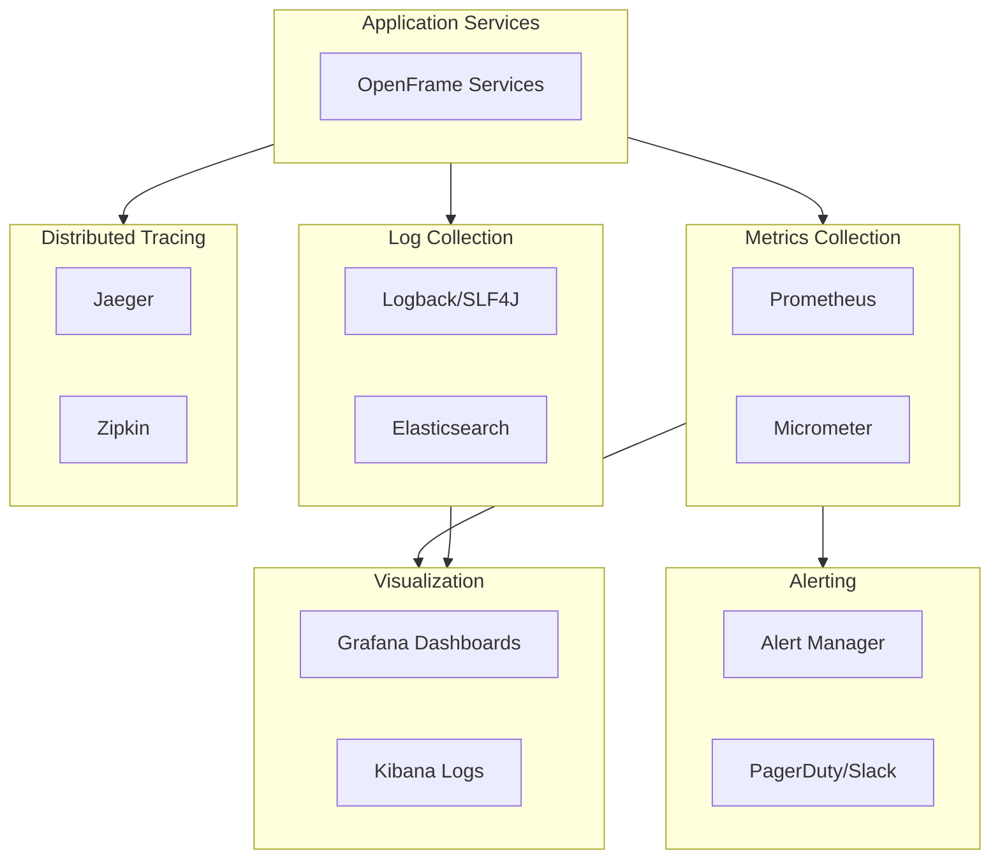

# Architecture Overview

This document provides a comprehensive overview of the OpenFrame OSS Tenant architecture, covering the high-level design, service interactions, data flows, and key architectural decisions that shape the platform.

## Architectural Philosophy

OpenFrame OSS Tenant is built on several core architectural principles:

### 1. Multi-Tenant First Design
Every component is designed with multi-tenancy as a primary concern:
- **Complete data isolation** between tenants
- **Tenant-aware security contexts** throughout the stack
- **Per-tenant configuration** and customization capabilities
- **Scalable tenant onboarding** and management

### 2. Event-Driven Architecture
The system uses events as the primary communication mechanism:
- **Asynchronous processing** for better performance and reliability
- **Event sourcing patterns** for audit trails and data lineage
- **Loosely coupled services** that communicate through well-defined events
- **Real-time capabilities** through event streaming

### 3. Domain-Driven Design (DDD)
Clear domain boundaries and service responsibilities:
- **Bounded contexts** for different business domains
- **Domain services** that encapsulate business logic
- **Anti-corruption layers** between domains
- **Ubiquitous language** across the development team

### 4. Security by Design
Security is integrated at every architectural layer:
- **Zero-trust networking** with service-to-service authentication
- **Defense in depth** with multiple security layers
- **Principle of least privilege** in service access patterns
- **Encrypted data flows** and secure storage

## High-Level System Architecture

The OpenFrame platform consists of multiple layers working together to provide a comprehensive MSP solution:



## Service Architecture Details

### Core Service Responsibilities

OpenFrame is composed of several microservices, each with specific responsibilities:

| Service | Port | Primary Responsibility | Key Technologies |
|---------|------|----------------------|------------------|
| **Gateway Service** | 8761 | Edge routing, authentication, CORS | Spring Cloud Gateway |
| **Authorization Server** | 9000 | OAuth2/OIDC, tenant authentication | Spring Authorization Server |
| **API Service** | 8080 | Internal GraphQL/REST APIs | Spring Boot, Netflix DGS |
| **External API Service** | 8081 | Public REST APIs | Spring Boot, OpenAPI |
| **Client Service** | 8084 | Agent management, registration | Spring Boot, NATS |
| **Stream Service** | 8083 | Event processing, enrichment | Spring Boot, Kafka Streams |
| **Management Service** | 8082 | Operations, scheduling, tools | Spring Boot, ShedLock |

### Service Interaction Patterns



## Data Architecture

### Database Strategy

OpenFrame uses a polyglot persistence approach, choosing the right database for each use case:

#### MongoDB (Primary Database)
**Purpose**: Transactional data, user management, configuration
**Collections**:
- `tenants` - Tenant information and settings
- `users` - User accounts and profiles
- `organizations` - Customer organizations
- `devices` - Managed devices and machines
- `tools` - Integrated MSP tools configuration
- `api_keys` - API access credentials

**Schema Design Principles**:
- Document-oriented with embedded subdocuments for related data
- Tenant ID included in all documents for isolation
- Optimistic concurrency control with version fields
- Rich querying with compound indexes

#### Redis (Cache & Sessions)
**Purpose**: High-performance caching, session storage, rate limiting
**Usage Patterns**:
- Session storage: `session:{sessionId}`
- API rate limiting: `rate_limit:{tenantId}:{userId}`
- Cache: `cache:{service}:{key}`
- Real-time counters: `counter:{type}:{id}`

#### Cassandra (Time-Series Data)
**Purpose**: Log storage, metrics, audit trails
**Tables**:
- `unified_log_events` - Normalized log events from all tools
- `device_metrics` - Time-series device performance data
- `audit_trail` - System audit events

### Data Flow Architecture



## Security Architecture

### Multi-Layered Security Model

OpenFrame implements security at multiple levels:

#### 1. Edge Security (Gateway Layer)
- **JWT Token Validation**: All requests validated at the edge
- **CORS Policy Enforcement**: Cross-origin request security
- **Rate Limiting**: Per-tenant and per-user rate limits
- **Request Sanitization**: Input validation and sanitization

#### 2. Service-Level Security
- **OAuth2 Resource Server**: Each service validates tokens independently
- **Method-Level Security**: `@PreAuthorize` annotations on sensitive operations
- **Service-to-Service Authentication**: Internal service communication secured

#### 3. Data Security
- **Tenant Isolation**: Database-level tenant separation
- **Encrypted Sensitive Data**: PII and credentials encrypted at rest
- **Audit Logging**: All data access logged for compliance

### Authentication & Authorization Flow



### Tenant Isolation Strategy

```mermaid
flowchart TD
    subgraph TenantA[Tenant A Context]
        UserA[User A]
        DataA[Data A]
        ConfigA[Config A]
    end

    subgraph TenantB[Tenant B Context]
        UserB[User B] 
        DataB[Data B]
        ConfigB[Config B]
    end

    subgraph SharedServices[Shared Services]
        Gateway[Gateway Service]
        API[API Service]
        Auth[Authorization Server]
    end

    subgraph Database[MongoDB Collections]
        Users[users: {tenantId, ...}]
        Devices[devices: {tenantId, ...}]
        Organizations[organizations: {tenantId, ...}]
    end

    TenantA --> SharedServices
    TenantB --> SharedServices
    SharedServices --> Database
```

## Event-Driven Architecture

### Event Flow Design

OpenFrame uses events for asynchronous communication and data consistency:

#### Event Categories

**1. Domain Events**
- User registration, organization creation, device status changes
- Published by domain services when business events occur
- Immutable and append-only

**2. Integration Events**
- Events from external MSP tools (TacticalRMM, FleetDM, etc.)
- Normalized into OpenFrame's unified event format
- Processed by the Stream Service

**3. System Events**
- Service startup, shutdown, health changes
- Infrastructure and operational events
- Used for monitoring and alerting

### Event Processing Pipeline

```mermaid
flowchart LR
    subgraph Sources[Event Sources]
        WebAPI[Web API Actions]
        Agents[Agent Activities]
        Tools[MSP Tool Events]
        System[System Events]
    end

    subgraph Ingestion[Event Ingestion]
        KafkaInbound[Kafka Inbound Topics]
        NATSStreams[NATS Streams]
        DirectAPI[Direct API Events]
    end

    subgraph Processing[Event Processing]
        StreamService[Stream Service]
        Validation[Event Validation]
        Enrichment[Data Enrichment]
        Transformation[Format Transformation]
    end

    subgraph Storage[Event Storage]
        KafkaLog[Kafka Event Log]
        CassandraEvents[Cassandra Time Series]
        MongoSnapshots[MongoDB Snapshots]
    end

    subgraph Consumers[Event Consumers]
        NotificationService[Notification Service]
        AnalyticsService[Analytics Service]
        ExternalAPI[External API Service]
        WebSockets[Real-time WebSockets]
    end

    Sources --> Ingestion
    Ingestion --> Processing
    Processing --> Storage
    Storage --> Consumers
```



## Service Communication Patterns

### Synchronous Communication
- **HTTP/REST**: Request-response for immediate consistency needs
- **GraphQL**: Complex queries with precise data requirements
- **Internal APIs**: Service-to-service direct calls where necessary

### Asynchronous Communication
- **Kafka Events**: Reliable event delivery with persistence
- **NATS JetStream**: Real-time messaging for immediate notifications
- **MongoDB Change Streams**: Database-triggered event processing

### Communication Matrix

| Source Service | Target Service | Pattern | Protocol | Use Case |
|---|---|---|---|---|
| Gateway | API | Synchronous | HTTP/GraphQL | User requests |
| Gateway | Authorization | Synchronous | HTTP/REST | Token validation |
| API | Stream | Asynchronous | Kafka | Event publishing |
| Stream | Management | Asynchronous | Kafka | Tool lifecycle events |
| Client | API | Synchronous | HTTP/REST | Agent registration |
| Management | All Services | Asynchronous | NATS | System notifications |

## Scalability and Performance

### Horizontal Scaling Strategy



### Performance Optimization Techniques

**1. Caching Strategy**
- **Application-level caching**: Redis for frequently accessed data
- **Database query caching**: MongoDB query result caching
- **CDN caching**: Static assets and public API responses

**2. Database Optimization**
- **Index optimization**: Compound indexes for common query patterns
- **Read replicas**: Separate read and write workloads
- **Sharding strategy**: Horizontal partitioning by tenant

**3. Event Processing Optimization**
- **Kafka partitioning**: Events partitioned by tenant for parallel processing
- **Stream processing**: Kafka Streams for efficient event transformation
- **Batch processing**: Bulk operations for high-throughput scenarios

## Monitoring and Observability

### Observability Stack



### Key Metrics and SLIs

**Service Level Indicators (SLIs)**:
- **Availability**: Service uptime percentage
- **Latency**: Response time percentiles (P50, P95, P99)
- **Throughput**: Requests per second
- **Error Rate**: Percentage of failed requests

**Business Metrics**:
- **Tenant Growth**: New tenant registration rate
- **Device Management**: Devices under management per tenant
- **Integration Health**: Success rate of tool integrations
- **User Engagement**: API usage patterns and user activity

## Deployment Architecture

### Container Strategy

OpenFrame services are containerized for consistent deployment:

```dockerfile
# Example Dockerfile for OpenFrame services
FROM openjdk:21-jre-slim

LABEL maintainer="OpenFrame Team"
LABEL version="1.0.0"

# Create non-root user
RUN groupadd -r openframe && useradd -r -g openframe openframe

# Install application
COPY target/openframe-*.jar /opt/openframe/app.jar
RUN chown -R openframe:openframe /opt/openframe

USER openframe
WORKDIR /opt/openframe

# Health check
HEALTHCHECK --interval=30s --timeout=10s --start-period=60s \
  CMD curl -f http://localhost:8080/actuator/health || exit 1

EXPOSE 8080
ENTRYPOINT ["java", "-jar", "app.jar"]
```

### Kubernetes Deployment

```yaml
apiVersion: apps/v1
kind: Deployment
metadata:
  name: openframe-api
spec:
  replicas: 3
  selector:
    matchLabels:
      app: openframe-api
  template:
    metadata:
      labels:
        app: openframe-api
    spec:
      containers:
      - name: openframe-api
        image: openframe/api:1.0.0
        ports:
        - containerPort: 8080
        env:
        - name: SPRING_PROFILES_ACTIVE
          value: "prod"
        - name: MONGODB_URI
          valueFrom:
            secretKeyRef:
              name: mongodb-secret
              key: connection-string
        resources:
          requests:
            memory: "1Gi"
            cpu: "500m"
          limits:
            memory: "2Gi"
            cpu: "1000m"
        livenessProbe:
          httpGet:
            path: /actuator/health/liveness
            port: 8080
          initialDelaySeconds: 120
          periodSeconds: 30
        readinessProbe:
          httpGet:
            path: /actuator/health/readiness
            port: 8080
          initialDelaySeconds: 60
          periodSeconds: 10
```

## Architecture Decision Records (ADRs)

### ADR-001: Multi-Tenant Database Design
**Decision**: Use tenant ID in all documents rather than separate databases
**Rationale**: Better resource utilization, simpler operations, easier backup/restore
**Consequences**: Requires careful query filtering, potential for data leakage if not implemented correctly

### ADR-002: Event-Driven Architecture
**Decision**: Use Kafka for event streaming with NATS for real-time messaging
**Rationale**: Kafka provides durability and ordering, NATS provides low-latency real-time capabilities
**Consequences**: Increased complexity, need for event schema evolution strategy

### ADR-003: Spring Boot Microservices
**Decision**: Use Spring Boot 3.x with Spring Cloud for microservices
**Rationale**: Mature ecosystem, excellent observability, strong security features
**Consequences**: JVM memory overhead, startup time considerations

### ADR-004: GraphQL for Internal APIs
**Decision**: Use GraphQL (Netflix DGS) for internal APIs, REST for external
**Rationale**: GraphQL provides efficient data fetching, reduces over-fetching
**Consequences**: Learning curve for developers, more complex caching

## Future Architecture Considerations

### Planned Enhancements

**1. Service Mesh Integration**
- Implement Istio for advanced service-to-service communication
- Enhanced security, observability, and traffic management
- Circuit breaking and retry policies

**2. CQRS Pattern Implementation**
- Separate read and write models for better performance
- Event sourcing for complete audit trails
- Eventual consistency handling

**3. AI/ML Pipeline Integration**
- Real-time anomaly detection in device metrics
- Predictive maintenance capabilities
- Automated incident response

**4. Multi-Region Deployment**
- Geographic distribution for performance
- Disaster recovery and high availability
- Data residency compliance

## Related Documentation

For detailed information about specific components:

- **[API Service Core](../../../architecture/api-service-core/api-service-core.md)** - Internal API architecture and GraphQL implementation
- **[Gateway Service Core](../../../architecture/gateway-service-core/gateway-service-core.md)** - Edge routing and security enforcement
- **[Authorization Service Core](../../../architecture/authorization-service-core/authorization-service-core.md)** - OAuth2/OIDC implementation
- **[Data Mongo Core](../../../architecture/data-mongo-core/data-mongo-core.md)** - MongoDB persistence patterns
- **[Security OAuth Core](../../../architecture/security-oauth-core/security-oauth-core.md)** - Security implementation details

## Summary

OpenFrame OSS Tenant implements a sophisticated, multi-tenant architecture designed for scalability, security, and maintainability. Key architectural strengths include:

- **Multi-tenant isolation** ensuring complete data separation
- **Event-driven design** providing loose coupling and scalability
- **Comprehensive security** with multiple layers of protection
- **Polyglot persistence** choosing the right database for each use case
- **Cloud-native deployment** with containerization and orchestration
- **Rich observability** with metrics, logging, and tracing

This architecture supports the platform's mission to provide an AI-driven MSP solution that can scale from small deployments to enterprise-level implementations while maintaining security, performance, and reliability.