# Architecture Overview

OpenFrame is built as a distributed, multi-tenant microservices platform designed for scalability, security, and extensibility. This guide provides a comprehensive overview of the system architecture, core components, and design decisions.

## High-Level Architecture

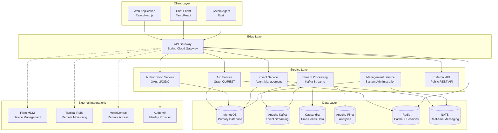

## Core Design Principles

### 1. Multi-Tenancy First
- **Tenant Isolation**: Complete data and resource isolation between tenants
- **Scalable Architecture**: Support thousands of MSP tenants
- **Per-Tenant Configuration**: Customizable settings and integrations per tenant

### 2. Event-Driven Architecture  
- **Async Processing**: Non-blocking operations using Kafka event streams
- **Real-time Updates**: NATS for immediate notifications and chat
- **Audit Trail**: Complete event logging for compliance and debugging

### 3. API-First Design
- **GraphQL Primary**: Rich query capabilities for complex data relationships
- **REST Fallback**: Simple REST endpoints for basic operations
- **External API**: Public API for third-party integrations

### 4. Security by Design
- **Zero-Trust**: All internal communication authenticated and authorized
- **OAuth2/OIDC**: Industry-standard authentication protocols
- **JWT Tokens**: Stateless authentication with short-lived tokens

### 5. Cloud-Native
- **Containerized Services**: Docker containers for all components
- **Kubernetes Ready**: Helm charts for production deployment
- **Service Mesh**: Istio for traffic management and security

## Component Architecture

### API Gateway (Entry Point)

The Gateway acts as the single entry point for all client requests:

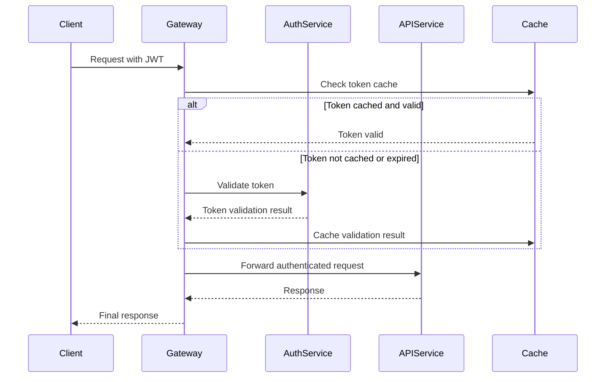

**Key Responsibilities:**
- **Authentication**: JWT token validation and refresh
- **Authorization**: Role-based access control
- **Rate Limiting**: Per-tenant and per-user rate limits
- **Request Routing**: Intelligent routing to backend services
- **WebSocket Support**: Real-time communication proxy

### Authorization Service (Identity)

Handles all authentication and authorization concerns:

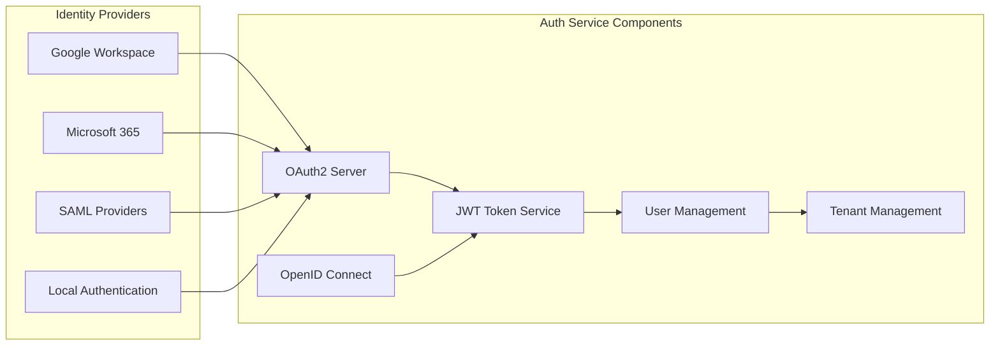

**Features:**
- **Multi-Provider SSO**: Google, Microsoft, SAML, local auth
- **PKCE Support**: Secure public client authentication
- **Tenant-Specific Keys**: RSA key pairs per tenant for token signing
- **Invitation Flows**: User onboarding and organization setup

### API Service (Business Logic)

The core business logic layer exposing GraphQL and REST APIs:

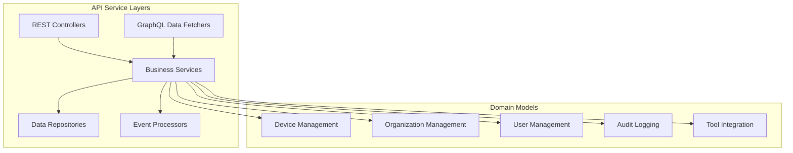

**Core Domains:**
- **Device Management**: Device lifecycle, health monitoring, remote access
- **Organization Management**: Multi-tenant organization and client management
- **User Management**: User roles, permissions, and access control
- **Tool Integration**: Fleet MDM, Tactical RMM, MeshCentral connections
- **Audit & Compliance**: Complete activity logging and reporting

### Stream Processing (Data Pipeline)

Handles real-time event processing and data enrichment:

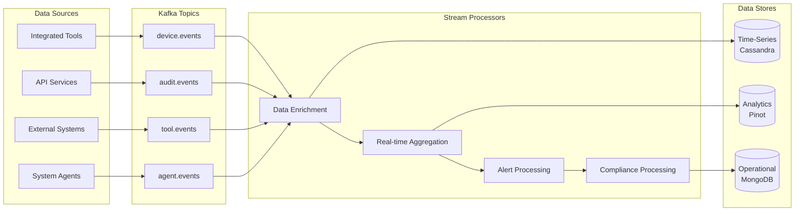

**Processing Capabilities:**
- **Real-time Enrichment**: Add contextual data to raw events
- **Stream Analytics**: Live aggregations and metrics calculation
- **Alert Processing**: Rule-based alerting and notification
- **Compliance Tracking**: Automated compliance report generation

## Data Architecture

### Database Strategy

OpenFrame uses a polyglot persistence approach, choosing the right database for each use case:

| Database | Use Case | Data Types | Scaling Strategy |
|----------|----------|------------|------------------|
| **MongoDB** | Operational data | Documents, transactions | Replica sets, sharding |
| **Apache Kafka** | Event streaming | Messages, logs | Partitioning, replication |
| **Cassandra** | Time-series data | Metrics, sensor data | Ring architecture |
| **Apache Pinot** | Analytics | Aggregated metrics | Segment distribution |
| **Redis** | Caching | Sessions, temp data | Cluster mode |
| **NATS** | Real-time messaging | Chat, notifications | Clustering |

### Data Flow Architecture

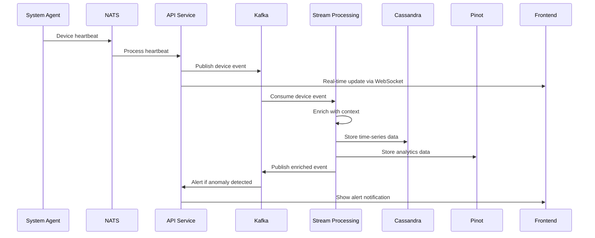

## Security Architecture

### Multi-Tenant Security Model

```mermaid
flowchart TD
    subgraph "Security Layers"
        Network[Network Security<br/>TLS/mTLS]
        Gateway[Gateway Security<br/>JWT Validation]
        Service[Service Security<br/>Internal Auth]
        Data[Data Security<br/>Tenant Isolation]
    end
    
    subgraph "Authentication Flow"
        OAuth2[OAuth2/OIDC]
        JWT[JWT Tokens]
        Refresh[Token Refresh]
        Sessions[Session Management]
    end
    
    subgraph "Authorization Model"
        RBAC[Role-Based Access]
        Tenant[Tenant Isolation]
        Resources[Resource Permissions]
        API[API Key Management]
    end
    
    Network --> Gateway
    Gateway --> Service
    Service --> Data
    
    OAuth2 --> JWT
    JWT --> Refresh
    Refresh --> Sessions
    
    RBAC --> Tenant
    Tenant --> Resources
    Resources --> API
```

**Security Features:**
- **End-to-End Encryption**: TLS 1.3 for all communications
- **Zero-Trust Architecture**: Every request authenticated and authorized
- **Tenant Data Isolation**: Complete separation of tenant data
- **JWT with Rotation**: Short-lived access tokens with refresh capability
- **API Key Management**: Scoped API keys for external integrations

### Authentication & Authorization Flow

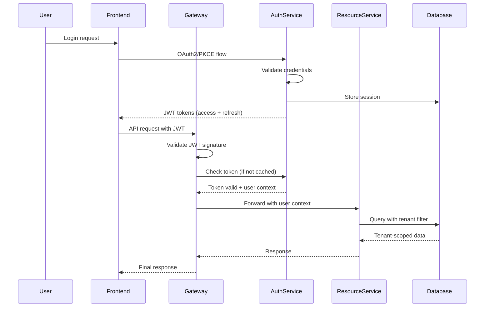

## Integration Architecture

### Tool Integration Strategy

OpenFrame integrates with external MSP tools through a unified proxy pattern:

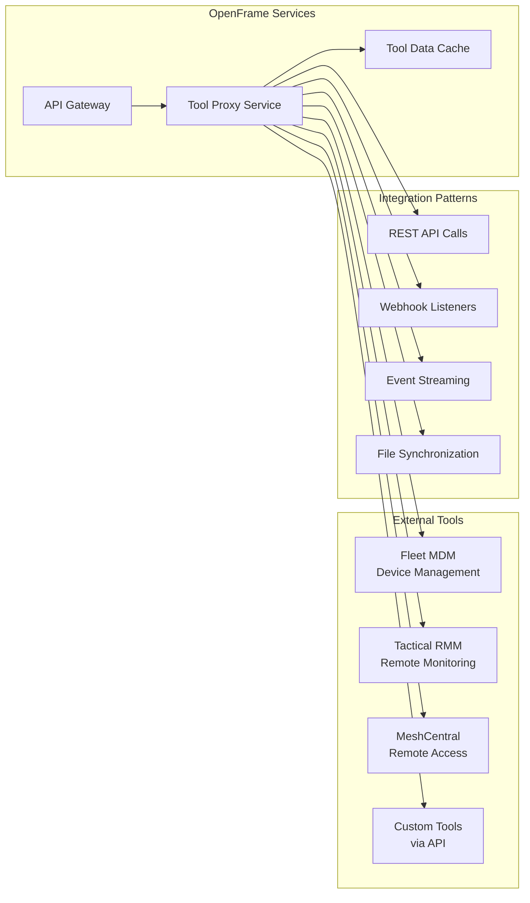

**Integration Benefits:**
- **Unified API**: Single API for all tool interactions
- **Caching Layer**: Improved performance with intelligent caching
- **Authentication Proxy**: Single sign-on for all integrated tools
- **Event Normalization**: Consistent event format across tools

## Deployment Architecture

### Kubernetes Deployment Model

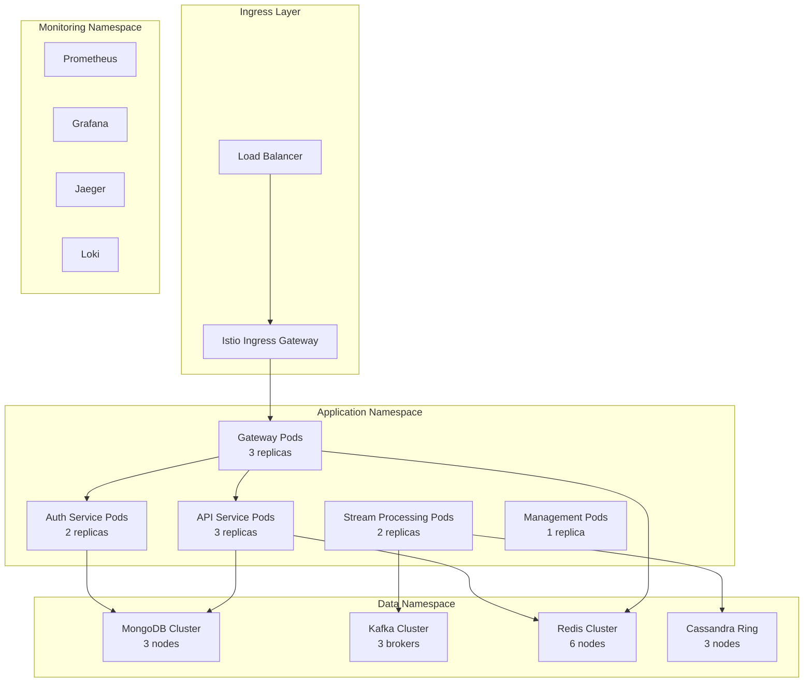

**Deployment Features:**
- **High Availability**: Multi-replica deployments with health checks
- **Auto-scaling**: Horizontal pod autoscaling based on metrics
- **Service Mesh**: Istio for traffic management and security
- **Observability**: Complete monitoring, logging, and tracing

## Performance Characteristics

### Scalability Targets

| Component | Concurrent Users | Requests/Second | Data Volume | Response Time |
|-----------|------------------|-----------------|-------------|---------------|
| **API Gateway** | 10,000+ | 50,000+ | N/A | < 50ms |
| **API Service** | 5,000+ | 10,000+ | 10TB+ | < 200ms |
| **Auth Service** | 10,000+ | 20,000+ | 1GB+ | < 100ms |
| **Stream Processing** | N/A | 100,000+ events/sec | 100TB+ | < 1s |
| **Database** | 1,000+ connections | 50,000+ ops/sec | 100TB+ | < 10ms |

### Caching Strategy

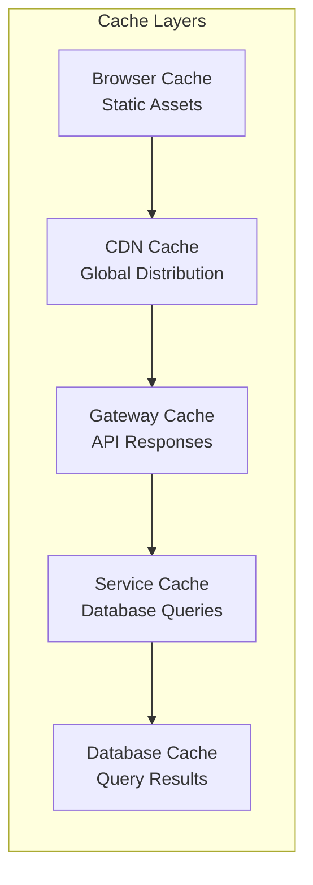

## Key Design Decisions

### Technology Choices

| Decision | Rationale | Trade-offs |
|----------|-----------|------------|
| **Java 21 + Spring Boot** | Mature ecosystem, excellent tooling, enterprise-ready | Higher memory usage vs. Go/Rust |
| **GraphQL over REST** | Flexible queries, type safety, better client experience | More complex caching, learning curve |
| **MongoDB Primary Database** | Document model fits domain, good scalability, JSON-native | No ACID across documents |
| **Apache Kafka** | Industry standard for event streaming, excellent durability | Operational complexity |
| **React Frontend** | Large ecosystem, component reusability, developer familiarity | Bundle size, runtime performance |

### Architectural Trade-offs

**Microservices vs. Monolith:**
- ✅ **Chosen**: Microservices for independent scaling and team autonomy
- ❌ **Rejected**: Monolith due to complexity of multi-tenant requirements

**Event-Driven vs. Request-Response:**
- ✅ **Chosen**: Hybrid approach - synchronous for user requests, async for background processing
- ❌ **Rejected**: Pure event-driven due to complexity for simple CRUD operations

**Multi-Database vs. Single Database:**
- ✅ **Chosen**: Polyglot persistence for optimal performance per use case
- ❌ **Rejected**: Single database due to diverse data patterns and scale requirements

## Future Architecture Evolution

### Planned Enhancements

1. **Edge Computing**: Deploy lightweight agents for local processing
2. **AI/ML Integration**: Native machine learning pipeline for predictive analytics
3. **Multi-Region**: Global deployment with data residency compliance
4. **Plugin Architecture**: Runtime plugin system for custom extensions
5. **Event Sourcing**: Complete event sourcing for audit and replay capabilities

### Scalability Roadmap

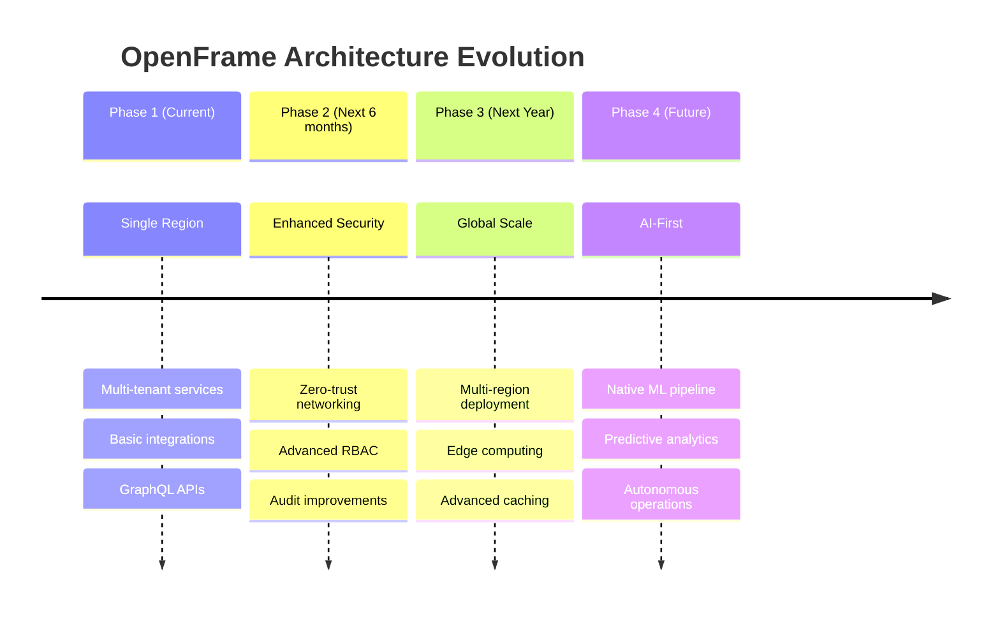

---

This architecture enables OpenFrame to serve thousands of MSP tenants while maintaining security, performance, and extensibility. The modular design allows for independent scaling and evolution of components as requirements grow.