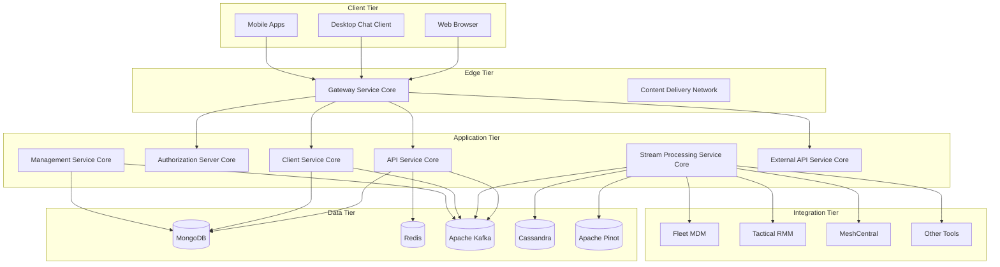
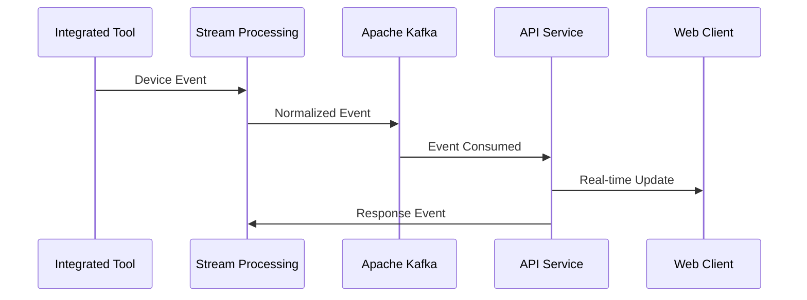
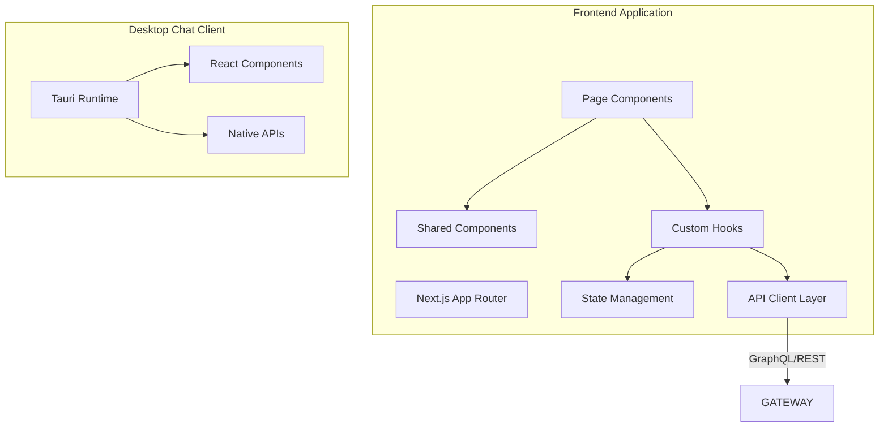
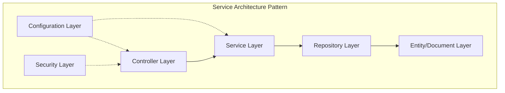
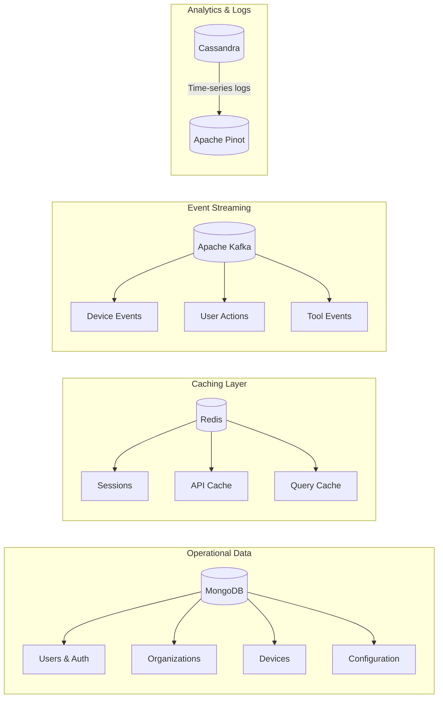
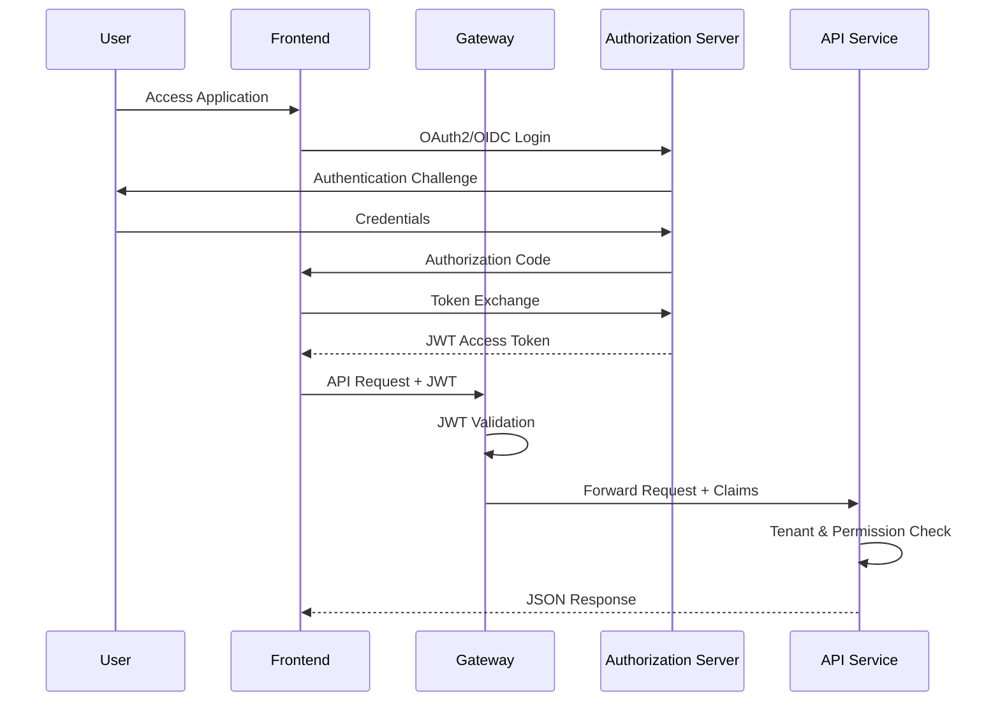
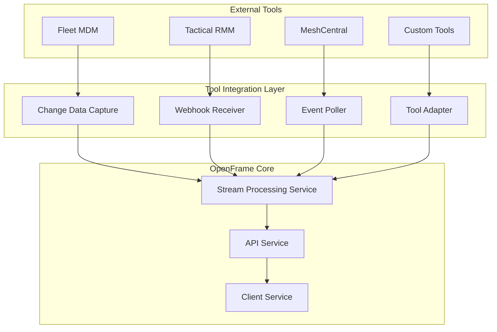
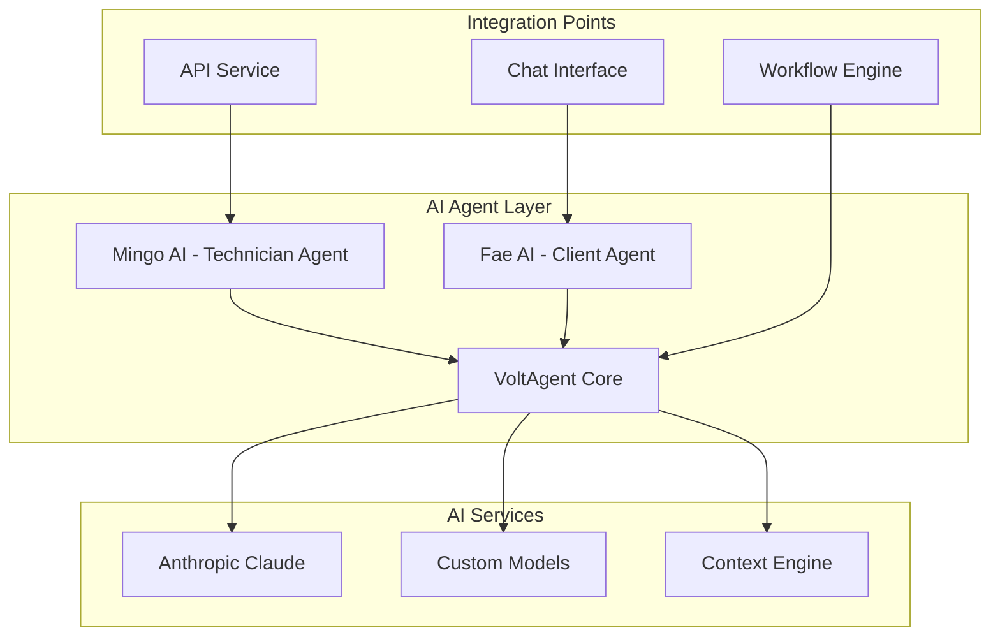
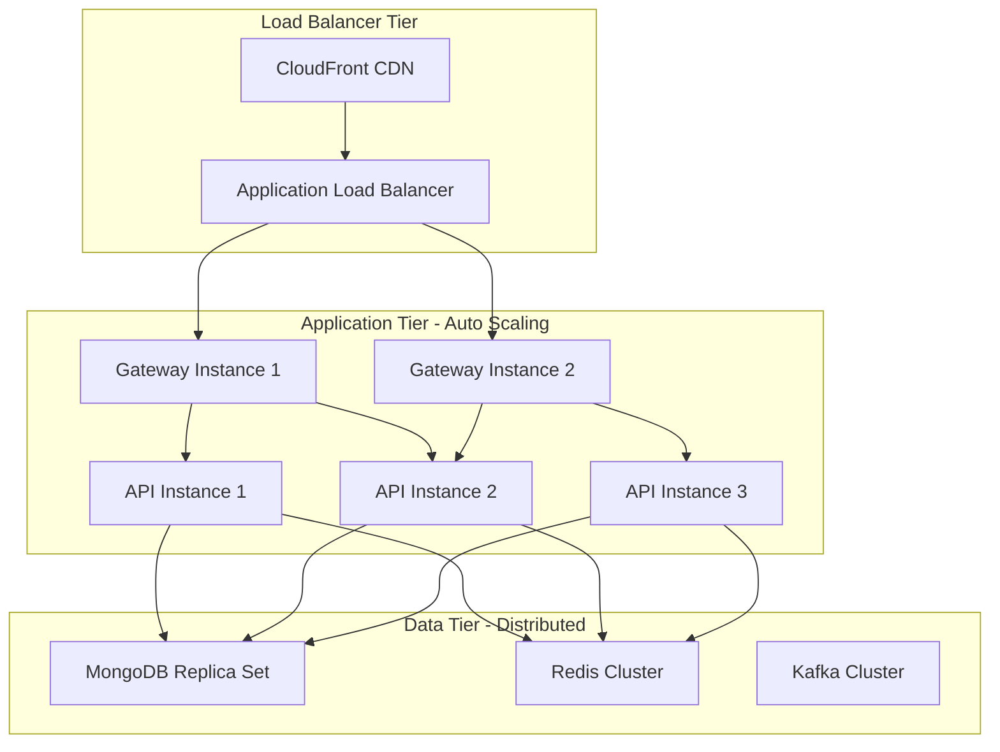
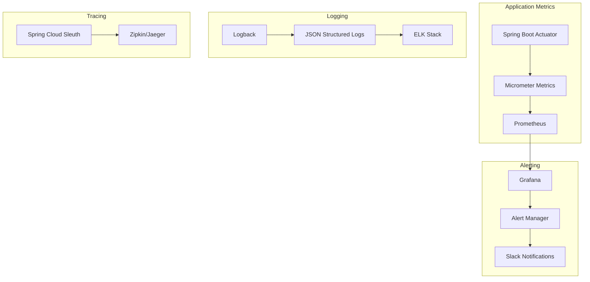

# Architecture Overview

OpenFrame is a sophisticated, multi-tenant MSP platform built with modern microservices architecture. This guide provides a comprehensive overview of the system design, component relationships, and architectural decisions.

## High-Level Architecture

OpenFrame follows a distributed microservices architecture with clear separation of concerns:



## Core Architectural Principles

### 1. Multi-Tenant by Design

Every component supports complete tenant isolation:

**Data Isolation:**
- Database-level tenant separation using `tenantId` fields
- Per-tenant collections and schemas
- Isolated caching with tenant-specific keys

**Security Isolation:**
- Per-tenant JWT signing keys
- Tenant-scoped authentication and authorization
- Isolated OAuth2 client configurations

**Configuration Isolation:**
- Tenant-specific feature flags
- Customizable branding and settings
- Independent tool integrations per tenant

### 2. Event-Driven Architecture

Real-time operations powered by event streaming:



**Event Types:**
- Device state changes
- User actions and commands
- Tool integration events
- System health and monitoring events
- Audit and compliance events

### 3. Microservices with Clear Boundaries

Each service has a specific domain responsibility:

| Service | Responsibility | Technology |
|---------|---------------|------------|
| **Gateway Service** | Routing, authentication, rate limiting | Spring Cloud Gateway |
| **API Service** | Business logic, GraphQL, REST orchestration | Spring Boot + Netflix DGS |
| **Authorization Server** | OAuth2/OIDC, JWT management, user auth | Spring Authorization Server |
| **Client Service** | Agent management, device communication | Spring Boot + NATS |
| **Stream Processing** | Event processing, data transformation | Spring Boot + Kafka Streams |
| **Management Service** | Admin operations, maintenance tasks | Spring Boot |
| **External API** | Public REST API, third-party integrations | Spring Boot |

## Detailed Component Architecture

### Frontend Architecture

The frontend follows a modern React-based architecture:



**Key Frontend Technologies:**
- **Next.js 16+**: App Router for server-side rendering and routing
- **React 18+**: Component framework with Suspense and concurrent features
- **TypeScript**: Type safety and development experience
- **Tailwind CSS**: Utility-first styling framework
- **Tanstack Query**: Server state management and caching
- **GraphQL Code Generator**: Type-safe API client generation

### Backend Service Architecture

Each Spring Boot service follows layered architecture:



**Architectural Layers:**

1. **Controller Layer**: REST endpoints, GraphQL resolvers, request/response handling
2. **Service Layer**: Business logic, orchestration, transaction management
3. **Repository Layer**: Data access abstraction, query optimization
4. **Entity Layer**: Data models, validation, relationships
5. **Configuration Layer**: Spring configuration, beans, profiles
6. **Security Layer**: Authentication, authorization, JWT handling

### Data Architecture

OpenFrame uses a polyglot persistence approach:



**Data Store Responsibilities:**

- **MongoDB**: Primary operational data (users, organizations, devices, configuration)
- **Redis**: Session management, API response caching, query result caching
- **Apache Kafka**: Event streaming, tool integration, real-time updates
- **Apache Cassandra**: Time-series data, audit logs, historical events
- **Apache Pinot**: Real-time analytics, reporting, dashboard metrics

## Service Communication Patterns

### Synchronous Communication

**REST APIs** for direct service-to-service communication:
```text
Gateway → API Service: HTTPS/REST
API Service → External APIs: HTTPS/REST
Frontend → Gateway: HTTPS/GraphQL+REST
```

**GraphQL** for frontend-to-backend communication:
```graphql
query GetDevices($tenantId: String!, $filter: DeviceFilter) {
  devices(tenantId: $tenantId, filter: $filter) {
    edges {
      node {
        id
        name
        status
        organization {
          id
          name
        }
      }
    }
    pageInfo {
      hasNextPage
      endCursor
    }
  }
}
```

### Asynchronous Communication

**Apache Kafka** for event-driven communication:
```java
// Event Producer
@KafkaTemplate
public void publishDeviceEvent(DeviceEvent event) {
    kafkaTemplate.send("device-events", event.getTenantId(), event);
}

// Event Consumer
@KafkaListener(topics = "device-events")
public void handleDeviceEvent(DeviceEvent event) {
    // Process device state change
    deviceService.updateDeviceState(event);
}
```

**NATS JetStream** for agent communication:
```java
// Agent Heartbeat Publisher  
@Component
public class MachineHeartbeatPublisher {
    public void publishHeartbeat(MachineHeartbeat heartbeat) {
        natsTemplate.publish("machine.heartbeat." + heartbeat.getMachineId(), heartbeat);
    }
}

// Heartbeat Consumer
@NatsListener("machine.heartbeat.>")
public void handleHeartbeat(MachineHeartbeat heartbeat) {
    machineStatusService.updateStatus(heartbeat);
}
```

## Security Architecture

### Authentication Flow



### Multi-Tenant Security Model

**Tenant Isolation Strategies:**

1. **JWT-Based Tenant Resolution**:
```java
@Component
public class TenantResolver {
    public String resolveTenantId(AuthPrincipal principal) {
        return principal.getTenantId();
    }
}
```

2. **Data Access Control**:
```java
@Repository
public class DeviceRepository {
    public List<Device> findByTenantId(String tenantId) {
        return mongoTemplate.find(
            Query.query(Criteria.where("tenantId").is(tenantId)),
            Device.class
        );
    }
}
```

3. **Per-Tenant Configuration**:
```yaml
openframe:
  tenants:
    tenant-a:
      features:
        ai-enabled: true
        tool-integrations: [fleet, tactical-rmm]
    tenant-b:
      features:
        ai-enabled: false
        tool-integrations: [meshcentral]
```

## Integration Architecture

### Tool Integration Pattern

OpenFrame integrates with external MSP tools through a consistent pattern:



**Integration Methods:**

1. **Change Data Capture (CDC)**: Real-time database change streaming
2. **Webhooks**: HTTP callbacks for event notifications
3. **Polling**: Periodic API calls for state synchronization
4. **Custom Adapters**: Tool-specific integration logic

### AI Agent Architecture

The AI system follows an agent-based architecture:



**AI Agent Capabilities:**

- **Mingo AI**: Device management, incident triage, automation execution
- **Fae AI**: Client support, password resets, basic troubleshooting
- **VoltAgent Core**: Agent orchestration, conversation management, tool execution

## Scalability & Performance Architecture

### Horizontal Scaling Strategy



**Scaling Characteristics:**

- **Stateless Services**: All application services are stateless and horizontally scalable
- **Database Clustering**: MongoDB replica sets, Redis clustering, Kafka partitioning
- **Caching Strategy**: Multi-level caching (application, database, CDN)
- **Event Processing**: Kafka consumer groups for parallel event processing

### Performance Optimization Patterns

**Caching Strategy:**
```java
@Cacheable(value = "organizations", key = "#tenantId")
public List<Organization> getOrganizations(String tenantId) {
    return organizationRepository.findByTenantId(tenantId);
}

@CacheEvict(value = "organizations", key = "#organization.tenantId")
public Organization updateOrganization(Organization organization) {
    return organizationRepository.save(organization);
}
```

**Database Optimization:**
```java
// Efficient pagination with cursor-based approach
public class CursorPaginationService {
    public CursorPageResult<Device> getDevices(String tenantId, String cursor, int limit) {
        Query query = new Query()
            .addCriteria(Criteria.where("tenantId").is(tenantId))
            .limit(limit + 1); // +1 to determine hasNextPage
            
        if (cursor != null) {
            query.addCriteria(Criteria.where("_id").gt(cursor));
        }
        
        return buildPageResult(mongoTemplate.find(query, Device.class));
    }
}
```

## Monitoring & Observability Architecture

### Observability Stack



**Key Metrics:**
- Application performance (response times, throughput)
- Database performance (query times, connection pool usage)
- Cache hit rates and memory usage
- Event processing latency and throughput
- Error rates and exception tracking

## Design Patterns & Best Practices

### Repository Pattern with MongoDB

```java
@Repository
public class OrganizationRepositoryImpl implements CustomOrganizationRepository {
    
    @Autowired
    private MongoTemplate mongoTemplate;
    
    @Override
    public CursorPageResult<Organization> findWithCursor(
            OrganizationQueryFilter filter, 
            String cursor, 
            int limit) {
        
        Query query = buildQuery(filter);
        query.limit(limit + 1);
        
        if (cursor != null) {
            query.addCriteria(Criteria.where("id").gt(cursor));
        }
        
        List<Organization> organizations = mongoTemplate.find(query, Organization.class);
        return CursorPageResult.of(organizations, limit);
    }
}
```

### Event Sourcing Pattern

```java
@EventSourcingHandler
public class DeviceEventHandler {
    
    @EventHandler
    public void on(DeviceCreatedEvent event) {
        Device device = new Device();
        device.setId(event.getDeviceId());
        device.setTenantId(event.getTenantId());
        device.setName(event.getName());
        device.setStatus(DeviceStatus.ONLINE);
        deviceRepository.save(device);
    }
    
    @EventHandler  
    public void on(DeviceStatusChangedEvent event) {
        Device device = deviceRepository.findById(event.getDeviceId())
            .orElseThrow(() -> new DeviceNotFoundException(event.getDeviceId()));
        device.setStatus(event.getNewStatus());
        deviceRepository.save(device);
    }
}
```

### Circuit Breaker Pattern

```java
@Component
public class ToolIntegrationService {
    
    @CircuitBreaker(name = "fleet-integration", fallbackMethod = "fallbackGetDevices")
    @TimeLimiter(name = "fleet-integration")
    public CompletableFuture<List<Device>> getDevicesFromFleet(String tenantId) {
        return CompletableFuture.supplyAsync(() -> {
            return fleetClient.getDevices(tenantId);
        });
    }
    
    public CompletableFuture<List<Device>> fallbackGetDevices(String tenantId, Exception ex) {
        log.warn("Fleet integration failed, using cached data", ex);
        return CompletableFuture.completedFuture(getCachedDevices(tenantId));
    }
}
```

## Deployment Architecture

### Container Strategy

```yaml
# docker-compose.production.yml
version: '3.8'
services:
  gateway:
    image: openframe/gateway:latest
    replicas: 2
    environment:
      - SPRING_PROFILES_ACTIVE=production
      - JVM_OPTS=-Xmx1g -XX:+UseG1GC
    
  api:
    image: openframe/api:latest
    replicas: 3
    environment:
      - SPRING_PROFILES_ACTIVE=production
      - JVM_OPTS=-Xmx2g -XX:+UseG1GC
      
  frontend:
    image: openframe/frontend:latest
    replicas: 2
    environment:
      - NODE_ENV=production
      - NEXT_PUBLIC_API_URL=https://api.openframe.ai
```

### Infrastructure as Code

OpenFrame deployments use:
- **Docker** for containerization
- **Kubernetes** for orchestration
- **Helm Charts** for configuration management
- **Terraform** for infrastructure provisioning

## Next Steps

Now that you understand the architecture:

1. **[Security Guidelines](../security/README.md)** - Learn security implementation details
2. **[Testing Overview](../testing/README.md)** - Understand testing strategies  
3. **[Contributing Guidelines](../contributing/guidelines.md)** - Start contributing to the architecture
4. Explore specific service documentation in `docs/architecture/` subdirectories

## Architecture Questions & Support

- **OpenMSP Slack**: https://www.openmsp.ai/ - Use `#architecture` channel
- **Join Slack**: https://join.slack.com/t/openmsp/shared_invite/zt-36bl7mx0h-3~U2nFH6nqHqoTPXMaHEHA

---

**🏗️ Architecture Deep Dive Complete!** You now understand the comprehensive design of OpenFrame's distributed, multi-tenant MSP platform.