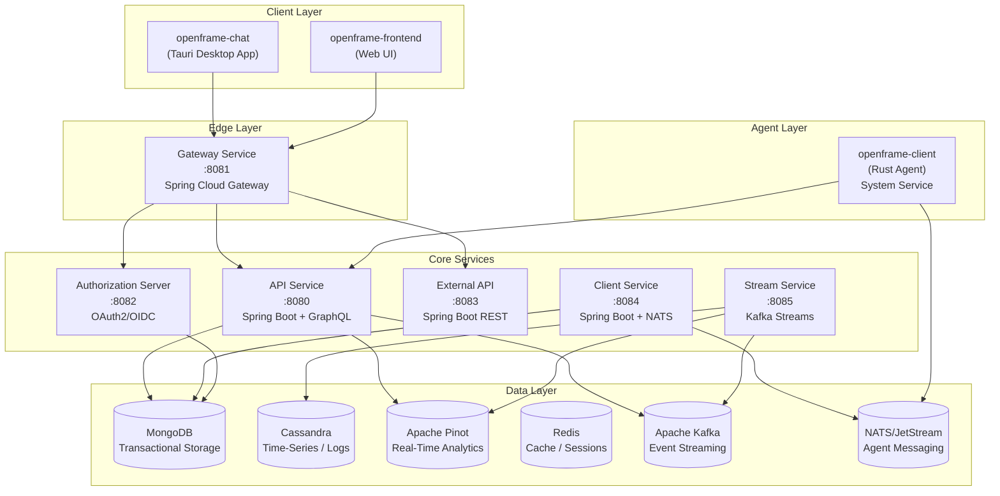
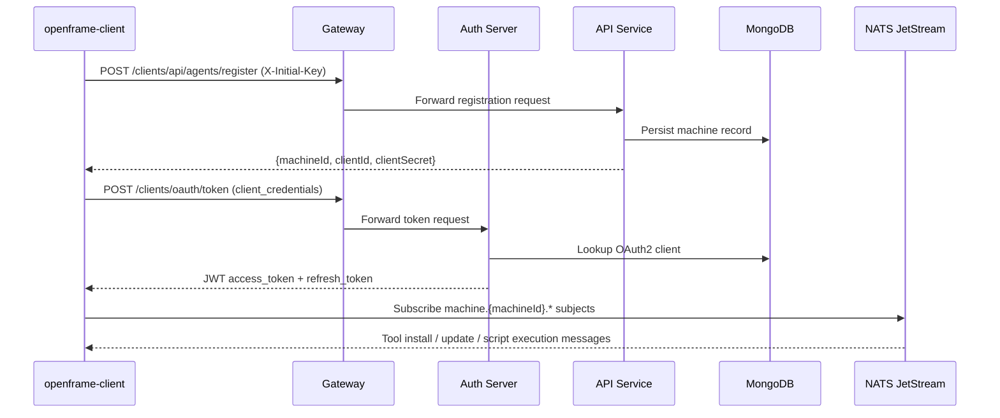
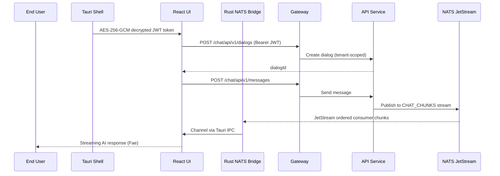
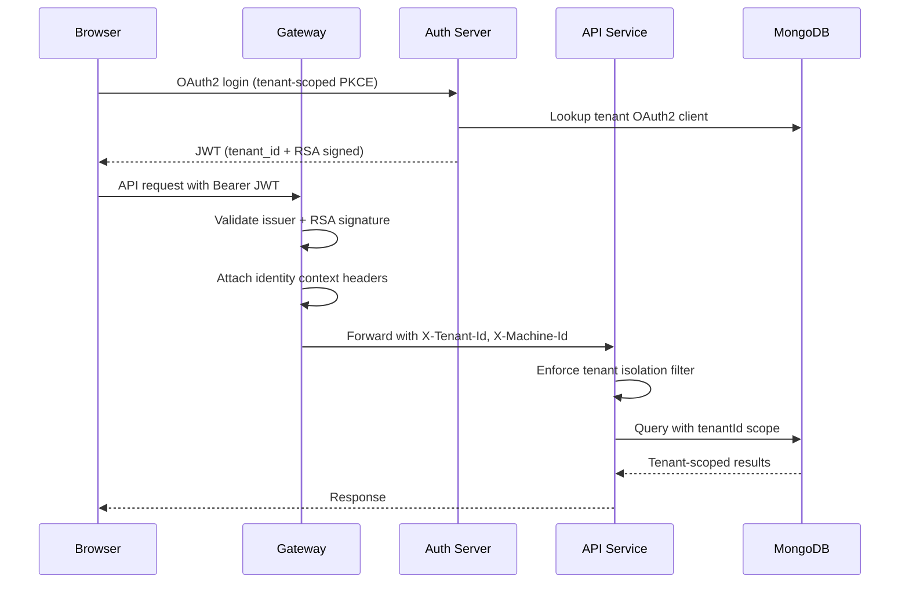

# Architecture Overview

OpenFrame OSS Tenant is a polyglot, multi-tenant microservice platform built with Java (Spring Boot 3.3), Rust, and TypeScript. This document provides the high-level architecture, component relationships, and key data flows.

---

## High-Level System Architecture

All client traffic enters through the Spring Cloud Gateway. Backend services communicate internally via HTTP/GraphQL and asynchronously via Kafka and NATS JetStream. The Rust agent communicates exclusively over NATS.

---

## Core Components

| Component | Language | Port | Responsibility |
|---|---|---|---|
| **API Service** | Java / Spring Boot 3.3 | 8080 | Internal REST + GraphQL APIs; ticket, dialog, AI settings, tenant management |
| **Authorization Server** | Java / Spring Authorization Server | 8082 | Multi-tenant OAuth2/OIDC; JWT issuance with RSA keys; SSO (Google, Microsoft) |
| **Gateway** | Java / Spring Cloud Gateway | 8081 | Security enforcement, JWT validation, request routing, WebSocket proxy |
| **External API** | Java / Spring Boot | 8083 | Rate-limited public API endpoints with API key management |
| **Stream Service** | Java / Kafka Streams | 8085 | Real-time event normalization, enrichment, Cassandra/Pinot write |
| **Client Service** | Java / Spring Boot + NATS | 8084 | Agent lifecycle management, tool orchestration |
| **openframe-client** | Rust | — | Cross-platform system agent; device registration, tool management, script execution |
| **openframe-chat** | TypeScript / Tauri + React | 3003 (dev) | Desktop AI chat client (Fae) for end clients |
| **openframe-frontend-core** | TypeScript (npm library) | — | Shared UI component library; design tokens, chat components, NATS hooks |

---

## Data Flow: Agent Registration and Authentication

When a new managed device connects to OpenFrame for the first time:

---

## Data Flow: Fae AI Chat (openframe-chat)

The Fae desktop client streams AI responses through NATS JetStream via a Rust bridge:

---

## Data Flow: Multi-Tenant OAuth2 Security

Every API request is tenant-scoped via JWT:

---

## Key Design Decisions

### Multi-Tenancy via JWT Claims
Every Spring Boot service enforces tenant isolation by reading the `tenant_id` claim from the forwarded JWT. The Gateway adds `X-Tenant-Id` and `X-Machine-Id` headers after JWT validation. All MongoDB queries are scoped to the tenant via `TenantAwareMongoTemplate`.

### NATS JetStream for Agent Messaging
The Rust `openframe-client` communicates exclusively via NATS JetStream rather than HTTP REST. This provides durable message delivery, ordered consumer semantics, and low-latency bidirectional communication for script execution results, heartbeats, and tool lifecycle events.

### Kafka for Event Streaming
Service-to-service event propagation uses Apache Kafka. The Stream Service consumes events from Kafka and writes enriched data to Apache Cassandra (for time-series logs) and Apache Pinot (for real-time analytics queries).

### Polyglot Architecture
- **Java/Spring Boot** handles all multi-tenant business logic, OAuth2/OIDC, and GraphQL APIs
- **Rust** is used where performance, memory safety, and cross-platform system integration are critical (the endpoint agent and Tauri desktop backend)
- **TypeScript/React** provides the UI layer, consuming the same GraphQL API

### Netflix DGS for GraphQL
The API Service uses [Netflix DGS](https://netflix.github.io/dgs/) (Domain Graph Service) as the GraphQL framework. Data fetchers, data loaders, and schema definitions follow the DGS conventions.

---

## Key Source Files

| File | Purpose |
|---|---|
| [`openframe/services/openframe-api/src/main/java/com/openframe/api/ApiApplication.java`](https://github.com/flamingo-stack/openframe-oss-tenant/blob/main/openframe/services/openframe-api/src/main/java/com/openframe/api/ApiApplication.java) | API Service entry point |
| [`openframe/services/openframe-gateway/src/main/java/com/openframe/gateway/GatewayApplication.java`](https://github.com/flamingo-stack/openframe-oss-tenant/blob/main/openframe/services/openframe-gateway/src/main/java/com/openframe/gateway/GatewayApplication.java) | Gateway entry point |
| [`clients/openframe-client/src/main.rs`](https://github.com/flamingo-stack/openframe-oss-tenant/blob/main/clients/openframe-client/src/main.rs) | Thin agent entry point (calls `openframe::run()`) |
| [`clients/openframe-client/src/lib.rs`](https://github.com/flamingo-stack/openframe-oss-lib/blob/main/clients/openframe-client/src/lib.rs) | Agent core (openframe-agent-lib): wires all subsystems |
| [`clients/openframe-chat/src/App.tsx`](https://github.com/flamingo-stack/openframe-oss-tenant/blob/main/clients/openframe-chat/src/App.tsx) | Desktop app root component |
| [`clients/openframe-chat/src-tauri/src/lib.rs`](https://github.com/flamingo-stack/openframe-oss-tenant/blob/main/clients/openframe-chat/src-tauri/src/lib.rs) | Tauri application entry point |

---

## Reference Documentation

For detailed component-level documentation, see the [Architecture Reference](./reference/architecture/overview.md).
