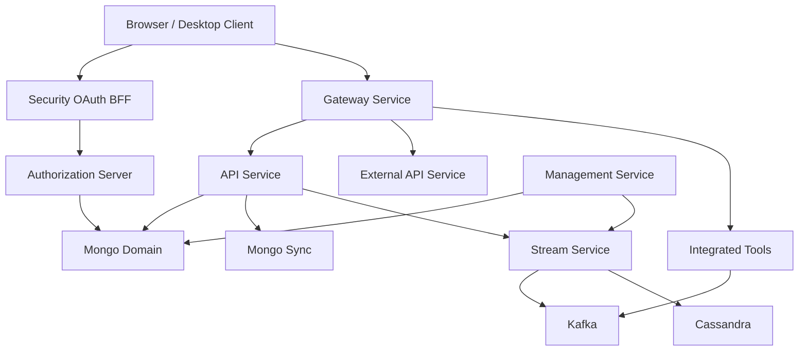
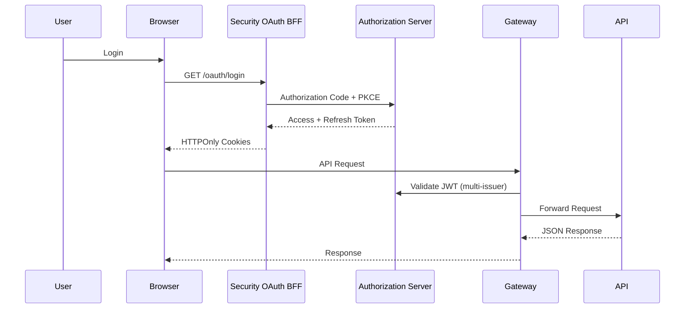
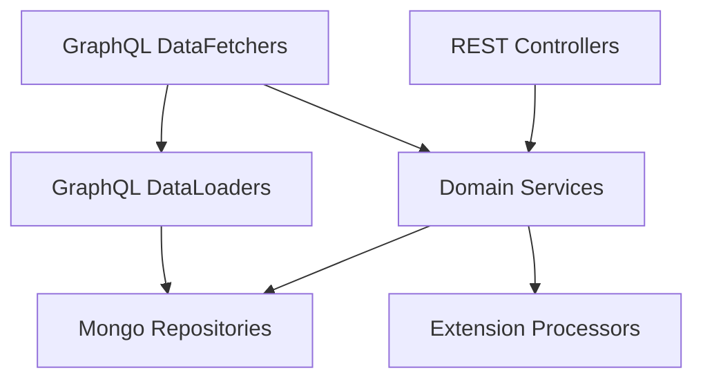
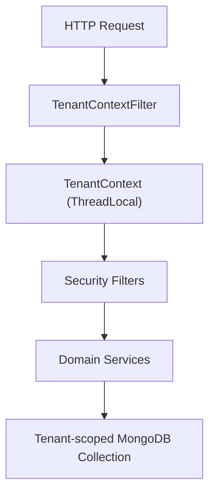
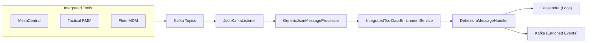
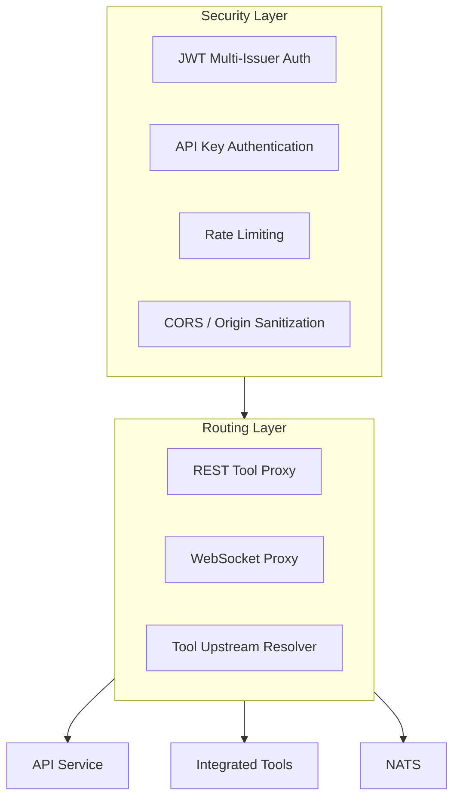
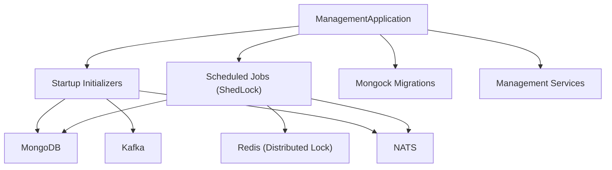
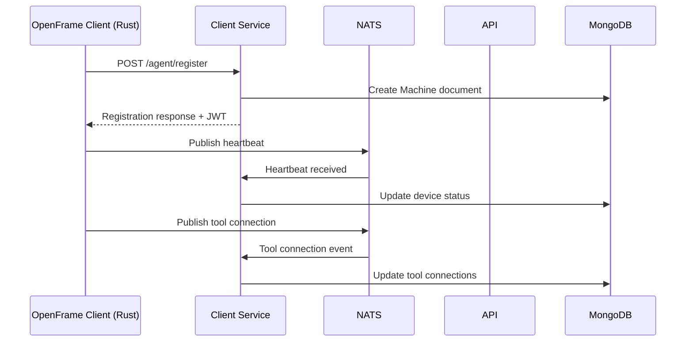

# Architecture Overview

OpenFrame OSS Tenant is a multi-service microservices platform designed for MSP (Managed Service Provider) environments. This document provides a comprehensive view of the system architecture, component relationships, and key design decisions.

[](https://www.youtube.com/watch?v=FgQu7hfKJKw)

---

## High-Level Architecture



---

## Core Components

| Component | Path | Technology | Role |
|-----------|------|-----------|------|
| **Gateway Service** | `openframe/services/openframe-gateway` | Spring WebFlux | Edge routing, JWT auth, WebSocket proxy |
| **Authorization Server** | `openframe/services/openframe-authorization-server` | Spring Authorization Server | OAuth2/OIDC, multi-tenant identity |
| **API Service** | `openframe/services/openframe-api` | Spring MVC + Netflix DGS | GraphQL + REST business logic |
| **Management Service** | `openframe/services/openframe-management` | Spring Boot | Schedulers, migrations, tool lifecycle |
| **Stream Service** | `openframe/services/openframe-stream` | Kafka Streams | CDC event ingestion, enrichment |
| **External API** | `openframe/services/openframe-external-api` | Spring MVC | Public REST API with API key auth |
| **Config Server** | `openframe/services/openframe-config` | Spring Cloud Config | Centralized configuration |
| **Security OAuth BFF** | `openframe-oss-lib` | Spring Boot | Browser-safe PKCE login flows |

---

## Authentication & Request Flow

The platform enforces OAuth2 + PKCE for all browser clients, ensuring tokens are never exposed to JavaScript:



**Security guarantees:**
- PKCE enforced on all authorization flows
- HTTPOnly cookie token storage (no JS access)
- Multi-issuer JWT validation (per-tenant RSA keys)
- Role-based route enforcement at Gateway level

---

## API Layer Architecture

The API Service follows a layered architecture using Netflix DGS for GraphQL:



### GraphQL Capabilities

- **Relay-compatible** cursor pagination (`ConnectionArgs`, `CursorCodec`)
- **Global IDs** — all entities addressable by Relay node ID
- **DataLoader batching** — prevents N+1 query problems
- **Custom scalars** — `Date`, `Instant`, `Long`

---

## Multi-Tenant Model

The platform is built for strict multi-tenant isolation:



**Isolation mechanisms:**
- Per-tenant RSA key pairs for JWT signing
- `TenantContext` ThreadLocal ensures no cross-tenant data leakage
- Tenant ID embedded in JWT claims (`tenant_id`)
- MongoDB collections scoped per tenant

---

## Stream Processing Architecture

The Stream Processing Core handles real-time event ingestion from integrated tools:



**Processing pipeline:**
1. Debezium captures CDC events from tool databases
2. `JsonKafkaListener` consumes events from Kafka
3. `IntegratedToolDataEnrichmentService` resolves tenant and machine metadata
4. `DebeziumMessageHandler` normalizes events to platform types
5. Enriched events are persisted to Cassandra and re-published to Kafka

---

## Gateway Service Architecture



**Key features:**
- `ApiKeyAuthenticationFilter` — validates API keys for `/external-api/**`
- Rate limiting with per-minute, per-hour, per-day windows
- WebSocket proxying for MeshCentral remote desktop/shell
- Tool-specific upstream resolvers (MeshCentral, Tactical RMM)

---

## Management Service Control Plane



**Key responsibilities:**
- `ShedLockConfig` — prevents duplicate job execution across replicas
- `AgentRegistrationSecretInitializer` — bootstraps agent secrets at startup
- `DeviceHeartbeatOfflineDetectionScheduler` — marks offline devices
- `ApiKeyStatsSyncScheduler` — syncs API key usage stats
- Mongock-based schema migrations

---

## Data Flow: Device Registration



---

## Key Design Decisions

### 1. Netflix DGS for GraphQL

The API layer uses Netflix DGS (Domain Graph Service) framework rather than plain Spring GraphQL, providing:
- DataLoader auto-registration
- GraphQL federation support
- Relay compliant out of the box
- Rich DGS annotations (`@DgsComponent`, `@DgsQuery`, `@DgsMutation`)

### 2. Per-Tenant RSA Keys

Each tenant has its own RSA key pair generated by `RsaAuthenticationKeyPairGenerator`. Keys are stored encrypted in MongoDB via `EncryptionService`. This means:
- A compromised key for one tenant cannot affect others
- Keys can be rotated per-tenant independently
- JWT validation fails for cross-tenant token usage

### 3. Reactive Gateway with WebFlux

The Gateway is built on Spring WebFlux (non-blocking) while the API Service uses standard Spring MVC. This separation allows:
- Maximum concurrency at the edge (WebSocket proxying)
- Simpler blocking code for business logic in the API
- Independent scaling of gateway vs. business logic

### 4. ShedLock for Distributed Scheduling

Rather than Quartz or similar, the Management Service uses ShedLock with Redis for distributed job locking. Lock keys follow the pattern:

```text
of:{tenantId}:job-lock:{environment}:{lockName}
```

This ensures multi-tenant safety and environment isolation in shared clusters.

---

## Reference Architecture Documentation

For deep-dives into each component, see the architecture reference docs:

- [API Service Core](./architecture/api-service-core/api-service-core.md)
- [Gateway Service Core](./architecture/gateway-service-core/gateway-service-core.md)
- [Authorization Server Core](./architecture/authorization-server-core/authorization-server-core.md)
- [Management Service Core](./architecture/management-service-core/management-service-core.md)
- [Stream Processing Core](./architecture/stream-processing-core/stream-processing-core.md)
- [Security and OAuth BFF](./architecture/security-and-oauth-bff/security-and-oauth-bff.md)
- [Mongo Domain and Repositories](./architecture/mongo-domain-and-repositories/mongo-domain-and-repositories.md)
- [Mongo Sync Custom Repositories](./architecture/mongo-sync-custom-repositories/mongo-sync-custom-repositories.md)
