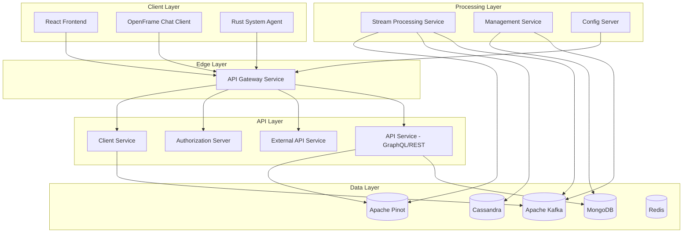
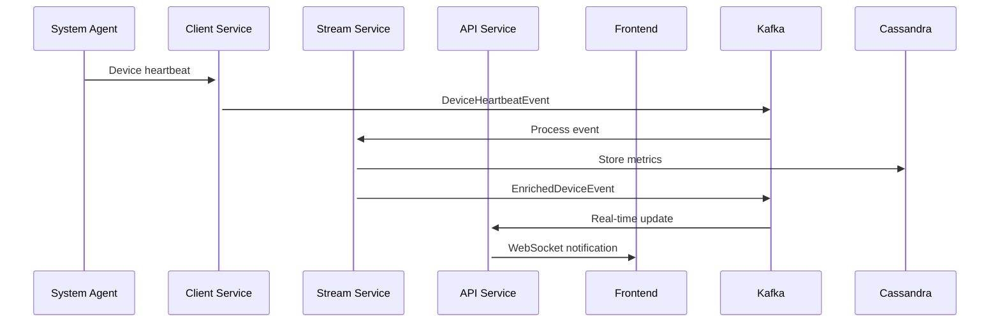
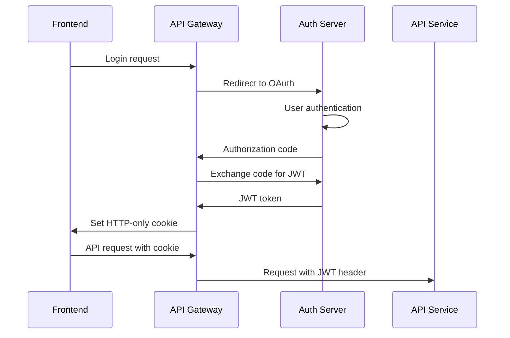
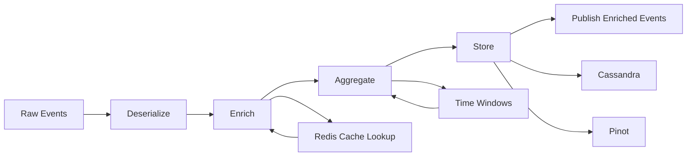
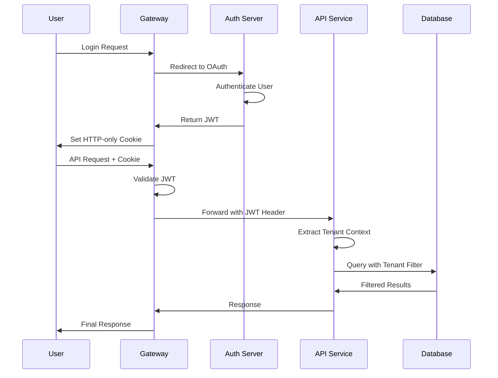
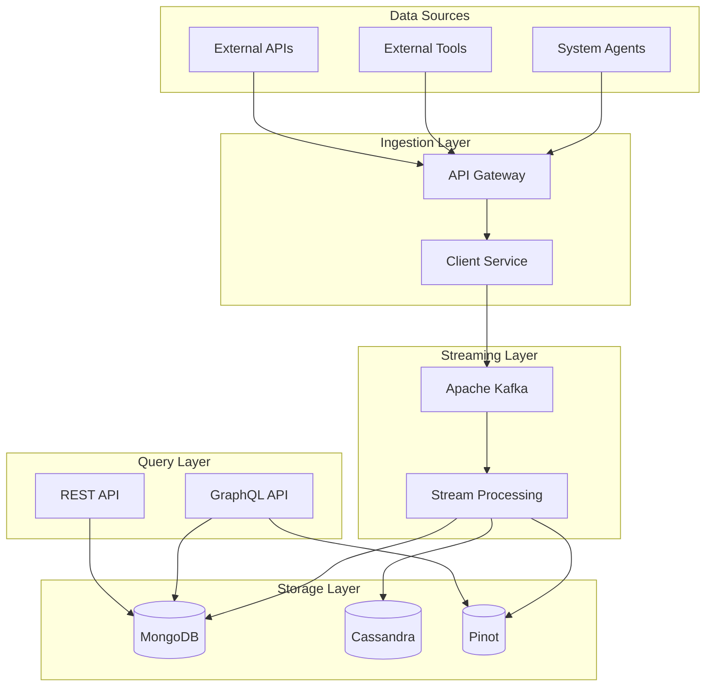
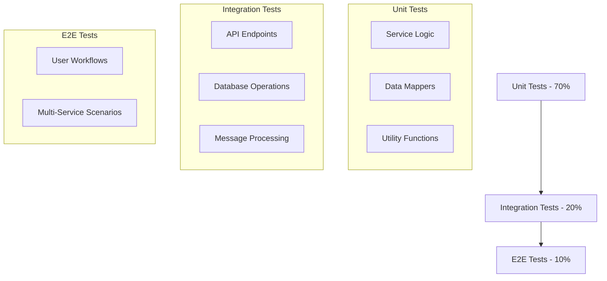

# Architecture Overview

OpenFrame uses a modern microservices architecture designed for scalability, maintainability, and multi-tenant operation. This guide provides a comprehensive overview of the system architecture and design decisions.

## 🏗️ High-Level Architecture

OpenFrame follows a layered microservices architecture with clear separation of concerns:



## 🔄 Service Architecture Patterns

### 1. API Gateway Pattern

The **Gateway Service** acts as the single entry point for all client requests:

**Responsibilities:**
- Request routing and load balancing
- Authentication and authorization
- Rate limiting and throttling
- Protocol translation (HTTP/WebSocket)
- Request/response transformation

**Key Features:**
```java
@Component
public class GatewayFilter implements GlobalFilter {
    @Override
    public Mono<Void> filter(ServerWebExchange exchange, GatewayFilterChain chain) {
        // JWT validation
        // Rate limiting
        // Request routing
        return chain.filter(exchange);
    }
}
```

### 2. Domain-Driven Design (DDD)

Each service is organized around business domains:

```text
openframe-api/
├── src/main/java/com/openframe/api/
│   ├── controller/          # REST controllers
│   ├── datafetcher/         # GraphQL data fetchers
│   ├── service/             # Domain services
│   ├── mapper/              # Data mappers
│   └── dto/                 # Data transfer objects
```

### 3. Event-Driven Architecture

Services communicate asynchronously via **Apache Kafka**:



### 4. CQRS (Command Query Responsibility Segregation)

**Write Operations (Commands):**
- REST API mutations
- Event publishing to Kafka
- MongoDB for operational data

**Read Operations (Queries):**
- GraphQL queries
- Apache Pinot for analytics
- Cassandra for time-series data

## 📋 Core Components

### Edge Layer Components

#### API Gateway Service
**Technology:** Spring Cloud Gateway  
**Port:** 8080  
**Responsibilities:**
- Single entry point for all requests
- JWT token validation
- Rate limiting per API key
- WebSocket proxy for real-time features
- Request routing to backend services

**Key Configuration:**
```yaml
spring:
  cloud:
    gateway:
      routes:
        - id: api-service
          uri: lb://openframe-api
          predicates:
            - Path=/graphql/**,/api/**
          filters:
            - name: JwtAuthenticationFilter
```

### API Layer Components

#### API Service (GraphQL + REST)
**Technology:** Spring Boot + Netflix DGS  
**Port:** 8081  
**Responsibilities:**
- GraphQL API with DataLoader batching
- REST endpoints for mutations
- Real-time subscriptions via WebSocket
- Multi-tenant data access

**GraphQL Schema Example:**
```graphql
type Query {
  devices(
    first: Int
    after: String
    filter: DeviceFilterInput
  ): DeviceConnection
  
  organizations(
    first: Int
    after: String
  ): OrganizationConnection
}

type Mutation {
  updateDeviceStatus(
    input: UpdateDeviceStatusInput!
  ): UpdateDeviceStatusPayload
}
```

#### Authorization Server
**Technology:** Spring Authorization Server  
**Port:** 9000  
**Responsibilities:**
- OAuth2 Authorization Code + PKCE
- OpenID Connect (OIDC) provider
- Multi-tenant JWT signing
- Google/Microsoft SSO integration

**OAuth2 Flow:**


#### External API Service
**Technology:** Spring Boot + OpenAPI  
**Port:** 8083  
**Responsibilities:**
- Public REST API for external integrations
- API key authentication
- Rate limiting and quota management
- Comprehensive OpenAPI documentation

### Processing Layer Components

#### Stream Processing Service
**Technology:** Spring Boot + Kafka Streams  
**Port:** 8084  
**Responsibilities:**
- Real-time event processing from Kafka
- Data enrichment and transformation
- Time-series data aggregation
- Complex event pattern detection

**Stream Processing Pipeline:**


#### Management Service
**Technology:** Spring Boot + Scheduler  
**Port:** 8085  
**Responsibilities:**
- System initialization and setup
- Scheduled background tasks
- Data synchronization jobs
- Health monitoring and alerting

### Data Layer Architecture

#### Data Storage Strategy

**MongoDB - Operational Data:**
- User accounts and authentication
- Organization and tenant information
- Device registration and metadata
- Configuration and settings

**Apache Cassandra - Time-Series Data:**
- Device metrics and performance data
- Event logs and audit trails
- System monitoring data
- Historical data with TTL

**Apache Pinot - Real-Time Analytics:**
- Real-time dashboards and reporting
- Complex analytical queries
- Data aggregations and trends
- Business intelligence queries

**Redis - Caching and Sessions:**
- Session storage and management
- Frequently accessed data caching
- Rate limiting counters
- Real-time feature flags

## 🔐 Security Architecture

### Multi-Tenant Security Model

OpenFrame implements tenant isolation at multiple levels:

**Data Isolation:**
```sql
-- MongoDB collections with tenant_id
{
  "_id": ObjectId("..."),
  "tenant_id": "acme-corp",
  "name": "John's Laptop",
  "status": "online"
}
```

**API Security:**
```java
@Component
public class TenantSecurityFilter implements Filter {
    @Override
    public void doFilter(ServletRequest request, ServletResponse response, 
                         FilterChain chain) {
        String tenantId = extractTenantId(request);
        TenantContext.setCurrentTenant(tenantId);
        // Continue with request
        chain.doFilter(request, response);
    }
}
```

### Authentication & Authorization Flow



## 📊 Data Flow Architecture

### Ingestion Pipeline

**Device Data Flow:**


### Real-Time Processing

**Event Stream Processing:**
```java
@Component
public class DeviceEventProcessor {
    
    @KafkaListener(topics = "device-events")
    public void processDeviceEvent(DeviceEvent event) {
        // Enrich event data
        EnrichedDeviceEvent enriched = enrichmentService.enrich(event);
        
        // Store in time-series database
        cassandraRepository.save(enriched);
        
        // Update real-time analytics
        pinotProducer.send("device-analytics", enriched);
        
        // Publish for real-time UI updates
        webSocketService.broadcast(enriched);
    }
}
```

## 🔄 Communication Patterns

### Synchronous Communication

**REST API Calls:**
- Frontend to Gateway
- Gateway to backend services
- External API integrations

**GraphQL Queries:**
- Complex data fetching with joins
- Real-time subscriptions
- Efficient data loading with DataLoader

### Asynchronous Communication

**Event-Driven Messaging:**
```java
// Publishing events
@EventListener
public void handleDeviceUpdate(DeviceUpdateEvent event) {
    kafkaTemplate.send("device-updates", event);
}

// Consuming events
@KafkaListener(topics = "device-updates")
public void processDeviceUpdate(DeviceUpdateEvent event) {
    // Process asynchronously
    deviceProcessingService.process(event);
}
```

### WebSocket Real-Time Updates

```typescript
// Frontend WebSocket connection
const wsClient = new WebSocketClient('ws://localhost:8080/ws');

wsClient.subscribe('/topic/device-updates', (message) => {
    // Update UI in real-time
    updateDeviceStatus(JSON.parse(message.body));
});
```

## 📈 Scalability Patterns

### Horizontal Scaling

**Stateless Services:**
- All business logic services are stateless
- Session state stored in Redis
- Load balancing via Spring Cloud Gateway

**Database Sharding:**
```yaml
# MongoDB sharding by tenant_id
sharding:
  shardKey: { tenant_id: 1 }
  zones:
    - zone: "us-east"
      range: { tenant_id: MinKey, tenant_id: "m" }
    - zone: "us-west"  
      range: { tenant_id: "m", tenant_id: MaxKey }
```

### Vertical Scaling

**Resource Optimization:**
- JVM tuning for memory usage
- Connection pooling optimization
- Cache warming strategies

**Performance Monitoring:**
```java
@Component
@Timed(name = "device.query.time", description = "Time taken to query devices")
public class DeviceService {
    
    @Cacheable(value = "devices", key = "#tenantId + #deviceId")
    public Device findDevice(String tenantId, String deviceId) {
        return deviceRepository.findByTenantIdAndId(tenantId, deviceId);
    }
}
```

## 🔍 Monitoring and Observability

### Distributed Tracing

```java
@RestController
@Slf4j
public class DeviceController {
    
    @GetMapping("/devices/{id}")
    @NewSpan("get-device")
    public ResponseEntity<Device> getDevice(@PathVariable String id) {
        Span.current().setAttribute("device.id", id);
        return ResponseEntity.ok(deviceService.findById(id));
    }
}
```

### Metrics Collection

```java
@Component
public class DeviceMetrics {
    
    private final MeterRegistry meterRegistry;
    private final Counter deviceRegistrationCounter;
    private final Timer deviceQueryTimer;
    
    public DeviceMetrics(MeterRegistry meterRegistry) {
        this.meterRegistry = meterRegistry;
        this.deviceRegistrationCounter = Counter.builder("device.registrations.total")
            .description("Total device registrations")
            .register(meterRegistry);
    }
}
```

## 🧪 Testing Strategy

### Testing Pyramid



### Test Categories

**Unit Tests:**
```java
@ExtendWith(MockitoExtension.class)
class DeviceServiceTest {
    
    @Mock
    private DeviceRepository deviceRepository;
    
    @InjectMocks
    private DeviceService deviceService;
    
    @Test
    void shouldFindDeviceById() {
        // Given
        Device device = new Device("1", "laptop", "online");
        when(deviceRepository.findById("1")).thenReturn(Optional.of(device));
        
        // When
        Device result = deviceService.findById("1");
        
        // Then
        assertThat(result.getHostname()).isEqualTo("laptop");
    }
}
```

**Integration Tests:**
```java
@SpringBootTest(webEnvironment = SpringBootTest.WebEnvironment.RANDOM_PORT)
@TestContainers
class DeviceControllerIntegrationTest {
    
    @Container
    static MongoDBContainer mongodb = new MongoDBContainer("mongo:6.0");
    
    @Test
    void shouldCreateDevice() {
        given()
            .contentType(ContentType.JSON)
            .body(deviceRequest)
        .when()
            .post("/api/v1/devices")
        .then()
            .statusCode(201);
    }
}
```

## 🚀 Deployment Architecture

### Container Strategy

**Multi-stage Dockerfile:**
```dockerfile
# Build stage
FROM openjdk:21-jdk-slim AS builder
WORKDIR /app
COPY . .
RUN ./mvnw clean package -DskipTests

# Runtime stage
FROM openjdk:21-jre-slim
WORKDIR /app
COPY --from=builder /app/target/*.jar app.jar
ENTRYPOINT ["java", "-jar", "app.jar"]
```

### Kubernetes Deployment

**Service Deployment:**
```yaml
apiVersion: apps/v1
kind: Deployment
metadata:
  name: openframe-api
spec:
  replicas: 3
  selector:
    matchLabels:
      app: openframe-api
  template:
    metadata:
      labels:
        app: openframe-api
    spec:
      containers:
      - name: api
        image: openframe/api:latest
        ports:
        - containerPort: 8081
        env:
        - name: SPRING_PROFILES_ACTIVE
          value: "production"
```

## 🔄 Design Decisions and Trade-offs

### Technology Choices

| Decision | Rationale | Trade-offs |
|----------|-----------|------------|
| **Spring Boot** | Rapid development, excellent ecosystem | Learning curve, some overhead |
| **GraphQL** | Flexible queries, efficient data fetching | Complexity, caching challenges |
| **MongoDB** | Document model fits domain, flexible schema | Eventual consistency, complex queries |
| **Kafka** | High throughput, durability, streaming | Complexity, eventual consistency |
| **React** | Component reusability, ecosystem | Bundle size, learning curve |

### Architectural Trade-offs

**Microservices vs Monolith:**
- ✅ **Chosen:** Microservices for team scalability and technology diversity
- ❌ **Trade-off:** Increased operational complexity and network latency

**Event-Driven vs Request-Response:**
- ✅ **Chosen:** Event-driven for loose coupling and scalability  
- ❌ **Trade-off:** Eventual consistency and debugging complexity

**Multi-Tenancy Strategy:**
- ✅ **Chosen:** Shared database with tenant isolation
- ❌ **Trade-off:** Complex queries but better resource utilization

## 📚 Further Reading

### Architecture Patterns
- **Microservices Patterns** by Chris Richardson
- **Building Event-Driven Microservices** by Adam Bellemare
- **GraphQL: The Documentary** for GraphQL best practices

### Spring Ecosystem
- **Spring Boot Reference Documentation**
- **Spring Cloud Gateway Documentation**  
- **Spring Security OAuth2 Guide**

### Data Architecture
- **Designing Data-Intensive Applications** by Martin Kleppmann
- **Apache Kafka Documentation**
- **MongoDB Architecture Guide**

This architecture provides a solid foundation for building scalable, maintainable, and secure multi-tenant applications. The design prioritizes developer productivity while maintaining operational excellence.

## Next Steps

- **[Security Architecture](../security/README.md)**: Deep dive into security implementation
- **[Local Development](../setup/local-development.md)**: Set up your development environment
- **[Testing Strategy](../testing/README.md)**: Learn about testing approaches

Understanding this architecture will help you contribute effectively to OpenFrame development! 🚀