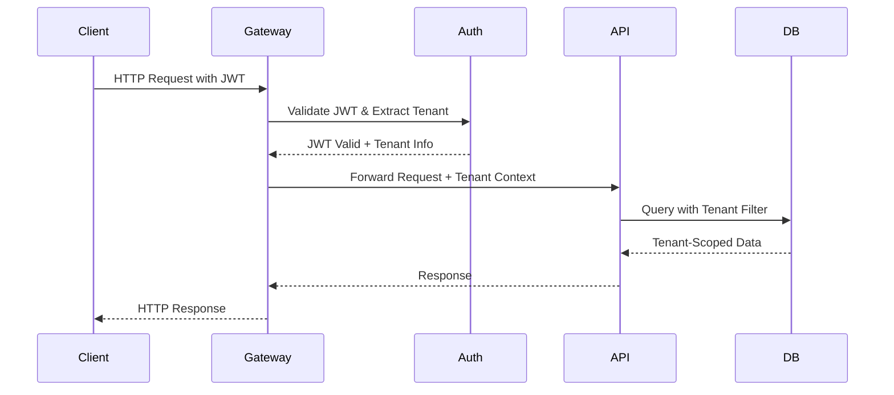
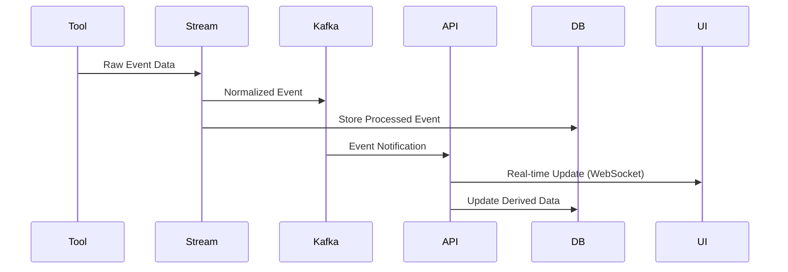
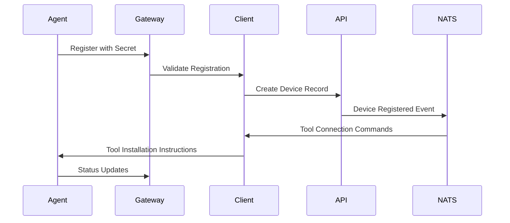
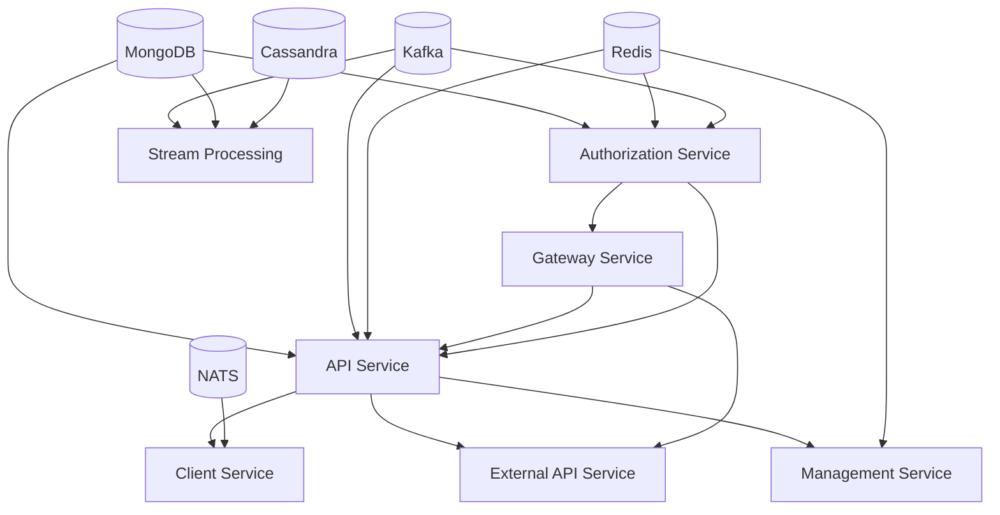
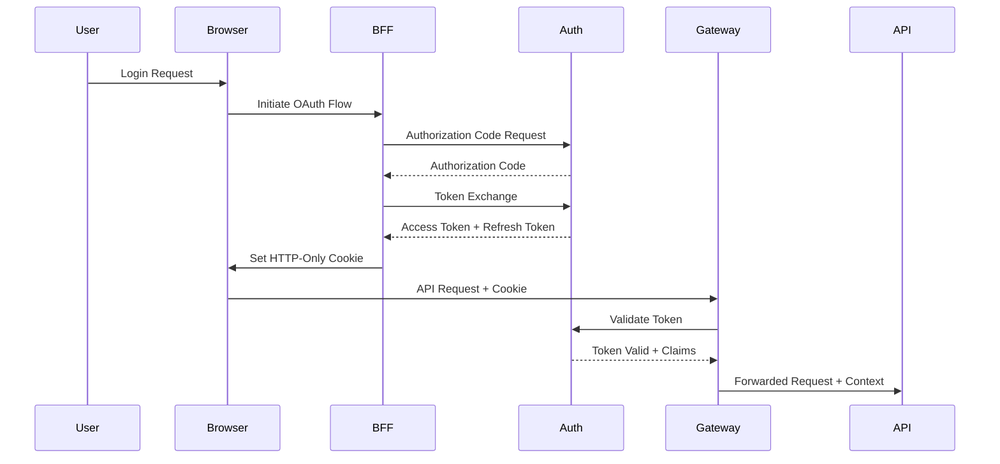

# Architecture Overview

OpenFrame is built on a modern, scalable microservices architecture designed for multi-tenant MSP operations. This document provides a comprehensive overview of the system architecture, core design principles, and service interactions.

## High-Level Architecture

OpenFrame follows a layered microservices architecture with clear separation of concerns:

```mermaid
graph TB
    subgraph "Client Layer"
        Web[Web Dashboard]
        Desktop[Desktop Clients]
        Mobile[Mobile Apps] 
        CLI[CLI Tools]
        External[External APIs]
    end
    
    subgraph "Edge Layer"
        Gateway[API Gateway]
        BFF[OAuth BFF]
        LB[Load Balancer]
    end
    
    subgraph "Authentication Layer"
        AuthZ[Authorization Server]
        JWT[JWT Validation]
        SSO[SSO Providers]
    end
    
    subgraph "Application Layer"  
        API[API Service]
        ExtAPI[External API Service]
        Client[Client Service]
        Mgmt[Management Service]
    end
    
    subgraph "Processing Layer"
        Stream[Stream Processing]
        Events[Event Processing]
        Scheduler[Job Scheduler]
    end
    
    subgraph "Integration Layer"
        TacticalRMM[TacticalRMM]
        FleetMDM[FleetMDM]
        MeshCentral[MeshCentral]
        CustomTools[Custom Tools]
    end
    
    subgraph "Data Layer"
        MongoDB[(MongoDB)]
        Kafka[(Apache Kafka)]
        Redis[(Redis)]
        Cassandra[(Cassandra)]
        Pinot[(Apache Pinot)]
    end
    
    Web --> Gateway
    Desktop --> Gateway
    Mobile --> Gateway
    CLI --> Gateway
    External --> Gateway
    
    Gateway --> AuthZ
    Gateway --> BFF
    Gateway --> API
    Gateway --> ExtAPI
    Gateway --> Client
    
    AuthZ --> JWT
    AuthZ --> SSO
    
    API --> MongoDB
    API --> Kafka
    API --> Redis
    
    Stream --> Kafka
    Stream --> MongoDB
    Stream --> Cassandra
    
    Stream --> TacticalRMM
    Stream --> FleetMDM
    Stream --> MeshCentral
    
    Events --> Pinot
```

## Core Design Principles

### 1. Multi-Tenancy First

Every component is designed with multi-tenancy as a core requirement:

- **Tenant Isolation**: Complete data and configuration separation
- **Tenant-Aware Services**: All services understand tenant context
- **Dynamic Tenant Discovery**: Runtime tenant resolution based on domain/JWT
- **Per-Tenant Customization**: Configuration, branding, and feature flags

### 2. Security by Design

Security is embedded at every architectural layer:

- **Zero Trust Architecture**: No implicit trust between services
- **OAuth2/OIDC Standard**: Industry-standard authentication protocols
- **Multi-Tenant JWT**: Tenant-aware token validation
- **API Key Management**: Secure external API access
- **End-to-End Encryption**: Data protection in transit and at rest

### 3. Event-Driven Architecture

Loosely coupled services communicate through events:

- **Asynchronous Processing**: Non-blocking service interactions
- **Event Sourcing**: Complete audit trail of system changes
- **Stream Processing**: Real-time data transformation and correlation
- **Eventual Consistency**: Scalable data consistency model

### 4. API-First Development

All functionality exposed through well-defined APIs:

- **GraphQL for Complex Queries**: Efficient data fetching for frontends
- **REST for Simple Operations**: Standard HTTP operations
- **OpenAPI Documentation**: Comprehensive API specifications
- **Versioned APIs**: Backward-compatible API evolution

## Core Components

### Edge Services

#### [Gateway Service](../../architecture/gateway-service-core/gateway-service-core.md)
**Role**: Primary entry point for all HTTP traffic

**Key Responsibilities**:
- Request routing and load balancing
- JWT token validation (multi-tenant)
- API key authentication for external APIs
- Rate limiting and DDoS protection
- WebSocket proxy for real-time connections

**Technology**: Spring Cloud Gateway, Spring WebFlux

#### OAuth BFF (Backend for Frontend)
**Role**: Simplified OAuth flow management for web clients

**Key Responsibilities**:
- OAuth2 authorization code flow orchestration
- Secure token storage and refresh
- Session management with HTTP-only cookies
- CSRF protection and security headers

### Identity and Authorization

#### [Authorization Service](../../architecture/authorization-service-core/authorization-service-core.md)
**Role**: Multi-tenant OAuth2/OIDC authorization server

**Key Responsibilities**:
- OAuth2 authorization code + PKCE flows
- Multi-tenant client registration
- Dynamic SSO provider integration (Google, Microsoft, Custom OIDC)
- Tenant-specific RSA signing keys
- User invitation and onboarding workflows

**Technology**: Spring Authorization Server, MongoDB

#### [Security JWT Core](../../architecture/security-jwt-core/security-jwt-core.md)
**Role**: Cryptographic foundation for JWT operations

**Key Responsibilities**:
- RSA key pair generation and management
- JWT encoding, decoding, and validation
- PKCE utility functions
- Tenant-aware key resolution

### Application Services

#### [API Service Core](../../architecture/api-service-core/api-service-core.md)
**Role**: Primary business logic and data access layer

**Key Responsibilities**:
- GraphQL API for frontend consumption
- Internal REST APIs for service communication
- Device, organization, user, and tool management
- Event processing and audit logging
- Multi-tenant data access patterns

**Technology**: Spring Boot, Netflix DGS (GraphQL), MongoDB

#### [External API Service](../../architecture/external-api-service-core/external-api-service-core.md)
**Role**: Public REST API for external integrations

**Key Responsibilities**:
- Versioned REST API (`/api/v1/**`)
- API key-based authentication
- Rate limiting and quota management  
- OpenAPI 3.0 documentation
- External tool proxy endpoints

#### [Client Service Core](../../architecture/client-service-core/client-service-core.md)
**Role**: Agent lifecycle and device management

**Key Responsibilities**:
- Agent registration and authentication
- Device heartbeat and status tracking
- Tool connection synchronization
- NATS/JetStream message handling
- Tool-specific agent ID transformation

### Data Services

#### [Data Mongo Core](../../architecture/data-mongo-core/data-mongo-core.md)
**Role**: Primary persistence layer

**Key Responsibilities**:
- Multi-tenant document storage
- Reactive and blocking repository patterns
- Custom query building and filtering
- Cursor-based pagination
- Data consistency and integrity

#### [Data Kafka Core](../../architecture/data-kafka-core/data-kafka-core.md)
**Role**: Event streaming infrastructure

**Key Responsibilities**:
- Producer and consumer configuration
- Topic management and partitioning
- Tenant-aware message routing
- Dead letter queue handling
- Schema evolution support

#### [Stream Processing Core](../../architecture/stream-processing-core/stream-processing-core.md)
**Role**: Real-time event processing and normalization

**Key Responsibilities**:
- CDC (Change Data Capture) processing
- Event correlation and enrichment  
- Data transformation pipelines
- Multi-source event normalization
- Analytics data preparation

**Technology**: Kafka Streams, Apache Cassandra, Apache Pinot

### Management and Control

#### [Management Service Core](../../architecture/management-service-core/management-service-core.md)
**Role**: System administration and control plane

**Key Responsibilities**:
- Service health monitoring
- Configuration management
- Scheduled task execution
- System initialization and migration
- Resource provisioning

## Data Flow Architecture

### 1. Request Processing Flow

### 2. Event Processing Flow

### 3. Agent Management Flow

## Service Dependencies

### Startup Order Requirements

Services have specific startup dependencies:

### Runtime Dependencies

Each service has specific runtime requirements:

| Service | Required Services | Optional Services |
|---------|------------------|-------------------|
| **Authorization** | MongoDB, Redis | Kafka (for audit events) |
| **Gateway** | Authorization Service | Redis (for rate limiting) |
| **API Service** | MongoDB, Authorization, Gateway | Kafka, Redis, NATS |
| **Client Service** | API Service, NATS | Kafka |
| **External API** | API Service, Gateway | - |
| **Stream Processing** | Kafka, MongoDB | Cassandra, Pinot |
| **Management** | MongoDB, Redis | Kafka |

## Scalability Patterns

### 1. Horizontal Scaling

All services are designed for horizontal scaling:

- **Stateless Services**: No server-side session state
- **Database Sharding**: Tenant-aware data partitioning
- **Event Partitioning**: Kafka partitions by tenant ID
- **Load Balancing**: Round-robin and tenant-aware routing

### 2. Performance Optimization

Key performance patterns implemented:

- **Connection Pooling**: Optimized database connections
- **Caching Strategies**: Multi-layer caching (Redis, application, database)
- **Batch Processing**: Efficient bulk operations
- **DataLoader Pattern**: N+1 query prevention in GraphQL

### 3. Resilience Patterns

Built-in resilience mechanisms:

- **Circuit Breakers**: Prevent cascade failures
- **Retry Logic**: Automatic retry with backoff
- **Timeout Management**: Request timeout configuration
- **Bulkhead Isolation**: Resource isolation between tenants

## Monitoring and Observability

### Application Monitoring

- **Health Endpoints**: Spring Actuator health checks
- **Metrics Collection**: Micrometer + Prometheus integration
- **Distributed Tracing**: Request correlation across services
- **Custom Metrics**: Business-specific monitoring

### Infrastructure Monitoring

- **Database Monitoring**: MongoDB, Redis, Kafka health
- **Resource Monitoring**: CPU, memory, disk, network
- **Log Aggregation**: Centralized logging with structured formats
- **Alert Management**: Proactive issue detection

## Security Architecture

### Authentication Flow

### Multi-Tenant Security

- **Tenant Isolation**: Database-level data separation
- **Context Propagation**: Tenant context in every request
- **Permission Management**: Role-based access control per tenant
- **API Key Scoping**: Tenant-specific API key access

## Deployment Architecture

### Container Strategy

- **Microservice Containers**: Each service in dedicated container
- **Database Containers**: Separate containers for data services  
- **Configuration Management**: Environment-based configuration
- **Health Checks**: Container health monitoring

### Service Mesh (Optional)

For large deployments, consider service mesh:

- **Istio Integration**: Traffic management and security
- **mTLS**: Automatic service-to-service encryption
- **Load Balancing**: Advanced routing and load balancing
- **Observability**: Enhanced monitoring and tracing

## Development Considerations

### Local Development

- **Docker Compose**: Infrastructure services in containers
- **Hot Reload**: Development-time code reloading
- **Debug Configuration**: Remote debugging support
- **Test Data**: Consistent test data setup

### CI/CD Integration

- **Build Pipeline**: Maven-based build automation
- **Test Automation**: Unit, integration, and E2E tests
- **Deployment Pipeline**: Automated deployment workflows
- **Environment Promotion**: Consistent environment progression

## Future Architecture Evolution

### Planned Enhancements

- **GraphQL Federation**: Distributed GraphQL schema
- **Event Sourcing**: Full event-driven state management
- **CQRS Implementation**: Command/query responsibility separation
- **Multi-Region Deployment**: Global deployment support

### Technology Evolution

- **Reactive Streams**: Full reactive stack adoption
- **Native Compilation**: GraalVM native image support
- **Kubernetes Native**: Cloud-native deployment patterns
- **AI/ML Integration**: Built-in AI processing capabilities

## Next Steps

To dive deeper into specific aspects of the architecture:

1. **[Explore Service Details](../../architecture/README.md)** - Detailed service documentation
2. **[Review Security Implementation](../security/README.md)** - Security patterns and practices
3. **[Understand Testing Strategy](../testing/README.md)** - Architecture testing approaches
4. **[Join Architecture Discussions](https://join.slack.com/t/openmsp/shared_invite/zt-36bl7mx0h-3~U2nFH6nqHqoTPXMaHEHA)** - Community architecture discussions

This architecture overview provides the foundation for understanding OpenFrame's design. Each component is built to be maintainable, scalable, and secure while supporting the complex requirements of modern MSP operations.