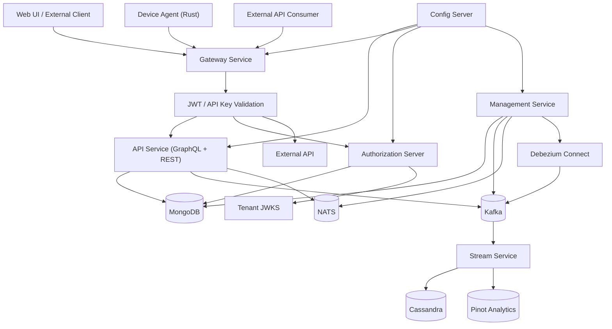
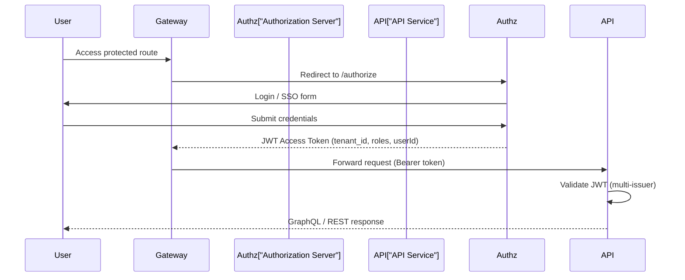
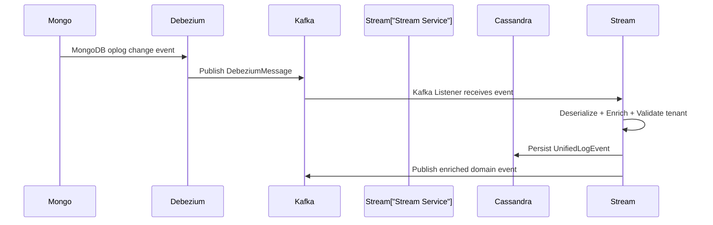
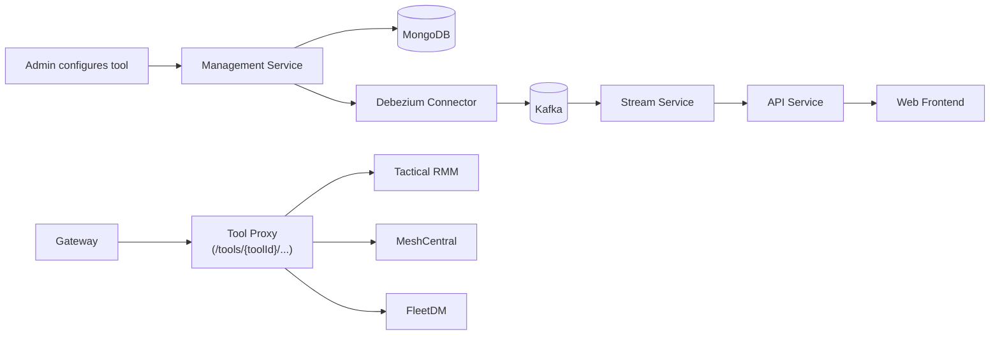
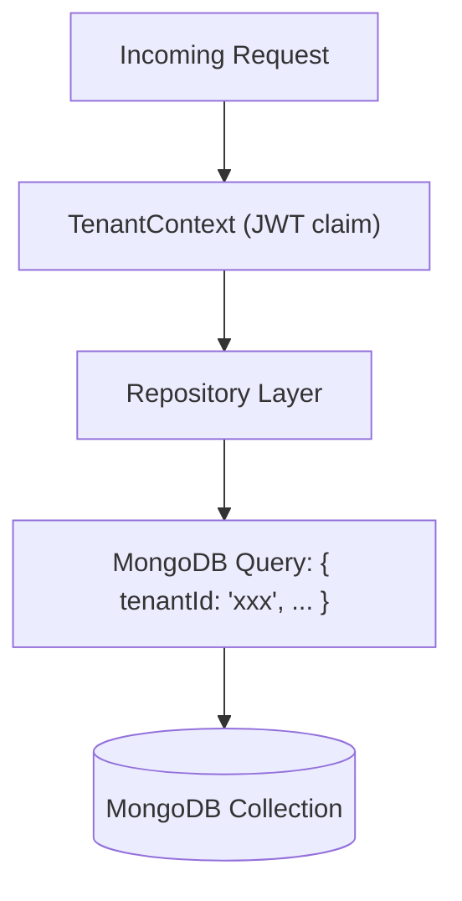
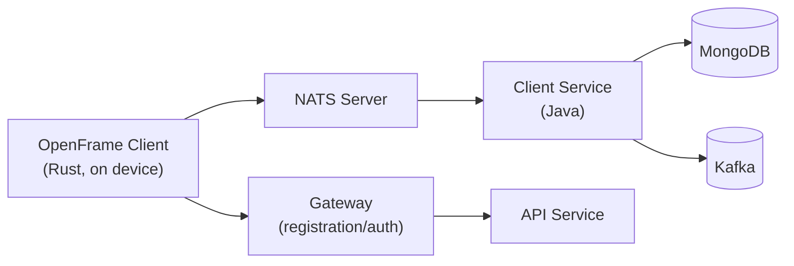
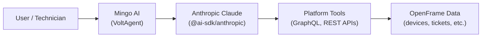
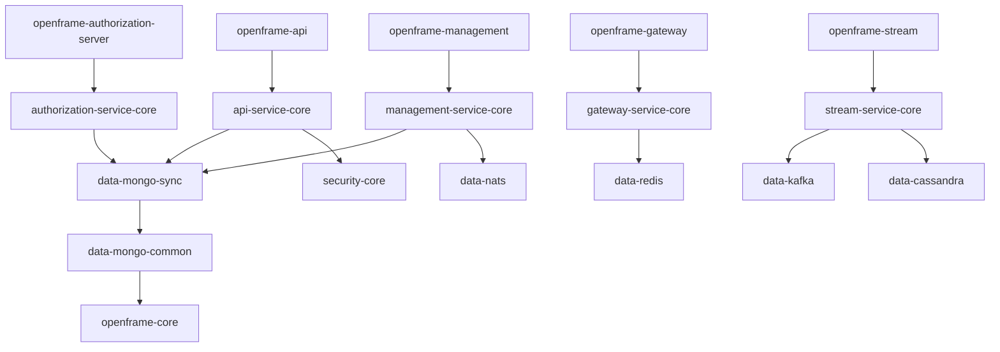

# Architecture Overview

OpenFrame OSS Tenant is a modular, event-driven, multi-tenant microservice platform built on Java (Spring Boot), Kafka, MongoDB, and a Next.js frontend. This document provides a high-level architectural overview.

---

## High-Level Architecture

---

## Core Service Components

| Service | Purpose | Technology |
|---------|---------|-----------|
| **Gateway** | Single entry point — JWT/API key validation, routing, WebSocket proxy | Spring Cloud Gateway (WebFlux) |
| **API Service** | GraphQL + REST business API surface | Spring Boot + Netflix DGS |
| **Authorization Server** | OAuth2 / OIDC identity provider, multi-tenant SSO | Spring Authorization Server |
| **Management Service** | Operational control plane — schedulers, migrations, tool lifecycle | Spring Boot + ShedLock |
| **Stream Service** | Kafka-based event processing, CDC, device event enrichment | Spring Boot + Kafka Streams |
| **External API** | Public REST API for third-party integrations | Spring Boot |
| **Config Server** | Centralized configuration distribution | Spring Cloud Config |
| **Frontend** | Next.js 15 web application | Next.js + React + Relay |
| **Client Agent** | Device-side agent for managed endpoints | Rust |
| **Chat Client** | Desktop AI chat application | Tauri + React |

---

## Authentication and Authorization Flow

### JWT Claims

Each JWT issued by the Authorization Server contains:

| Claim | Description |
|-------|-------------|
| `tenant_id` | Scopes the user to a specific tenant |
| `userId` | The authenticated user's identifier |
| `roles` | User roles (`ADMIN`, `OWNER`, `AGENT`, etc.) |
| `iss` | Tenant-specific issuer URL |
| `kid` | RSA key ID for JWKS validation |

---

## Change Data Capture (CDC) Flow

Debezium connectors are:
- Auto-provisioned by the Management Service
- Health-monitored with exponential backoff
- Tenant-scoped with dedicated topics

---

## Tool Integration Architecture

Supported tool types:
- **Tactical RMM** — Remote monitoring and management
- **MeshCentral** — Remote access and remote desktop
- **FleetDM** — Device fleet management and compliance

---

## Multi-Tenant Data Model

Every domain entity in MongoDB is scoped to a `tenantId`:

Key tenant-scoped documents:
- `users`, `auth_users`
- `organizations`
- `machines` (devices)
- `tickets`, `ticket_notes`, `ticket_statuses`
- `integrated_tools`
- `knowledge_base_items`
- `notifications`
- `tags`, `tag_assignments`
- `api_keys`

---

## OpenFrame Client (Agent) Architecture

The Rust agent:
1. Registers with the platform using an agent registration secret
2. Maintains a NATS connection for bidirectional messaging
3. Publishes heartbeat, tool connection, and installed agent events
4. Receives installation, update, and command messages

---

## AI Agent Layer

The Node.js tooling (`package.json`) wraps the platform with AI capabilities using:

Key packages:
- `@voltagent/core@2.7.6` — Agent orchestration and tool routing
- `@ai-sdk/anthropic@2.0.80` — Vercel AI SDK for Claude
- `@anthropic-ai/sdk@0.100.1` — Direct Anthropic SDK
- `zod@4.4.3` — Structured output validation

---

## Key Design Decisions

| Decision | Rationale |
|----------|-----------|
| **Spring WebFlux for Gateway** | Non-blocking reactive I/O for high-throughput edge routing |
| **Netflix DGS for GraphQL** | Production-grade DGS enables DataLoaders, batching, and Relay compliance |
| **Per-tenant RSA key pairs** | Cryptographic isolation — each tenant's JWTs cannot be validated by other tenants |
| **Debezium for CDC** | Event sourcing from MongoDB without application-level event publishing overhead |
| **ShedLock for scheduling** | Prevents duplicate scheduler execution across multiple service instances |
| **NATS JetStream for agents** | Low-latency, durable messaging with exactly-once semantics for device communications |
| **Relay pagination** | Cursor-based pagination enables efficient, scalable list queries |
| **Pluggable processors** | Key service behaviors (`AgentRegistrationProcessor`, `UserProcessor`, etc.) are interface-based for extension |

---

## Module Dependency Graph

