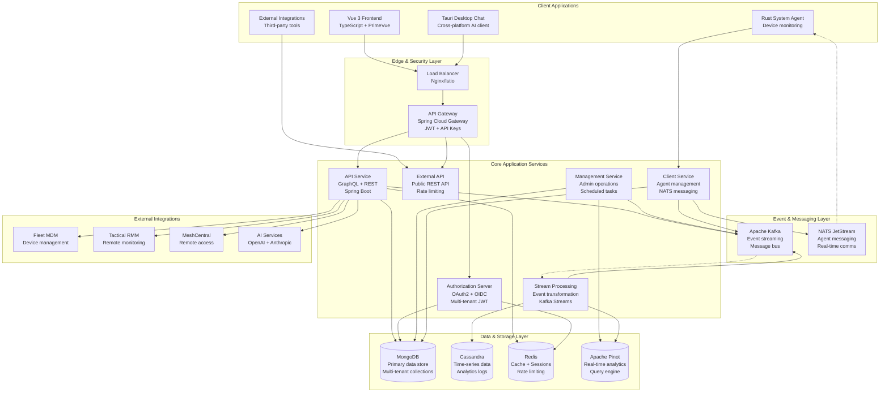
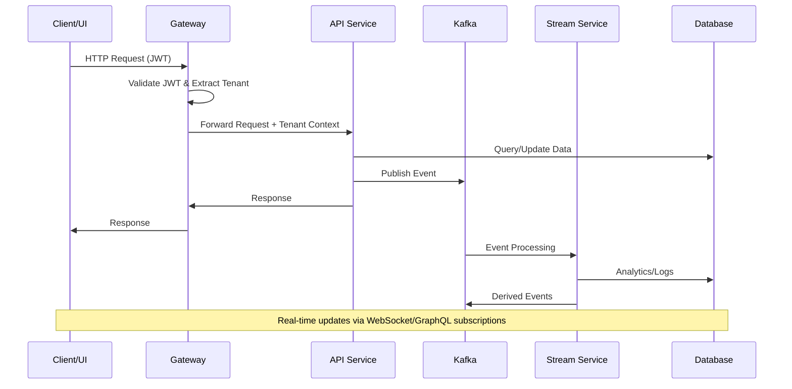
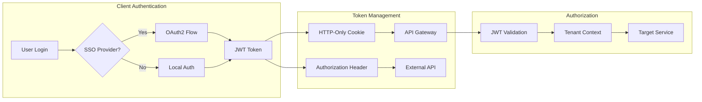
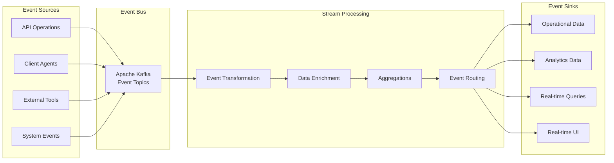
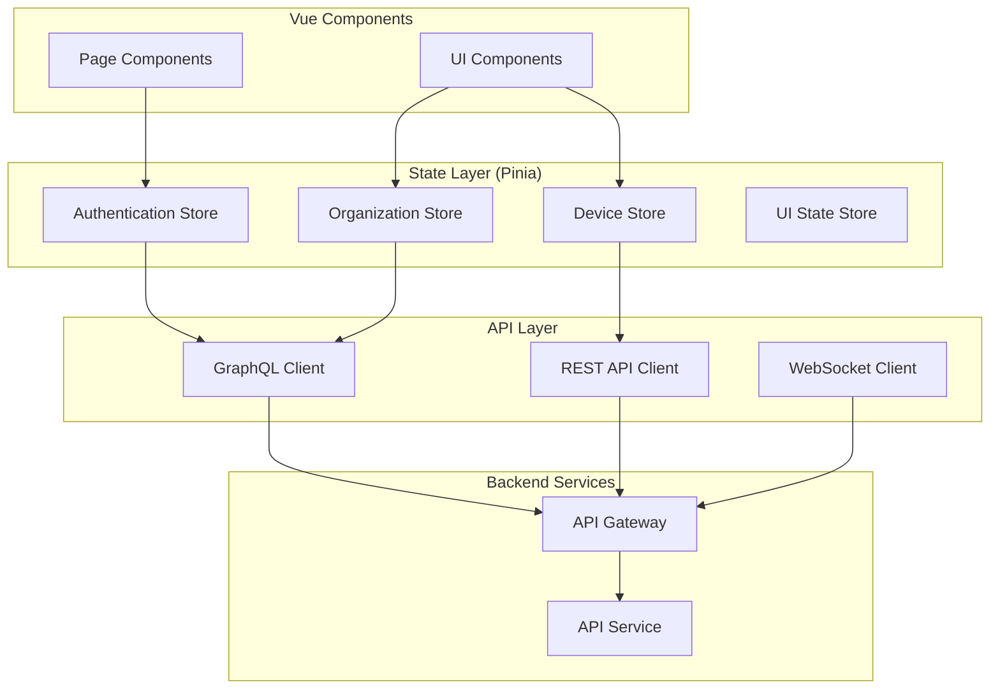

# Architecture Overview

This document provides a comprehensive overview of OpenFrame's architecture, design principles, and key components. Understanding this architecture is essential for contributing to or extending the OpenFrame platform.

## 🏗️ High-Level Architecture

OpenFrame follows a **modular, multi-service, event-driven architecture** designed for scalability, maintainability, and multi-tenant isolation.

### System Architecture Diagram



## 🎯 Core Design Principles

### 1. Multi-Tenancy First
- **Complete tenant isolation** across all data and operations
- **Organization-based partitioning** with secure tenant context
- **Per-tenant configuration** and customization capabilities
- **Tenant-aware caching** and performance optimization

### 2. Event-Driven Architecture
- **Apache Kafka** for high-throughput event streaming
- **Event sourcing** for audit trails and state reconstruction
- **CQRS patterns** with read/write separation
- **Real-time updates** via WebSocket and GraphQL subscriptions

### 3. API-First Design
- **GraphQL** for efficient client-server communication
- **REST APIs** for external integrations and legacy support
- **OpenAPI specifications** for all public endpoints
- **Versioned APIs** with backward compatibility

### 4. Security by Design
- **OAuth2/OIDC** for authentication and authorization
- **JWT tokens** with HTTP-only cookies for web security
- **API key authentication** for external integrations
- **End-to-end encryption** for sensitive data

### 5. Observability & Monitoring
- **Distributed tracing** with OpenTelemetry
- **Structured logging** with correlation IDs
- **Metrics collection** via Prometheus
- **Health checks** and circuit breakers

## 🏛️ Service Architecture

### Core Components Table

| Service | Technology | Port | Responsibility |
|---------|------------|------|---------------|
| **API Gateway** | Spring Cloud Gateway | 8080 | Request routing, authentication, rate limiting |
| **API Service** | Spring Boot + GraphQL | 8081 | Business logic, data management, GraphQL API |
| **Authorization Server** | Spring Authorization Server | 8082 | OAuth2/OIDC, JWT issuance, SSO integration |
| **Management Service** | Spring Boot | 8084 | Administrative tasks, system management, monitoring |
| **Client Service** | Spring Boot | 8083 | Agent management, device communication |
| **Stream Service** | Spring Boot + Kafka Streams | 8085 | Event processing, data transformation |
| **External API** | Spring Boot | 8086 | Public REST API, external integrations |
| **Frontend** | Vue 3 + Vite | 3000 | Web user interface, real-time updates |

### Data Flow Sequence



## 📊 Data Architecture

### Database Strategy

#### Primary Data Store (MongoDB)
```text
openframe_tenant_{tenant_id}/
├── organizations          # Client organizations
├── users                  # User accounts and profiles
├── devices                # Device/machine registry
├── api_keys              # API key management
├── events                # Application events
├── integrations          # External tool configurations
├── chat_dialogs          # AI conversation history
└── system_config         # System-wide configuration
```

#### Analytics & Time-Series (Cassandra)
```text
openframe_analytics/
├── unified_log_events    # Centralized logging
├── device_metrics        # Time-series device data
├── performance_metrics   # System performance data
├── audit_trail          # Security and compliance logs
└── event_aggregations   # Pre-computed analytics
```

#### Cache & Sessions (Redis)
```text
redis/
├── sessions:{tenant_id}  # User sessions
├── cache:{entity}        # Application cache
├── rate_limit:{key}      # API rate limiting
└── locks:{resource}      # Distributed locking
```

#### Real-Time Analytics (Apache Pinot)
```text
pinot_tables/
├── device_events_rt      # Real-time device events
├── log_events_rt         # Real-time log analysis
├── user_activity_rt      # Real-time user analytics
└── system_metrics_rt     # Real-time system monitoring
```

### Data Consistency Strategy

#### Eventual Consistency Model
- **Write operations** to primary MongoDB with immediate consistency
- **Event propagation** via Kafka for async processing
- **Read replicas** and caches updated asynchronously
- **Conflict resolution** using timestamp-based ordering

#### Transaction Boundaries
```text
1. Single Service = Strong Consistency (MongoDB transactions)
2. Cross-Service = Eventual Consistency (Kafka events)
3. External Systems = Best-Effort Consistency (retry mechanisms)
```

## 🔐 Security Architecture

### Authentication Flow



### Security Layers

#### 1. Network Security
- **TLS/HTTPS** for all external communications
- **mTLS** for internal service-to-service communication
- **Network segmentation** with firewall rules
- **VPN/private networks** for production deployments

#### 2. Application Security
- **Input validation** and sanitization at API boundaries
- **SQL injection prevention** with parameterized queries
- **XSS protection** with Content Security Policy
- **CSRF protection** with SameSite cookies

#### 3. Data Security
- **Encryption at rest** for sensitive data in databases
- **Encryption in transit** for all network communications
- **Key management** with secure key rotation
- **Data masking** for logs and audit trails

#### 4. Access Control
- **Role-based access control (RBAC)** with granular permissions
- **Multi-tenant data isolation** with strict tenant boundaries
- **API rate limiting** to prevent abuse
- **Audit logging** for all privileged operations

## 🚀 Scalability Architecture

### Horizontal Scaling Strategy

#### Stateless Services
All application services are designed to be stateless:
- **No local state** stored in application memory
- **Session data** stored in Redis cluster
- **Configuration** externalized via Spring Cloud Config
- **Load balancing** with round-robin or least-connections

#### Database Scaling
```text
MongoDB:
├── Read Replicas (3+ nodes)
├── Sharding by tenant_id
└── Connection pooling

Cassandra:
├── Multi-node cluster (3+ nodes)
├── Replication factor 3
└── Consistent hashing

Redis:
├── Cluster mode (6+ nodes)
├── Automatic failover
└── Memory optimization
```

#### Event Streaming Scaling
```text
Kafka:
├── Multiple brokers (3+ nodes)
├── Topic partitioning by tenant_id
├── Consumer groups for parallel processing
└── Retention policies for storage management
```

### Performance Optimization

#### Caching Strategy
1. **L1 Cache**: Application-level caching (Caffeine)
2. **L2 Cache**: Distributed caching (Redis)
3. **L3 Cache**: CDN for static assets
4. **Database query optimization** with proper indexing

#### Connection Management
- **Connection pooling** for all database connections
- **Circuit breakers** for external service calls
- **Bulkhead pattern** for resource isolation
- **Timeout configuration** for all network calls

## 🔄 Event Processing Architecture

### Event Streaming Pipeline



### Event Types and Schemas

#### Core Event Categories
1. **Device Events**: Agent status, metrics, configuration changes
2. **User Events**: Authentication, authorization, profile updates
3. **Organization Events**: Tenant operations, billing, configuration
4. **Integration Events**: External tool synchronization
5. **System Events**: Health checks, performance metrics, errors

#### Event Schema Example
```json
{
  "eventId": "uuid",
  "eventType": "device.status.changed",
  "tenantId": "tenant-uuid",
  "timestamp": "2024-01-15T10:30:00Z",
  "source": "openframe-agent",
  "version": "1.0",
  "data": {
    "deviceId": "device-uuid",
    "previousStatus": "offline",
    "currentStatus": "online",
    "metadata": {}
  }
}
```

## 🎨 Frontend Architecture

### Vue.js Application Structure

```text
openframe-frontend/
├── src/
│   ├── app/                    # Feature-based routes
│   │   ├── auth/              # Authentication pages
│   │   ├── dashboard/         # Main dashboard
│   │   ├── devices/           # Device management
│   │   ├── organizations/     # Organization management
│   │   └── settings/          # System settings
│   ├── components/            # Shared UI components
│   ├── lib/                   # Core utilities
│   │   ├── api-client.ts      # HTTP client wrapper
│   │   ├── graphql-client.ts  # GraphQL client
│   │   └── auth-client.ts     # Authentication logic
│   ├── stores/                # Pinia state management
│   └── types/                 # TypeScript definitions
```

### State Management Architecture



## 🔧 Key Design Decisions

### Technology Choices

| Decision | Technology | Rationale |
|----------|------------|-----------|
| **Backend Language** | Java 21 + Spring Boot | Enterprise maturity, extensive ecosystem, team expertise |
| **API Style** | GraphQL + REST | GraphQL for UI efficiency, REST for external integrations |
| **Database** | MongoDB + Cassandra | Document model for flexibility, time-series for analytics |
| **Message Bus** | Apache Kafka | High-throughput, durability, stream processing capabilities |
| **Frontend Framework** | Vue 3 + TypeScript | Developer productivity, TypeScript safety, component ecosystem |
| **Client Agent** | Rust | Performance, memory safety, cross-platform compatibility |
| **Authentication** | OAuth2/OIDC + JWT | Industry standards, SSO integration, stateless tokens |

### Architecture Trade-offs

#### Eventual Consistency vs Strong Consistency
- **Choice**: Eventual consistency for cross-service operations
- **Trade-off**: Complexity vs scalability and availability
- **Mitigation**: Clear consistency boundaries and conflict resolution

#### Microservices vs Monolith
- **Choice**: Modular microservices with shared libraries
- **Trade-off**: Operational complexity vs independent deployment
- **Mitigation**: Comprehensive testing and deployment automation

#### Multi-tenancy Strategy
- **Choice**: Shared infrastructure with tenant isolation
- **Trade-off**: Resource efficiency vs complete isolation
- **Mitigation**: Strict tenant context enforcement and monitoring

## 📚 Further Reading

### Deep-Dive Documentation
- **[API Service Core](../../../docs/architecture/api_service_core_runtime_and_security/api_service_core_runtime_and_security.md)**: Detailed API service architecture
- **[Frontend Architecture](../../../docs/architecture/frontend_openframe_app_core_clients_and_mingo/frontend_openframe_app_core_clients_and_mingo.md)**: Complete frontend design
- **[Stream Processing](../../../docs/architecture/stream_processing_service_core/stream_processing_service_core.md)**: Event processing architecture

### Implementation Guides
- **[Security Guidelines](../security/README.md)**: Security implementation details
- **[Testing Strategy](../testing/README.md)**: Testing architecture and practices

### External Resources
- **Spring Boot Documentation**: [https://spring.io/projects/spring-boot](https://spring.io/projects/spring-boot)
- **Vue.js Guide**: [https://vuejs.org/guide/](https://vuejs.org/guide/)
- **Apache Kafka Documentation**: [https://kafka.apache.org/documentation/](https://kafka.apache.org/documentation/)

---

**Understanding the architecture?** Next, explore the [Security Best Practices](../security/README.md) to understand how OpenFrame implements security across all these components.