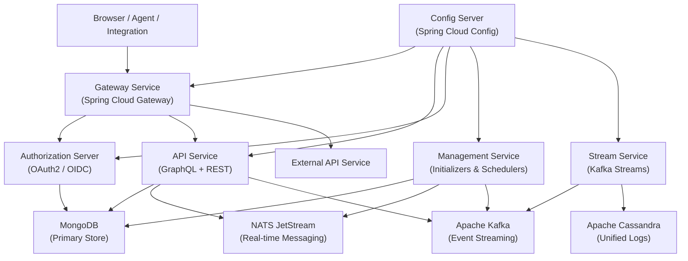
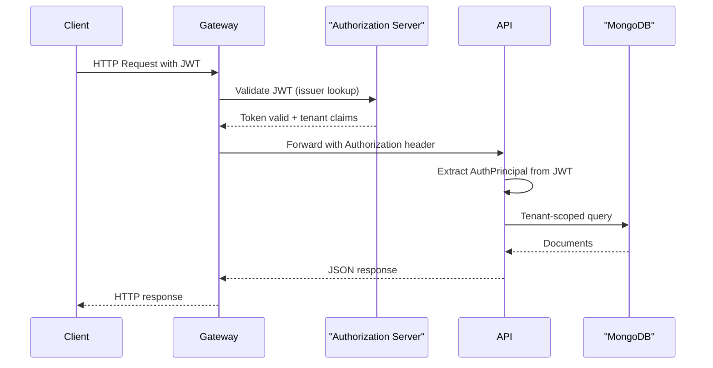
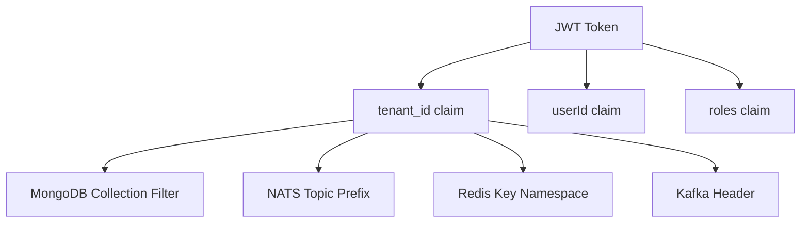
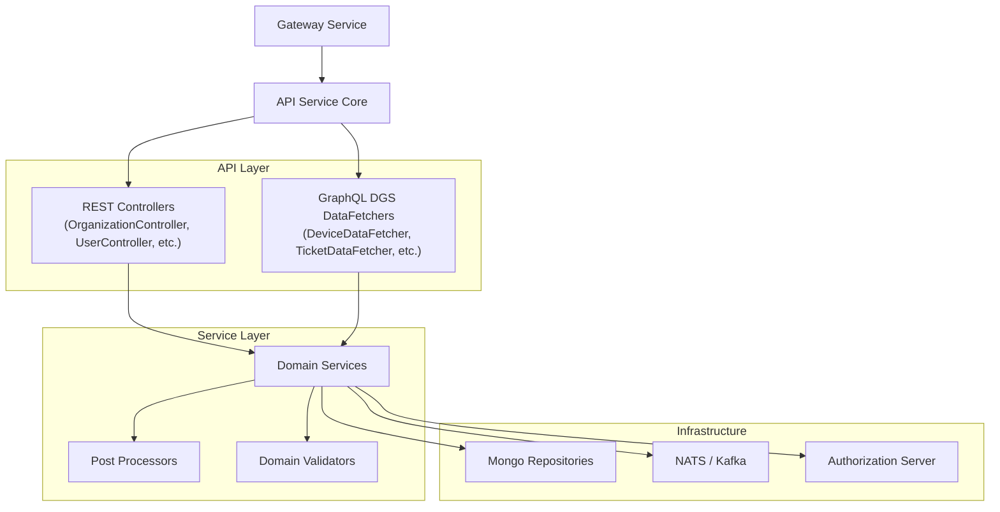
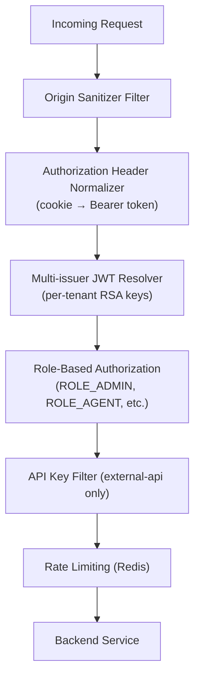
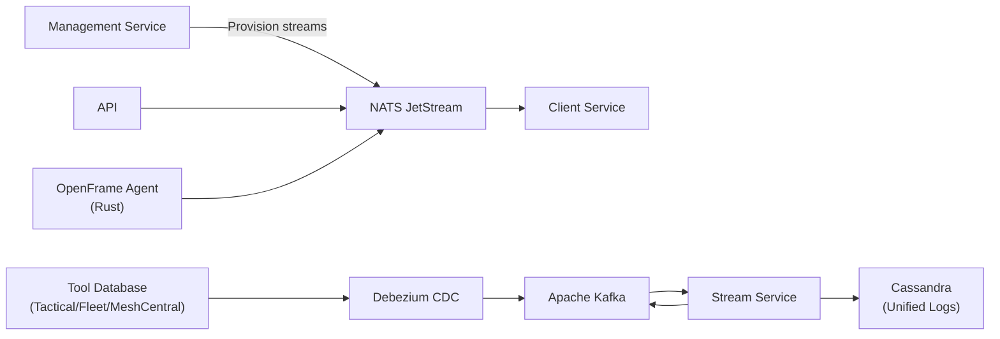
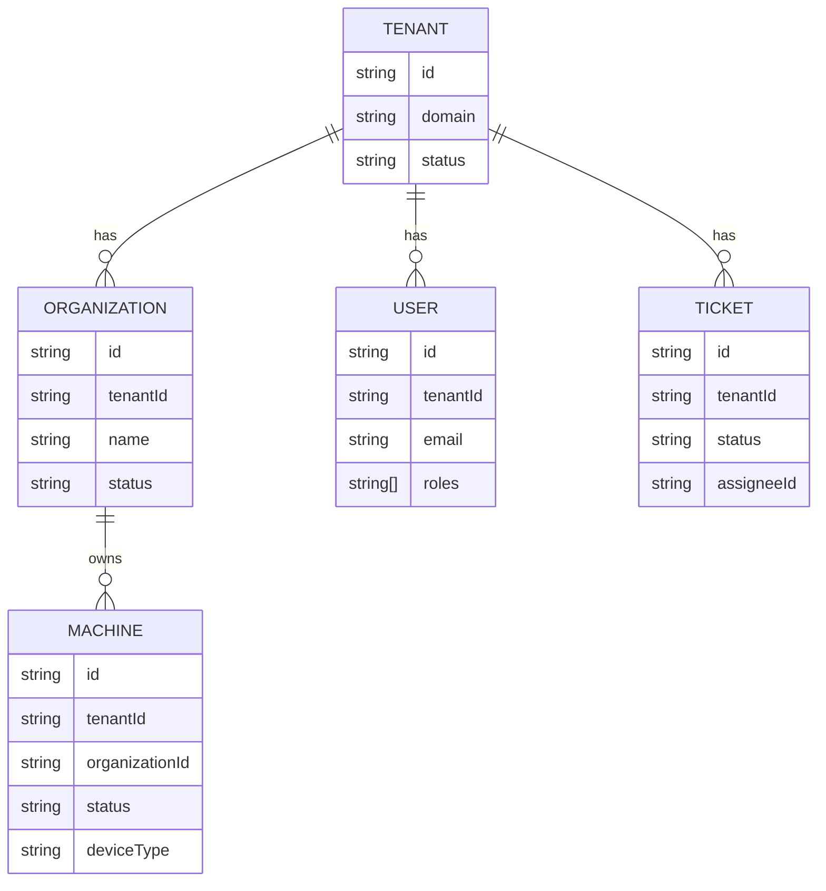

# Architecture Overview

OpenFrame OSS Tenant is a **modular, library-driven, multi-tenant microservices platform** built on Spring Boot 3.3 and Java 21. This document provides a comprehensive overview of the system architecture.

---

## High-Level Architecture

---

## Core Components

| Service | Technology | Responsibility |
|---|---|---|
| **Gateway** | Spring Cloud Gateway (Reactive) | Routing, JWT validation, API key auth, WebSocket proxy, rate limiting |
| **Authorization Server** | Spring Authorization Server | OAuth2/OIDC, multi-tenant JWT, SSO (Google/Microsoft), tenant registration |
| **API Service** | Spring Boot + Netflix DGS | GraphQL + REST API layer for frontend and integrations |
| **External API** | Spring Boot | Restricted REST surface for third-party integrations |
| **Management Service** | Spring Boot | Startup initializers, schedulers, migrations, tool configuration |
| **Stream Service** | Spring Boot + Kafka Streams | Debezium CDC ingestion, event normalization, Cassandra logging |
| **Client Service** | Spring Boot | Agent-facing APIs, device registration, NATS communication |
| **Config Server** | Spring Cloud Config | Centralized configuration for all services |

---

## Design Principles

1. **Multi-tenancy by default** — Every layer enforces `tenantId` isolation: MongoDB queries, JWT claims, NATS topics, Redis keys, and Kafka topics are all tenant-scoped.
2. **Modular library architecture** — Core logic lives in `openframe-oss-lib`. Runtime services (`openframe-oss-tenant`) compose those libraries into deployable applications.
3. **Gateway-first security** — The Gateway handles authentication, authorization header normalization, and rate limiting before requests reach backend services.
4. **Event-driven communication** — Services communicate asynchronously via Kafka (durable, ordered) and NATS (real-time, low-latency).
5. **Extensible processor pattern** — Default implementations (`DefaultXxxProcessor`) can be overridden in SaaS or enterprise deployments.

---

## Authenticated Request Flow

---

## Multi-Tenant Model

Each JWT access token carries:
- `tenant_id` — scopes all data operations
- `userId` — identifies the authenticated user
- `roles` — `ROLE_ADMIN`, `ROLE_AGENT`, `ROLE_OWNER`, etc.

Every MongoDB query is automatically filtered by `tenantId`. This is enforced at the repository level in `openframe-oss-lib`.

---

## API Layer Architecture

### GraphQL API

The GraphQL API uses **Netflix DGS** with:
- **Relay-style pagination** — Cursor-based with global IDs
- **DataLoaders** — Batch loading for N+1 prevention
- **Custom scalars** — `Date`, `Instant`, `Long`
- **Multi-issuer JWT** — Auth principal resolved from tenant-scoped tokens

### REST API

REST endpoints handle mutations and operational tasks:
- Identity & access (users, invitations, API keys, SSO)
- Organization and device management
- Agent registration and force operations
- Health and version endpoints

---

## Security Architecture

Key security features:
- **Per-tenant RSA keys** — Each tenant has its own signing key pair stored encrypted in MongoDB
- **Multi-issuer JWT validation** — Gateway validates tokens from any tenant's issuer
- **PKCE support** — Secure public client flows
- **API key rate limiting** — Sliding window rate limiting via Redis

---

## Messaging Architecture

**NATS JetStream** handles:
- Agent heartbeats and metrics
- Tool installation commands
- Client update notifications
- Notification broadcasts

**Apache Kafka** handles:
- Debezium CDC events from integrated tools
- Durable event streaming for audit logs
- Kafka Streams joins for activity enrichment

---

## Data Model Overview

All documents include `tenantId` for multi-tenant isolation enforced at the repository layer.

---

## Key Design Decisions

| Decision | Rationale |
|---|---|
| **Spring Boot 3.3 + Java 21** | LTS release, virtual threads support, modern language features |
| **Netflix DGS for GraphQL** | Production-proven, DataLoader support, Spring integration |
| **MongoDB as primary store** | Schema flexibility for MSP data, multi-tenant isolation via `tenantId`, Debezium CDC |
| **NATS for agent messaging** | Ultra-low latency, persistent JetStream, ideal for real-time agent communication |
| **Kafka for event streaming** | Durable, ordered, exactly-once semantics for audit logs |
| **Per-tenant RSA keys** | Cryptographic isolation, key rotation support, OIDC compliance |
| **Config Server** | Centralized configuration management, environment-specific overrides |

---

## Reference Documentation

For deep dives into each module:

- [API Service Core](./architecture/api-service-core-graphql-and-rest/api-service-core-graphql-and-rest.md) — GraphQL + REST details
- [Authorization Server Core](./architecture/authorization-server-core/authorization-server-core.md) — OAuth2/OIDC implementation
- [Gateway Service Core](./architecture/gateway-service-core-routing-and-security/gateway-service-core-routing-and-security.md) — Routing and security
- [Stream Processing Core](./architecture/stream-processing-core/stream-processing-core.md) — Kafka event pipeline
- [Management Service Core](./architecture/management-service-core-initialization-and-scheduling/management-service-core-initialization-and-scheduling.md) — Initialization and schedulers
- [Data Mongo Domain](./architecture/data-mongo-domain-and-repositories/data-mongo-domain-and-repositories.md) — Data model and repositories
- [Service Runtime Applications](./architecture/service-runtime-applications/service-runtime-applications.md) — Spring Boot app entry points
