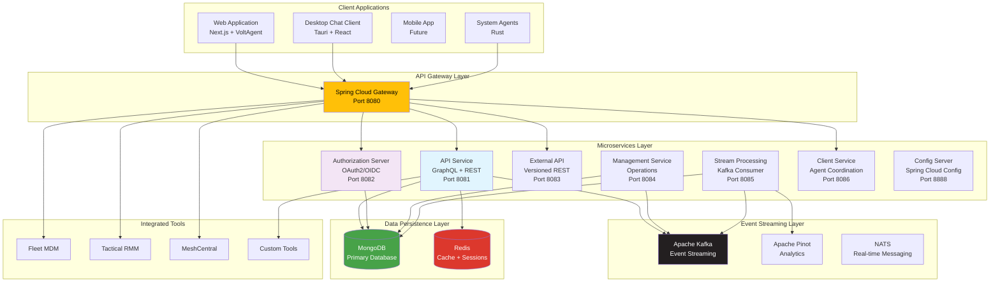
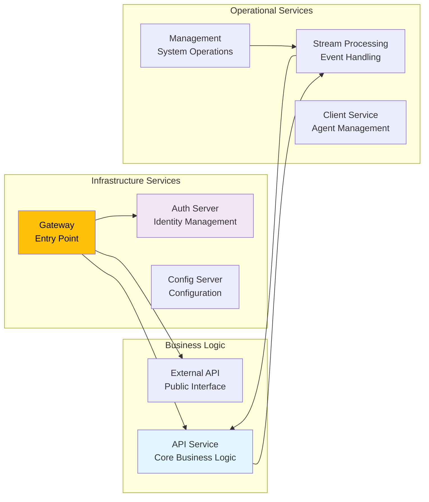
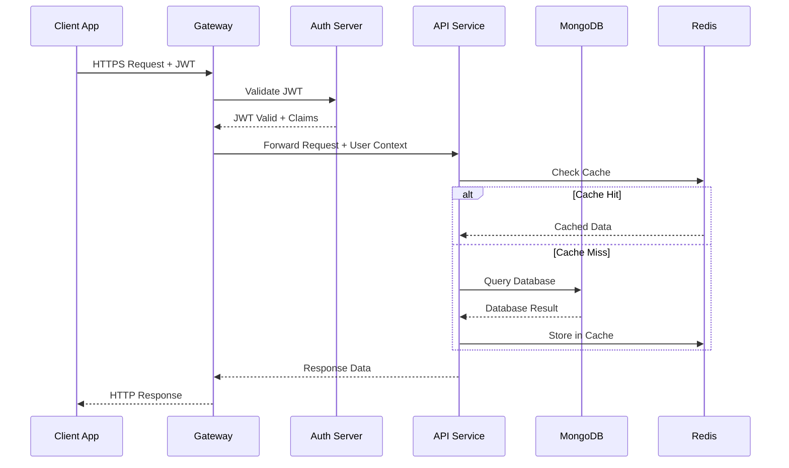
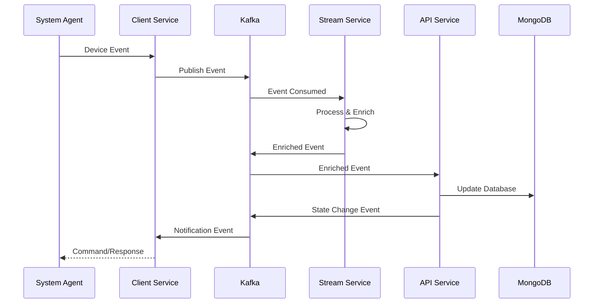
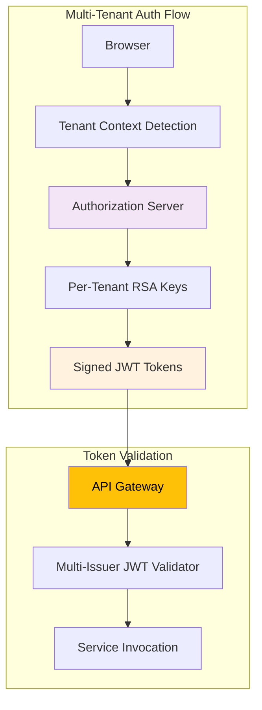
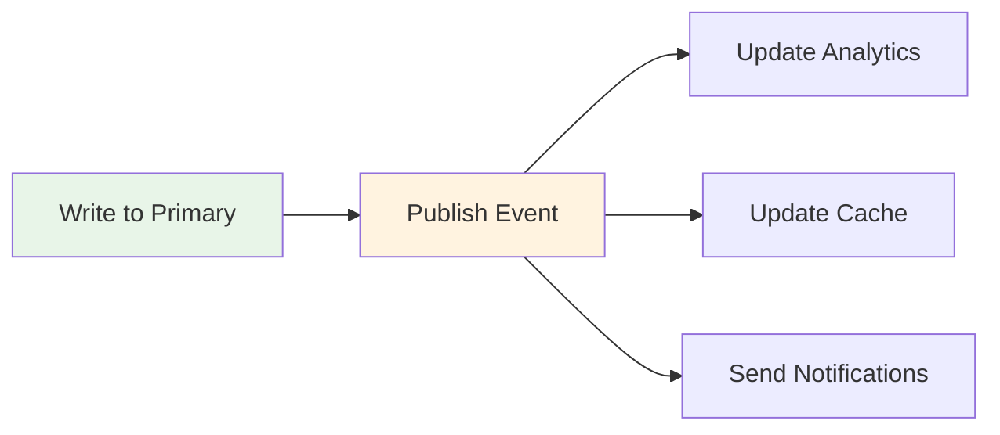
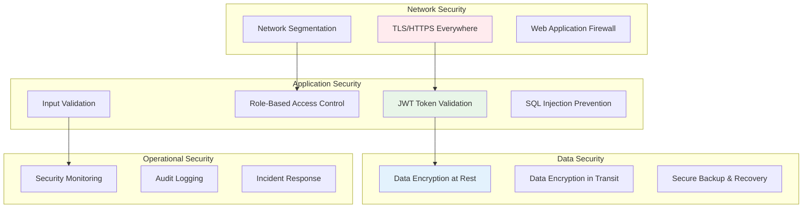
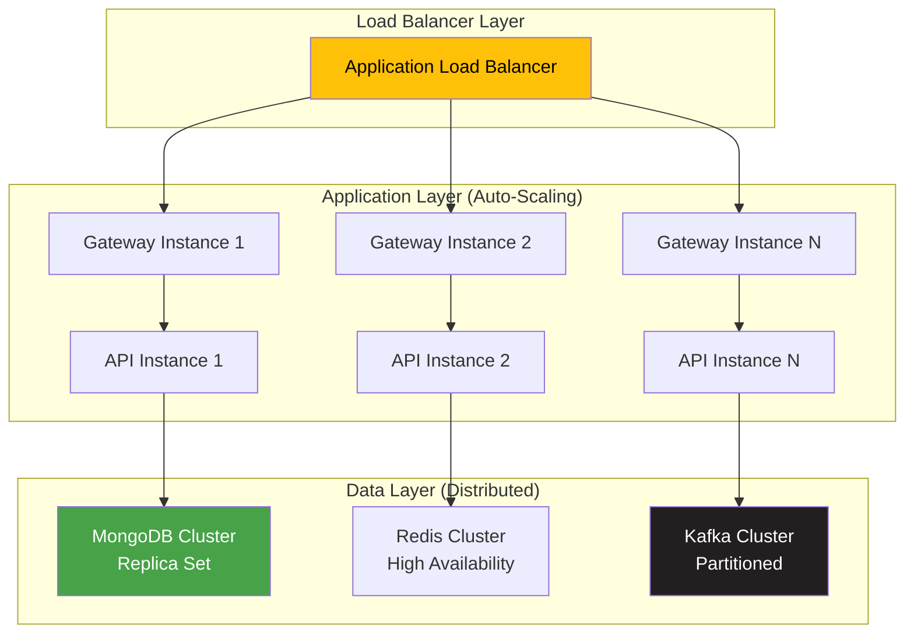
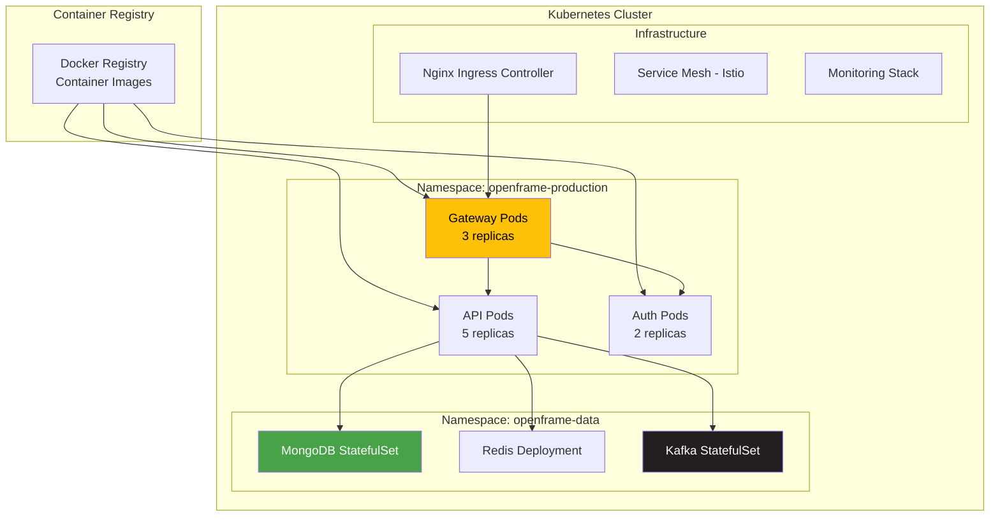

# Architecture Overview

OpenFrame is designed as a modern, cloud-native platform using microservices architecture patterns. This guide provides a comprehensive overview of the system design, component interactions, and key architectural decisions.

## High-Level System Architecture



## Core Components Overview

### Client Applications Layer

| Component | Technology | Purpose | Key Features |
|-----------|------------|---------|-------------|
| **Web Application** | Next.js 16 + VoltAgent | Primary user interface | AI-powered UI, responsive design, SSR |
| **Desktop Chat Client** | Tauri + React | AI assistant interface | Native performance, secure token storage |
| **System Agents** | Rust | Device monitoring | Low resource usage, cross-platform |

### API Gateway Layer

**Spring Cloud Gateway** serves as the single entry point for all client requests:

- **JWT Validation**: Multi-issuer JWT verification
- **API Key Authentication**: For programmatic access
- **Rate Limiting**: Per-client request throttling
- **WebSocket Proxying**: Real-time communication support
- **Tool Routing**: Dynamic routing to integrated tools
- **CORS Management**: Cross-origin request handling

### Microservices Layer



#### Service Responsibilities

**API Service (Port 8081)**
- **Primary Role**: Core business logic and data operations
- **Technologies**: Spring Boot, Netflix DGS (GraphQL), MongoDB
- **Key Features**:
  - GraphQL API with DataLoader optimization
  - REST endpoints for mutations
  - Multi-tenant data isolation
  - Business rule enforcement

**Authorization Server (Port 8082)**
- **Primary Role**: Identity and access management
- **Technologies**: Spring Authorization Server, OAuth2/OIDC
- **Key Features**:
  - Multi-tenant OAuth2 flows
  - Dynamic SSO provider integration
  - JWT token management
  - User registration and invitation flows

**External API (Port 8083)**
- **Primary Role**: Public API for integrations
- **Technologies**: Spring Boot, OpenAPI/Swagger
- **Key Features**:
  - Versioned REST API
  - Rate limiting and quotas
  - API key management
  - Public documentation

**Management Service (Port 8084)**
- **Primary Role**: System operations and orchestration
- **Technologies**: Spring Boot, Scheduled Tasks
- **Key Features**:
  - Database initialization
  - Health monitoring
  - Automated maintenance tasks
  - System metrics collection

**Stream Processing Service (Port 8085)**
- **Primary Role**: Event processing and data enrichment
- **Technologies**: Spring Kafka, Apache Kafka Streams
- **Key Features**:
  - Real-time event processing
  - Data transformation pipelines
  - Integration with external tools
  - Analytics data preparation

**Client Service (Port 8086)**
- **Primary Role**: Agent coordination and communication
- **Technologies**: Spring Boot, NATS
- **Key Features**:
  - Agent registration and authentication
  - Command dispatch to agents
  - File transfer coordination
  - Tool installation management

## Data Flow Architecture

### Request-Response Flow



### Event-Driven Flow



## Key Design Decisions

### Multi-Tenancy Strategy

**Database-Level Isolation:**
```text
Collection Structure:
├── organizations (tenant_id: ObjectId)
├── users (organization_id: ObjectId)
├── devices (organization_id: ObjectId)
└── events (organization_id: ObjectId)
```

**Benefits:**
- Complete data isolation between tenants
- Simplified backup and recovery per tenant
- Flexible per-tenant configuration
- Scalable to thousands of tenants

**Trade-offs:**
- Slightly more complex queries (tenant filtering)
- Additional indexes required
- More careful migration planning

### Authentication & Authorization Architecture



**Key Features:**
- **Per-Tenant Keys**: Each tenant uses unique RSA key pairs
- **Dynamic SSO**: Runtime SSO provider configuration
- **Session Management**: Redis-backed session storage
- **API Key Support**: Programmatic access with scoped permissions

### Data Consistency Patterns

**Eventual Consistency for Events:**


**Strong Consistency for Transactions:**
- User authentication and authorization
- Financial and billing operations
- Critical configuration changes

**Benefits:**
- High performance for read operations
- Scalable event processing
- Resilient to temporary service outages

### Microservices Communication Patterns

**Synchronous Communication:**
- Client-to-service: HTTP/HTTPS with JWT
- Service-to-service: Internal HTTP with service accounts
- External integrations: HTTP/HTTPS with API keys

**Asynchronous Communication:**
- Event streaming: Apache Kafka for data events
- Real-time messaging: NATS for command/control
- Batch processing: Scheduled tasks and background jobs

## Security Architecture

### Defense in Depth Strategy



### Security Controls

| Layer | Control | Implementation |
|-------|---------|----------------|
| **Transport** | TLS 1.3 | All communications encrypted |
| **Authentication** | OAuth2/OIDC | Multi-tenant identity management |
| **Authorization** | JWT + RBAC | Token-based access control |
| **Data** | AES-256 | Encryption at rest and in transit |
| **Network** | Private subnets | Service mesh communication |
| **Monitoring** | Audit logs | Comprehensive activity tracking |

## Performance and Scalability

### Horizontal Scaling Strategy



### Performance Optimizations

**Caching Strategy:**
- **L1 Cache**: Application-level caching with Caffeine
- **L2 Cache**: Redis distributed cache
- **L3 Cache**: CDN for static assets

**Database Optimization:**
- **Read Replicas**: Separate read and write operations
- **Indexing Strategy**: Compound indexes for complex queries
- **Connection Pooling**: HikariCP for optimal connection management

**Event Processing:**
- **Partitioning**: Kafka topic partitioning for parallel processing
- **Batch Processing**: Grouped event processing for efficiency
- **Consumer Groups**: Multiple consumers for scalability

## Deployment Architecture

### Container Strategy



### Environment Strategy

| Environment | Purpose | Infrastructure | Deployment |
|-------------|---------|---------------|------------|
| **Development** | Local development | Docker Compose | Manual |
| **Staging** | Integration testing | Kubernetes (single node) | CI/CD Pipeline |
| **Production** | Live system | Kubernetes (multi-node) | GitOps + Automation |

## Monitoring and Observability

### Three Pillars of Observability

```mermaid
graph TB
    subgraph "Metrics"
        Prometheus[Prometheus<br/>Time Series DB]
        Grafana[Grafana<br/>Dashboards]
        Alerts[Alert Manager<br/>Notifications]
    end
    
    subgraph "Logging"
        Loki[Loki<br/>Log Aggregation]
        Fluent[Fluent Bit<br/>Log Shipping]
        LogDash[Log Dashboards]
    end
    
    subgraph "Tracing"
        Jaeger[Jaeger<br/>Distributed Tracing]
        OpenTel[OpenTelemetry<br/>Instrumentation]
        TraceDash[Trace Analysis]
    end
    
    Prometheus --> Grafana
    Grafana --> Alerts
    
    Fluent --> Loki
    Loki --> LogDash
    
    OpenTel --> Jaeger
    Jaeger --> TraceDash
    
    style Prometheus fill:#e6522c,color:#fff
    style Grafana fill:#f46800,color:#fff
    style Loki fill:#00d4aa,color:#000
```



### Key Performance Indicators (KPIs)

**Application Metrics:**
- Request latency (P50, P95, P99)
- Error rates by service
- Throughput (requests per second)
- CPU and memory utilization

**Business Metrics:**
- User registration rate
- AI conversation engagement
- Device onboarding success rate
- Multi-tenant usage patterns

**System Health:**
- Database connection pool utilization
- Kafka consumer lag
- Cache hit rates
- Service availability (uptime)

## Future Architecture Considerations

### Planned Enhancements

**AI/ML Integration:**
- Dedicated AI inference services
- Model serving infrastructure
- Training pipeline automation
- Vector database for embeddings

**Edge Computing:**
- Edge deployment capabilities
- Offline-first agent functionality
- Local data processing
- Sync mechanisms

**Advanced Analytics:**
- Real-time analytics dashboards
- Predictive maintenance algorithms
- Anomaly detection systems
- Custom reporting engines

---

This architecture overview provides the foundation for understanding OpenFrame's design principles and technical implementation. The modular, scalable design enables rapid development, easy maintenance, and future growth.

**Next Steps:**
- [Security Best Practices](../security/README.md) - Deep dive into security implementation
- [Local Development](../setup/local-development.md) - Set up your development environment
- [Testing Strategy](../testing/README.md) - Learn about our testing approach

> **💡 Architecture Tip**: OpenFrame's microservices architecture allows you to focus on specific services without understanding the entire system. Start with the API service for business logic or the Gateway service for routing and security.