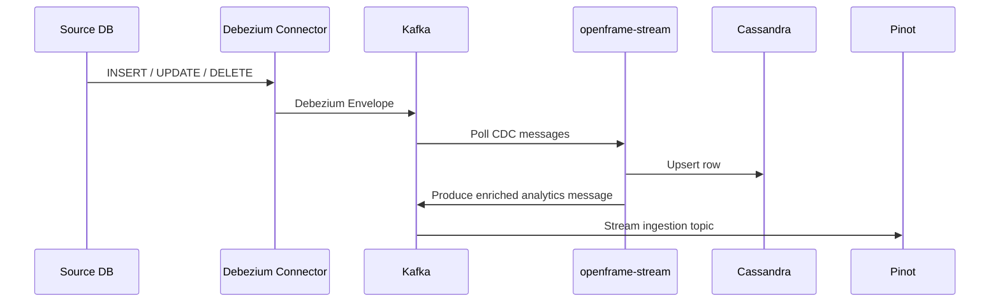

# Streaming Pipeline Architecture

This document describes how data flows from external *Integrated Tools* (e.g. Tactical RMM, Fleet MDM, MeshCentral, Authentik) through Debezium **change-data-capture (CDC)** into Kafka, where it is processed by the `openframe-stream` micro-service and finally persisted in downstream stores (Cassandra for OLTP workloads and Apache Pinot for analytics).

## High-Level Flow

```mermaid
graph LR
    subgraph Integrated Tools
        db1[(Tactical RMM<br/>PostgreSQL)]
        db2[(Fleet MDM<br/>MySQL)]
        db3[(MeshCentral<br/>MongoDB)]
        db4[(Authentik<br/>PostgreSQL)]
    end

    subgraph Debezium Connect
        Debezium((Debezium Connect
        Cluster))
    end

    subgraph Kafka
        topicCDC["<tool>.<schema>.<table>  topics"]
        topicInternal["_debezium-internal"]
    end

    subgraph Stream Processing
        OFStream[openframe-stream
        (Kafka Streams)]
    end

    subgraph Sinks
        cassandra[(Cassandra)]
        pinot[(Kafka  ➜  Apache Pinot)]
    end

    db1 -- binlog --> Debezium
    db2 -- binlog --> Debezium
    db3 -- Oplog  --> Debezium
    db4 -- WAL    --> Debezium
    Debezium -->|CDC events| topicCDC
    Debezium -->|Schema / offsets| topicInternal

    topicCDC --> OFStream
    OFStream -->|Mutations| cassandra
    OFStream -->|Enriched events| pinot
```

## Component Breakdown

| Layer | Component | Responsibilities                                                                                                                                                                                                                                                                              |
|-------|-----------|-----------------------------------------------------------------------------------------------------------------------------------------------------------------------------------------------------------------------------------------------------------------------------------------------|
| **Integrated Tools** | Tactical RMM, Fleet MDM, MeshCentral, Authentik, … | Operate their own databases; any INSERT / UPDATE / DELETE is the single source of truth.                                                                                                                                                                                                      |
| **Debezium Connect** | A Helm-managed Kafka Connect cluster with Debezium connectors | • Tail the tool databases via native logs<br/>• Convert row changes into *Debezium Envelopes* (`before`, `after`, `op`, `ts_ms` …)<br/>• Publish envelopes to tool-specific Kafka topics.<br/>• Maintain connector offsets & schema topics.                                                   |
| **Kafka** | Strimzi / Confluent cluster | Message backbone; decouples producers (Debezium) from consumers (`openframe-stream`, Pinot Ingestion jobs, etc.).                                                                                                                                                                             |
| **openframe-stream** | Spring Boot + Kafka Streams micro-service | • Deserialize Debezium messages.<br/>• Enrich with external context (organisation, site, user).<br/>• Route to **Cassandra** (OLTP) and back to Kafka for **Pinot**.<br/>• Apply idempotent upserts, deduplication and data-quality guards.<br/>• Expose health / lag metrics via Micrometer. |
| **Sinks** | Cassandra, Apache Pinot | • **Cassandra** – canonical state for transactional queries (device list, user inventory).<br/>• **Pinot** – OLAP store for dashboards & ad-hoc analytics (time-series, aggregations).                                                                                                        |

## Debezium Connect Details

* **Deployment**: Packaged as a Helm chart (`manifests/datasources/debezium-connect`).  Each replica runs ```quay.io/debezium/connect:2.x``` with the following plugins pre-installed:
  * `debezium-connector-mysql`
  * `debezium-connector-postgres`
  * `debezium-connector-mongodb`
  * `debezium-connector-mssql` (future)
* **Connector naming convention**: `<tool>-<db>-cdc` (e.g. `fleetmdm-mysql-cdc`).
* **Topic naming** (Debezium default): `<server>.<schema>.<table>`.
* **Schema registry**: Not required—Debezium messages are JSON-encoded to simplify polyglot consumption.

## Kafka Topic Strategy

```text
__debezium-heartbeat.<conn>          // Heart-beat per connector
__debezium-offsets                   // Connector offsets (compacted)
__debezium-topic-configs             // Connector configurations

fleetmdm.public.hosts                // Row-level CDC topic
fleetmdm.public.activities           // …
tactical.msp.scripts                 // …
```

* **Compaction**: CDC topics are *append-only*; they are **not** compacted to keep a full audit trail.
* **Partitions**: Default *= N cores* of source DB; ensures ordered events per primary-key.

## `openframe-stream` Internals

### Project Structure

```text
openframe-stream/
 ├── config/              // Kafka & Streams configuration
 ├── deserializer/        // Converts Debezium envelopes → domain DTOs
 ├── processor/           // GenericJsonMessageProcessor, per-entity Streams topologies
 ├── handler/             // Destination-specific sinks (CassandraWriter, PinotProducer)
 ├── service/             // Data enrichment services (look-ups, caching)
 └── model/               // Stream-layer DTOs
```

### Processing Steps

1. **Deserialization** – Convert `CommonDebeziumMessage` ➜ `DeserializedDebeziumMessage` via the appropriate `KafkaMessageDeserializer` (selected by `MessageType`).
2. **Enrichment** – Join with static/reference data (organisation, asset metadata) supplied by `DataEnrichmentService` implementations.
3. **Routing** – For each `Destination` defined on the `MessageType`, delegate to the corresponding `MessageHandler`:
   * **Cassandra** – Perform upsert using *lightweight transactions* to guarantee idempotency.
   * **Pinot** – Re-serialize enriched message to *Avro/JSON* and publish to `<entity>-analytics` Kafka topic (consumed by Pinot stream ingestion).  
4. **Acknowledgement** – Commit Kafka offsets only after *all* destinations succeed ➜ *at-least-once* semantics.

### Failure & Retry

* Transient handler failures are retried *in-process* with exponential back-off (max 5 attempts).
* Persistent failures are redirected to `<topic>.DLQ` where they are inspected and replayed manually.

## Data Lineage



## Observability

| Metric | Source | Grafana Dashboard |
|--------|--------|-------------------|
| `kafka.consumer.lag` | openframe-stream | *Streaming ➜ Consumer Lag* |
| `streams.task.process.rate` | openframe-stream | *Streaming ➜ Task Throughput* |
| `cassandra.write.latency` | Micrometer + DataStax driver | *Cassandra ➜ Driver Metrics* |
| `pinot.ingestion.lagMs` | Pinot Controller | *Analytics ➜ Pinot Ingestion* |

## Security Considerations

* All Kafka traffic is encrypted (TLS) with mTLS between Debezium, Streams and Brokers.
* Debezium connects to source databases over VPN links and authenticates with read-only CDC users.
* `openframe-stream` runs as a non-root Kubernetes pod; SECCOMP & read-only root FS enabled.

## Future Extensions

1. **Schema Registry & Avro** – Switch to Avro + Confluent Schema Registry for stronger schema evolution guarantees.
2. **Exactly-Once** – Upgrade Streams processing guarantee to *EOS* once Kafka cluster supports Idempotent Writes & Transactions.
3. **Spark Structured Streaming** – Off-line reprocessing / back-fills.
4. **Tiered Storage** – Migrate cold CDC topics to S3 via Kafka Tiered Storage for cost optimisation. 